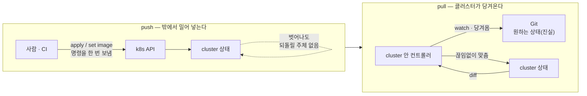
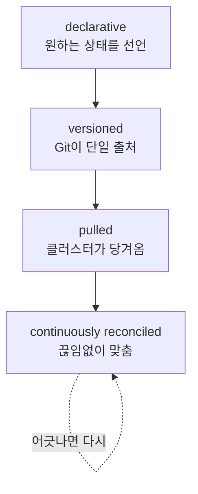
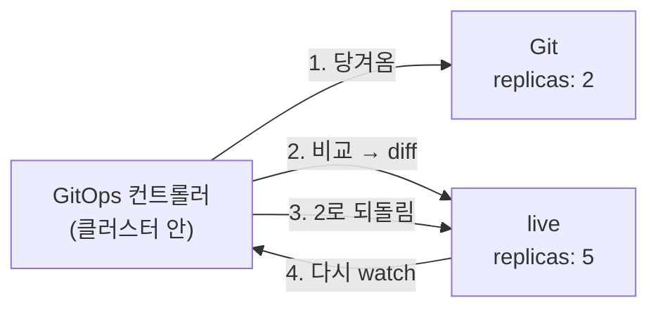

# 1. 왜 GitOps인가 — push vs pull

GitOps는 "배포를 Git으로 한다"는 말이 아닙니다. 배포 명령을 누가·어디서·언제 보내느냐의 방향을 뒤집는 일입니다. `kubectl apply`도, CI 파이프라인의 `kubectl set image`도 모두 **밖에서 클러스터로 상태를 밀어 넣는(push)** 방식입니다. push는 명령을 한 번 보내고 끝나므로, 보낸 뒤 클러스터가 그 상태에서 벗어나도(drift) 그것을 되돌릴 주체가 없습니다. 이 편은 Argo CD를 아직 설치하지 않은 채, push 배포 하나를 직접 만들고 그 상태를 손으로 어긋나게 해서 **"아무도 다시 맞추지 않는다"**를 눈으로 확인합니다. 그 빈자리에서 pull 모델 — 클러스터 안에 사는 컨트롤러가 Git을 진실로 두고 끊임없이 당겨와 맞추는 방식 — 이 무엇을 바꾸는지, 그리고 GitOps 4원칙(**declarative · versioned · pulled · continuously reconciled**)이 왜 그 순서로 묶이는지가 드러납니다. 이 편의 산출물은 "push 배포의 drift를 직접 만들어 본 경험"과 "push와 pull을 한 그림으로 가를 수 있는 상태"입니다.

## 핵심 다이어그램





- **push는 명령을 한 번 보낸다.** `kubectl apply`도 CI의 배포 스텝도, 밖에 있는 주체가 클러스터 API로 "이렇게 만들어라"를 밀어 넣는다. 보내는 순간에만 상태가 맞고, 보낸 뒤의 일은 책임지지 않는다.
- **pull은 클러스터가 당겨온다.** 클러스터 안에 사는 컨트롤러가 Git에 적힌 원하는 상태를 주기적으로 당겨와, 지금 클러스터 상태와 비교하고, 다르면 맞춘다. 명령이 아니라 상태로 수렴한다.
- **차이는 "벗어난 다음"에 드러난다.** 둘 다 처음 배포는 똑같이 된다. 갈라지는 건 배포 이후 누군가 클러스터를 손으로 바꿨을 때 — push는 그대로 방치되고, pull은 다시 Git 쪽으로 되돌린다.
- **GitOps 4원칙은 한 줄로 이어진다.** 원하는 상태를 **선언(declarative)**하고, 그 선언을 **Git에 버전으로(versioned)** 두고, 클러스터가 그것을 **당겨와(pulled)**, **끊임없이 맞춘다(continuously reconciled)**. 앞 원칙이 빠지면 뒤가 성립하지 않는다 — 선언이 없으면 버전이 무의미하고, 당겨올 단일 출처가 없으면 reconcile할 기준이 없다.

아래 시연이 이 경계를 한 줄씩 손으로 확인합니다.

## 사전 준비물

이 실습은 **macOS** 환경을 기준으로 합니다.

- **Docker** — Docker Desktop, OrbStack 등. `docker ps`가 에러 없이 돌아가면 OK.
- **Homebrew** — macOS 패키지 관리자.

### kind · kubectl 설치

```bash
brew install kind kubectl
```

### rosa-lab 클러스터 · namespace 준비

```bash
kind create cluster --name rosa-lab
kubectl create namespace rosa-lab
```

## 실습 환경

이 편에는 Argo CD가 등장하지 않습니다. push 모델의 한계를 먼저 손으로 겪어야 pull이 무엇을 메우는지 보이기 때문입니다. 준비물은 평범한 Deployment 하나입니다 — `manifests/app.yaml`에 `replicas: 2`로 선언된 nginx입니다. 이 파일이 곧 "원하는 상태의 선언"이고, GitOps라면 이 파일이 Git에 올라가 단일 출처가 됩니다.

```bash
kubectl apply -f manifests/app.yaml
kubectl -n rosa-lab get deploy web
```

## 여기서 직접 확인할 수 있는 것

### push로 배포한다 — 명령을 한 번 보낸다

방금 친 `kubectl apply`가 push입니다. 내 노트북에서 클러스터 API로 "web을 replicas 2로 만들어라"를 한 번 보냈고, 클러스터는 그대로 만들었습니다.

```bash
kubectl -n rosa-lab get pods -l app=web
```

```
NAME                   READY   STATUS    RESTARTS   AGE
web-6f...-abcde        1/1     Running   0          20s
web-6f...-fghij        1/1     Running   0          20s
```

여기까지는 push든 pull이든 결과가 같습니다. 파일에 적힌 선언(`replicas: 2`)이 클러스터에 반영됐습니다. 갈라지는 지점은 다음 한 줄에서 시작합니다.

### drift를 만든다 — 누군가 클러스터를 직접 바꾼다

운영 중에는 이런 일이 흔합니다. 트래픽이 튀어서 누군가 급히 손으로 스케일을 올리거나, 디버깅하느라 이미지를 바꿔치기합니다. 그것을 한 줄로 재현합니다.

```bash
kubectl -n rosa-lab scale deployment web --replicas=5
kubectl -n rosa-lab get deploy web
```

```
NAME   READY   UP-TO-DATE   AVAILABLE   AGE
web    5/5     5            5           90s
```

이제 **선언과 실제가 어긋났습니다.** `manifests/app.yaml`은 여전히 `replicas: 2`라고 말하는데, 클러스터는 5로 돌고 있습니다. 이 어긋남이 **drift**입니다. Git의 파일은 진실이라고 믿고 싶지만, 클러스터의 진짜 상태는 그 파일과 다릅니다.

선언과 실제가 갈라졌는지 한 줄로 비교해 봅니다.

```bash
echo "선언(파일): $(grep 'replicas:' manifests/app.yaml | awk '{print $2}')"
echo "실제(클러스터): $(kubectl -n rosa-lab get deploy web -o jsonpath='{.spec.replicas}')"
```

```
선언(파일): 2
실제(클러스터): 5
```

### push 모델은 이 drift를 모른다 — 아무도 되돌리지 않는다

여기가 push의 한계입니다. `kubectl apply`는 명령을 한 번 보내고 끝났으므로, 그 뒤에 일어난 scale을 감지할 주체가 없습니다. CI 파이프라인으로 배포했어도 똑같습니다 — 파이프라인은 push가 끝나면 잠들고, 다음 커밋이 들어오기 전까지는 클러스터를 쳐다보지 않습니다. 시간이 지나도 drift는 그대로입니다.

```bash
kubectl -n rosa-lab get deploy web -o jsonpath='{.spec.replicas}{"\n"}'
```

```
5
```

한참을 기다려도 5입니다. push 모델에서 이 5를 2로 되돌리는 방법은 하나뿐입니다 — **사람이 다시 push하는 것**입니다.

```bash
kubectl apply -f manifests/app.yaml
kubectl -n rosa-lab get deploy web -o jsonpath='{.spec.replicas}{"\n"}'
```

```
2
```

`apply`를 다시 치자 2로 돌아왔습니다. 하지만 이건 자동이 아니라 **누군가 drift를 발견하고 손으로 명령을 또 보낸 것**입니다. drift를 발견하지 못하면 영영 5로 남습니다. push 모델의 본질이 이 한 줄에 있습니다 — 수렴을 사람이 책임진다.

### pull 모델은 무엇을 바꾸나 — 클러스터가 Git을 당겨와 끊임없이 맞춘다

pull 모델에서는 클러스터 **안에** 사는 컨트롤러가 Git에 적힌 `replicas: 2`를 주기적으로 당겨와, 지금 클러스터의 5와 비교하고, 다르면 2로 되돌립니다. 사람이 발견할 필요도, 다시 push할 필요도 없습니다. 방금 우리가 손으로 친 `kubectl apply -f`를, 클러스터 안 컨트롤러가 **Git을 기준으로 끊임없이 자동으로** 하는 것 — 그게 pull입니다.

이 컨트롤러가 하는 일은 사실 Kubernetes가 이미 하는 일과 같은 모양입니다. ReplicaSet 컨트롤러가 "Pod 2개"라는 desired를 보고 현재와 맞추듯, GitOps 컨트롤러는 "Git의 선언"을 desired로 보고 클러스터 전체를 맞춥니다. 맞추는 대상이 Pod 개수에서 **Git의 선언 상태 전체**로 한 단계 올라갔을 뿐입니다.



이 자동 수렴(self-heal)을 실제로 작동시키는 건 Argo CD를 올린 뒤입니다. 이 편에서 손에 쥐는 것은 그 전 단계 — **"push는 drift를 방치하고, pull은 그것을 자동으로 메운다"**는 경계 자체입니다.

### 그래서 declarative · versioned · pulled · continuously reconciled

방금 시연을 4원칙에 그대로 얹어 봅니다.

- **declarative** — `manifests/app.yaml`은 "어떻게 만들어라"가 아니라 "최종 상태는 replicas 2다"를 선언합니다. 명령이 아니라 상태라서, 언제든 그 파일 하나로 원하는 모습을 재현할 수 있습니다.
- **versioned** — 그 선언이 Git에 있으면, "지금 원하는 상태"가 커밋 히스토리로 남습니다. 누가 언제 2를 3으로 바꿨는지, 되돌리려면 어디로 가야 하는지가 버전으로 추적됩니다. drift를 판정할 **단일 출처**가 생깁니다.
- **pulled** — 클러스터가 그 Git을 당겨옵니다. 밖에서 밀어 넣는 게 아니라 안에서 가져오므로, 배포 권한을 클러스터 밖 CI에 넓게 열어 줄 필요가 줄어듭니다(CI는 Git에 커밋만, 클러스터 접근은 컨트롤러만).
- **continuously reconciled** — 한 번이 아니라 끊임없이 비교하고 맞춥니다. 우리가 손으로 한 번 친 `apply`를, 컨트롤러가 주기적으로 자동 수행합니다. drift는 다음 reconcile에서 지워집니다.

핵심은 이 네 가지가 **순서대로 맞물린다**는 것입니다. 상태를 선언하지 않으면 버전으로 둘 게 없고, Git이라는 단일 출처가 없으면 당겨올 기준이 없고, 당겨오지 않으면 끊임없이 맞출 대상이 없습니다. push 배포는 이 사슬의 마지막 고리(continuously reconciled)가 끊긴 상태입니다 — 선언도 Git도 있을 수 있지만, 클러스터가 그것을 계속 당겨와 맞추지는 않습니다. GitOps는 그 마지막 고리를 잇는 일입니다.

### 정리

```bash
kubectl delete -f manifests/app.yaml --ignore-not-found
```

클러스터까지 정리하려면:

```bash
kind delete cluster --name rosa-lab
```

## 이 편의 산출물

- `kubectl apply`로 push 배포한 Deployment에 `kubectl scale`로 **drift를 직접 만들고**, 선언(파일 `replicas: 2`)과 실제(클러스터 `replicas: 5`)를 한 줄로 비교해 어긋남을 눈으로 확인한 경험.
- push 모델에서 drift를 되돌리는 유일한 방법이 **사람이 다시 push하는 것**임을 보고, "수렴을 누가 책임지나"가 push와 pull을 가르는 축임을 한 문장으로 그을 수 있는 상태.
- pull 모델(클러스터 안 컨트롤러가 Git을 당겨와 끊임없이 맞춤)이 ReplicaSet의 reconcile와 같은 모양이고, 맞추는 대상이 **Git의 선언 상태 전체**로 한 단계 올라간 것임을 다이어그램으로 설명할 수 있는 상태.
- GitOps 4원칙(**declarative → versioned → pulled → continuously reconciled**)이 왜 그 순서로 맞물리는지, 그리고 push 배포가 그 사슬의 마지막 고리가 끊긴 상태임을 방금 시연에 얹어 설명할 수 있는 상태.
