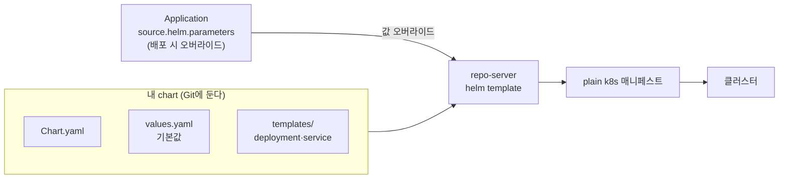

# 10. 내 chart를 Argo CD로 배포하기

공개 chart를 배포하는 것과 내가 만든 chart를 배포하는 것은 흐름이 같지만, 한 가지가 더 분명해집니다 — **chart도 Git에 사는 배포 대상**이라는 것. chart를 만든다는 건 "값으로 조절되는 매니페스트 묶음"을 만드는 일이고, 그것을 Git에 두면 Application이 가리켜 배포합니다. 이때 Argo CD는 chart를 `helm install`로 깔지 않고 `helm template`으로 **렌더만** 합니다 — 그래서 chart가 어떤 매니페스트를 찍어내는지는 클러스터 없이 `helm template`으로 미리, 정확히 볼 수 있습니다. 이 편은 최소 web chart를 직접 만들어 로컬에서 렌더해 보고, 값 주입이 chart의 `values.yaml`(기본값)과 Application의 `source.helm`(배포 시 오버라이드) 두 곳에서 일어남을 구분한 뒤, 그 chart를 가리키는 Application을 작성합니다. 핵심은 **값이 클러스터나 `--set` 명령이 아니라 Git의 선언에 적힌다**는 것 — 그래야 누가 언제 무엇으로 배포했는지가 재현됩니다. 산출물은 "직접 만든 chart와 그것을 배포하는 Application"과 "chart values와 Application 오버라이드의 주입 위치를 구분한 경험"입니다.

## 핵심 다이어그램



- **chart는 파라미터화된 매니페스트다.** `templates/`의 YAML이 `{{ .Values.* }}`로 값을 비워 두고, `values.yaml`이 그 기본값을 채운다. 같은 chart로 replica·이미지·포트만 바꿔 여러 배포를 찍어낼 수 있다.
- **값은 두 곳에서 들어온다.** chart의 `values.yaml`은 기본값이고, Application의 `source.helm.parameters`/`values`는 배포 시 오버라이드다. 둘 다 **선언**이라 Git에 남는다.
- **Argo CD는 helm template으로 렌더만 한다.** chart를 받아 값으로 채운 plain 매니페스트를 만들어 적용한다. Helm release(이력·롤백)는 만들지 않는다 — 그건 Application이 자기 방식으로 한다.
- **그래서 클러스터 없이 미리 볼 수 있다.** repo-server가 할 렌더를 `helm template`으로 똑같이 돌려, 배포 전에 결과 매니페스트를 정확히 확인할 수 있다.

아래 시연이 이 흐름을 한 줄씩 손으로 확인합니다.

## 사전 준비물

이 실습은 **macOS** 환경을 기준으로 합니다. chart 제작·렌더는 클러스터 없이 진행되고, 실제 Argo 적용은 마지막에 본인 repo로 안내합니다.

### helm · git 설치

```bash
brew install helm git
```

## 여기서 직접 확인할 수 있는 것

### 최소 chart를 만든다 — 무엇으로 이뤄지나

`web/` 디렉터리에 chart를 직접 둡니다. 구조는 세 부분입니다.

```bash
find web -type f | sort
```

```
web/Chart.yaml
web/templates/deployment.yaml
web/templates/service.yaml
web/values.yaml
```

- **Chart.yaml** — chart의 신원(`name`·`version`)과 담은 앱 버전(`appVersion`).
- **values.yaml** — 템플릿이 참조할 **기본값**(`replicaCount: 1`, `image.tag: 1.27.0`, `service.port: 80`).
- **templates/** — 값을 비워 둔 매니페스트. 예를 들어 deployment는 `replicas: {{ .Values.replicaCount }}`처럼 값을 참조합니다.

```bash
grep -E "replicas:|image:|Values" web/templates/deployment.yaml
```

```
  replicas: {{ .Values.replicaCount }}
          image: "{{ .Values.image.repository }}:{{ .Values.image.tag }}"
            - containerPort: {{ .Values.service.port }}
```

### 렌더한다 — Argo가 할 일을 미리 본다

repo-server가 배포 시 할 `helm template`을 그대로 로컬에서 돌립니다. chart가 무엇을 찍어내는지 클러스터 없이 정확히 보입니다.

```bash
helm lint ./web
helm template web ./web | grep -E "^kind:|replicas:|image:|port:"
```

```
1 chart(s) linted, 0 chart(s) failed

kind: Service
    - port: 80
kind: Deployment
  replicas: 1
          image: "nginx:1.27.0"
```

`values.yaml`의 기본값이 그대로 채워졌습니다 — replica 1, nginx:1.27.0, port 80. 이게 오버라이드 없이 배포했을 때의 결과입니다.

### 값을 오버라이드한다 — 기본값 위에 덮는다

배포마다 replica를 바꾸고 싶습니다. `helm template`에서 `--set`으로 덮으면 결과가 어떻게 바뀌는지 봅니다(이건 로컬 미리보기용입니다 — 실제 배포에서는 아래 Application 선언이 같은 일을 합니다).

```bash
helm template web ./web --set replicaCount=3 | grep -E "replicas:"
```

```
  replicas: 3
```

기본값 1 위에 3이 덮였습니다. 값이 두 층으로 합쳐진다는 게 보입니다 — chart의 기본값(아래) + 오버라이드(위).

### Application으로 가리킨다 — 오버라이드를 선언으로 박는다

방금 `--set replicaCount=3`으로 미리 본 오버라이드를, 실제 배포에서는 Application의 `source.helm.parameters`에 **선언**으로 적습니다. `manifests/app.yaml`이 그것입니다.

```yaml
source:
  repoURL: https://github.com/<you>/gitops.git
  path: web                       # chart 디렉터리
  helm:
    parameters:
      - name: replicaCount
        value: "2"                # --set replicaCount=2 와 같은 일, 단 Git에 남는다
destination:
  namespace: web-demo
```

`--set`과 결과는 같지만 결정적 차이가 있습니다 — **`--set`은 명령이라 사라지고, `source.helm.parameters`는 선언이라 Git에 남습니다.** 누가 이 앱을 replica 2로 배포했는지가 매니페스트에 적혀 추적·재현됩니다. GitOps에서 값을 `--set`이나 UI로 바꾸면 안 되는 이유가 여기입니다 — 그 값이 Git 밖에 있어 다음 reconcile에서 사라지거나 drift가 됩니다.

### 실제로 배포한다 — 본인 repo에 chart를 두고

이 chart를 본인 Git repo에 올리면 Argo CD가 그대로 배포합니다.

```bash
# 1) 본인 repo에 web/ chart를 push
#    (예: gitops repo의 web/ 경로)
# 2) manifests/app.yaml의 repoURL을 본인 repo로 교체
# 3) 클러스터·Argo CD 준비 후 적용
```

클러스터·Argo CD가 없다면 준비합니다.

```bash
kind create cluster --name rosa-lab
kubectl create namespace argocd
kubectl apply -n argocd -f https://raw.githubusercontent.com/argoproj/argo-cd/stable/manifests/install.yaml
kubectl -n argocd wait --for=condition=Ready pods --all --timeout=180s
```

repoURL을 본인 repo로 바꾼 뒤 적용하면, repo-server가 `web` chart를 `helm template`으로 렌더(이때 `replicaCount=2` 오버라이드 적용)해 `web-demo` namespace에 배포합니다.

```bash
kubectl apply -f manifests/app.yaml
# argocd app get web → Synced/Healthy, replica는 2 (chart 기본 1 위에 오버라이드)
```

배포된 결과는 방금 로컬에서 `helm template --set replicaCount=2`로 미리 본 것과 정확히 같습니다 — repo-server가 하는 일이 그 렌더이기 때문입니다.

### 정리

클러스터를 띄웠다면:

```bash
kubectl delete -f manifests/app.yaml --ignore-not-found
kind delete cluster --name rosa-lab
```

## 이 편의 산출물

- `Chart.yaml`·`values.yaml`·`templates/`로 이뤄진 **직접 만든 최소 chart(`web/`)**, 그리고 그것을 가리키는 Application(`manifests/app.yaml`) — chart가 "값으로 조절되는 매니페스트 묶음"임을 구조로 본 결과물.
- `helm lint`·`helm template`으로 chart를 **클러스터 없이 렌더**해, repo-server가 배포 시 할 일을 미리 정확히 확인한 경험(기본값: replica 1·nginx:1.27.0·port 80).
- 값 주입이 **chart의 `values.yaml`(기본값)과 Application의 `source.helm.parameters`(배포 오버라이드)** 두 층에서 일어남을 구분하고, `--set replicaCount=3`으로 두 층이 합쳐지는 것을 본 경험.
- `--set`(명령, 사라짐)과 `source.helm.parameters`(선언, Git에 남음)의 차이로 **GitOps에서 값을 명령으로 바꾸면 안 되는 이유**(재현·추적 불가, drift)를 한 문장으로 말할 수 있는 상태.
