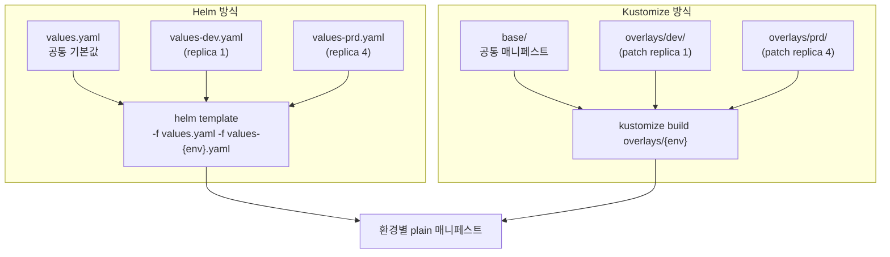

# 11. Config 전략 — 환경별 values · Kustomize overlays · multiple sources

같은 앱을 dev·stg·prd에 배포하는데 환경마다 replica·이미지 태그·도메인이 다릅니다. 이 차이를 **어디에 두느냐**가 config 전략입니다. 잘못된 답은 분명합니다 — UI에서 폼을 고치거나 `--set`으로 값을 주입하는 것. 그 값은 Git 밖에 있어 다음 reconcile에서 사라지거나 drift가 되고, "prd가 지금 무엇으로 떠 있나"를 아무도 재현하지 못합니다. 옳은 답은 모두 한 모양입니다 — **환경 차이를 선언 파일로 만들어 Git에 둔다.** 다만 그 파일의 형태가 갈립니다. Helm이면 `values-prd.yaml` 같은 환경별 values 파일을, Kustomize면 `overlays/prd/` 같은 패치를, chart와 값을 다른 repo로 나누려면 multiple sources를 씁니다. 이 편은 같은 web 앱을 Helm valueFiles와 Kustomize overlays 두 방식으로 환경 분기해 로컬에서 렌더하고, 두 방식이 모두 "공통 base + 환경별 차이 파일"이라는 같은 구조임을 봅니다. 산출물은 "환경 config를 Helm·Kustomize 두 방식으로 분기해 렌더한 경험"과 "왜 환경 차이를 명령이 아니라 Git의 선언 파일로 두는지 말할 수 있는 상태"입니다.

## 핵심 다이어그램



- **환경 차이는 선언 파일로 둔다.** `values-prd.yaml`이든 `overlays/prd/`든, 환경마다 다른 것을 Git의 파일로 적는다. PR diff에 "prd의 replica를 4로 올린다"가 한 줄로 남고, 누가 언제 바꿨는지가 추적된다.
- **두 방식은 같은 구조다.** Helm은 "기본 values + 환경 values"로, Kustomize는 "base + overlay patch"로 합친다. 둘 다 *공통을 한 번 쓰고 환경 차이만 따로 둔다* — DRY가 핵심이다.
- **합치는 주체는 repo-server다.** Application이 어느 환경 파일을 쓸지(`valueFiles`/`path`)만 선언하면, repo-server가 `helm template -f`나 `kustomize build`로 합쳐 plain 매니페스트를 만든다.
- **`--set`·UI는 Git 밖이라 금지다.** 같은 replica 4를 만들어도, `--set`은 명령이라 사라지고 UI 변경은 클러스터에만 남는다. Git에 없는 값은 재현 불가이고, selfHeal이 켜져 있으면 다음 reconcile에서 되돌려진다.

아래 시연이 이 구조를 한 줄씩 손으로 확인합니다.

## 사전 준비물

이 실습은 **macOS** 환경을 기준으로 합니다. 렌더 비교는 클러스터 없이 진행됩니다.

### helm · kubectl 설치

```bash
brew install helm kubectl
```

`kubectl kustomize`로 Kustomize 렌더를 봅니다(별도 `kustomize` 바이너리를 깔아도 됩니다).

## 여기서 직접 확인할 수 있는 것

### Helm — 공통 values + 환경 values

`helm/web/`은 chart이고, 그 옆에 환경별 차이 파일이 있습니다.

```bash
ls helm/web/*.yaml
```

```
helm/web/values.yaml       ← 공통 기본값 (replicaCount 1, nginx 1.27.0, port 80)
helm/web/values-dev.yaml   ← dev 차이만
helm/web/values-prd.yaml   ← prd 차이만 (replicaCount 4)
```

환경 파일은 **차이만** 담습니다. `values-prd.yaml`을 보면 replica와 태그만 있고, 나머지는 공통 `values.yaml`에서 옵니다.

```bash
grep -vE '^#|^$' helm/web/values-prd.yaml
```

```yaml
replicaCount: 4
image:
  tag: "1.27.0"
```

두 환경을 각각 렌더합니다. `-f`를 여러 번 주면 뒤 파일이 앞을 덮습니다(공통 → 환경 순서).

```bash
echo "== dev ==" && helm template web ./helm/web -f helm/web/values.yaml -f helm/web/values-dev.yaml | grep -E "replicas:|image:"
echo "== prd ==" && helm template web ./helm/web -f helm/web/values.yaml -f helm/web/values-prd.yaml | grep -E "replicas:|image:"
```

```
== dev ==
  replicas: 1
          image: "nginx:1.27.0"
== prd ==
  replicas: 4
          image: "nginx:1.27.0"
```

같은 chart에서 환경 파일만 바꿔 replica 1과 4가 나왔습니다. 공통은 한 번 쓰고, 차이는 파일로 갈렸습니다.

### Kustomize — base + overlay patch

같은 분기를 Kustomize로 합니다. `kustomize/base/`에 공통 매니페스트를 두고, `overlays/{dev,prd}/`가 그것을 참조해 패치합니다.

```bash
find kustomize -type f | sort
```

```
kustomize/base/deployment.yaml
kustomize/base/kustomization.yaml
kustomize/overlays/dev/kustomization.yaml
kustomize/overlays/prd/kustomization.yaml
```

overlay는 base를 `resources`로 참조하고 차이만 패치합니다. prd overlay를 봅니다.

```bash
cat kustomize/overlays/prd/kustomization.yaml
```

```yaml
resources:
  - ../../base
namePrefix: prd-
patches:
  - target: { kind: Deployment, name: web }
    patch: |-
      - op: replace
        path: /spec/replicas
        value: 4
```

두 overlay를 렌더합니다.

```bash
echo "== dev ==" && kubectl kustomize kustomize/overlays/dev | grep -E "^  name:|replicas:"
echo "== prd ==" && kubectl kustomize kustomize/overlays/prd | grep -E "^  name:|replicas:"
```

```
== dev ==
  name: dev-web
  replicas: 1
== prd ==
  name: prd-web
  replicas: 4
```

base는 한 벌이고, overlay가 이름 prefix(`dev-`/`prd-`)와 replica만 바꿨습니다. Helm valueFiles와 형태는 다르지만 원리는 같습니다 — **공통 base + 환경 차이**.

### Application은 어느 환경 파일을 쓸지만 선언한다

repo-server가 렌더를 하니, Application은 "어느 환경 파일을 쓸지"만 가리킵니다. Helm이면 `valueFiles`, Kustomize면 overlay `path`입니다.

```yaml
# manifests/app-helm-prd.yaml  (Helm)
source:
  path: helm/web
  helm:
    valueFiles:
      - values.yaml
      - values-prd.yaml      # 공통 위에 prd 덮음
---
# manifests/app-kustomize-prd.yaml  (Kustomize)
source:
  path: kustomize/overlays/prd   # overlay가 base를 참조
```

환경마다 Application 하나, 차이는 `valueFiles` 또는 `path`뿐입니다. 어느 쪽이든 결과는 같은 prd 매니페스트(replica 4)이고, 그 환경 설정이 전부 Git에 있습니다.

### multiple sources — chart와 값을 다른 repo로

chart는 공용(플랫폼팀이 관리)인데 환경별 값은 서비스팀이 관리하는 경우, 둘을 다른 repo로 나누고 **multiple sources**로 합칩니다.

```yaml
# manifests/app-multi-source.yaml
sources:
  - repoURL: https://github.com/<you>/charts.git    # chart repo
    path: web
    helm:
      valueFiles:
        - $values/env/prd/values.yaml                # 아래 repo의 파일을 참조
  - repoURL: https://github.com/<you>/config.git     # 값 repo
    ref: values                                       # $values로 노출
```

첫 source가 chart를, 둘째 source(`ref: values`)가 값 파일을 제공하고, `$values/...`로 둘을 잇습니다. chart의 버전과 환경 값의 변경이 **서로 다른 repo·다른 권한·다른 주기**로 관리됩니다 — chart를 올리는 일과 prd 값을 바꾸는 일이 분리됩니다.

### config 전략을 한눈에

| 방법 | 환경 차이를 두는 곳 | 언제 |
|---|---|---|
| chart `values.yaml` | chart 안 기본값 | 모든 환경 공통 기본 |
| 환경별 values 파일 + `valueFiles` | `values-{env}.yaml` | Helm으로 환경 분기 |
| Application `source.helm.values`(inline) | Application 안에 직접 | 작은 일회성 오버라이드 |
| Kustomize overlays | `overlays/{env}/` patch | 패치 기반으로 분기 |
| multiple sources | chart repo + 값 repo 분리 | chart와 값의 소유·주기가 다를 때 |
| ~~`--set` · UI~~ | ~~Git 밖~~ | **쓰지 않는다 (재현·추적 불가)** |

공통점은 마지막 줄을 뺀 모두가 **Git의 선언 파일**이라는 것입니다. Helm이냐 Kustomize냐는 팀의 선택이고, 둘 다 "공통을 한 번, 환경 차이를 파일로"라는 원칙은 같습니다.

### 정리

이 편은 렌더 비교만 했으므로 클러스터 리소스가 없습니다. 본인 repo에 `helm/`·`kustomize/`를 push하고 `manifests/`의 `repoURL`을 바꾸면 그대로 Argo CD에 적용해 볼 수 있습니다.

## 이 편의 산출물

- 같은 web 앱을 **Helm valueFiles**(`values.yaml` + `values-{env}.yaml`)와 **Kustomize overlays**(`base` + `overlays/{env}`) 두 방식으로 환경 분기해 로컬 렌더하고, dev=replica 1·prd=replica 4가 나오는 것을 확인한 경험.
- 두 방식이 형태는 달라도 **공통 base + 환경 차이 파일**이라는 같은 구조(DRY)임을 보고, Application은 "어느 환경 파일을 쓸지"(`valueFiles`/`path`)만 선언하며 합치는 일은 repo-server가 함을 확인한 상태.
- **multiple sources**로 chart repo와 값 repo를 분리해 `$values` ref로 잇는 패턴을, chart와 환경 값의 소유·주기가 다를 때 쓰는 것으로 이해한 상태.
- 환경 차이를 `--set`·UI(Git 밖, 재현·추적 불가)가 아니라 **Git의 선언 파일**로 두어야 하는 이유를, config 전략 표의 모든 옳은 답이 "Git의 파일"이라는 공통점으로 말할 수 있는 상태.
