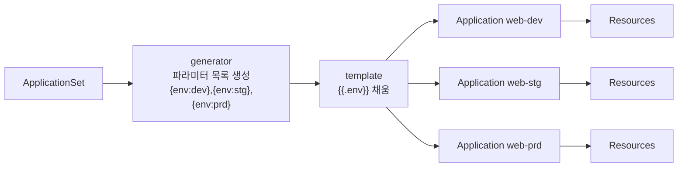
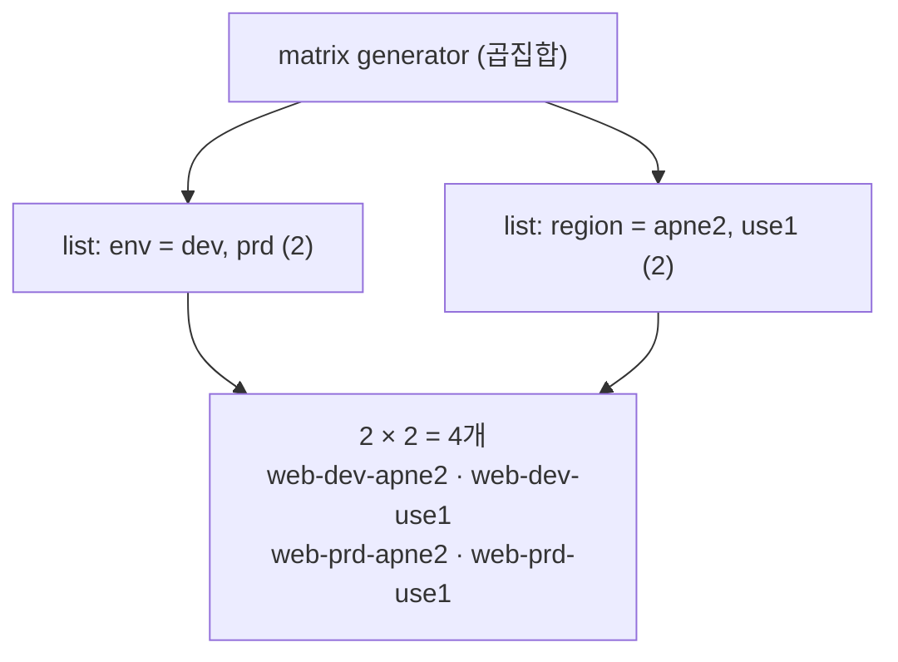

# 12. ApplicationSet — generator: list · git · cluster · matrix · pullRequest

환경이 셋이고 클러스터가 여럿이면, 거의 똑같은 Application 매니페스트를 여러 벌 손으로 복사하게 됩니다 — `web-dev`, `web-stg`, `web-prd`… `path`와 `namespace`만 다른 파일들. ApplicationSet은 그 복사를 없앱니다. **Application을 직접 쓰는 대신, Application을 찍어내는 틀을 쓴다** — generator가 파라미터 목록을 만들고, template이 그 파라미터로 채워져 Application이 하나씩 생성됩니다. 그래서 ApplicationSet을 읽는 핵심 질문은 하나입니다 — **"generator가 파라미터를 몇 개 만들고, 따라서 Application이 몇 개 생성되는가?"** 특히 `matrix` generator는 두 목록의 **곱집합**이라, 무심코 한 축을 늘리면 Application이 폭발합니다(`cluster 10 × app 20 × env 3 = 600`). 이 편은 list generator로 환경 셋을 펼쳐 Application 3개가 생기는 것을 보고, matrix로 곱집합이 어떻게 4개가 되는지 세고, git·cluster·pullRequest generator가 무엇을 축으로 삼는지 정리합니다. 산출물은 "ApplicationSet이 generator → template → Application으로 펼쳐지는 모델을 손으로 본 경험"과 "generator별 생성 개수를 셀 수 있는 상태"입니다.

## 핵심 다이어그램





- **ApplicationSet은 Application의 틀이다.** 별도 CRD이고, applicationset-controller가 이 객체를 watch해 Application을 생성·갱신·삭제한다. 생성된 Application들은 그다음 application-controller가 평소처럼 reconcile한다 — 틀과 reconcile은 분리돼 있다.
- **generator가 파라미터를, template이 모양을 정한다.** generator는 `{env: dev}` 같은 파라미터 묶음의 목록을 만들고, template은 `{{.env}}`로 그 값을 받아 Application 하나가 된다. 목록의 길이가 곧 Application 수다.
- **generator 종류가 "무엇을 축으로 펼치나"를 정한다.** list(직접 적은 목록)·git(repo의 디렉터리·파일)·cluster(등록된 클러스터)·matrix(두 generator의 곱)·pullRequest(열린 PR). 축이 다를 뿐 펼치는 방식은 같다.
- **matrix는 곱집합이라 폭발한다.** 두 목록을 곱하므로, 한 축에 element 하나를 더하면 Application이 다른 축의 길이만큼 늘어난다. "축을 하나 늘리면 몇 개가 되나"를 항상 먼저 계산해야 한다.

아래 시연이 이 모델을 한 줄씩 손으로 확인합니다.

## 사전 준비물

이 실습은 **macOS** 환경을 기준으로 합니다.

- **Docker** — Docker Desktop, OrbStack 등. `docker ps`가 에러 없이 돌아가면 OK.
- **Homebrew** — macOS 패키지 관리자.

### kind · kubectl · argocd CLI 설치

```bash
brew install kind kubectl argocd
```

### 클러스터 · Argo CD 준비

Argo CD 공식 install에는 applicationset-controller가 포함돼 있습니다(별도 설치 불필요).

```bash
kind create cluster --name rosa-lab
kubectl create namespace argocd
kubectl apply -n argocd -f https://raw.githubusercontent.com/argoproj/argo-cd/stable/manifests/install.yaml
kubectl -n argocd wait --for=condition=Ready pods --all --timeout=180s
kubectl -n argocd get deploy argocd-applicationset-controller
```

## 여기서 직접 확인할 수 있는 것

### list generator — 목록 길이만큼 Application이 생긴다

`manifests/appset-list.yaml`은 `dev`·`stg`·`prd` 세 element를 가진 list generator입니다. template의 `{{.env}}`가 각 element의 값으로 채워집니다.

```bash
kubectl apply -f manifests/appset-list.yaml
sleep 5
kubectl -n argocd get applications
```

```
NAME      SYNC STATUS   HEALTH STATUS
web-dev   Synced        Healthy
web-prd   Synced        Healthy
web-stg   Synced        Healthy
```

ApplicationSet 하나를 적용했는데 **Application 3개**가 생겼습니다 — 우리가 직접 Application을 쓰지 않았습니다. applicationset-controller가 element마다 template을 채워 만든 것입니다. 이 셋은 5편에서 본 일반 Application과 똑같아서, 각자 reconcile됩니다.

```bash
kubectl -n argocd get application web-prd -o jsonpath='{.spec.destination.namespace}{"\n"}'
```

```
web-prd
```

`web-prd`의 namespace가 `web-prd`입니다 — template의 `web-{{.env}}`가 `prd`로 채워졌습니다.

### 누가 이 Application을 소유하나 — ownerReference

생성된 Application은 ApplicationSet이 소유합니다. 그래서 ApplicationSet을 지우면 만든 Application도 함께 사라집니다(9편의 cascade와 같은 결).

```bash
kubectl -n argocd get application web-dev -o jsonpath='{.metadata.ownerReferences[0].kind}/{.metadata.ownerReferences[0].name}{"\n"}'
```

```
ApplicationSet/web-envs
```

element를 빼면 그 Application이 삭제되고, 더하면 생깁니다 — 목록을 편집하는 것이 곧 Application의 생성·삭제입니다.

### matrix generator — 곱집합을 센다

`manifests/appset-matrix.yaml`은 env 2개(`dev`,`prd`) × region 2개(`apne2`,`use1`)의 matrix입니다. 적용 전에 먼저 **개수를 계산**합니다 — 이게 ApplicationSet을 다루는 습관입니다.

```
env(2) × region(2) = Application 4개
```

적용하고 실제 개수를 확인합니다.

```bash
kubectl apply -f manifests/appset-matrix.yaml
sleep 5
kubectl -n argocd get applications | grep web-
```

```
web-dev            Synced   Healthy
web-dev-apne2      Synced   Healthy
web-dev-use1       Synced   Healthy
web-prd            Synced   Healthy
web-prd-apne2      Synced   Healthy
web-prd-use1       Synced   Healthy
web-stg            Synced   Healthy
```

matrix가 만든 건 `web-dev-apne2`·`web-dev-use1`·`web-prd-apne2`·`web-prd-use1` **4개**입니다(앞의 web-dev/stg/prd는 list ApplicationSet 것). 계산과 일치합니다. 만약 region에 element를 하나만 더하면(`apne2`,`use1`,`euw1`), 4개가 아니라 `2 × 3 = 6개`가 됩니다 — 한 축의 +1이 다른 축의 길이만큼 늘어나는 것이 곱집합입니다.

### generator 종류 — 무엇을 축으로 펼치나

list·matrix 외의 generator는 "축을 어디서 가져오나"가 다를 뿐 모델은 같습니다.

| generator | 무엇을 축으로 | 생성 개수 |
|---|---|---|
| `list` | 직접 적은 elements | elements 수 |
| `git` (directories) | repo의 디렉터리(`env/*`) | 디렉터리 수 |
| `git` (files) | repo의 파일(`**/config.json`) | 파일 수 |
| `cluster` | Argo CD에 등록된 클러스터 | 클러스터 수 |
| `matrix` | 두 generator의 곱집합 | A × B |
| `merge` | 여러 generator를 키로 병합 | 병합 결과 수 |
| `pullRequest` | 열린 PR | PR 수 |

**git generator**는 repo 구조를 축으로 삼습니다 — `manifests/appset-git.yaml`처럼 `env/*` 디렉터리를 훑으면, 디렉터리를 추가하는 것만으로 새 환경 Application이 생깁니다(6편의 폴더 구조가 그대로 generator의 입력이 됩니다).

```yaml
# appset-git.yaml (발췌)
generators:
  - git:
      repoURL: https://github.com/<you>/gitops.git
      directories:
        - path: env/*          # env/dev, env/stg ... 디렉터리마다 Application
template:
  metadata:
    name: 'web-{{.path.basename}}'
```

**pullRequest generator**는 열린 PR을 축으로 삼아 **미리보기 환경**을 만듭니다 — `PR 생성 → 임시 Application·namespace 생성 → PR 머지/닫힘 → Application 자동 삭제`. 리뷰어가 각 PR을 실제로 떠 있는 앱으로 확인하고, 닫으면 흔적 없이 정리됩니다.

### 폭발을 계산으로 막는다

matrix·merge로 축을 곱하기 시작하면 개수가 빠르게 커집니다. 실무에서 가장 흔한 사고가 이것입니다.

```
cluster(10) × app(20) × env(3) = 600개 Application
```

ApplicationSet을 늘릴 때마다 "이 변경이 Application을 몇 개로 만드나"를 먼저 계산하는 것이 유일한 방어입니다 — 600개가 동시에 sync되면 repo-server·controller에 부하가 몰리고, 잘못된 template 하나가 600곳에 퍼집니다. 축은 곱이 아니라 합으로 두는 게 안전할 때가 많습니다(matrix 대신 list 여러 개).

### 정리

```bash
kubectl -n argocd delete applicationset web-envs web-matrix
# ApplicationSet 삭제 → 생성된 Application·리소스도 함께 정리됨
kubectl delete -n argocd -f https://raw.githubusercontent.com/argoproj/argo-cd/stable/manifests/install.yaml
kubectl delete namespace argocd
```

클러스터까지 정리하려면:

```bash
kind delete cluster --name rosa-lab
```

## 이 편의 산출물

- ApplicationSet 하나(list generator, element 3개)를 적용해 **Application 3개**(`web-dev`·`web-stg`·`web-prd`)가 자동 생성되는 것을 보고, `generator → template → Application`으로 펼쳐지는 모델을 손으로 확인한 경험.
- 생성된 Application이 ApplicationSet의 `ownerReference`로 소유되어, element를 더하고 빼는 것이 곧 Application의 생성·삭제이며 ApplicationSet 삭제가 cascade로 정리됨을 확인한 상태.
- `matrix` generator가 **곱집합**(env 2 × region 2 = 4)이라 한 축의 +1이 다른 축 길이만큼 Application을 늘린다는 것을, 적용 전 개수 계산과 실제 생성 결과를 맞춰 본 경험.
- generator 종류(list·git·cluster·matrix·merge·pullRequest)가 "무엇을 축으로 펼치나"의 차이임을 정리하고, git generator가 repo 디렉터리를, pullRequest generator가 열린 PR(미리보기 환경)을 축으로 삼음을 이해하며, "축을 늘리면 몇 개가 되나"를 먼저 계산하는 습관을 가진 상태.
