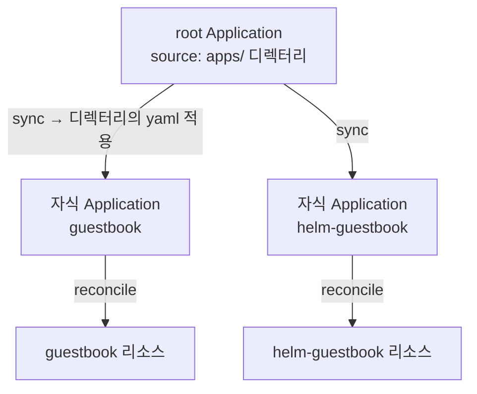

# 13. App of Apps 패턴 — 앱을 앱으로 관리

새 클러스터에 플랫폼을 올린다고 합시다 — ingress, monitoring, cert-manager, 그리고 서비스 앱 몇 개. 이들을 Application 매니페스트로 하나씩 `kubectl apply`하면, 어디까지 적용했는지·무엇이 빠졌는지를 사람이 추적해야 합니다. App of Apps는 이걸 **Application 하나로 묶습니다.** 핵심은 단순합니다 — **Application의 source가 다른 Application 매니페스트들을 담은 디렉터리를 가리키게 한다.** 그러면 그 root Application을 sync할 때 디렉터리의 자식 Application들이 클러스터에 생성되고, 각 자식이 또 자기 앱을 배포합니다. Application이 Application을 배포하는 2단계 구조입니다. 주의할 것은 이것이 ApplicationSet 같은 CRD가 아니라 **패턴**이라는 점 — 새 종류의 객체가 아니라, 평범한 Application과 평범한 directory source를 조합한 관용구입니다. 이 편은 root Application과 자식 Application 둘을 만들어 "root 하나를 sync하면 자식들이 줄줄이 생기는" 부트스트랩 구조를 보고, 같은 일을 하는 ApplicationSet과 언제 무엇을 쓸지 가릅니다. 산출물은 "root → 자식 → 앱으로 펼쳐지는 App of Apps 구조를 만든 결과물"과 "App of Apps와 ApplicationSet의 경계를 말할 수 있는 상태"입니다.

## 핵심 다이어그램



- **App of Apps는 CRD가 아니라 패턴이다.** root도 자식도 평범한 `kind: Application`이다. 새로운 건 "root의 source가 자식 Application 매니페스트들을 담은 디렉터리"라는 조합뿐이다.
- **root의 적용 결과가 자식 Application이다.** root는 directory source(7편의 plain 타입)로 `apps/`의 yaml들을 클러스터에 적용한다. 그 yaml들이 `kind: Application`이므로, 적용 결과로 자식 Application 객체가 생긴다.
- **reconcile이 2단계로 이어진다.** root가 자식 Application을 만들고(1단계), 각 자식이 자기 앱 리소스를 만든다(2단계). 같은 reconcile 모델이 한 층 더 쌓인 것이다.
- **부트스트랩에 쓰인다.** root 하나만 클러스터에 두면, 그 아래 플랫폼 앱 전체가 따라온다. "클러스터에 무엇을 깔지"가 root가 가리키는 디렉터리 하나로 선언된다.

아래 시연이 이 구조를 한 줄씩 손으로 확인합니다.

## 사전 준비물

이 실습은 **macOS** 환경을 기준으로 합니다. 구조 확인은 클러스터 없이 진행되고, 실제 부트스트랩은 본인 repo로 안내합니다.

### kubectl · argocd CLI · git 설치

```bash
brew install kubectl argocd git
```

## 여기서 직접 확인할 수 있는 것

### 구조를 본다 — root와 자식

이 디렉터리는 App of Apps 구조 그대로입니다. `apps/`에 자식 Application들이, `manifests/root.yaml`에 root가 있습니다.

```bash
find apps manifests -type f | sort
```

```
apps/guestbook.yaml
apps/helm-guestbook.yaml
manifests/root.yaml
```

`apps/`의 두 파일은 각각 평범한 Application입니다 — 공개 example-apps의 guestbook과 helm-guestbook을 배포합니다.

```bash
grep -E "kind:|name:|path:" apps/guestbook.yaml
```

```
kind: Application
  name: guestbook
    path: guestbook
```

### root가 무엇을 가리키나 — 디렉터리

root는 source로 `apps/` 디렉터리를 가리키고, `directory.recurse: true`로 그 안의 yaml을 모두 적용합니다.

```bash
grep -E "path: apps|recurse:|destination" -A2 manifests/root.yaml | sed 's/ *#.*//'
```

```
    path: apps
    directory:
      recurse: true
  destination:
    server: https://kubernetes.default.svc
    namespace: argocd
```

여기서 root의 `destination.namespace`가 `argocd`인 점이 중요합니다 — root가 적용하는 건 **앱 리소스가 아니라 자식 Application 객체**이고, Application 객체는 `argocd` namespace에 삽니다(5편). 자식이 자기 앱을 배포할 namespace는 각 자식 매니페스트의 `destination`에 따로 적혀 있습니다(`guestbook`, `helm-guestbook`).

### 부트스트랩한다 — 본인 repo에 두고 root만 적용

`apps/`와 자식 매니페스트를 본인 repo에 올리고, root의 `repoURL`을 바꾼 뒤 root **하나만** 적용하면 나머지가 따라옵니다.

클러스터·Argo CD를 준비합니다.

```bash
kind create cluster --name rosa-lab
kubectl create namespace argocd
kubectl apply -n argocd -f https://raw.githubusercontent.com/argoproj/argo-cd/stable/manifests/install.yaml
kubectl -n argocd wait --for=condition=Ready pods --all --timeout=180s
```

본인 repo로 `repoURL`을 바꾼 root를 적용합니다.

```bash
# manifests/root.yaml 의 repoURL 을 본인 repo로 교체한 뒤:
kubectl apply -f manifests/root.yaml
sleep 10
kubectl -n argocd get applications
```

```
NAME             SYNC STATUS   HEALTH STATUS
root             Synced        Healthy
guestbook        Synced        Healthy
helm-guestbook   Synced        Healthy
```

root 하나를 적용했는데 자식 둘(`guestbook`·`helm-guestbook`)이 함께 생겼습니다. root가 `apps/`의 yaml을 적용하면서 자식 Application이 만들어졌고, 그 자식들이 각자 앱을 배포해 Healthy가 됐습니다.

```bash
kubectl get ns | grep -E "guestbook|helm-guestbook"
```

```
guestbook         Active
helm-guestbook    Active
```

자식 앱들의 namespace까지 생겼습니다 — root 하나의 sync가 전체 부트스트랩으로 펼쳐졌습니다. 새 앱을 추가하려면 `apps/`에 yaml 하나를 더 커밋하면 됩니다. root가 그것을 다음 sync에서 자식으로 만듭니다.

### App of Apps와 ApplicationSet — 언제 무엇을 쓰나

둘 다 "Application을 여러 개 만든다"지만 결이 다릅니다.

| | App of Apps | ApplicationSet |
|---|---|---|
| 정체 | **패턴** (Application + directory source) | **CRD** (applicationset-controller가 생성) |
| 자식들은 | 서로 **다른** 앱 묶음 (ingress·monitoring·서비스…) | **같은** 모양, 파라미터만 다름 (env·cluster…) |
| 추가 방법 | `apps/`에 yaml 파일 추가 | generator의 element·축 추가 |
| 잘 맞는 곳 | 클러스터 **부트스트랩**, 이종 앱 한 묶음 | 멀티 환경·멀티 클러스터로 **같은 앱 펼치기** |

판단 기준은 "자식들이 서로 같은가 다른가"입니다. payment·user 같은 **같은 앱을 환경마다** 펼치면 ApplicationSet, ingress·cert-manager·monitoring 같은 **서로 다른 앱을 한 묶음으로** 부트스트랩하면 App of Apps입니다. 둘은 섞이기도 합니다 — root(App of Apps)가 여러 ApplicationSet을 자식으로 묶어, "이 클러스터에 깔 모든 것"을 root 하나로 선언하는 구조가 대규모에서 흔합니다.

### 정리

클러스터를 띄웠다면(root에 finalizer가 없으면 자식 Application은 orphan으로 남으므로, root부터 cascade로 지웁니다):

```bash
argocd app delete root --cascade --yes 2>/dev/null || kubectl -n argocd delete application root guestbook helm-guestbook
kind delete cluster --name rosa-lab
```

## 이 편의 산출물

- root Application(directory source) + 자식 Application 둘(`apps/`)로 이뤄진 **App of Apps 구조**를 만들고, root 하나의 sync가 자식 Application 생성 → 자식의 앱 배포로 2단계로 펼쳐지는 부트스트랩을 확인한 결과물.
- App of Apps가 **CRD가 아니라 패턴**(평범한 Application + directory source의 조합)이며, root의 `destination.namespace`가 `argocd`인 이유(적용 대상이 앱이 아니라 자식 Application 객체)를 이해한 상태.
- 새 앱 추가가 `apps/`에 yaml 한 장을 커밋하는 일이고, "클러스터에 무엇을 깔지"가 root가 가리키는 디렉터리 하나로 선언됨을 본 경험.
- App of Apps(서로 다른 앱 묶음·부트스트랩)와 ApplicationSet(같은 앱을 환경·클러스터로 펼치기)의 경계를 "자식들이 서로 같은가 다른가"로 가르고, 대규모에서 root가 ApplicationSet들을 묶는 조합을 이해한 상태.
