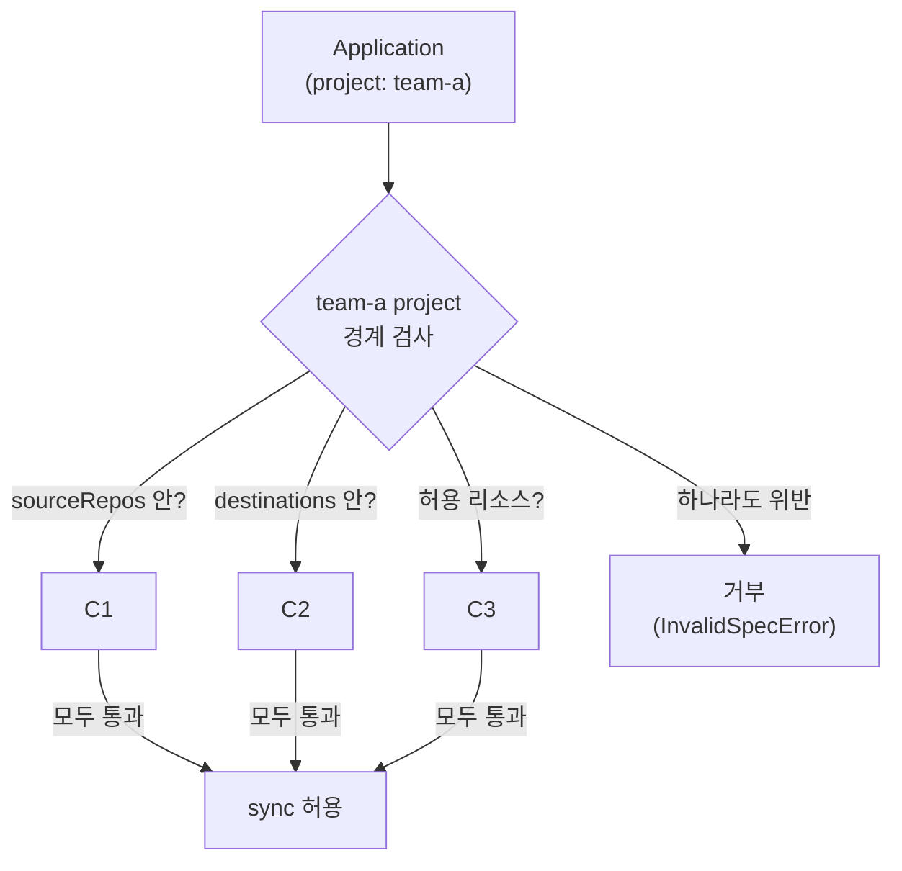

# 14. AppProject — 팀·환경 경계 · 멀티테넌시 · RBAC scope

여러 팀이 한 Argo CD를 같이 쓰면 곧 질문이 생깁니다 — payment 팀이 실수로 user 팀 namespace에 배포하면? 검증 안 된 외부 repo를 source로 걸면? 누군가 ClusterRole을 배포해 권한을 키우면? 모든 Application이 무엇이든 어디에나 배포할 수 있는 상태(기본 `default` project가 그렇습니다)는 멀티테넌시에서 위험합니다. AppProject는 **"이 묶음의 Application은 어떤 repo에서, 어떤 클러스터·namespace로, 어떤 종류의 리소스를 배포해도 되는가"의 울타리**입니다. 모든 Application은 정확히 하나의 project에 속하고, project 경계를 벗어나는 Application은 **거부**됩니다 — sync가 안 되는 게 아니라 애초에 허용되지 않습니다. 이 편은 `team-a` project를 만들어 repo·namespace·리소스 종류를 좁히고, 경계 안 Application은 정상 배포되지만 경계 밖(다른 namespace)을 노린 Application은 거부되는 것을 봅니다. 그리고 project가 RBAC scope의 단위이기도 함을 짚습니다. 산출물은 "AppProject로 source·destination·resource 경계를 좁힌 결과물"과 "경계 위반 Application이 거부되는 것을 손으로 본 경험"입니다.

## 핵심 다이어그램



- **AppProject는 정책 울타리다.** `sourceRepos`(어디서)·`destinations`(어디로)·`*ResourceWhitelist`(무엇을)로 한 묶음의 Application이 배포할 수 있는 범위를 좁힌다. `default` project는 이 모두가 `*`라 제한이 없다(5편).
- **모든 Application은 한 project에 속한다.** `spec.project`가 그것이다. project를 지정하지 않으면 `default`로 들어간다 — 즉 명시적으로 좁힌 project에 넣어야 경계가 생긴다.
- **경계 위반은 sync 실패가 아니라 거부다.** repo·namespace·리소스가 project 허용 범위를 벗어나면, Argo CD는 그 Application을 `InvalidSpecError`로 막는다. drift나 렌더 문제가 아니라 **정책 차원의 거부**다.
- **project는 RBAC scope이기도 하다.** `spec.roles`로 "이 project의 앱을 누가 sync할 수 있는가"를 project 안에서 정한다 — 전역 권한과 별개로, 팀이 자기 project 안에서 권한을 가진다.

아래 시연이 이 경계를 한 줄씩 손으로 확인합니다.

## 사전 준비물

이 실습은 **macOS** 환경을 기준으로 합니다.

- **Docker** — Docker Desktop, OrbStack 등. `docker ps`가 에러 없이 돌아가면 OK.
- **Homebrew** — macOS 패키지 관리자.

### kind · kubectl · argocd CLI 설치

```bash
brew install kind kubectl argocd
```

### 클러스터 · Argo CD 준비

```bash
kind create cluster --name rosa-lab
kubectl create namespace argocd
kubectl apply -n argocd -f https://raw.githubusercontent.com/argoproj/argo-cd/stable/manifests/install.yaml
kubectl -n argocd wait --for=condition=Ready pods --all --timeout=180s
```

## 여기서 직접 확인할 수 있는 것

### 경계를 만든다 — team-a project

`manifests/project.yaml`은 세 축을 좁힙니다 — repo는 example-apps만, namespace는 `team-a-*`만, 리소스는 Service·Deployment만.

```bash
kubectl apply -f manifests/project.yaml
kubectl -n argocd get appproject team-a -o jsonpath='{.spec.sourceRepos} {.spec.destinations[0].namespace}{"\n"}'
```

```
[https://github.com/argoproj/argocd-example-apps.git] team-a-*
```

`default`의 `*`와 달리, 이 project는 한 repo와 `team-a-*` namespace로 좁혀졌습니다. 이 경계 안에서만 배포가 허용됩니다.

### 경계 안 — 정상 배포된다

`manifests/app-allowed.yaml`은 세 축을 모두 만족합니다 — example-apps repo, `team-a-dev` namespace(`team-a-*`에 맞음), guestbook(Service+Deployment만).

```bash
kubectl apply -f manifests/app-allowed.yaml
argocd app wait allowed --health 2>/dev/null
argocd app get allowed | grep -E "Project|Sync Status|Health Status"
```

```
Project:            team-a
Sync Status:        Synced
Health Status:      Healthy
```

경계를 모두 지켰으므로 정상 배포됐습니다. project가 `team-a`임이 보입니다.

### 경계 밖 — 거부된다

`manifests/app-denied-ns.yaml`은 다른 건 같은데 namespace만 `team-b-dev`입니다 — `team-a-*` 패턴을 벗어납니다.

```bash
kubectl apply -f manifests/app-denied-ns.yaml
sleep 5
argocd app get denied-ns | grep -E "Sync Status|Conditions|Message" -i
```

```
Sync Status:        Unknown
Conditions:         InvalidSpecError
Message:            application destination namespace 'team-b-dev' is not permitted in project 'team-a'
```

배포되지 않았습니다. 이건 sync가 실패한 게 아니라 **project가 거부**한 것입니다 — `team-a` 경계에 `team-b-dev`가 없으니, Argo CD는 이 Application을 `InvalidSpecError`로 막습니다. namespace를 `team-a-*`로 바꾸지 않는 한, 이 앱은 영영 배포되지 않습니다.

```bash
kubectl -n team-b-dev get deploy 2>&1
```

```
No resources found in team-b-dev namespace.
```

리소스가 만들어지지 않았습니다. 같은 방식으로 다른 repo를 source로 걸거나(`sourceRepos` 위반), guestbook 대신 ClusterRole을 포함한 앱을 걸면(`clusterResourceWhitelist: []` 위반) 모두 거부됩니다 — 세 축 중 하나만 벗어나도 막힙니다.

### 리소스 종류도 경계다 — whitelist

`team-a`는 namespace 리소스 중 Service·Deployment만 허용합니다.

```bash
kubectl -n argocd get appproject team-a -o jsonpath='{range .spec.namespaceResourceWhitelist[*]}{.kind}{" "}{end}{"\n"}'
kubectl -n argocd get appproject team-a -o jsonpath='clusterResources={.spec.clusterResourceWhitelist}{"\n"}'
```

```
Service Deployment 
clusterResources=[]
```

`clusterResourceWhitelist: []`라 ClusterRole·ClusterRoleBinding 같은 **클러스터 범위 리소스는 전면 금지**입니다. 팀 앱이 권한을 스스로 키우지 못하게 막는 흔한 설정입니다. namespace 범위도 Service·Deployment만 허용하므로, 그 외(예: Secret·CronJob)를 배포하려는 Application은 거부됩니다.

### project는 RBAC scope이기도 하다

`team-a`의 `roles`는 "이 project 안에서 누가 무엇을 할 수 있는가"를 정합니다.

```bash
kubectl -n argocd get appproject team-a -o jsonpath='{.spec.roles[0].name}: {.spec.roles[0].policies[0]}{"\n"}'
```

```
deployer: p, proj:team-a:deployer, applications, sync, team-a/*, allow
```

이 policy는 "`team-a` project의 Application을 **sync만** 할 수 있다"는 권한을 `deployer` role에 줍니다. `groups`에 묶인 OIDC 그룹(`team-a-oncall`) 멤버가 이 role을 받습니다. 전역 관리자 권한과 별개로, **팀이 자기 project 안에서만** 권한을 가지는 구조 — 이것이 멀티테넌시의 핵심입니다. project가 배포 범위(source·destination·resource)와 권한 범위(roles)를 한 객체에서 함께 긋습니다.

### 정리

```bash
argocd app delete allowed --yes 2>/dev/null
kubectl -n argocd delete application denied-ns --ignore-not-found
kubectl -n argocd delete appproject team-a --ignore-not-found
kubectl delete ns team-a-dev --ignore-not-found
kubectl delete -n argocd -f https://raw.githubusercontent.com/argoproj/argo-cd/stable/manifests/install.yaml
kubectl delete namespace argocd
```

클러스터까지 정리하려면:

```bash
kind delete cluster --name rosa-lab
```

## 이 편의 산출물

- `team-a` AppProject로 **세 축**(sourceRepos 한 repo·destinations `team-a-*`·namespaceResourceWhitelist Service/Deployment)을 좁혀, `default`의 `*`를 경계로 바꾼 결과물.
- 경계를 모두 지킨 Application은 정상 배포되고, namespace만 벗어난 Application은 **`InvalidSpecError`로 거부**(sync 실패가 아니라 정책 차원의 거부)되며 리소스가 만들어지지 않음을 손으로 본 경험.
- `clusterResourceWhitelist: []`로 **클러스터 범위 리소스(ClusterRole 등)를 전면 금지**해 팀 앱이 권한을 스스로 키우지 못하게 막는 패턴, 그리고 리소스 종류도 경계의 한 축임을 확인한 상태.
- AppProject가 배포 범위(source·destination·resource)와 **RBAC scope(roles)**를 한 객체에서 함께 긋는 멀티테넌시의 단위임을, project-scoped role policy(`proj:team-a:deployer` sync 권한)로 이해한 상태.
