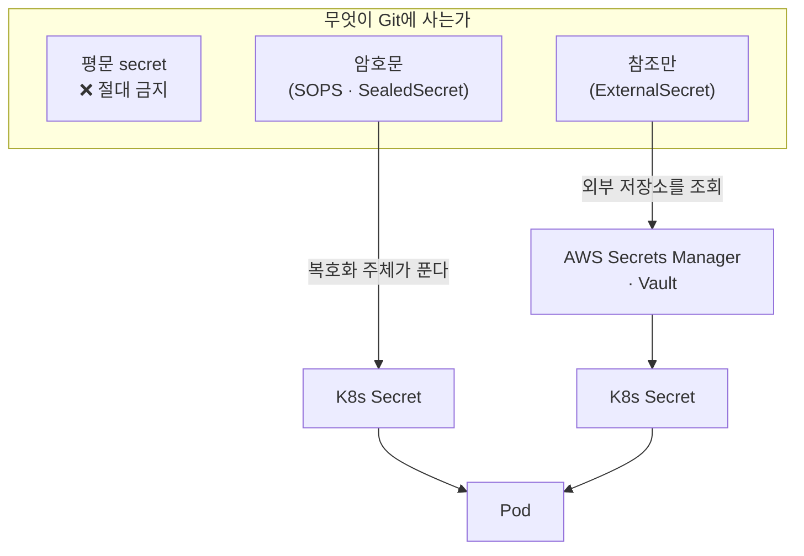
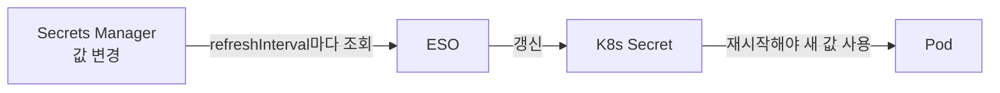

# 15. Secret 관리 — SOPS · sealed-secrets · External Secrets · rotation

GitOps의 원칙은 "모든 것을 Git에"지만, secret만은 예외입니다 — DB 비밀번호·API 키를 평문으로 repo에 커밋하면, repo에 접근하는 누구나(그리고 git 히스토리·포크·CI 로그가) 그 값을 봅니다. 그렇다고 secret을 GitOps 밖에서 손으로 관리하면 "Git이 곧 클러스터 상태"라는 모델이 깨집니다. 답은 둘 중 하나입니다 — **secret을 암호화해서 Git에 두거나(SOPS·sealed-secrets), 아예 Git에 두지 않고 참조만 두거나(External Secrets).** 핵심 질문은 **"무엇이 Git에 사는가"**입니다. 평문은 절대 안 되고, 암호문이 살거나(복호화 주체가 풀어 줌), 참조만 살거나(외부 저장소가 진짜 값을 가짐). 그리고 secret은 한 번 두고 끝이 아니라 **회전(rotation)**해야 하는데, 방식마다 "누가 언제 값을 바꾸나"가 다릅니다. 이 편은 세 방식의 역할 경계를 가르고, sealed-secrets로 평문 → 봉인 → 복호화 흐름을 보고, EKS 실무 기본인 External Secrets의 참조 구조와 rotation 흐름을 정리합니다. 산출물은 "세 방식이 무엇을 Git에 두는지 구분한 상태"와 "EKS에서 External Secrets로 외부 저장소를 참조하는 구조와 rotation 흐름을 말할 수 있는 상태"입니다.

## 핵심 다이어그램



- **평문은 금지다.** secret을 그대로 Git에 두면 repo 접근자·히스토리·포크 전부에 노출된다. 나머지 모든 방식은 이걸 피하는 방법이다.
- **SOPS·sealed-secrets는 암호문을 Git에 둔다.** 값을 암호화한 결과를 커밋하고, 복호화 주체(SOPS는 sync 시 KMS/age 키, sealed-secrets는 클러스터 controller의 private key)가 클러스터 안에서 K8s Secret으로 푼다. 암호문은 공개돼도 키 없이는 못 푼다.
- **External Secrets는 참조만 Git에 둔다.** 진짜 값은 AWS Secrets Manager·Vault 같은 외부 저장소에 있고, Git에는 "어디서 가져올지"만 적는다. ESO(External Secrets Operator)가 그 저장소를 조회해 K8s Secret을 만든다.
- **rotation은 방식마다 주체가 다르다.** 암호문 방식은 값을 바꾸려면 **다시 암호화해 커밋**한다(rotation = Git 커밋). External Secrets는 **외부 저장소에서 값만 바꾸면** ESO가 주기적으로 당겨와 갱신한다(rotation = 외부 저장소).

아래 시연이 이 경계를 한 줄씩 손으로 확인합니다.

## 사전 준비물

이 실습은 **macOS** 환경을 기준으로 합니다.

- **Docker** — Docker Desktop, OrbStack 등. `docker ps`가 에러 없이 돌아가면 OK.
- **Homebrew** — macOS 패키지 관리자.

### kind · kubectl · kubeseal 설치

```bash
brew install kind kubectl kubeseal
```

### 클러스터 준비

```bash
kind create cluster --name rosa-lab
kubectl create namespace app
```

## 여기서 직접 확인할 수 있는 것

### 평문은 왜 안 되나 — base64는 암호화가 아니다

흔한 오해부터 짚습니다. K8s Secret의 `data`는 base64인데, 이건 **인코딩이지 암호화가 아닙니다.**

```bash
echo "s3cret-password" | base64
# → czNjcmV0LXBhc3N3b3JkCg==
echo "czNjcmV0LXBhc3N3b3JkCg==" | base64 -d
# → s3cret-password
```

키 없이 한 줄로 원문이 나옵니다. 그래서 평문 Secret(또는 base64 Secret)을 Git에 커밋하는 건 비밀번호를 그대로 올리는 것과 같습니다. 아래 방식들은 모두 이 문제를 푸는 다른 답입니다.

### sealed-secrets — 봉인해서 Git에 둔다

sealed-secrets는 controller를 클러스터에 깔고, 그 controller의 **public key로 암호화**합니다. 암호문(SealedSecret)은 Git에 안전하게 두고, controller만 자기 private key로 풉니다.

controller를 설치합니다.

```bash
kubectl apply -f https://github.com/bitnami-labs/sealed-secrets/releases/latest/download/controller.yaml
kubectl -n kube-system rollout status deploy/sealed-secrets-controller
```

평문 Secret을 만들되 **Git에는 올리지 않고**, `kubeseal`로 봉인합니다.

```bash
# 평문 Secret (로컬에만, Git ✗)
kubectl create secret generic db -n app \
  --from-literal=password=s3cret-password \
  --dry-run=client -o yaml > /tmp/secret.yaml

# 봉인 → SealedSecret (Git ✓)
kubeseal -f /tmp/secret.yaml -w manifests/sealedsecret.yaml
grep -A2 "encryptedData:" manifests/sealedsecret.yaml | sed 's/ *#.*//'
```

```
  encryptedData:
    password: AgBy3i4OJSWK+PiTySYZZA9rO43cGDEq...
  template:
```

이 `manifests/sealedsecret.yaml`은 암호문이라 Git에 커밋해도 안전합니다. 적용하면 controller가 복호화해 진짜 Secret을 만듭니다.

```bash
kubectl apply -f manifests/sealedsecret.yaml
kubectl -n app get secret db
kubectl -n app get secret db -o jsonpath='{.data.password}' | base64 -d; echo
```

```
NAME   TYPE     DATA   AGE
db     Opaque   1      3s
s3cret-password
```

Git에는 암호문만 올라갔는데, 클러스터에는 진짜 Secret이 생겼습니다 — controller가 풀어 준 것입니다. SOPS도 결은 같습니다(암호문을 Git에 두고 sync 시 KMS/age 키로 복호화). 차이는 **복호화가 일어나는 위치**입니다 — sealed-secrets는 클러스터 controller, SOPS는 Argo CD sync 단계(plugin).

### External Secrets — 참조만 Git에 둔다 (EKS 실무 기본)

암호문조차 Git에 두기 싫다면, 값을 외부 저장소에 두고 **참조만** 커밋합니다. AWS/EKS 환경의 실무 기본입니다. Git에는 두 개만 둡니다 — 외부 저장소 연결(`SecretStore`)과 무엇을 가져올지(`ExternalSecret`).

```bash
grep -E "kind:|service:|region:|key:|property:|refreshInterval:" manifests/secretstore.yaml manifests/externalsecret.yaml | sed 's/ *#.*//'
```

```
manifests/secretstore.yaml:kind: SecretStore
manifests/secretstore.yaml:      service: SecretsManager
manifests/secretstore.yaml:      region: ap-northeast-2
manifests/externalsecret.yaml:kind: ExternalSecret
manifests/externalsecret.yaml:  refreshInterval: 1h
manifests/externalsecret.yaml:    kind: SecretStore
manifests/externalsecret.yaml:        key: prod/db
manifests/externalsecret.yaml:        property: password
```

`SecretStore`는 "AWS Secrets Manager(ap-northeast-2)를 IRSA로 접근한다"는 연결이고, `ExternalSecret`은 "`prod/db`의 `password` 필드를 가져와 K8s Secret `db`를 만든다"는 선언입니다. **진짜 값은 Git에도, 매니페스트에도 없습니다** — Secrets Manager에만 있습니다. EKS에서 ESO를 깔고 SA에 IRSA를 붙이면, ESO가 이 참조를 따라 Secret을 만듭니다.

### rotation — 누가 언제 값을 바꾸나

secret은 주기적으로 회전해야 하는데, 방식마다 회전 주체가 다릅니다.

- **암호문 방식(SOPS·sealed-secrets)** — 값을 바꾸려면 새 값을 **다시 암호화해 커밋**합니다. rotation이 Git 커밋이라 추적은 쉽지만, 사람이 매번 재봉인해야 합니다.
- **External Secrets** — **외부 저장소에서 값만 바꾸면** 끝입니다. ESO가 `refreshInterval`(여기선 1h)마다 다시 조회해 K8s Secret을 갱신합니다. Git은 건드리지 않습니다.

External Secrets의 rotation 흐름은 이렇게 이어집니다.



마지막 한 칸이 함정입니다 — K8s Secret이 갱신돼도, 이미 떠 있는 Pod는 옛 값을 환경변수·볼륨으로 들고 있습니다. 새 값을 쓰려면 **Pod를 재시작**해야 합니다. 그래서 secret 변경을 Deployment의 롤아웃과 잇습니다(예: Secret 해시를 Pod 템플릿 annotation에 넣어 값이 바뀌면 자동 롤아웃되게 하거나, Reloader 같은 컨트롤러를 씁니다). "값 회전 → Secret 갱신 → Pod 재시작"까지 이어져야 rotation이 실제로 적용됩니다.

### 세 방식을 한눈에

| 방식 | Git에 사는 것 | 복호화·조회 주체 | rotation |
|---|---|---|---|
| ~~평문 Secret~~ | ~~값 그대로~~ | ~~-~~ | **❌ 절대 금지** |
| SOPS | 암호문 | sync 단계(KMS/age 키) | 재암호화 커밋 |
| sealed-secrets | SealedSecret(암호문) | 클러스터 controller(private key) | 재봉인 커밋 |
| External Secrets | 참조(어디서 가져올지) | ESO가 외부 저장소 조회 | 외부 저장소에서 값 변경 → 자동 |

선택 기준은 "암호문을 Git에 두는 게 허용되나, 아니면 참조만 둘 것인가"입니다. 작은 팀·외부 저장소가 없으면 **sealed-secrets**가 간단하고, AWS/EKS처럼 Secrets Manager·IRSA가 있으면 **External Secrets**가 rotation까지 자연스러워 실무 기본입니다.

### 정리

```bash
kubectl -n app delete sealedsecret db --ignore-not-found
kubectl delete -f https://github.com/bitnami-labs/sealed-secrets/releases/latest/download/controller.yaml --ignore-not-found
kubectl delete namespace app --ignore-not-found
```

클러스터까지 정리하려면:

```bash
kind delete cluster --name rosa-lab
```

## 이 편의 산출물

- K8s Secret의 base64가 암호화가 아님을 한 줄로 확인하고, **평문 secret을 Git에 두면 안 되는 이유**와 나머지 방식이 모두 이 문제의 다른 답임을 가른 상태.
- sealed-secrets로 평문 → `kubeseal` 봉인(암호문) → controller 복호화 → 진짜 K8s Secret 생성의 흐름을 손으로 보고, **암호문은 Git에 안전하고 복호화는 클러스터 안에서** 일어남을 확인한 경험.
- External Secrets가 **참조(SecretStore·ExternalSecret)만 Git에 두고** 진짜 값은 AWS Secrets Manager에 남기는 구조, 그리고 그것이 IRSA로 접근하는 EKS 실무 기본임을 매니페스트로 이해한 상태.
- rotation의 주체가 방식마다 다름(암호문=재암호화 커밋, External Secrets=외부 저장소 변경 후 자동 갱신)을 구분하고, **"값 회전 → Secret 갱신 → Pod 재시작"**까지 이어져야 실제 적용됨을 이해한 상태.
