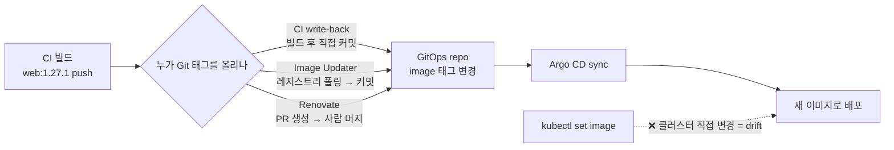

# 16. Image Update — 이미지 태그는 누가 올리는가

CI가 새 이미지(`web:1.27.1`)를 빌드해 레지스트리에 푸시했습니다. 이제 클러스터가 이 새 이미지를 쓰게 하려면 무엇을 해야 할까요? 명령형 세계의 답은 `kubectl set image`지만, GitOps에서 이건 금지입니다 — 클러스터를 직접 바꾸면 Git의 선언(`web:1.27.0`)과 어긋나 drift가 되고, selfHeal이 켜져 있으면 다음 reconcile에서 옛 이미지로 되돌려집니다. GitOps의 답은 하나입니다 — **클러스터가 아니라 Git의 태그를 바꾼다.** Git이 `web:1.27.1`로 커밋되면, Argo CD가 그 변경을 당겨와 sync합니다. 그러면 남는 질문은 **"누가 Git의 태그를 올리나"**입니다. 세 주체가 있습니다 — 빌드한 CI가 직접 커밋하거나(write-back), Argo CD Image Updater가 레지스트리를 폴링해 자동 커밋하거나, Renovate가 새 태그 PR을 열어 사람이 머지합니다. 이 편은 CI write-back을 git으로 직접 시연해 "이미지 갱신 = Git 커밋"임을 보고, Image Updater와 Renovate의 설정과 차이를 정리합니다. 산출물은 "이미지 갱신이 클러스터가 아니라 Git 변경임을 손으로 본 경험"과 "태그를 올리는 세 주체를 자동화 수준·게이트로 구분한 상태"입니다.

## 핵심 다이어그램



- **이미지 갱신은 Git 변경이다.** 클러스터를 직접 바꾸면 Git과 어긋나 drift가 된다. Git의 태그를 바꿔야 Argo CD가 정상 경로로 sync한다 — `build → push → update Git → sync`.
- **누가 Git을 바꾸느냐가 갈린다.** CI(빌드 이벤트로 즉시), Image Updater(레지스트리를 폴링해 자동), Renovate(스케줄로 PR 생성). 셋 다 **Git을 거친다**는 점은 같고, 자동화 수준과 사람 게이트가 다르다.
- **write-back은 반드시 Git이어야 한다.** Image Updater는 Git 커밋 대신 Application parameter를 직접 고치는 모드(`argocd`)도 있는데, 그러면 변경이 Git에 안 남아 GitOps가 깨진다. `write-back-method: git`이 원칙이다.
- **사람 게이트가 필요한 곳을 고른다.** dev는 자동 머지로 빠르게, prd는 PR 리뷰로 신중하게 — Renovate는 이 게이트를 PR로 만든다.

아래 시연이 이 원칙을 한 줄씩 손으로 확인합니다.

## 사전 준비물

이 실습은 **macOS** 환경을 기준으로 합니다. CI write-back 시연은 클러스터 없이 git만으로 진행됩니다.

- **git** — `git --version`이 돌면 OK.

## 여기서 직접 확인할 수 있는 것

### CI write-back — 이미지 갱신은 Git 커밋이다

CI가 빌드 후 GitOps repo의 태그를 바꾸는 일을 git으로 직접 해 봅니다. 먼저 prd 매니페스트가 `1.27.0`을 가리키는 repo를 만듭니다.

```bash
mkdir gitops && cd gitops && git init -q
mkdir -p env/prd
cat > env/prd/web.yaml <<'EOF'
apiVersion: apps/v1
kind: Deployment
metadata:
  name: web
  namespace: web-prd
spec:
  replicas: 2
  selector: { matchLabels: { app: web } }
  template:
    metadata: { labels: { app: web } }
    spec:
      containers:
        - name: web
          image: nginx:1.27.0
EOF
git add . && git commit -qm "deploy web 1.27.0"
```

이제 CI가 `nginx:1.27.1`을 빌드·푸시한 뒤 하는 일 — **GitOps repo의 태그를 바꿔 커밋** — 을 그대로 재현합니다.

```bash
git switch -c ci/web-1.27.1 -q
sed -i '' 's|nginx:1.27.0|nginx:1.27.1|' env/prd/web.yaml
git commit -aqm "ci: bump web image to 1.27.1"
git show --stat HEAD | tail -3
git diff main HEAD
```

```
 env/prd/web.yaml | 2 +-

diff --git a/env/prd/web.yaml b/env/prd/web.yaml
-          image: nginx:1.27.0
+          image: nginx:1.27.1
```

이미지 갱신 전체가 **파일 한 줄, 커밋 하나**입니다. `kubectl set image`는 어디에도 없습니다 — CI는 클러스터에 손대지 않고 Git만 바꿨고, 이 커밋이 main에 머지되면 Argo CD가 당겨와 sync합니다. "누가 배포했나"는 이 커밋으로 추적되고, 되돌리려면 revert하면 됩니다. 이게 GitOps의 이미지 갱신입니다.

```bash
cd .. && rm -rf gitops
```

### Argo CD Image Updater — 레지스트리를 폴링해 자동 커밋

CI에 write-back 로직을 안 넣고 싶다면, Argo CD Image Updater가 그 일을 대신합니다. 별도 컨트롤러가 레지스트리를 폴링해 새 태그를 찾고, 규칙에 맞으면 Git에 커밋합니다. 설정은 Application의 **annotation**으로 줍니다.

```bash
grep "image-updater" manifests/app-image-updater.yaml | sed 's/ *#.*//'
```

```
    argocd-image-updater.argoproj.io/image-list: web=nginx
    argocd-image-updater.argoproj.io/web.update-strategy: semver
    argocd-image-updater.argoproj.io/web.allow-tags: regexp:^1\.27\..*
    argocd-image-updater.argoproj.io/write-back-method: git
    argocd-image-updater.argoproj.io/git-branch: main
```

- `image-list` — 감시할 이미지(`web=nginx`).
- `update-strategy: semver` + `allow-tags` — `1.27.x` 범위 안에서 최신 semver를 고른다(임의 태그로 안 튄다).
- **`write-back-method: git`** — 찾은 새 태그를 GitOps repo에 커밋한다. 이게 핵심이다. 만약 `argocd`로 두면 Application parameter를 직접 고쳐 Git을 안 거치므로 drift가 된다 — GitOps를 유지하려면 반드시 `git`이다.

즉 Image Updater는 CI write-back의 "레지스트리 폴링 + 커밋" 부분을 컨트롤러가 자동으로 하는 것입니다. 결과(Git 커밋 → sync)는 CI write-back과 같습니다.

### Renovate — 새 태그를 PR로 연다

CI·Image Updater가 자동으로 커밋한다면, Renovate는 **PR을 열어 사람 게이트**를 둡니다. 새 이미지·차트·라이브러리 버전을 감지해 업데이트 PR을 만들고, 사람이 리뷰·머지합니다.

```bash
grep -E "managerFilePatterns|matchFileNames|matchUpdateTypes|automerge" manifests/renovate.json
```

```
    "managerFilePatterns": ["/env/.+\\.ya?ml$/"]
      "matchFileNames": ["env/prd/**"],
      "automerge": false
      "matchFileNames": ["env/dev/**"],
      "matchUpdateTypes": ["patch"],
      "automerge": true
```

`env/*.yaml`의 이미지를 감시하되, **prd는 자동 머지 금지(PR 리뷰 필수), dev의 패치는 자동 머지**로 둡니다. 환경마다 게이트의 세기를 다르게 거는 것 — prd 배포는 사람이 보고, dev는 빠르게 흐르게 합니다. 머지되면 그 변경이 Git에 들어가 Argo CD가 sync합니다.

### 세 주체를 한눈에

| 주체 | 새 태그 감지 | Git 반영 | 사람 게이트 |
|---|---|---|---|
| **CI write-back** | 빌드 이벤트(즉시) | 빌드 후 직접 커밋 | 없음(파이프라인 자동) |
| **Argo CD Image Updater** | 레지스트리 폴링 | 컨트롤러가 자동 커밋(`git`) | 없음(자동) |
| **Renovate** | 스케줄 폴링 | PR 생성 | **PR 리뷰·머지** |

공통점은 셋 다 **Git을 거쳐 sync를 유발**한다는 것입니다(클러스터 직접 변경 아님). 차이는 누가 감지하고 사람이 어디서 끼어드느냐입니다 — 빠른 흐름이 필요하면 CI·Image Updater, 버전 변경을 사람이 보고 결정해야 하면 Renovate. dev는 자동, prd는 PR처럼 환경별로 섞기도 합니다.

## 이 편의 산출물

- CI가 새 이미지를 푸시한 뒤 하는 일이 `kubectl set image`가 아니라 **GitOps repo의 태그를 바꾸는 커밋**임을, 로컬 git에서 `sed`로 태그를 올리고 `git diff`로 "파일 한 줄·커밋 하나"를 확인한 경험.
- 이미지 갱신을 클러스터 직접 변경(drift)이 아니라 **`build → push → update Git → sync`** 흐름으로 그릴 수 있고, `kubectl set image`가 왜 GitOps에서 금지인지 말할 수 있는 상태.
- Argo CD Image Updater의 annotation 설정(`image-list`·`update-strategy: semver`·`allow-tags`·**`write-back-method: git`**)을 읽고, write-back을 `argocd`(parameter 직접)로 두면 Git을 안 거쳐 drift가 되므로 `git`이어야 함을 이해한 상태.
- 태그를 올리는 세 주체(CI write-back·Image Updater·Renovate)를 **감지 방식·Git 반영·사람 게이트**로 구분하고, Renovate가 PR로 게이트를 만들어 prd는 리뷰·dev는 자동 머지처럼 환경별로 다르게 거는 패턴을 이해한 상태.
