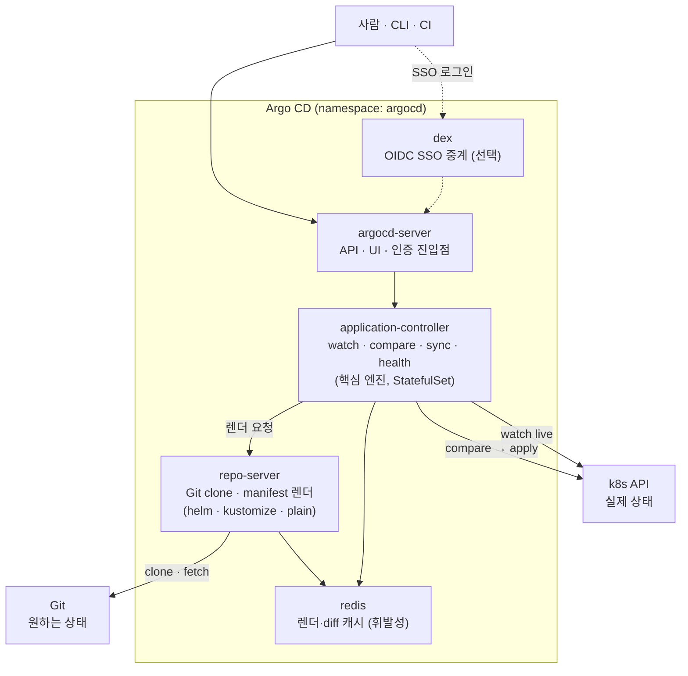
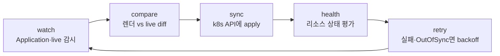

# 2. Argo CD 내부 구조 — sync는 누가 수행하는가

Argo CD를 "하나의 프로그램"으로 생각하면 sync가 막혔을 때 어디를 봐야 할지 알 수 없습니다. Argo CD는 역할이 다른 여러 컴포넌트의 모임이고, "Git을 당겨와 클러스터에 맞춘다"는 한 문장은 사실 그 컴포넌트들의 분업입니다 — 누군가는 Git을 clone해 manifest를 렌더하고, 누군가는 그 결과를 클러스터의 실제 상태와 비교해 적용하고, 누군가는 사람이 보는 UI·API를 연다. 이 편은 Argo CD를 클러스터에 올린 뒤, 어떤 컴포넌트가 떠 있고 각자 무슨 일을 하는지 손으로 해부합니다. 첫 앱을 sync하기 전에 구조를 먼저 보는 이유는, 나중에 sync가 안 될 때 "렌더가 문제인지(repo-server), 비교·적용이 문제인지(application-controller), 접근이 문제인지(server)"를 가를 지도를 갖기 위해서입니다. 핵심은 **Kubernetes가 오브젝트를 reconcile한다면, Argo CD는 Git의 선언 상태와 클러스터 상태를 reconcile한다**는 것이고, 그 reconcile 한 바퀴가 어느 컴포넌트를 거치는지가 이 편의 그림입니다. 산출물은 "Argo CD 컴포넌트 분업도를 직접 그릴 수 있는 상태"와 "watch → compare → sync → health → retry 한 바퀴를 컴포넌트에 매핑한 경험"입니다.

## 핵심 다이어그램



- **argocd-server는 사람이 닿는 면이다.** API·UI·CLI 요청을 받고 인증한다. sync를 직접 "수행"하지는 않는다 — 요청을 받아 상태를 보여 주고, controller가 한 일을 중계한다.
- **application-controller는 핵심 엔진이다.** Application(CRD)을 watch하고, repo-server에 원하는 상태를 렌더해 달라 요청하고, 클러스터의 실제 상태와 비교(diff)해, 다르면 k8s API에 적용(sync)하고, 적용된 리소스의 health를 평가한다. "sync를 누가 하느냐"의 답이 여기다.
- **repo-server는 manifest를 만든다.** Git을 clone·fetch해서 helm template·kustomize build·plain YAML을 **렌더**한다. 클러스터를 직접 건드리지 않는다 — 텍스트(원하는 상태)를 만들어 controller에 건넨다.
- **redis는 캐시다.** 렌더 결과·diff·앱 상태를 캐시해 반복 작업을 줄인다. 영속 데이터가 아니라 날아가도 재생성된다(진실은 Git과 클러스터에 있다).
- **dex는 선택이다.** GitHub·Google 같은 외부 IdP와 OIDC로 연결할 때만 일한다. SSO를 안 쓰면 떠 있어도 idle이다.

아래 시연이 이 분업을 한 줄씩 손으로 확인합니다.

## 사전 준비물

이 실습은 **macOS** 환경을 기준으로 합니다.

- **Docker** — Docker Desktop, OrbStack 등. `docker ps`가 에러 없이 돌아가면 OK.
- **Homebrew** — macOS 패키지 관리자.

### kind · kubectl 설치

```bash
brew install kind kubectl
```

### rosa-lab 클러스터 준비

```bash
kind create cluster --name rosa-lab
```

## 실습 환경

Argo CD를 `argocd` namespace에 공식 install manifests로 올립니다. 이 편은 컴포넌트 구조를 보는 게 목적이라, 누가 설치를 책임지느냐(직접 `kubectl` / `helm` / `terraform`)는 따지지 않고 가장 단순한 `kubectl apply`로 받습니다.

```bash
kubectl create namespace argocd
kubectl apply -n argocd -f https://raw.githubusercontent.com/argoproj/argo-cd/stable/manifests/install.yaml
```

> `stable`은 시점에 따라 가리키는 버전이 달라집니다. 재현성을 정확히 맞추려면 `stable` 대신 `v2.13.0` 같은 태그를 박으면 됩니다.

모든 컴포넌트가 Ready가 될 때까지 기다립니다.

```bash
kubectl -n argocd rollout status deploy/argocd-repo-server
kubectl -n argocd wait --for=condition=Ready pods --all --timeout=180s
```

## 여기서 직접 확인할 수 있는 것

### 누가 떠 있나 — 컴포넌트를 나열한다

먼저 namespace에 무엇이 떴는지 봅니다.

```bash
kubectl -n argocd get pods
```

```
NAME                                                READY   STATUS    RESTARTS   AGE
argocd-application-controller-0                     1/1     Running   0          2m
argocd-applicationset-controller-7d...-abcde        1/1     Running   0          2m
argocd-dex-server-6b...-fghij                        1/1     Running   0          2m
argocd-notifications-controller-5c...-klmno         1/1     Running   0          2m
argocd-redis-7f...-pqrst                             1/1     Running   0          2m
argocd-repo-server-69...-uvwxy                       1/1     Running   0          2m
argocd-server-58...-zabcd                            1/1     Running   0          2m
```

이 편의 주인공은 다섯입니다 — **server · application-controller · repo-server · redis · dex**. 나머지 둘(applicationset-controller·notifications-controller)은 각각 ApplicationSet과 알림을 담당하는 별도 컨트롤러로, 지금 그림에서는 옆에 두고 봅니다.

### controller만 StatefulSet인 이유 — workload 종류를 본다

같은 Pod처럼 보이지만 떠 있는 방식이 다릅니다.

```bash
kubectl -n argocd get statefulset,deploy
```

```
NAME                                             READY   AGE
statefulset.apps/argocd-application-controller    1/1     3m

NAME                                       READY   UP-TO-DATE   AVAILABLE   AGE
deployment.apps/argocd-dex-server          1/1     1            1           3m
deployment.apps/argocd-redis               1/1     1            1           3m
deployment.apps/argocd-repo-server         1/1     1            1           3m
deployment.apps/argocd-server              1/1     1            1           3m
```

**application-controller만 StatefulSet**입니다. 핵심 엔진은 어떤 클러스터/앱을 누가 맡는지가 안정적인 신원(`-0`, `-1` …)으로 갈려야 하기 때문입니다 — 앱이 수백 개로 늘면 이 controller를 여러 개로 나눠 클러스터별로 분담시키는데(sharding), 그러려면 각 인스턴스가 고정된 식별자를 가져야 합니다. 반면 repo-server는 **stateless**라 그냥 Deployment로 여러 개 띄워 렌더 부하를 나눌 수 있습니다 — 누가 렌더하든 결과는 같으니까요.

### 컴포넌트는 어떻게 통신하나 — 서비스 경로를 본다

컴포넌트끼리는 ClusterIP 서비스로 내부에서만 이야기합니다.

```bash
kubectl -n argocd get svc
```

```
NAME                       TYPE        CLUSTER-IP      PORT(S)
argocd-dex-server          ClusterIP   10.96.x.x       5556/TCP,5557/TCP
argocd-redis               ClusterIP   10.96.x.x       6379/TCP
argocd-repo-server         ClusterIP   10.96.x.x       8081/TCP
argocd-server              ClusterIP   10.96.x.x       80/TCP,443/TCP
```

application-controller는 서비스로 노출되지 않습니다 — 받는 쪽이 아니라 **거는 쪽**이기 때문입니다. controller가 `argocd-repo-server:8081`로 렌더를 요청하고 `argocd-redis:6379`로 캐시를 읽고 씁니다. 다이어그램의 화살표가 실제로 이 포트들 위에서 흐릅니다. 밖에서 닿는 건 `argocd-server`뿐이고, 나머지는 클러스터 내부 통신입니다.

### 핵심 엔진이 무엇을 하는가 — controller 로그를 본다

application-controller가 시작하면서 무엇을 watch하기 시작하는지 로그로 봅니다.

```bash
kubectl -n argocd logs argocd-application-controller-0 | head -20
```

```
... level=info msg="Starting configmap/secret informers"
... level=info msg="appResyncPeriod=3m0s ..."
... level=info msg="Application Controller (version ...) starting"
... level=info msg="Starting clusters cache"
... level=info msg="0 applications added"
```

앱을 아직 하나도 안 만들었으므로 `0 applications added`입니다. 즉 엔진은 켜져서 Application(CRD)을 watch하며 돌고 있지만, 맞출 대상이 없어 idle입니다. `appResyncPeriod=3m`이 보이는데, 이게 **"끊임없이 맞춘다"의 주기** — controller는 변화 이벤트가 없어도 이 주기마다 한 바퀴를 다시 돕니다.

### dex는 지금 일하지 않는다 — SSO를 안 쓰면 idle이다

dex는 떠 있지만, SSO를 설정하지 않으면 할 일이 없습니다.

```bash
kubectl -n argocd logs deploy/argocd-dex-server | tail -5
```

```
... msg="config does not have any static clients ..." 
```

외부 IdP 연결(OIDC) 설정이 없으니 dex는 대기 상태입니다. 이게 다이어그램에서 dex를 **점선(선택)**으로 그린 이유입니다 — 로컬 admin 로그인만 쓰면 dex 없이도 Argo CD는 완전히 동작합니다. SSO를 붙이는 순간 이 컴포넌트가 GitHub·Google 로그인을 중계하기 시작합니다.

### 사람이 닿는 면을 연다 — server를 확인한다

마지막으로 사람이 보는 면, argocd-server를 포트포워드해서 응답하는지만 봅니다(로그인·첫 앱은 다음 단계의 일이라, 여기서는 "API가 살아 있다"까지만 확인합니다).

```bash
kubectl -n argocd port-forward svc/argocd-server 8080:443 >/tmp/pf.log 2>&1 &
sleep 3
curl -sk https://localhost:8080/healthz && echo
```

```
ok
```

`argocd-server`가 API·UI를 열고 응답합니다. 이 한 면이 사람·CLI·CI가 닿는 유일한 입구이고, 그 뒤의 렌더·비교·적용은 모두 controller와 repo-server가 내부에서 합니다.

확인이 끝나면 포트포워드를 정리합니다.

```bash
kill %1 2>/dev/null
```

### 한 바퀴를 컴포넌트에 얹는다 — watch → compare → sync → health → retry

지금까지 본 컴포넌트들을 reconcile 한 바퀴에 매핑하면 구조가 한 문장이 됩니다.



- **watch** — application-controller가 Application(CRD)과 클러스터의 live 리소스를 감시한다.
- **compare** — repo-server가 Git에서 렌더한 **원하는 상태**와 live의 **실제 상태**를 비교해 diff를 낸다(결과는 redis에 캐시).
- **sync** — diff가 있고 정책이 허용하면 controller가 k8s API에 apply한다.
- **health** — 적용된 리소스가 Healthy/Progressing/Degraded 중 무엇인지 평가한다.
- **retry** — 실패하거나 아직 OutOfSync면 backoff 후 다시 한 바퀴를 돈다(`appResyncPeriod` 주기도 이 루프를 깨운다).

이 다섯 단계가 1편에서 본 push의 빈자리 — "벗어나도 되돌릴 주체가 없다" — 를 메우는 실체입니다. 클러스터 안에 사는 이 컴포넌트들이 끊임없이 한 바퀴를 돌기 때문에, Git에서 벗어난 상태가 다음 바퀴에서 다시 맞춰집니다. sync가 안 될 때 이 그림이 지도가 됩니다 — 렌더가 안 되면 repo-server, 비교·적용이 안 되면 application-controller, 접근이 안 되면 server를 봅니다.

### 정리

```bash
kubectl delete -n argocd -f https://raw.githubusercontent.com/argoproj/argo-cd/stable/manifests/install.yaml
kubectl delete namespace argocd
```

클러스터까지 정리하려면:

```bash
kind delete cluster --name rosa-lab
```

## 이 편의 산출물

- Argo CD가 단일 프로그램이 아니라 **server · application-controller · repo-server · redis · dex**의 분업임을 `kubectl get pods/svc`로 확인하고, 그 분업도를 직접 그릴 수 있는 상태.
- application-controller만 **StatefulSet**인 이유(안정적 신원 → sharding 가능)와 repo-server가 **stateless Deployment**라 렌더 부하를 나눌 수 있다는 구조적 차이를 workload 종류로 확인한 경험.
- 컴포넌트 통신이 ClusterIP 서비스(repo-server:8081·redis:6379) 위에서 흐르고, 밖에서 닿는 면은 argocd-server뿐이며, dex는 SSO를 켤 때만 일하는 선택 컴포넌트임을 로그·서비스로 확인한 상태.
- **watch → compare → sync → health → retry** 한 바퀴를 컴포넌트에 매핑해, "sync는 누가 수행하는가"의 답이 application-controller(+repo-server 렌더)임을 한 문장으로 말할 수 있고, sync 장애 시 어느 컴포넌트를 볼지 지도를 가진 상태.
