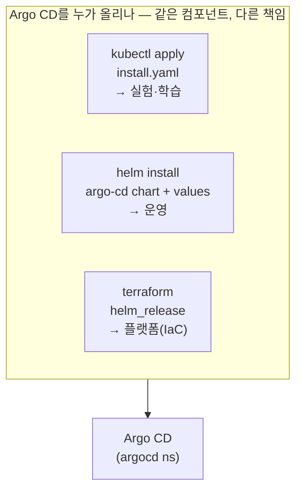
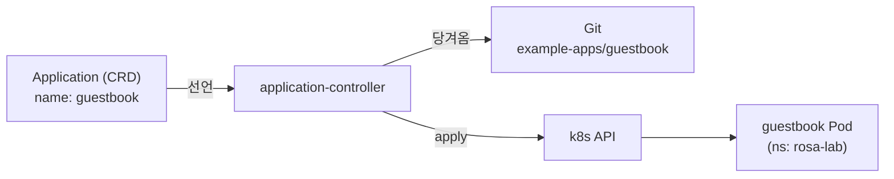

# 3. Argo CD 설치와 첫 Application

Argo CD를 올리는 명령 자체는 한 줄입니다. 정작 갈리는 건 그 한 줄을 **누가 책임지느냐**입니다 — 손으로 `kubectl apply`를 친 사람인지, `helm install`로 values와 함께 버전을 관리하는 운영자인지, Terraform이 클러스터를 만들면서 함께 올리는 플랫폼인지. 셋은 같은 컴포넌트를 띄우지만 "설정이 어디 적히고, 업그레이드를 누가 하고, 이 설치 자체가 어디에 선언돼 있느냐"가 다릅니다. 이 편은 그 세 선택을 가른 뒤 가장 단순한 방식으로 Argo CD를 올리고, **첫 Application을 Git에서 sync**합니다. 핵심은 "앱을 등록한다"가 클릭이 아니라 **Application이라는 객체 하나를 선언하는 일**이라는 것 — 그 객체를 클러스터에 두면 application-controller가 Git을 당겨와 알아서 맞춥니다. 산출물은 "설치 주체 세 가지를 구분해 고를 수 있는 상태"와 "Git의 매니페스트가 클러스터의 Pod가 되는 첫 sync를 CLI·UI 양쪽에서 본 경험"입니다.

## 핵심 다이어그램





- **설치 주체 셋은 같은 결과, 다른 책임이다.** `kubectl apply`는 명령을 한 번 보낼 뿐이라 설정·버전이 어디에도 안 남는다(실험용). `helm install`은 values로 설정을 모으고 `helm upgrade`로 버전을 올린다(운영용). `terraform helm_release`는 그 Helm 설치를 IaC에 박아, 클러스터 프로비저닝과 한 흐름으로 묶는다(플랫폼용).
- **"Argo CD 자신은 누가 설치하나"는 닭-달걀 문제다.** 모든 걸 Argo CD로 배포하고 싶지만, Argo CD 자체는 Argo CD가 아직 없을 때 올라가야 한다. 이 출발점을 Terraform이 잡는 패턴이 self-managing의 시작이다.
- **첫 앱 등록은 Application 객체 하나를 두는 일이다.** UI에서 폼을 채우든 CLI로 만들든, 결국 클러스터에 `kind: Application` 객체가 생긴다. GitOps답게 하려면 그 객체조차 매니페스트로 선언해 Git에 둔다.
- **그다음은 controller의 몫이다.** Application이 가리키는 Git을 controller가 당겨와, 거기 선언된 리소스를 클러스터에 적용한다. 사람은 "무엇을 원하는지"만 선언하고, "어떻게 맞출지"는 controller가 한다.

아래 시연이 이 흐름을 한 줄씩 손으로 확인합니다.

## 사전 준비물

이 실습은 **macOS** 환경을 기준으로 합니다.

- **Docker** — Docker Desktop, OrbStack 등. `docker ps`가 에러 없이 돌아가면 OK.
- **Homebrew** — macOS 패키지 관리자.

### kind · kubectl · argocd CLI 설치

```bash
brew install kind kubectl argocd
```

### 클러스터 준비

```bash
kind create cluster --name rosa-lab
```

## 설치 — 누가 책임지나

세 방식은 같은 컴포넌트를 올리되 책임이 다릅니다.

| 방식 | 명령 | 설정이 사는 곳 | 업그레이드 | 쓰임새 |
|---|---|---|---|---|
| kubectl apply | `kubectl apply -f install.yaml` | 없음(명령에 흘러감) | 다시 apply | 실험·학습 |
| helm install | `helm install argocd argo/argo-cd -f values.yaml` | `values.yaml`(Git) | `helm upgrade` | 운영 |
| terraform | `resource "helm_release" "argocd" { ... }` | `.tf`(Git) | `terraform apply` | 플랫폼·IaC |

이 편은 첫 sync를 보는 게 목적이므로 가장 단순한 `kubectl apply`로 올립니다. 운영이라면 `helm`을, 클러스터까지 코드로 만든다면 `terraform helm_release`를 고르면 됩니다 — 셋 다 아래와 동일한 컴포넌트가 뜹니다.

```bash
kubectl create namespace argocd
kubectl apply -n argocd -f https://raw.githubusercontent.com/argoproj/argo-cd/stable/manifests/install.yaml
kubectl -n argocd wait --for=condition=Ready pods --all --timeout=180s
```

## 첫 Application — Git이 Pod가 되는 것을 본다

### CLI로 로그인한다

먼저 admin 초기 비밀번호를 꺼내고, server를 포트포워드한 뒤 CLI로 로그인합니다.

```bash
ARGOCD_PW=$(kubectl -n argocd get secret argocd-initial-admin-secret -o jsonpath='{.data.password}' | base64 -d)
kubectl -n argocd port-forward svc/argocd-server 8080:443 >/tmp/pf.log 2>&1 &
sleep 3
argocd login localhost:8080 --username admin --password "$ARGOCD_PW" --insecure
```

```
'admin:login' logged in successfully
Context 'localhost:8080' updated
```

### Application을 선언으로 만든다

GitOps답게, 앱 등록도 **매니페스트 한 장**으로 합니다. `manifests/guestbook.yaml`은 공개 예제 저장소의 `guestbook` 디렉터리를 source로 두고, 이 클러스터의 `rosa-lab` namespace에 배포하도록 선언합니다.

```yaml
apiVersion: argoproj.io/v1alpha1
kind: Application
metadata:
  name: guestbook
  namespace: argocd
spec:
  project: default
  source:
    repoURL: https://github.com/argoproj/argocd-example-apps.git
    targetRevision: HEAD
    path: guestbook
  destination:
    server: https://kubernetes.default.svc
    namespace: rosa-lab
  syncPolicy:
    automated: { prune: true, selfHeal: true }
    syncOptions: [ CreateNamespace=true ]
```

`source`(어디서)·`destination`(어디로)·`syncPolicy`(어떻게 맞출지) 세 덩어리가 보이면 충분합니다. 각 필드의 동작은 다음 단계의 주제이고, 여기서는 이 객체를 두면 무슨 일이 일어나는지에 집중합니다.

```bash
kubectl apply -f manifests/guestbook.yaml
```

```
application.argoproj.io/guestbook created
```

> 한 줄 명령형 대안도 있습니다 — `argocd app create guestbook --repo https://github.com/argoproj/argocd-example-apps.git --path guestbook --dest-server https://kubernetes.default.svc --dest-namespace rosa-lab`. 결과는 같은 Application 객체지만, 명령이 Git에 안 남으므로 **선언 매니페스트 쪽을 권합니다**.

### sync가 일어나는 것을 확인한다

`automated` 정책을 켰으므로 controller가 곧바로 Git을 당겨와 sync합니다.

```bash
argocd app get guestbook
```

```
Name:               argocd/guestbook
Project:            default
Server:             https://kubernetes.default.svc
Namespace:          rosa-lab
Sync Status:        Synced to HEAD (xxxxxxx)
Health Status:      Healthy

GROUP  KIND        NAMESPACE  NAME          STATUS  HEALTH
       Service     rosa-lab   guestbook-ui  Synced  Healthy
apps   Deployment  rosa-lab   guestbook-ui  Synced  Healthy
```

`Sync Status: Synced`, `Health Status: Healthy`입니다. Git에 선언된 리소스가 실제로 클러스터에 생겼는지 직접 봅니다.

```bash
kubectl -n rosa-lab get deploy,svc,pods
```

```
NAME                           READY   UP-TO-DATE   AVAILABLE
deployment.apps/guestbook-ui   1/1     1            1

NAME                   TYPE        CLUSTER-IP     PORT(S)
service/guestbook-ui   ClusterIP   10.96.x.x      80/TCP

NAME                              READY   STATUS    RESTARTS
pod/guestbook-ui-...-xxxxx        1/1     Running   0
```

방금 우리는 클러스터에 `kubectl apply`로 guestbook을 직접 만든 적이 없습니다. **Application 객체 하나를 선언했을 뿐인데**, controller가 Git을 읽어 Deployment·Service·Pod를 대신 만들었습니다. 이게 1편에서 본 pull의 실체입니다 — 사람은 원하는 상태를 가리키기만 하고, 수렴은 클러스터 안 controller가 합니다.

### UI에서 같은 것을 본다

CLI로 본 상태를 UI에서도 봅니다. 브라우저로 접근합니다(포트포워드는 로그인 때 이미 띄워 두었습니다).

```bash
echo "https://localhost:8080  (user: admin / pw: $ARGOCD_PW)"
open https://localhost:8080
```

로그인하면 `guestbook` 카드가 보이고, 클릭하면 **Application → Deployment → ReplicaSet → Pod**로 이어지는 리소스 트리가 그려집니다. 각 노드의 색이 sync·health 상태(녹색 Healthy/Synced)입니다. CLI의 `argocd app get`이 텍스트로 보여 준 것과 정확히 같은 상태를, UI는 트리로 보여 줍니다 — 둘은 같은 application-controller의 상태를 다른 면으로 비출 뿐입니다.

### 정리

```bash
argocd app delete guestbook --yes
kill %1 2>/dev/null
kubectl delete -n argocd -f https://raw.githubusercontent.com/argoproj/argo-cd/stable/manifests/install.yaml
kubectl delete namespace argocd
```

클러스터까지 정리하려면:

```bash
kind delete cluster --name rosa-lab
```

## 이 편의 산출물

- Argo CD 설치 주체 세 가지(**kubectl apply 실험 · helm install 운영 · terraform helm_release 플랫폼**)를 "설정이 어디 사는가·업그레이드를 누가 하는가"로 구분해 고를 수 있는 상태, 그리고 "Argo CD 자신은 누가 설치하나"가 닭-달걀 문제임을 한 문장으로 말할 수 있는 상태.
- 앱 등록이 클릭이 아니라 **`kind: Application` 객체 하나를 선언하는 일**임을 보고, `manifests/guestbook.yaml`로 그 객체를 Git에 둘 수 있는 형태로 만든 경험.
- Application을 선언하기만 했는데 controller가 Git을 당겨와 Deployment·Service·Pod를 대신 만든 **첫 sync**를 `argocd app get`과 `kubectl get`으로 확인한 경험 — pull의 실체를 손으로 본 것.
- 같은 sync·health 상태를 **CLI(`argocd app get`)와 UI(리소스 트리)** 양쪽에서 보고, 둘이 같은 application-controller 상태의 두 면임을 확인한 상태.
