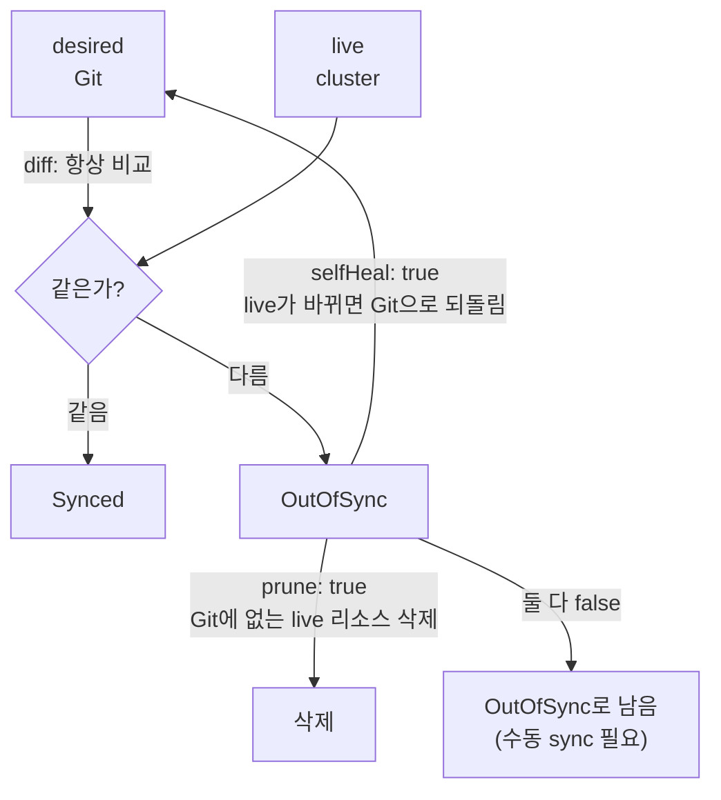

# 4. sync와 drift — self-heal · prune · diff

배포가 끝난 순간이 아니라 그 뒤가 문제입니다. 누군가 클러스터를 손으로 바꾸거나(replica를 올리거나) 리소스가 사라지면, Git에 적힌 원하는 상태와 클러스터의 실제 상태가 어긋납니다 — 이 어긋남이 **drift**입니다. Argo CD는 이 drift를 두 단계로 다룹니다. 먼저 **diff**로 desired(Git)와 live(cluster)의 차이를 계산해 `OutOfSync`로 표시하고, 정책이 허용하면 **self-heal**로 다시 Git 쪽으로 되돌리거나 **prune**으로 Git에 없는 리소스를 지웁니다. 중요한 건 "감지(diff)"와 "복원(self-heal·prune)"이 별개의 스위치라는 것 — Argo CD는 항상 어긋남을 *보지만*, 자동으로 *되돌릴지*는 따로 켜야 합니다. 이 편은 같은 drift를 self-heal을 끈 채와 켠 채로 만들어, "OutOfSync로 남는다 vs 자동으로 복원된다"의 경계를 직접 봅니다. 산출물은 "drift 두 종류(수정·삭제)를 만들어 self-heal 자동 복원을 손으로 본 경험"과 "diff·self-heal·prune이 각각 무엇을 가르는 스위치인지 구분한 상태"입니다.

## 핵심 다이어그램



- **diff는 항상 돈다.** Argo CD는 reconcile 한 바퀴마다 desired와 live를 비교한다. 차이가 있으면 `OutOfSync`, 없으면 `Synced`다. 이 감지는 정책과 무관하게 늘 일어난다 — 끄는 스위치가 아니다.
- **self-heal은 "되돌릴지"의 스위치다.** live가 Git과 다르게 바뀌었을 때(replica를 손으로 올렸거나 리소스를 지웠을 때), `selfHeal: true`면 controller가 자동으로 Git 상태로 되돌린다. `false`면 `OutOfSync`로 표시만 하고 그대로 둔다 — 복원은 사람이 `sync`로 한다.
- **prune은 "지울지"의 스위치다.** Git source에서 사라진 리소스가 live에 남아 있을 때, `prune: true`면 live에서도 삭제한다. `false`면 orphan으로 남겨 둔다. self-heal과는 **방향이 다른 독립 스위치**다 — self-heal은 바뀐 것을 되돌리고, prune은 없어진 것을 지운다.
- **감지와 복원은 분리돼 있다.** "왜 OutOfSync인데 안 고쳐지나"의 답은 대개 여기다 — diff는 어긋남을 봤지만, self-heal/prune이 꺼져 있어 복원하지 않은 것이다.

아래 시연이 이 경계를 한 줄씩 손으로 확인합니다.

## 사전 준비물

이 실습은 **macOS** 환경을 기준으로 합니다.

- **Docker** — Docker Desktop, OrbStack 등. `docker ps`가 에러 없이 돌아가면 OK.
- **Homebrew** — macOS 패키지 관리자.

### kind · kubectl · argocd CLI 설치

```bash
brew install kind kubectl argocd
```

### 클러스터 · Argo CD 준비

```bash
kind create cluster --name rosa-lab
kubectl create namespace argocd
kubectl apply -n argocd -f https://raw.githubusercontent.com/argoproj/argo-cd/stable/manifests/install.yaml
kubectl -n argocd wait --for=condition=Ready pods --all --timeout=180s
```

CLI 로그인:

```bash
ARGOCD_PW=$(kubectl -n argocd get secret argocd-initial-admin-secret -o jsonpath='{.data.password}' | base64 -d)
kubectl -n argocd port-forward svc/argocd-server 8080:443 >/tmp/pf.log 2>&1 &
sleep 3
argocd login localhost:8080 --username admin --password "$ARGOCD_PW" --insecure
```

## 실습 환경

`manifests/guestbook.yaml`은 guestbook 앱을 배포하되, **self-heal과 prune을 일부러 꺼 둔** Application입니다. `automated`만 켜져 있어 Git이 바뀌면 자동 적용하지만, live가 어긋나도 되돌리지는 않습니다 — drift가 어떻게 *남는지*부터 보기 위해서입니다.

```yaml
syncPolicy:
  automated:
    prune: false
    selfHeal: false
  syncOptions:
    - CreateNamespace=true
```

```bash
kubectl apply -f manifests/guestbook.yaml
argocd app wait guestbook --health
```

처음엔 Synced·Healthy입니다.

```bash
argocd app get guestbook | grep -E "Sync Status|Health Status"
```

```
Sync Status:        Synced to HEAD (xxxxxxx)
Health Status:      Healthy
```

## 여기서 직접 확인할 수 있는 것

### drift를 만든다 — live를 Git과 다르게 바꾼다

guestbook의 replica를 손으로 올립니다. Git은 1을 원하는데 live를 3으로 만듭니다.

```bash
kubectl -n rosa-lab scale deployment guestbook-ui --replicas=3
```

### diff가 어긋남을 본다 — OutOfSync

Argo CD가 다음 reconcile에서 이 차이를 감지합니다. 잠시 후 상태를 봅니다.

```bash
argocd app get guestbook | grep -E "Sync Status"
argocd app diff guestbook
```

```
Sync Status:        OutOfSync from HEAD (xxxxxxx)

===== apps/Deployment rosa-lab/guestbook-ui ======
<   replicas: 1
>   replicas: 3
```

diff가 정확히 짚습니다 — desired(`<` Git)는 1, live(`>` 클러스터)는 3. 감지는 정책과 무관하게 일어났습니다.

### self-heal이 꺼져 있으면 — 복원되지 않는다

`selfHeal: false`이므로, 한참을 기다려도 Argo CD는 이 drift를 되돌리지 않습니다.

```bash
sleep 30
kubectl -n rosa-lab get deploy guestbook-ui -o jsonpath='{.spec.replicas}{"\n"}'
```

```
3
```

여전히 3입니다. diff는 OutOfSync를 봤지만, 복원 스위치가 꺼져 있어 손대지 않았습니다. 되돌리려면 사람이 수동으로 sync해야 합니다.

```bash
argocd app sync guestbook
kubectl -n rosa-lab get deploy guestbook-ui -o jsonpath='{.spec.replicas}{"\n"}'
```

```
1
```

수동 `sync`가 Git 상태(1)로 되돌렸습니다. 이게 1편에서 본 push 모델과 같은 자리입니다 — 감지는 자동이지만 복원은 사람이 명령합니다.

### self-heal을 켠다 — 같은 drift가 자동으로 복원된다

이제 복원 스위치를 켭니다. `manifests/guestbook.yaml`의 `selfHeal`을 `true`로 바꿔 다시 apply합니다(GitOps답게 정책 변경도 매니페스트로).

```bash
sed -i '' 's/selfHeal: false/selfHeal: true/' manifests/guestbook.yaml
kubectl apply -f manifests/guestbook.yaml
```

같은 drift를 다시 만듭니다.

```bash
kubectl -n rosa-lab scale deployment guestbook-ui --replicas=3
sleep 20
kubectl -n rosa-lab get deploy guestbook-ui -o jsonpath='{.spec.replicas}{"\n"}'
```

```
1
```

손대지 않았는데 1로 돌아왔습니다. controller가 diff에서 OutOfSync를 보고, 이번엔 `selfHeal: true`라 자동으로 Git 상태를 다시 적용했습니다. 우리가 앞서 손으로 친 `argocd app sync`를, controller가 reconcile 바퀴마다 알아서 한 것입니다.

### 삭제 drift도 복원된다 — self-heal의 다른 면

drift는 "바뀜"만이 아닙니다. 리소스가 통째로 사라져도 desired와 live가 어긋납니다. guestbook의 Deployment를 지워 봅니다.

```bash
kubectl -n rosa-lab delete deployment guestbook-ui
sleep 20
kubectl -n rosa-lab get deploy guestbook-ui
```

```
NAME           READY   UP-TO-DATE   AVAILABLE   AGE
guestbook-ui   1/1     1            1           18s
```

`AGE`가 방금입니다 — controller가 사라진 Deployment를 Git 선언대로 다시 만들었습니다. self-heal은 "다르게 바뀐 것"뿐 아니라 "없어진 것"도 desired로 되돌립니다.

### prune은 방향이 다른 스위치다 — Git에서 사라진 것을 지운다

self-heal과 헷갈리기 쉬운 게 prune입니다. 둘은 방향이 반대입니다.

- **self-heal** — Git에 *있는데* live가 다르거나 없어졌다 → live를 Git에 맞춘다(되돌림·재생성).
- **prune** — Git에서 *사라졌는데* live에 남아 있다 → live에서 지운다.

prune이 켜져 있으면(`prune: true`), 누군가 Git에서 리소스 정의를 지웠을 때 controller가 클러스터에서도 그 리소스를 삭제합니다. `prune: false`면 그 리소스는 `OutOfSync`(orphaned)로 표시만 되고 클러스터에 남습니다. 정책 상태로 이 차이를 확인할 수 있습니다.

```bash
argocd app get guestbook | grep -E "prune|SelfHeal" -i
```

prune이 위험한 이유는 그 작동 자체에 있습니다 — Git에서 무언가를 실수로 지우거나 path를 잘못 옮기면, prune이 그것을 *충실하게* 클러스터에서도 지웁니다. 그래서 prune은 self-heal과 분리된 스위치로 두고, 무엇을 자동 삭제까지 허용할지 따로 정합니다.

### 정리

```bash
argocd app delete guestbook --yes
git checkout -- manifests/guestbook.yaml   # selfHeal 토글 되돌리기
kill %1 2>/dev/null
kubectl delete -n argocd -f https://raw.githubusercontent.com/argoproj/argo-cd/stable/manifests/install.yaml
kubectl delete namespace argocd
```

클러스터까지 정리하려면:

```bash
kind delete cluster --name rosa-lab
```

## 이 편의 산출물

- replica 변경(수정 drift)과 Deployment 삭제(삭제 drift)를 직접 만들어, **self-heal이 둘 다 desired로 되돌리는 것**을 손으로 본 경험.
- 같은 drift를 `selfHeal: false`에선 `OutOfSync`로 남기고 수동 `argocd app sync`로 복원, `selfHeal: true`에선 자동 복원시켜 — **감지(diff)와 복원(self-heal)이 별개의 스위치**임을 가른 상태.
- `argocd app diff`로 desired(`<` Git)와 live(`>` cluster)의 차이를 줄 단위로 읽고, OutOfSync가 무엇을 근거로 판정되는지 확인한 경험.
- **self-heal(바뀐 것을 되돌림)과 prune(Git에서 사라진 것을 지움)이 방향이 다른 독립 스위치**임을 구분하고, prune이 왜 위험해서 따로 켜야 하는지 한 문장으로 말할 수 있는 상태.
