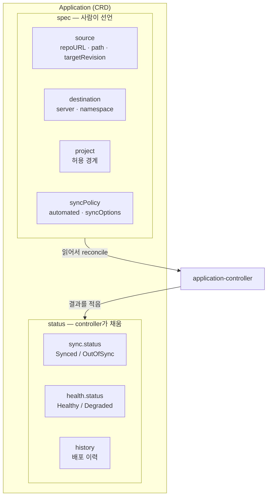

# 5. Application 매니페스트 — source · destination · project · syncPolicy

"Argo CD에 앱을 등록한다"는 결국 **`kind: Application` 객체 하나를 클러스터에 두는 일**입니다. 이 객체는 Argo CD가 정의한 CRD(`argoproj.io/v1alpha1`)이고, application-controller가 다른 모든 컨트롤러처럼 이것을 watch → reconcile합니다. 그래서 Application을 읽는 법은 다른 k8s 객체를 읽는 법과 같습니다 — `spec`에 사람이 **원하는 상태**를 선언하고, `status`는 controller가 **실제로 일어난 일**을 채웁니다. 이 편은 그 `spec`을 네 덩어리로 해부합니다 — **source**(어디서 가져오나), **destination**(어디에 적용하나), **project**(어느 경계 안에서 허용되나), **syncPolicy**(어떻게 맞추나). 그리고 사람이 건드리는 `spec`과 controller만 쓰는 `status`의 경계를 직접 보면, 앞 편들에서 본 Synced·OutOfSync·Healthy가 모두 이 한 객체의 `status`에 적히는 값이었음이 드러납니다. 산출물은 "Application을 CRD로 읽고 네 필드의 역할을 구분한 상태"와 "spec(선언)과 status(controller가 채움)의 경계를 객체에서 직접 가른 경험"입니다.

## 핵심 다이어그램



- **Application은 CRD다.** Pod·Deployment가 k8s 내장 객체이듯, Application은 Argo CD가 추가한 객체 타입이다. application-controller가 이 객체를 watch하고, `spec`이 가리키는 desired와 클러스터의 live를 맞춘다 — 0편부터 이어진 reconcile 모델이 여기서 "Application을 reconcile한다"로 구체화된다.
- **spec은 사람이, status는 controller가 쓴다.** `spec`에는 "어디서·어디로·어떤 경계에서·어떻게"를 선언한다. `status`는 사람이 안 쓴다 — controller가 sync 결과·health·이력을 채워 넣는다. 이 경계가 GitOps의 분업이다(사람은 원하는 것을, 기계는 일어난 일을).
- **네 필드가 한 배포를 정의한다.** source(무엇을), destination(어디에), project(누구의 권한으로), syncPolicy(얼마나 자동으로). 넷이 모이면 "이 Git의 이 경로를, 이 클러스터의 이 namespace에, 이 경계 안에서, 이렇게 맞춰라"가 된다.

아래 시연이 이 구조를 한 줄씩 손으로 확인합니다.

## 사전 준비물

이 실습은 **macOS** 환경을 기준으로 합니다.

- **Docker** — Docker Desktop, OrbStack 등. `docker ps`가 에러 없이 돌아가면 OK.
- **Homebrew** — macOS 패키지 관리자.

### kind · kubectl · argocd CLI 설치

```bash
brew install kind kubectl argocd
```

### 클러스터 · Argo CD 준비

```bash
kind create cluster --name rosa-lab
kubectl create namespace argocd
kubectl apply -n argocd -f https://raw.githubusercontent.com/argoproj/argo-cd/stable/manifests/install.yaml
kubectl -n argocd wait --for=condition=Ready pods --all --timeout=180s
```

CLI 로그인:

```bash
ARGOCD_PW=$(kubectl -n argocd get secret argocd-initial-admin-secret -o jsonpath='{.data.password}' | base64 -d)
kubectl -n argocd port-forward svc/argocd-server 8080:443 >/tmp/pf.log 2>&1 &
sleep 3
argocd login localhost:8080 --username admin --password "$ARGOCD_PW" --insecure
```

## 여기서 직접 확인할 수 있는 것

### Application은 CRD다 — 객체 타입을 확인한다

Application이 어디서 온 타입인지부터 봅니다. Argo CD를 설치할 때 함께 등록된 CRD입니다.

```bash
kubectl get crd | grep argoproj
```

```
applications.argoproj.io        ...
applicationsets.argoproj.io     ...
appprojects.argoproj.io         ...
```

`applications.argoproj.io`가 우리가 쓰는 Application 타입입니다. 스키마도 다른 객체처럼 `explain`으로 읽힙니다.

```bash
kubectl explain application.spec --recursive | grep -E "source|destination|project|syncPolicy" | head
```

```
   destination   <Object>
   project       <string>
   source        <Object>
   syncPolicy    <Object>
```

`spec` 아래에 네 덩어리가 그대로 있습니다. 매니페스트에 적은 게 이 스키마였습니다.

### 객체를 두고 spec과 status를 가른다

`manifests/guestbook.yaml`을 적용하고, 객체를 통째로 꺼내 봅니다.

```bash
kubectl apply -f manifests/guestbook.yaml
argocd app wait guestbook --health
kubectl -n argocd get application guestbook -o yaml | sed -n '/^spec:/,/^status:/p' | head -40
```

`spec`은 우리가 쓴 그대로입니다. 그런데 `status`가 새로 생겼습니다 — 우리가 안 쓴 부분입니다.

```bash
kubectl -n argocd get application guestbook -o jsonpath='{.status.sync.status} / {.status.health.status}{"\n"}'
```

```
Synced / Healthy
```

`status.sync.status`(Synced)와 `status.health.status`(Healthy)는 controller가 적었습니다. 앞 편들에서 본 Synced·OutOfSync·Healthy가 전부 이 객체의 `status`에 들어가는 값입니다. **사람은 spec만, controller는 status만** — 이 경계가 Application을 reconcile 객체로 만듭니다.

### source — 어디서 가져오나

`source`는 원하는 상태의 출처입니다. 세 가지로 "무엇을, 어느 시점, 어느 경로"를 정합니다.

```yaml
source:
  repoURL: https://github.com/argoproj/argocd-example-apps.git   # 무엇을
  targetRevision: HEAD                                            # 어느 시점
  path: guestbook                                                 # 어느 디렉터리
```

`targetRevision`이 재현성을 가릅니다. `HEAD`는 "그 branch의 최신"이라 누가 push하면 가리키는 대상이 바뀝니다. 지금 어느 커밋에 sync됐는지는 status가 알려 줍니다.

```bash
kubectl -n argocd get application guestbook -o jsonpath='{.status.sync.revision}{"\n"}'
```

```
53e28ff20cc530b9ada2173fbbde64d6...
```

이 SHA를 `targetRevision`에 그대로 박으면 그 시점에 **고정**됩니다 — 누가 repo에 push해도 이 Application은 같은 상태를 재현합니다. 운영에서는 `HEAD` 대신 tag나 commit SHA로 고정해 "언제 배포해도 같은 결과"를 보장합니다.

### destination — 어디에 적용하나

`destination`은 어느 클러스터의 어느 namespace에 적용할지입니다.

```yaml
destination:
  server: https://kubernetes.default.svc   # 어느 클러스터 (이건 Argo CD가 사는 클러스터 자신)
  namespace: rosa-lab                       # 어느 namespace
```

여기서 헷갈리기 쉬운 점 하나 — Application 객체 자체는 `metadata.namespace: argocd`에 살지만, 그게 가리키는 **배포 대상**은 `destination.namespace: rosa-lab`입니다. 객체가 사는 곳과 앱이 뜨는 곳은 다릅니다. 확인해 봅니다.

```bash
kubectl -n argocd get application guestbook      # 객체는 argocd ns
kubectl -n rosa-lab get deploy                    # 앱은 rosa-lab ns
```

`server`는 등록된 클러스터를 URL이나 이름으로 가리킵니다. `https://kubernetes.default.svc`는 "Argo CD가 사는 바로 이 클러스터"를 뜻하는 특수 주소입니다. 외부 클러스터를 등록하면 그 클러스터의 API 주소나 이름을 적어 한 Argo CD가 여러 클러스터에 배포할 수 있습니다.

### project — 어느 경계 안에서 허용되나

`project`는 이 Application이 속한 **AppProject**를 가리킵니다. AppProject는 "이 앱이 어떤 repo에서, 어떤 클러스터·namespace로, 무엇을 배포해도 되는가"의 울타리입니다. 지금은 모든 게 허용된 기본 경계 `default`를 씁니다.

```bash
kubectl get appproject -n argocd default -o jsonpath='{.spec.sourceRepos} {.spec.destinations}{"\n"}'
```

```
[*] [{"namespace":"*","server":"*"}]
```

`default`는 `sourceRepos: *`, `destinations: * / *` — 즉 아무 repo·아무 클러스터·아무 namespace를 다 허용합니다. 팀·환경 경계를 긋는다는 건 이 `*`를 좁히는 일입니다. 이 편에서는 `project`가 "허용 경계를 가리키는 필드"라는 것까지만 짚습니다.

### syncPolicy — 어떻게 맞추나

`syncPolicy`는 sync를 얼마나 자동화할지입니다. `automated`를 켜면 controller가 알아서 sync하고, 그 안의 `prune`·`selfHeal`이 "사라진 걸 지울지·바뀐 걸 되돌릴지"를 정합니다. `syncOptions`는 sync 동작의 세부 옵션입니다.

```yaml
syncPolicy:
  automated:
    prune: true       # Git에서 사라진 리소스를 live에서도 삭제
    selfHeal: true    # live가 어긋나면 Git으로 되돌림
  syncOptions:
    - CreateNamespace=true   # destination namespace가 없으면 만든다
```

`automated`를 통째로 빼면 **manual sync**가 됩니다 — diff로 OutOfSync는 감지하되, 적용은 사람이 `argocd app sync`로 명령할 때만 일어납니다. 자동화의 정도를 이 한 블록으로 정합니다.

```bash
argocd app get guestbook | grep -iE "sync policy|prune|self"
```

### 정리

```bash
argocd app delete guestbook --yes
kill %1 2>/dev/null
kubectl delete -n argocd -f https://raw.githubusercontent.com/argoproj/argo-cd/stable/manifests/install.yaml
kubectl delete namespace argocd
```

클러스터까지 정리하려면:

```bash
kind delete cluster --name rosa-lab
```

## 이 편의 산출물

- Application이 `applications.argoproj.io` **CRD**임을 `kubectl get crd`·`explain`으로 확인하고, 다른 k8s 객체와 같은 방식(`spec`/`status`)으로 읽을 수 있는 상태.
- 같은 객체에서 **사람이 쓰는 `spec`**과 **controller가 채우는 `status`(sync·health·revision)**의 경계를 직접 가르고, 앞 편들의 Synced·OutOfSync·Healthy가 모두 이 `status` 값이었음을 확인한 경험.
- `spec`의 네 필드를 구분한 상태 — **source**(repoURL·path·targetRevision, `HEAD` vs 고정 SHA로 재현성이 갈림), **destination**(server·namespace, 객체가 사는 곳 ≠ 앱이 뜨는 곳), **project**(허용 경계 `default`의 `*`), **syncPolicy**(automated 유무로 자동/수동, prune·selfHeal·syncOptions).
- `targetRevision`을 status의 revision SHA로 고정하면 push와 무관하게 같은 상태가 재현된다는 것, `automated`를 빼면 manual sync가 된다는 것을 객체 수준에서 설명할 수 있는 상태.
