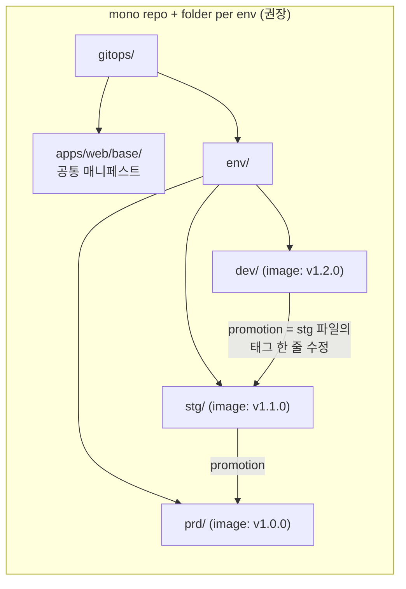
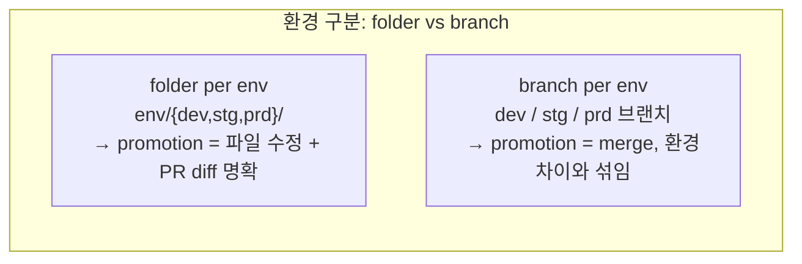

# 6. Git Repository 구조 — mono repo · folder vs branch · promotion

Application 하나를 만드는 법은 앞에서 봤지만, 앱이 여러 개가 되고 환경이 dev·stg·prd로 늘면 곧바로 다른 질문이 생깁니다 — **이 매니페스트들을 Git에 어떻게 배치하나.** 한 repo에 다 둘지(mono), 앱마다 repo를 팔지(repo per app), 환경마다 repo를 팔지(repo per env). 그리고 환경 구분을 **폴더**로 할지 **브랜치**로 할지. 이 선택이 매일 하는 일 — "dev에서 검증한 버전을 stg로 올리는(promotion)" 작업의 난이도를 정합니다. 이 편은 Git repo를 직접 만들어 폴더 기반 mono repo 구조를 세우고, dev → stg promotion을 한 번 해 보면서 **그 변경이 git diff에 어떻게 남는지**를 봅니다. 폴더 방식이 왜 추적·diff·promotion에서 브랜치 방식보다 단순한지가 그 diff 한 조각에서 드러납니다. 산출물은 "GitOps repo를 folder 기반으로 직접 세운 결과물"과 "promotion이 git에 어떻게 기록되는지를 folder·branch 양쪽으로 비교한 경험"입니다.

## 핵심 다이어그램





- **mono repo가 출발점이다.** 앱과 환경을 한 repo의 폴더로 나눈다(`apps/`·`env/`). 한 곳에서 전체를 보고, 한 PR로 여러 앱을 함께 바꿀 수 있다. repo를 나누는 건 팀·권한 경계가 생긴 *뒤*의 일이다.
- **환경은 브랜치가 아니라 폴더로 가른다.** `env/dev`·`env/prd`를 폴더로 두면, 모든 환경의 현재 상태가 한 브랜치(main)에 동시에 보인다. dev와 prd의 차이가 `diff env/dev env/prd` 한 줄로 드러난다.
- **promotion은 폴더에선 파일 수정이다.** dev에서 검증한 이미지 태그를 stg 폴더의 파일에 반영하는 것 — git diff에 "태그 한 줄이 바뀌었다"로 정확히 남는다. 무엇을, 누가, 언제 올렸는지가 PR 하나로 추적된다.
- **브랜치 방식은 promotion이 merge가 된다.** dev 브랜치를 stg 브랜치에 머지하는데, 환경마다 설정(replica·도메인)이 다르면 그 차이가 머지에 섞여 "이번에 올린 게 promotion인지 환경 설정인지"가 흐려진다.

아래 시연이 이 구조를 한 줄씩 손으로 확인합니다.

## 사전 준비물

이 실습은 **macOS** 환경을 기준으로 합니다. 이 편은 Git repo 설계가 주제라 클러스터 없이도 진행됩니다(Argo 연결은 마지막에 매니페스트로 짚습니다).

- **git** — `git --version`이 돌면 OK.

## 여기서 직접 확인할 수 있는 것

### GitOps repo를 folder 구조로 세운다

빈 repo를 만들고, 앱 하나(web)를 dev·stg·prd 세 환경 폴더로 배치합니다.

```bash
mkdir gitops && cd gitops && git init -q
mkdir -p apps/web/base env/dev env/stg env/prd
```

공통 정의는 `apps/web/base`에, 환경별 차이(여기서는 이미지 태그)는 `env/*`에 둡니다. 먼저 세 환경에 같은 앱을 두되 태그를 다르게 둡니다 — prd가 가장 검증된 옛 버전, dev가 가장 최신입니다.

```bash
for E in dev stg prd; do
cat > env/$E/web.yaml <<EOF
apiVersion: apps/v1
kind: Deployment
metadata:
  name: web
  namespace: $E
spec:
  replicas: 2
  selector: { matchLabels: { app: web } }
  template:
    metadata: { labels: { app: web } }
    spec:
      containers:
        - name: web
          image: web:1.0.0
EOF
done

# 환경별로 현재 태그를 다르게: dev=1.2.0, stg=1.1.0, prd=1.0.0
sed -i '' 's/web:1.0.0/web:1.2.0/' env/dev/web.yaml
sed -i '' 's/web:1.0.0/web:1.1.0/' env/stg/web.yaml

git add . && git commit -qm "init: web across dev/stg/prd"
```

구조를 봅니다.

```bash
find . -path ./.git -prune -o -type f -print | sort
```

```
./apps/web/base
./env/dev/web.yaml
./env/stg/web.yaml
./env/prd/web.yaml
```

세 환경이 **한 브랜치(main)에 동시에** 있습니다. 환경 사이의 차이는 폴더 비교 한 번으로 드러납니다.

```bash
diff env/stg/web.yaml env/prd/web.yaml
```

```
5c5
<   namespace: stg
---
>   namespace: prd
14c14
<           image: web:1.1.0
---
>           image: web:1.0.0
```

두 환경의 차이가 정확히 두 줄 — namespace(stg vs prd)와 이미지 태그(1.1.0 vs 1.0.0)뿐입니다. 둘 다 "환경이라서 다른 것"이고, 그 외에는 같습니다. 어느 환경이 무엇을 돌리는지 보려고 브랜치를 갈아탈 필요가 없습니다.

### promotion을 한다 — folder 방식은 파일 한 줄 수정이다

dev에서 `1.2.0`을 검증했다고 합시다. 이제 stg로 올립니다(promotion). folder 방식에서 이건 stg 파일의 태그를 dev와 같게 맞추는 일입니다.

```bash
git switch -c promote/web-1.2.0-to-stg -q
sed -i '' 's/web:1.1.0/web:1.2.0/' env/stg/web.yaml
git add env/stg/web.yaml && git commit -qm "promote web 1.2.0 to stg"
```

이 promotion이 git에 어떻게 남았는지 봅니다.

```bash
git show --stat HEAD
git diff main HEAD
```

```
 env/stg/web.yaml | 2 +-

diff --git a/env/stg/web.yaml b/env/stg/web.yaml
-          image: web:1.1.0
+          image: web:1.2.0
```

promotion 전체가 **파일 하나, 한 줄**입니다. PR 리뷰어는 "stg를 1.1.0에서 1.2.0으로 올린다"를 한눈에 봅니다 — 무엇이 바뀌는지에 모호함이 없습니다. 되돌리려면 이 커밋 하나를 revert하면 됩니다.

### branch 방식과 비교한다 — promotion이 merge에 섞인다

같은 일을 브랜치 방식으로 했다면 어떻게 다른지 봅니다. 환경을 브랜치로 가르면, dev에서 stg로 올리는 건 dev 브랜치를 stg에 머지하는 일이 됩니다. 문제는 환경마다 다른 설정까지 그 머지에 딸려 온다는 것입니다.

```bash
# 브랜치 방식 흉내: dev/stg 브랜치를 만들고 환경 설정을 다르게 둔다
git switch main -q
git switch -c env-dev -q
sed -i '' 's/replicas: 2/replicas: 1/' env/dev/web.yaml   # dev는 replica 1
git commit -aqm "dev config"

git switch -c env-stg -q
sed -i '' 's/replicas: 1/replicas: 4/' env/dev/web.yaml    # stg는 replica 4
git commit -aqm "stg config"
```

이제 dev에서 새 이미지를 stg로 머지하려 하면, diff에 **이미지 변경(promotion)과 replica 차이(환경 설정)가 함께** 나타납니다.

```bash
git diff env-dev env-stg -- env/dev/web.yaml
```

```
-          replicas: 1
+          replicas: 4
```

브랜치 사이의 diff는 "올리려는 것(이미지)"과 "환경이라서 원래 다른 것(replica)"을 구분해 주지 않습니다. promotion 때마다 이 둘이 섞이고, 환경 설정이 의도치 않게 따라 넘어가거나 머지 충돌이 납니다. folder 방식에서 promotion이 "태그 한 줄"로 깨끗했던 것과 대비됩니다. 그래서 환경 구분은 브랜치가 아니라 폴더를 권합니다.

### repo를 언제 나누나 — mono에서 분리로

mono repo가 출발점이지만, 다음 상황에서 repo를 나눕니다.

| 분할 | 언제 | 무엇을 얻나 |
|---|---|---|
| **mono repo** | 시작·소규모, 한 팀 | 전체를 한눈에, 한 PR로 여러 앱 변경 |
| **repo per app** | 앱마다 팀·릴리스 주기가 다를 때 | 앱별 권한·CI·이력 분리 |
| **repo per env** | prd 변경에 별도 승인·권한이 필요할 때 | 환경별 접근 통제(prd repo는 소수만) |

핵심은 **repo를 나누는 기준이 "기술"이 아니라 "권한·속도 경계"**라는 것입니다. payment 팀과 user 팀이 서로의 배포를 건드리면 안 되면 repo per app, prd push에 보안팀 승인이 필요하면 repo per env입니다. 그 경계가 없다면 mono repo가 추적·promotion 모두 단순합니다.

### Argo CD가 이 구조를 가리키는 법

만든 구조를 Argo CD는 **path만 다른 Application들**로 소비합니다. `manifests/app-dev.yaml`·`manifests/app-prd.yaml`은 같은 repo(`repoURL`)를 가리키되 `path`만 `env/dev`·`env/prd`로 다릅니다.

```yaml
# app-dev.yaml
source:
  repoURL: https://github.com/<you>/gitops.git
  path: env/dev
destination:
  namespace: dev
---
# app-prd.yaml
source:
  repoURL: https://github.com/<you>/gitops.git
  path: env/prd
destination:
  namespace: prd
```

환경 하나당 Application 하나, 차이는 `path`(어느 폴더)와 `destination.namespace`(어디로)뿐입니다. 그래서 promotion(stg 파일의 태그를 올림)이 Git에 커밋되면, stg Application이 다음 reconcile에서 그 변경을 당겨와 적용합니다 — repo 구조가 곧 배포 단위가 됩니다.

> 본인 GitHub에 이 `gitops` repo를 push하고, `manifests/*.yaml`의 `repoURL`을 본인 repo로 바꾸면 그대로 Argo CD에 적용해 볼 수 있습니다(Argo CD 설치는 `kubectl apply -n argocd -f https://raw.githubusercontent.com/argoproj/argo-cd/stable/manifests/install.yaml`).

### 정리

```bash
cd .. && rm -rf gitops
```

## 이 편의 산출물

- `apps/`·`env/{dev,stg,prd}/` 폴더로 나눈 **mono repo + folder per env** 구조를 직접 세우고, 세 환경이 한 브랜치에 동시에 보여 `diff env/stg env/prd`로 환경 차이가 한 줄로 드러나는 것을 확인한 결과물.
- dev → stg promotion을 **folder 방식(파일 한 줄 수정 + 명확한 PR diff)**으로 수행하고, `git show`·`git diff`로 promotion 전체가 "태그 한 줄"로 추적·revert 가능함을 본 경험.
- 같은 promotion이 **branch 방식**에선 이미지 변경과 환경 설정(replica) 차이가 머지에 섞여 추적이 흐려진다는 것을 git diff로 비교해, 환경 구분에 폴더를 권하는 이유를 한 문장으로 말할 수 있는 상태.
- repo 분할(mono / repo per app / repo per env)의 기준이 기술이 아니라 **권한·속도 경계**임을 구분하고, 이 구조를 Argo CD가 `path`만 다른 Application들로 소비함을 매니페스트로 확인한 상태.
