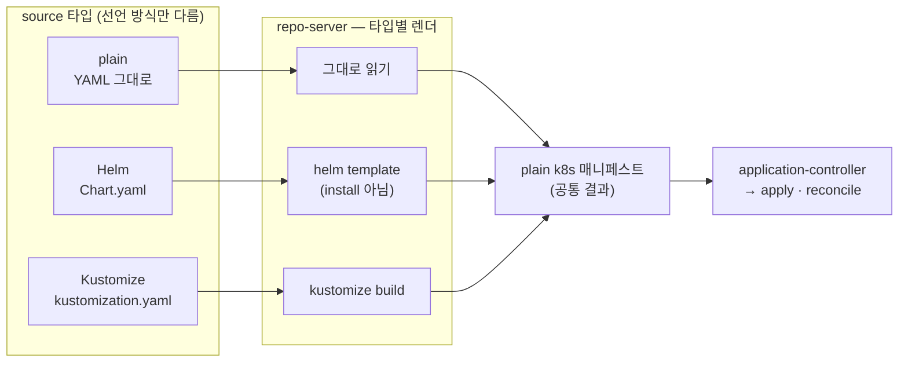

# 7. source 종류 — plain · Helm · Kustomize · directory

같은 `kind: Application`으로 plain YAML도, Helm chart도, Kustomize도 배포할 수 있습니다. 달라지는 건 `source` 한 덩어리뿐입니다 — Argo CD가 그 source를 어떻게 **렌더**해 매니페스트를 만들어내느냐만 다르고, 그다음(클러스터에 apply하고 reconcile하는 일)은 셋 다 똑같습니다. 핵심은 여기 있습니다 — **무엇으로 선언하든 repo-server가 최종적으로 plain k8s 매니페스트를 만들어내고**, application-controller는 그 결과만 봅니다. 특히 Helm을 쓸 때 Argo CD는 `helm install`을 하지 않습니다. `helm template`으로 **렌더만** 하고 그 YAML을 적용합니다 — 그래서 Helm release(저장된 릴리스 이력)가 생기지 않습니다. 이 편은 같은 repo의 세 디렉터리(plain·Helm·Kustomize)를 각각 Application으로 배포하고, `argocd app manifests`로 셋이 모두 같은 plain YAML로 귀결됨을 보고, Helm을 썼는데도 release가 없음을 손으로 확인합니다. 산출물은 "source 타입별 렌더 방식을 구분한 상태"와 "Argo CD가 Helm을 lifecycle 관리자가 아니라 renderer로 쓴다는 것을 release 부재로 확인한 경험"입니다.

## 핵심 다이어그램



- **source 타입은 "어떻게 매니페스트를 만드나"의 차이다.** plain은 파일을 그대로 읽고, Helm은 `helm template`으로 렌더하고, Kustomize는 `kustomize build`로 합성한다. repo-server가 어느 도구로 렌더할지는 디렉터리 내용(`Chart.yaml`·`kustomization.yaml`)을 보고 정한다.
- **결과는 항상 plain 매니페스트다.** 어느 타입이든 repo-server가 내놓는 건 동일하게 plain k8s YAML이다. application-controller는 그 결과만 보고 apply·diff·sync한다 — 타입을 신경 쓰지 않는다.
- **Helm은 renderer로만 쓰인다.** Argo CD는 `helm install`이 아니라 `helm template`을 호출한다. 클러스터에 Helm release(릴리스 secret·이력)가 만들어지지 않는다. "값을 끼워 YAML을 찍어내는" 부분만 Helm에게 맡기고, 적용·이력·롤백은 Argo CD가 자기 방식(Application status·revision history)으로 한다.
- **값 주입도 source 안에서 한다.** Helm이면 `source.helm.parameters`/`valueFiles`로, Kustomize면 디렉터리의 overlay로. 클러스터를 직접 건드리지 않고 선언으로 값을 정한다.

아래 시연이 이 구조를 한 줄씩 손으로 확인합니다.

## 사전 준비물

이 실습은 **macOS** 환경을 기준으로 합니다.

- **Docker** — Docker Desktop, OrbStack 등. `docker ps`가 에러 없이 돌아가면 OK.
- **Homebrew** — macOS 패키지 관리자.

### kind · kubectl · argocd CLI · helm 설치

```bash
brew install kind kubectl argocd helm
```

### 클러스터 · Argo CD 준비

```bash
kind create cluster --name rosa-lab
kubectl create namespace argocd
kubectl apply -n argocd -f https://raw.githubusercontent.com/argoproj/argo-cd/stable/manifests/install.yaml
kubectl -n argocd wait --for=condition=Ready pods --all --timeout=180s

ARGOCD_PW=$(kubectl -n argocd get secret argocd-initial-admin-secret -o jsonpath='{.data.password}' | base64 -d)
kubectl -n argocd port-forward svc/argocd-server 8080:443 >/tmp/pf.log 2>&1 &
sleep 3
argocd login localhost:8080 --username admin --password "$ARGOCD_PW" --insecure
```

## 실습 환경

같은 repo(`argocd-example-apps`)에 세 가지 source 타입의 디렉터리가 있습니다 — `guestbook`(plain), `helm-guestbook`(Helm), `kustomize-guestbook`(Kustomize). `manifests/`의 세 Application은 `path`만 다르게 이 셋을 각각 별도 namespace에 배포합니다.

```bash
kubectl apply -f manifests/app-plain.yaml
kubectl apply -f manifests/app-helm.yaml
kubectl apply -f manifests/app-kustomize.yaml
argocd app wait plain helm kustomize --health
```

세 앱 모두 Synced·Healthy가 됩니다.

```bash
argocd app list -o name
kubectl get deploy -A | grep -E "src-plain|src-helm|src-kustomize"
```

## 여기서 직접 확인할 수 있는 것

### plain — 파일을 그대로 적용한다

`guestbook` 디렉터리는 순수 k8s YAML입니다. repo-server는 렌더할 게 없으니 파일을 그대로 읽어 넘깁니다. Argo가 적용하기로 결정한 최종 매니페스트는 `argocd app manifests`로 볼 수 있습니다.

```bash
argocd app manifests plain | grep -E "^kind:|replicas:"
```

```
kind: Service
kind: Deployment
```

repo의 YAML이 그대로 클러스터로 갔습니다.

### Helm — install이 아니라 template으로 렌더한다

`helm-guestbook`은 `Chart.yaml`이 있는 Helm chart입니다. repo-server가 이걸 `helm template`으로 렌더합니다. 최종 매니페스트를 보면, chart의 템플릿이 값으로 채워진 **plain YAML**입니다.

```bash
argocd app manifests helm | grep -E "^kind:|replicas:"
```

```
kind: Service
kind: Deployment
  replicas: 2
```

`replicas: 2`가 보입니다 — `app-helm.yaml`의 `source.helm.parameters`에서 `replicaCount=2`를 준 결과가 템플릿에 박혀 렌더됐습니다. 값 주입이 클러스터가 아니라 source 선언에서 일어났습니다.

### Helm인데 release가 없다 — renderer로만 썼다는 증거

여기가 이 편의 핵심입니다. Helm chart를 배포했지만, `helm`으로 release를 찾아보면 아무것도 없습니다.

```bash
helm list -A
```

```
NAME    NAMESPACE    REVISION    UPDATED    STATUS    CHART    APP VERSION
```

비어 있습니다. `helm install`로 깔았다면 여기에 release가 잡히고, 클러스터에 릴리스 secret이 생겼을 것입니다. release secret도 확인해 봅니다.

```bash
kubectl -n src-helm get secret -l owner=helm
```

```
No resources found in src-helm namespace.
```

Helm release secret도 없습니다. Argo CD는 chart를 `helm template`으로 **렌더만** 하고 그 YAML을 적용했을 뿐, Helm의 release lifecycle(설치·이력·롤백)을 전혀 쓰지 않았습니다. 이 앱의 이력·롤백·sync 상태는 전부 Argo CD의 Application에 있습니다.

```bash
argocd app history helm
```

```
ID  DATE                 REVISION
0   2026-...             HEAD (xxxxxxx)
```

배포 이력은 Helm이 아니라 **Application history**에 남습니다 — 값을 찍어내는 일만 Helm에게 빌렸고, 운영은 Argo CD가 합니다.

### Kustomize — build로 합성한다

`kustomize-guestbook`은 `kustomization.yaml`이 있는 디렉터리입니다. repo-server는 별도 필드 없이 이걸 감지해 `kustomize build`로 렌더합니다(Application에 `kustomize:` 블록을 안 적어도 됩니다).

```bash
argocd app manifests kustomize | grep -E "^kind:|name:"
```

```
kind: Service
  name: kustomize-guestbook-ui
kind: Deployment
  name: kustomize-guestbook-ui
```

kustomize가 base에 적용한 결과(여기서는 이름 prefix 등)가 반영된 plain YAML이 나옵니다.

### 셋은 같은 곳에서 만난다 — 결과는 모두 plain

세 앱의 최종 매니페스트 종류를 나란히 봅니다.

```bash
for A in plain helm kustomize; do
  echo "== $A =="
  argocd app manifests $A | grep -E "^kind:" | sort -u
done
```

```
== plain ==
kind: Deployment
kind: Service
== helm ==
kind: Deployment
kind: Service
== kustomize ==
kind: Deployment
kind: Service
```

선언 방식은 셋 다 달랐지만, repo-server를 통과한 뒤에는 모두 같은 plain k8s 매니페스트입니다. application-controller 입장에서 세 앱은 구분되지 않습니다 — 똑같이 desired와 live를 비교해 sync할 뿐입니다. source 타입은 "입구"의 차이일 뿐, reconcile 모델은 하나입니다.

### 정리

```bash
argocd app delete plain helm kustomize --yes
kill %1 2>/dev/null
kubectl delete -n argocd -f https://raw.githubusercontent.com/argoproj/argo-cd/stable/manifests/install.yaml
kubectl delete namespace argocd
```

클러스터까지 정리하려면:

```bash
kind delete cluster --name rosa-lab
```

## 이 편의 산출물

- 같은 `kind: Application`으로 plain(`guestbook`)·Helm(`helm-guestbook`)·Kustomize(`kustomize-guestbook`)를 `path`만 바꿔 배포하고, source 타입이 repo-server의 렌더 방식(그대로 읽기 / `helm template` / `kustomize build`)만 가른다는 것을 확인한 경험.
- `argocd app manifests`로 세 타입이 모두 **같은 plain k8s 매니페스트**로 귀결됨을 나란히 보고, application-controller에게는 source 타입이 보이지 않으며 reconcile 모델이 하나임을 확인한 상태.
- Helm chart를 배포했는데도 `helm list`·release secret이 **비어 있음**을 확인해, Argo CD가 Helm을 lifecycle 관리자가 아니라 **manifest renderer**로만 쓴다는 것을 손으로 본 경험. 배포 이력·롤백이 Helm이 아니라 Application history에 있음을 확인한 것.
- Helm 값 주입을 `source.helm.parameters`로 선언에서 수행해(`replicaCount=2` → 렌더 결과 `replicas: 2`), 값이 클러스터가 아니라 source에서 정해진다는 것을 확인한 상태.
