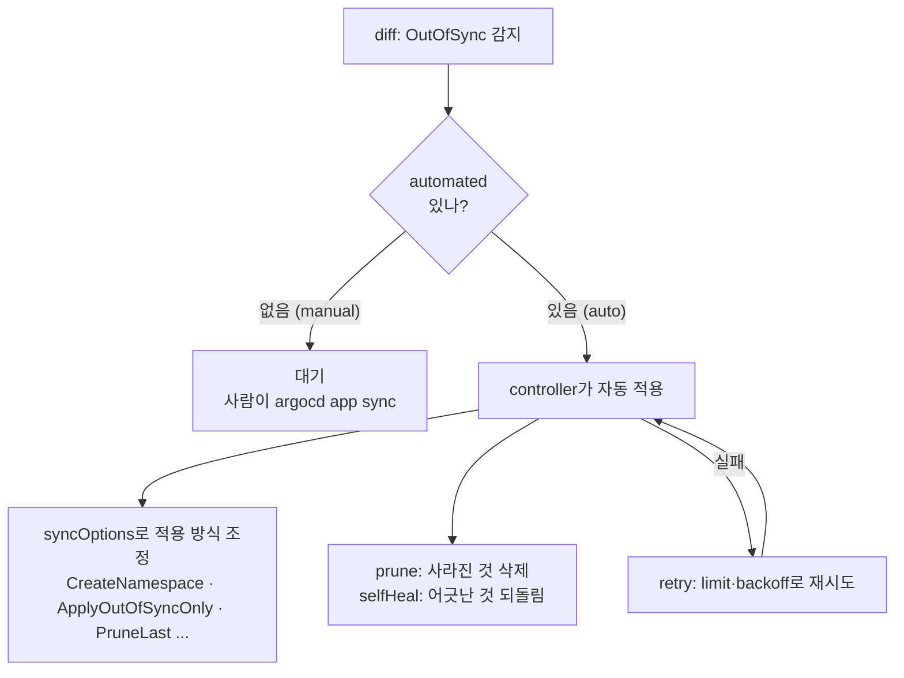

# 8. sync 정책 — automated · selfHeal · prune · syncOptions

`syncPolicy`는 "Argo CD가 desired와 live의 차이를 봤을 때, 거기까지만 할지 자동으로 적용까지 할지"를 정하는 블록입니다. 이 한 덩어리가 자동화의 수위를 정합니다 — `automated`가 없으면 차이를 감지(OutOfSync)하되 적용은 사람이 `argocd app sync`로 명령할 때만 일어나고(**manual**), `automated`를 켜면 controller가 reconcile 바퀴마다 알아서 적용합니다(**auto**). 그 위에 `prune`·`selfHeal`이 "사라진 걸 지울지·어긋난 걸 되돌릴지"를, `retry`가 "실패하면 어떻게 다시 시도할지"를, `syncOptions`가 "적용을 구체적으로 어떻게 할지"를 더합니다. 이 편은 같은 앱을 manual로 만들어 "아무것도 안 일어남 → 수동 sync"를 보고, namespace가 없어 sync가 실패하는 상황을 `syncOptions` 한 줄로 고치고, automated·retry·주요 syncOptions를 카탈로그로 정리합니다. 산출물은 "manual과 auto의 경계를 손으로 가른 경험"과 "syncPolicy의 네 부분(automated·retry·syncOptions·prune/selfHeal)이 각각 무엇을 정하는지 정리한 상태"입니다.

## 핵심 다이어그램



- **automated 유무가 manual/auto를 가른다.** 빠지면 manual — diff는 돌지만 적용은 수동이다. 첫 배포조차 자동으로 안 되고, 사람이 sync해야 리소스가 생긴다. 켜면 controller가 알아서 적용한다.
- **prune·selfHeal은 automated 안의 스위치다.** `prune`은 Git에서 사라진 리소스를 live에서 지우고, `selfHeal`은 live가 어긋나면 Git으로 되돌린다. 둘 다 기본 false라, 자동 적용을 켜도 따로 켜야 동작한다.
- **retry는 실패를 어떻게 다시 할지다.** sync가 실패하면 `limit`·`backoff`(duration·factor·maxDuration)에 따라 간격을 늘려 가며 재시도한다. 일시적 실패(이미지 pull 지연 등)를 사람이 안 봐도 넘기기 위한 것이다.
- **syncOptions는 적용의 세부 동작이다.** namespace를 만들지(`CreateNamespace`), 바뀐 것만 적용할지(`ApplyOutOfSyncOnly`), prune을 마지막에 할지(`PruneLast`) 등 — sync가 *무엇을 하느냐*가 아니라 *어떻게 하느냐*를 조정한다.

아래 시연이 이 구조를 한 줄씩 손으로 확인합니다.

## 사전 준비물

이 실습은 **macOS** 환경을 기준으로 합니다.

- **Docker** — Docker Desktop, OrbStack 등. `docker ps`가 에러 없이 돌아가면 OK.
- **Homebrew** — macOS 패키지 관리자.

### kind · kubectl · argocd CLI 설치

```bash
brew install kind kubectl argocd
```

### 클러스터 · Argo CD 준비

```bash
kind create cluster --name rosa-lab
kubectl create namespace argocd
kubectl apply -n argocd -f https://raw.githubusercontent.com/argoproj/argo-cd/stable/manifests/install.yaml
kubectl -n argocd wait --for=condition=Ready pods --all --timeout=180s

ARGOCD_PW=$(kubectl -n argocd get secret argocd-initial-admin-secret -o jsonpath='{.data.password}' | base64 -d)
kubectl -n argocd port-forward svc/argocd-server 8080:443 >/tmp/pf.log 2>&1 &
sleep 3
argocd login localhost:8080 --username admin --password "$ARGOCD_PW" --insecure
```

## 여기서 직접 확인할 수 있는 것

### manual — 만들어도 아무것도 안 일어난다

`manifests/app-manual.yaml`은 `syncPolicy`가 통째로 없습니다. 적용하면 Application 객체는 생기지만, 자동 적용이 없으니 리소스는 만들어지지 않습니다.

```bash
kubectl apply -f manifests/app-manual.yaml
sleep 5
argocd app get policy | grep -E "Sync Status|Health Status"
kubectl get ns policy-demo 2>&1
```

```
Sync Status:        OutOfSync from HEAD (xxxxxxx)
Health Status:      Missing
namespace "policy-demo" not found
```

`OutOfSync` / `Missing`입니다 — diff는 "Git엔 있는데 live엔 없다"를 봤지만, automated가 없어 적용하지 않았습니다. namespace조차 없습니다. manual에서는 감지가 곧 적용이 아닙니다.

### 수동 sync — namespace가 없어 실패한다

사람이 직접 sync를 명령합니다. 그런데 destination namespace(`policy-demo`)가 없고, 이 Application엔 namespace를 만들라는 옵션도 없습니다.

```bash
argocd app sync policy
```

```
... namespaces "policy-demo" not found
FATA[0001] Operation has completed with phase: Failed
```

sync가 실패했습니다. desired 매니페스트는 `policy-demo`에 리소스를 만들라는데, 그 namespace가 없어서 k8s API가 거부했습니다.

### syncOptions 한 줄로 고친다 — CreateNamespace

`CreateNamespace=true`를 더하면 Argo CD가 적용 전에 namespace를 만듭니다. 동시에 `automated`도 켜서 manual → auto로 올립니다. `manifests/app-auto.yaml`이 그 버전입니다.

```bash
kubectl apply -f manifests/app-auto.yaml
argocd app wait policy --health
argocd app get policy | grep -E "Sync Status|Health Status"
kubectl -n policy-demo get deploy
```

```
Sync Status:        Synced to HEAD (xxxxxxx)
Health Status:      Healthy
NAME           READY   UP-TO-DATE   AVAILABLE
guestbook-ui   1/1     1            1
```

이번엔 자동으로 namespace가 생기고, 리소스가 적용되고, Synced·Healthy가 됐습니다. 실패하던 sync를 코드(매니페스트)에서 옵션 한 줄로 고친 것 — UI에서 클릭하지 않았습니다.

### 정책을 객체에서 확인한다 — automated · retry · syncOptions

방금 적용한 정책이 객체에 어떻게 들어갔는지 봅니다.

```bash
kubectl -n argocd get application policy -o jsonpath='{.spec.syncPolicy}{"\n"}' | python3 -m json.tool
```

```json
{
  "automated": { "prune": true, "selfHeal": true },
  "retry": { "limit": 5, "backoff": { "duration": "5s", "factor": 2, "maxDuration": "3m" } },
  "syncOptions": [ "CreateNamespace=true", "ApplyOutOfSyncOnly=true", "PruneLast=true" ]
}
```

- **automated** — 자동 적용 + prune(사라진 것 삭제) + selfHeal(어긋난 것 되돌림).
- **retry** — 실패하면 5s에서 시작해 factor 2로 간격을 늘려(5s→10s→20s…) 최대 3m까지, 5번 재시도.
- **syncOptions** — namespace 자동 생성, 바뀐 리소스만 적용, prune은 마지막에.

### syncOptions 카탈로그 — 자주 쓰는 것들

`syncOptions`는 적용 방식을 조정하는 플래그 모음입니다. 자주 쓰는 것들:

| 옵션 | 무엇을 바꾸나 | 언제 |
|---|---|---|
| `CreateNamespace=true` | dest namespace가 없으면 만든다 | namespace를 Argo가 관리할 때 |
| `ApplyOutOfSyncOnly=true` | OutOfSync인 리소스만 apply | 리소스 많은 큰 앱의 sync 속도 |
| `PruneLast=true` | 다른 리소스 sync가 끝난 뒤 prune | 삭제가 신규/갱신보다 먼저 일어나 생기는 사고 방지 |
| `PrunePropagationPolicy=foreground` | prune 시 자식까지 기다려 삭제 | 삭제 순서를 엄격히 할 때 |
| `ServerSideApply=true` | client-side 대신 server-side apply | 큰 CRD·필드 소유권 충돌 회피 |
| `Replace=true` | apply 대신 replace | apply가 거부하는 큰/불변 객체 |
| `Validate=false` | client-side 스키마 검증 끔 | 검증이 오탐을 낼 때 |

이 옵션들은 "sync가 *무엇을* 하느냐(prune·selfHeal)"가 아니라 "*어떻게* 하느냐"를 정합니다. 기본값으로 두면 대부분 동작하고, 큰 앱·특수 리소스에서 필요할 때 하나씩 켭니다.

### 자동을 끄지 않고 미리 본다 — dry-run

automated가 켜져 있어도, 적용 전에 무엇이 바뀔지 미리 보고 싶을 때가 있습니다. `--dry-run`은 실제로 적용하지 않고 sync가 할 일만 계산합니다.

```bash
argocd app sync policy --dry-run
```

```
... (적용 없이 sync 대상 리소스 목록만 출력)
```

`--dry-run`은 클러스터를 건드리지 않습니다. 변경 내용을 줄 단위로 보려면 `argocd app diff policy`를, 적용까지 하려면 옵션 없이 `argocd app sync policy`를 씁니다.

### 정리

```bash
argocd app delete policy --yes
kubectl delete ns policy-demo --ignore-not-found
kill %1 2>/dev/null
kubectl delete -n argocd -f https://raw.githubusercontent.com/argoproj/argo-cd/stable/manifests/install.yaml
kubectl delete namespace argocd
```

클러스터까지 정리하려면:

```bash
kind delete cluster --name rosa-lab
```

## 이 편의 산출물

- `syncPolicy`가 없는 **manual** Application이 OutOfSync·Missing으로 남아 리소스를 만들지 않고, 사람이 `argocd app sync`를 명령해야 적용된다는 것을 손으로 본 경험 — 감지가 곧 적용이 아님을 가른 것.
- destination namespace가 없어 실패하던 sync를 `syncOptions: CreateNamespace=true` 한 줄과 `automated`로 고쳐, **manual → auto**로 올리고 실패를 코드에서 해결한 경험.
- 적용된 `syncPolicy`를 객체에서 꺼내 **automated(prune·selfHeal) · retry(limit·backoff) · syncOptions** 세 부분으로 읽고, retry의 backoff가 5s→10s→20s로 늘어나는 재시도임을 이해한 상태.
- 자주 쓰는 syncOptions(CreateNamespace·ApplyOutOfSyncOnly·PruneLast·ServerSideApply·Replace 등)가 "sync를 *어떻게* 하느냐"를 정하는 플래그임을 카탈로그로 정리하고, `--dry-run`으로 적용 없이 미리 보는 법을 확인한 상태.
