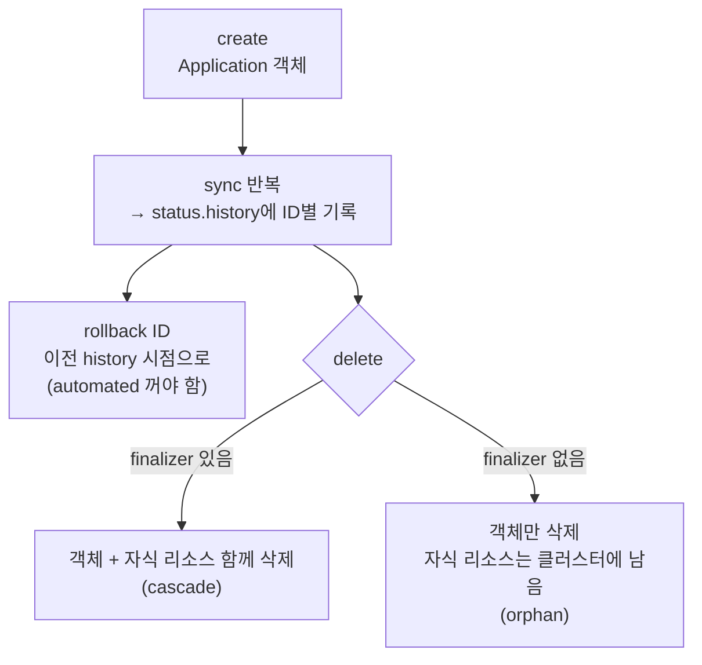

# 9. Application Lifecycle — revision history · rollback · deletion · finalizer

Application은 한 번 만들고 끝이 아닙니다. sync를 거듭하며 배포 이력이 쌓이고, 문제가 생기면 이전 상태로 되돌리고(rollback), 더는 필요 없으면 지웁니다. 이 진화에서 사람들이 가장 자주 발을 헛디디는 곳이 둘입니다 — **rollback이 automated sync와 충돌하는 것**(되돌려도 controller가 곧장 최신으로 다시 sync한다)과 **Application을 지웠는데 배포된 리소스가 클러스터에 남는 것**(finalizer가 없으면 객체만 지워진다). 이 편은 같은 앱을 여러 번 sync해 revision history를 쌓고, 그 history의 특정 시점으로 rollback하고, finalizer가 있을 때와 없을 때 삭제가 어떻게 갈리는지를 직접 봅니다. 핵심은 **Application 객체의 삭제와 그 객체가 만든 리소스의 삭제가 별개이고, 둘을 잇는 게 finalizer**라는 것 — 이 분리를 이해하면 "지웠는데 왜 남았나"가 사라집니다. 산출물은 "history를 쌓고 특정 시점으로 rollback한 경험"과 "finalizer 유무로 cascade 삭제와 orphan을 손으로 가른 경험"입니다.

## 핵심 다이어그램



- **history는 sync가 쌓는 이력이다.** 성공한 sync마다 `status.history`에 ID·시각·revision이 기록된다. rollback의 대상이 이 ID들이다.
- **rollback은 automated와 충돌한다.** 이전 시점으로 되돌려도, `automated`가 켜져 있으면 controller가 "desired는 최신"이라며 다시 sync해 rollback을 무효로 만든다. 그래서 rollback은 자동 sync를 끄고 한다 — Argo CD CLI도 automated가 켜져 있으면 rollback을 거부한다.
- **객체 삭제 ≠ 리소스 삭제.** `kind: Application`을 지우는 것과, 그 Application이 클러스터에 만든 Deployment·Service를 지우는 것은 다른 일이다. 기본적으로 k8s는 Application 객체만 지운다.
- **finalizer가 둘을 잇는다.** `resources-finalizer.argocd.argoproj.io`가 붙어 있으면, 객체 삭제 요청이 와도 controller가 **먼저 자식 리소스를 정리한 뒤** 객체를 지운다(cascade). 없으면 객체만 사라지고 리소스는 orphan으로 남는다.

아래 시연이 이 lifecycle을 한 줄씩 손으로 확인합니다.

## 사전 준비물

이 실습은 **macOS** 환경을 기준으로 합니다.

- **Docker** — Docker Desktop, OrbStack 등. `docker ps`가 에러 없이 돌아가면 OK.
- **Homebrew** — macOS 패키지 관리자.

### kind · kubectl · argocd CLI 설치

```bash
brew install kind kubectl argocd
```

### 클러스터 · Argo CD 준비

```bash
kind create cluster --name rosa-lab
kubectl create namespace argocd
kubectl apply -n argocd -f https://raw.githubusercontent.com/argoproj/argo-cd/stable/manifests/install.yaml
kubectl -n argocd wait --for=condition=Ready pods --all --timeout=180s

ARGOCD_PW=$(kubectl -n argocd get secret argocd-initial-admin-secret -o jsonpath='{.data.password}' | base64 -d)
kubectl -n argocd port-forward svc/argocd-server 8080:443 >/tmp/pf.log 2>&1 &
sleep 3
argocd login localhost:8080 --username admin --password "$ARGOCD_PW" --insecure
```

## 여기서 직접 확인할 수 있는 것

### 만들고 처음 sync한다 — manual로 시작

`manifests/app.yaml`은 `automated`가 없는 manual 앱입니다(rollback을 보려면 자동 sync가 꺼져 있어야 합니다). `replicaCount=1`로 시작합니다.

```bash
kubectl apply -f manifests/app.yaml
argocd app sync lifecycle
argocd app get lifecycle | grep -E "Sync Status"
```

```
Sync Status:        Synced to HEAD (xxxxxxx)
```

### history를 쌓는다 — sync마다 ID가 남는다

같은 앱의 파라미터를 바꿔 가며 두 번 더 sync합니다. 각 배포가 history에 기록됩니다.

```bash
argocd app set lifecycle -p replicaCount=3
argocd app sync lifecycle
argocd app set lifecycle -p replicaCount=2
argocd app sync lifecycle

argocd app history lifecycle
```

```
ID  DATE                           REVISION
0   2026-06-30 10:00:00 +0900      HEAD (xxxxxxx)
1   2026-06-30 10:01:00 +0900      HEAD (xxxxxxx)
2   2026-06-30 10:02:00 +0900      HEAD (xxxxxxx)
```

세 번의 배포가 ID 0·1·2로 쌓였습니다. 지금 live는 마지막(ID 2, `replicaCount=2`)입니다.

```bash
kubectl -n lifecycle-demo get deploy helm-guestbook -o jsonpath='{.spec.replicas}{"\n"}'
```

```
2
```

### rollback한다 — 이전 history 시점으로 되돌린다

ID 0(맨 처음, `replicaCount=1`)으로 되돌립니다. automated가 꺼져 있으므로 controller가 다시 덮어쓰지 않습니다.

```bash
argocd app rollback lifecycle 0
kubectl -n lifecycle-demo get deploy helm-guestbook -o jsonpath='{.spec.replicas}{"\n"}'
```

```
1
```

replica가 1로 돌아왔습니다 — ID 0 시점의 상태입니다. 만약 이 앱에 `automated: { selfHeal: true }`가 켜져 있었다면, rollback 직후 controller가 "Git의 desired는 최신"이라며 다시 sync해 이 1을 덮어썼을 것입니다. 그래서 rollback은 자동 sync를 끄고 합니다(CLI도 automated가 켜져 있으면 rollback을 거부합니다).

### finalizer 없이 지운다 — 리소스가 남는다(orphan)

이제 삭제를 봅니다. 먼저 현재 Application엔 finalizer가 없습니다. `kubectl`로 Application 객체만 지워 봅니다.

```bash
kubectl -n argocd get application lifecycle -o jsonpath='{.metadata.finalizers}{"\n"}'
kubectl -n argocd delete application lifecycle
```

```
              ← finalizer 비어 있음
application.argoproj.io "lifecycle" deleted
```

Application 객체는 사라졌습니다. 그런데 그것이 배포한 리소스는요?

```bash
kubectl -n lifecycle-demo get deploy,svc
```

```
NAME                             READY   UP-TO-DATE   AVAILABLE
deployment.apps/helm-guestbook   1/1     1            1

NAME                     TYPE        CLUSTER-IP     PORT(S)
service/helm-guestbook   ClusterIP   10.96.x.x      80/TCP
```

**리소스가 그대로 남았습니다.** Application 객체만 지워졌고, 그 객체가 만든 Deployment·Service는 이제 아무도 관리하지 않는 **orphan**입니다. 객체 삭제와 리소스 삭제가 별개임이 그대로 드러납니다.

### finalizer를 붙여 지운다 — 자식까지 함께 삭제(cascade)

orphan을 손으로 치우고, 이번엔 finalizer를 붙여 다시 만듭니다.

```bash
kubectl delete ns lifecycle-demo
kubectl apply -f manifests/app.yaml
argocd app sync lifecycle
```

Application에 Argo CD의 리소스 finalizer를 추가합니다.

```bash
kubectl -n argocd patch application lifecycle --type merge \
  -p '{"metadata":{"finalizers":["resources-finalizer.argocd.argoproj.io"]}}'
kubectl -n argocd get application lifecycle -o jsonpath='{.metadata.finalizers}{"\n"}'
```

```
["resources-finalizer.argocd.argoproj.io"]
```

이제 같은 방식으로 Application을 지웁니다.

```bash
kubectl -n argocd delete application lifecycle
kubectl -n lifecycle-demo get deploy,svc
```

```
application.argoproj.io "lifecycle" deleted
No resources found in lifecycle-demo namespace.
```

이번엔 리소스도 함께 사라졌습니다. finalizer가 삭제 요청을 가로채, controller가 **먼저 자식 리소스를 정리한 뒤** Application 객체를 지웠습니다(cascade). `kubectl delete` 때 객체가 잠깐 `Terminating`에 머무는 것이 그 정리 시간입니다.

> `argocd app delete <app>`는 기본적으로 이 finalizer를 자동으로 붙여 cascade 삭제합니다. `kubectl delete`로 객체를 직접 지울 때만 finalizer 유무가 orphan을 가릅니다 — Application을 Git으로 관리(GitOps)하면 이 차이가 중요해집니다. Git에서 Application 매니페스트를 지웠을 때 자식까지 정리되려면 매니페스트에 finalizer가 선언돼 있어야 합니다.

### 정리

```bash
kubectl -n argocd delete application lifecycle --ignore-not-found
kubectl delete ns lifecycle-demo --ignore-not-found
kill %1 2>/dev/null
kubectl delete -n argocd -f https://raw.githubusercontent.com/argoproj/argo-cd/stable/manifests/install.yaml
kubectl delete namespace argocd
```

클러스터까지 정리하려면:

```bash
kind delete cluster --name rosa-lab
```

## 이 편의 산출물

- 같은 Application을 파라미터를 바꿔 여러 번 sync해 `status.history`에 ID·revision이 쌓이는 것을 `argocd app history`로 확인하고, 특정 ID로 **rollback**해 그 시점 상태(replica)로 되돌린 경험.
- rollback이 **automated sync와 충돌**한다는 것 — 자동 sync가 켜져 있으면 controller가 최신으로 다시 덮어쓰므로 rollback은 자동을 끄고 해야 하며 CLI도 이를 거부함 — 을 이해한 상태.
- **Application 객체 삭제와 그 객체가 만든 리소스 삭제가 별개**임을, finalizer 없이 `kubectl delete`해 Deployment·Service가 **orphan**으로 남는 것으로 직접 본 경험.
- `resources-finalizer.argocd.argoproj.io`를 붙이면 삭제가 **cascade**(자식 먼저 정리 후 객체 삭제)로 바뀌는 것을 확인하고, GitOps에서 Application 매니페스트에 finalizer를 선언해야 Git 삭제 시 자식까지 정리됨을 이해한 상태.
