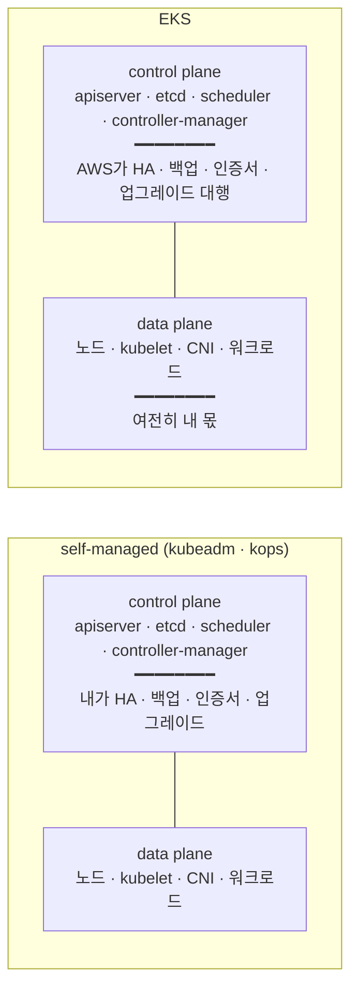

# 1. 왜 EKS인가

self-managed Kubernetes와 비교해 AWS가 무엇을 대신 맡는지 짚고, 클러스터를 어떤 도구(eksctl · Terraform)로 만들지 정합니다. 이 편이 끝나면 `aws` · `eksctl` · `kubectl` 이 준비되고, EKS를 쓰는 이유를 책임선으로 설명할 수 있습니다.

## 핵심 다이어그램



- **self-managed** — control plane과 data plane을 전부 직접 운영. apiserver를 여러 AZ에 띄워 HA를 맞추고, etcd를 백업하고, 인증서를 로테이션하고, 버전을 올리는 일이 전부 내 책임.
- **EKS** — control plane(apiserver · etcd · scheduler · controller-manager)을 AWS가 여러 AZ에 걸쳐 운영한다. 나는 endpoint 하나를 받아 쓰고, control plane 노드에 SSH로 들어갈 수 없다.
- **바뀌지 않는 것** — data plane(노드 · kubelet · CNI · 워크로드)은 EKS에서도 여전히 내 몫이다. EKS는 "관리형 control plane"이지 "관리형 클러스터 전부"가 아니다.

## 사전 준비

- **macOS + Homebrew**
- **AWS 프로필 `rosa-lab`** — `~/.aws/config` · `~/.aws/credentials` 에 설정된 프로필. 리전은 `ap-northeast-2`(서울).
- 이 편에서는 클러스터를 만들지 않으므로 과금되는 리소스가 생기지 않는다.

## 빠른 시작

세 도구를 설치하고 버전을 확인한다.

```bash
brew install awscli eksctl kubernetes-cli

aws --version
# aws-cli/2.x.x ...

eksctl version
# 0.x.x

kubectl version --client
# Client Version: v1.x.x
```

프로필이 살아 있는지 본다.

```bash
aws sts get-caller-identity --profile rosa-lab
# {
#   "UserId": "...",
#   "Account": "111122223333",
#   "Arn": "arn:aws:iam::111122223333:user/..."
# }
```

## 여기서 직접 확인할 수 있는 것

### 아직 클러스터는 없다

EKS API에 물어보면 이 리전에 클러스터가 하나도 없음을 확인할 수 있다.

```bash
aws eks list-clusters --profile rosa-lab --region ap-northeast-2
# {
#   "clusters": []
# }
```

이 명령이 도는 것 자체가 자격증명·리전·EKS 접근 권한이 맞물려 있다는 신호다. 권한이 없으면 여기서 `AccessDenied`가 난다.

### self-managed로 클러스터를 직접 운영하면 무엇을 해야 하는가

`kubeadm`이나 `kops`로 직접 클러스터를 세우면 control plane 운영이 통째로 내 일이 된다.

| 항목 | self-managed에서 내가 하는 일 |
|---|---|
| apiserver HA | 여러 노드에 apiserver를 띄우고 앞단에 load balancer를 둔다 |
| etcd | 클러스터 상태 저장소. 백업·복구 절차를 직접 만들고 정기적으로 검증한다 |
| 인증서 | apiserver·kubelet·etcd 간 TLS 인증서를 발급하고 만료 전에 로테이션한다 |
| 업그레이드 | control plane 컴포넌트를 순서대로 올리고, 실패 시 롤백을 책임진다 |
| OS 패치 | control plane 노드의 커널·패키지 보안 패치 |
| 가용성 | control plane이 AZ 장애를 견디도록 분산 배치 |

이 목록이 EKS를 쓰는 이유다. control plane은 "돌아가는 게 당연"해 보이지만, 위 항목 하나만 어긋나도 클러스터 전체가 멈춘다.

### EKS가 대신 맡는 것과 내가 계속 맡는 것

```bash
# EKS 클러스터를 만들면 control plane은 AWS가 관리하는 endpoint로만 노출된다.
# (지금은 클러스터가 없으므로 형태만 본다)
aws eks describe-cluster --name rosa-lab --profile rosa-lab --region ap-northeast-2
# An error occurred (ResourceNotFoundException) ...
#   → 아직 없음. 만들면 endpoint·version·status만 돌려주고,
#     apiserver·etcd 노드 자체는 노출하지 않는다.
```

경계는 이렇게 갈린다.

| 레이어 | 누가 |
|---|---|
| apiserver · etcd · scheduler · controller-manager | **AWS** (관리형 control plane) |
| control plane 인증서·백업·다중 AZ 배치 | **AWS** |
| control plane 버전 업그레이드 실행 | **AWS** (트리거는 내가, 실제 교체는 AWS) |
| 워커 노드 · kubelet · 노드 OS | **나** |
| CNI · 워크로드 · 애드온 버전 | **나** |
| IAM ↔ Kubernetes 권한 연결 | **나** |

EKS는 control plane을 걷어가는 대신, 그 대가로 **control plane 시간당 요금**을 받는다.

### eksctl과 Terraform — 클러스터를 만드는 두 방식

같은 EKS 클러스터를 두 도구로 선언할 수 있다. 아래는 비교용이며, 이 편에서는 어느 쪽도 적용하지 않는다.

**eksctl** — EKS 전용 CLI. 짧은 YAML 하나로 시작할 수 있고, 내부적으로 CloudFormation을 만든다.

```yaml
# cluster.yaml (비교용 — 적용 안 함)
apiVersion: eksctl.io/v1alpha5
kind: ClusterConfig
metadata:
  name: rosa-lab
  region: ap-northeast-2
managedNodeGroups:
  - name: ng-1
    instanceType: t3.medium
    desiredCapacity: 2
```

```bash
# eksctl create cluster -f cluster.yaml   # (적용 안 함)
```

**Terraform** — `terraform-aws-eks` 모듈로 선언. VPC·IAM 등 나머지 인프라와 같은 state·같은 언어로 묶인다.

```hcl
# main.tf (비교용 — 적용 안 함)
module "eks" {
  source  = "terraform-aws-eks/eks/aws"
  version = "~> 20.0"

  cluster_name    = "rosa-lab"
  cluster_version = "1.30"

  vpc_id     = var.vpc_id
  subnet_ids = var.subnet_ids

  eks_managed_node_groups = {
    ng-1 = {
      instance_types = ["t3.medium"]
      desired_size   = 2
    }
  }
}
```

두 방식의 성격 차이:

| | eksctl | Terraform |
|---|---|---|
| 성격 | EKS 전용 CLI | 범용 IaC |
| 상태 관리 | CloudFormation 스택 | Terraform state |
| 나머지 인프라와 통합 | 분리됨 | VPC·IAM·remote state와 한 묶음 |
| 시작 속도 | 빠름 | 초기 설정이 더 든다 |
| 재현·버전 관리 | config 파일 | state + 모듈 버전 핀 |

이 시리즈가 **Terraform**을 쓰는 이유: EKS는 인프라(VPC·IAM)와 워크로드가 만나는 이음매다. 클러스터만 따로 eksctl로 만들면 VPC·IAM은 Terraform, 클러스터는 CloudFormation으로 상태가 둘로 갈린다. 한 언어·한 state로 묶어야 전체를 선언형으로 재현하고 팀이 함께 다룰 수 있다. eksctl은 빠른 실험·검증용으로 남긴다.

### 비용 — 클러스터는 켜두는 것만으로 과금된다

EKS의 control plane은 사용량과 무관하게 **클러스터당 시간당 요금**이 붙는다(서울 기준 약 $0.10/h ≈ $73/월). 노드(EC2)·EBS·NAT는 그 위에 별도로 쌓인다.

- 워크로드가 하나도 없어도, 클러스터가 존재하는 시간만큼 control plane 요금이 누적된다.
- 그래서 학습용 클러스터는 **쓸 때 만들고 끝나면 지우는** 습관이 안전하다.

이 편은 클러스터를 만들지 않았으므로 과금되는 리소스가 없다.

### 정리할 것이 없다

이 편에서 만든 AWS 리소스가 없으므로 지울 것도 없다. 설치한 도구(`aws` · `eksctl` · `kubectl`)는 그대로 둔다.

```bash
aws eks list-clusters --profile rosa-lab --region ap-northeast-2
# {
#   "clusters": []
# }
```
