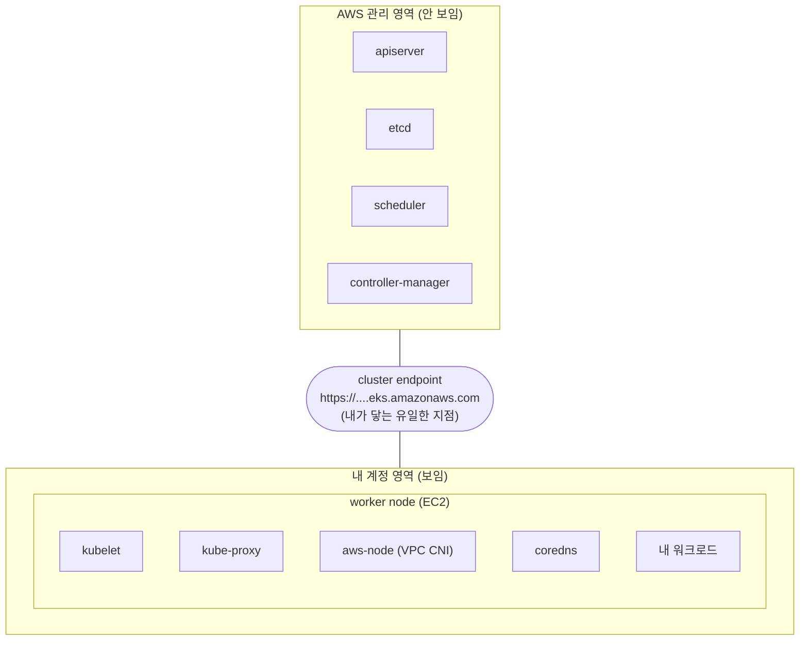

# 2. control plane vs data plane

EKS 클러스터 하나를 만들어, 어디까지가 AWS 책임(control plane)이고 어디부터 내 책임(data plane)인지 손으로 확인합니다. 이 편이 끝나면 `kubectl`·`aws` 명령으로 책임 분담선을 짚어 설명할 수 있습니다.

## 핵심 다이어그램



- **control plane** — apiserver · etcd · scheduler · controller-manager. AWS가 별도 영역에서 여러 AZ에 걸쳐 운영한다. 노드에 SSH로 들어갈 수도, 그 Pod을 볼 수도 없다.
- **cluster endpoint** — control plane이 밖으로 내미는 유일한 표면. `kubectl`·`aws eks`가 여기로 말을 건다.
- **data plane** — 워커 노드와 그 위의 모든 것(kubelet · kube-proxy · VPC CNI · coredns · 워크로드). 전부 내 계정 안에 있고, 내가 보고 고친다.

## 사전 준비

- **macOS + Homebrew** — `brew install awscli eksctl kubernetes-cli terraform`
- **AWS 프로필 `rosa-lab`** — 리전 `ap-northeast-2`(서울). `aws sts get-caller-identity --profile rosa-lab` 로 살아 있는지 확인.

## 빠른 시작

`rosa-lab` 클러스터가 이미 있으면 이 단계를 건너뛰고 kubeconfig만 내려받는다.

```bash
aws eks describe-cluster --name rosa-lab --region ap-northeast-2 --profile rosa-lab \
  --query 'cluster.status' 2>/dev/null
# "ACTIVE"  → 이미 있음. 아래 apply를 건너뛰고 update-kubeconfig로.
# 에러      → 없음. 아래로 만든다.
```

없으면 만든다. 작업 폴더에 `main.tf` 를 둔다.

```bash
mkdir -p /tmp/eks-lab-2 && cd /tmp/eks-lab-2
```

```hcl
# main.tf
terraform {
  required_providers {
    aws = {
      source  = "hashicorp/aws"
      version = "~> 5.0"
    }
  }
}

provider "aws" {
  region  = "ap-northeast-2"
  profile = "rosa-lab"
}

data "aws_availability_zones" "available" {
  state = "available"
}

locals {
  name = "rosa-lab"
  azs  = slice(data.aws_availability_zones.available.names, 0, 2)
  tags = {
    Project = "rosa-hands-on"
    Edition = "eks-2"
  }
}

# ─── VPC (NAT 없이 public 서브넷만 — 비용 최소화) ───
module "vpc" {
  source  = "terraform-aws-modules/vpc/aws"
  version = "~> 5.0"

  name = "${local.name}-vpc"
  cidr = "10.0.0.0/16"

  azs                     = local.azs
  public_subnets          = ["10.0.1.0/24", "10.0.2.0/24"]
  enable_nat_gateway      = false
  map_public_ip_on_launch = true

  tags = local.tags
}

# ─── EKS ───
module "eks" {
  source  = "terraform-aws-modules/eks/aws"
  version = "~> 20.0"

  cluster_name    = local.name
  cluster_version = "1.32" # 현재 지원 버전 중 하나로 맞춘다

  cluster_endpoint_public_access           = true
  enable_cluster_creator_admin_permissions = true

  vpc_id     = module.vpc.vpc_id
  subnet_ids = module.vpc.public_subnets

  eks_managed_node_groups = {
    default = {
      instance_types = ["t3.medium"]
      min_size       = 2
      max_size       = 2
      desired_size   = 2
      subnet_ids     = module.vpc.public_subnets
    }
  }

  tags = local.tags
}

output "cluster_name" {
  value = module.eks.cluster_name
}
```

```bash
terraform init
terraform apply   # 클러스터 + 노드까지 약 15분
#   Enter a value: yes
# Apply complete!
```

kubeconfig를 내려받아 `kubectl` 이 이 클러스터를 보게 한다.

```bash
aws eks update-kubeconfig --name rosa-lab --region ap-northeast-2 --profile rosa-lab
# Added new context arn:aws:eks:ap-northeast-2:...:cluster/rosa-lab
```

## 여기서 직접 확인할 수 있는 것

### `kubectl get nodes` 에는 워커 노드만 보인다

```bash
kubectl get nodes
# NAME                          STATUS   ROLES    AGE   VERSION
# ip-10-0-1-xx.ap-...           Ready    <none>   5m    v1.32.x
# ip-10-0-2-xx.ap-...           Ready    <none>   5m    v1.32.x
```

노드가 둘 다 `ROLES <none>` 인 워커다. self-managed 클러스터라면 여기에 `control-plane` 역할 노드도 섞여 나온다. EKS에는 그 줄이 없다 — apiserver·etcd가 도는 노드는 내 목록에 아예 등장하지 않는다. 이것이 책임선의 첫 신호다.

### `kube-system` 에 control plane 컴포넌트가 없다

```bash
kubectl -n kube-system get pods
# NAME                       READY   STATUS    RESTARTS   AGE
# aws-node-xxxxx             2/2     Running   0          5m
# aws-node-yyyyy             2/2     Running   0          5m
# coredns-xxxxxxxxxx-aaaaa   1/1     Running   0          8m
# coredns-xxxxxxxxxx-bbbbb   1/1     Running   0          8m
# kube-proxy-xxxxx           1/1     Running   0          5m
# kube-proxy-yyyyy           1/1     Running   0          5m
```

여기 있는 것은 전부 data plane이다 — `aws-node`(VPC CNI), `coredns`, `kube-proxy`. 정작 `apiserver`·`etcd`·`scheduler`·`controller-manager` Pod은 **하나도 없다**. self-managed라면 `kube-system` 에 `kube-apiserver-...`·`etcd-...` Pod이 떠 있다. EKS에서는 AWS가 안 보이는 영역에서 운영하므로 내 클러스터 뷰에 나타나지 않는다.

```bash
kubectl -n kube-system get pods | grep -E 'apiserver|etcd|scheduler|controller-manager'
# (아무것도 안 나옴)
```

### AWS가 노출하는 control plane 표면

control plane 자체는 못 보지만, AWS는 그 요약을 API로 내민다.

```bash
aws eks describe-cluster --name rosa-lab --region ap-northeast-2 --profile rosa-lab \
  --query 'cluster.{version:version,platformVersion:platformVersion,status:status,endpoint:endpoint}'
# {
#   "version": "1.32",
#   "platformVersion": "eks.x",
#   "status": "ACTIVE",
#   "endpoint": "https://XXXX.gr7.ap-northeast-2.eks.amazonaws.com"
# }
```

`endpoint` 가 다이어그램의 다리다. `kubectl` 이 실제로 말을 거는 주소이며, `platformVersion`(EKS 플랫폼 개정)은 AWS가 control plane에 패치를 얹을 때 올라간다 — 내가 손대지 않아도 바뀌는 값이다.

### control plane 버전과 kubelet 버전은 따로 관리된다

버전이 두 군데서 나온다.

```bash
# control plane 버전 — AWS가 올린다
aws eks describe-cluster --name rosa-lab --region ap-northeast-2 --profile rosa-lab \
  --query 'cluster.version' --output text
# 1.32

# kubelet(노드) 버전 — 내가 노드를 교체해 올린다
kubectl get nodes -o wide --no-headers | awk '{print $5}'
# v1.32.x
# v1.32.x
```

지금은 둘이 같지만, 관리 주체가 다르다. AWS가 control plane을 1.33으로 올려도 내 노드의 kubelet은 내가 노드를 새로 교체해 올리기 전까지 그대로다. control plane과 노드가 서로 다른 버전으로 벌어질 수 있다는 것 자체가 책임이 나뉘어 있다는 증거다.

### control plane 로그는 `kubectl` 로 볼 수 없다

data plane Pod의 로그는 바로 본다.

```bash
kubectl -n kube-system logs -l k8s-app=kube-dns --tail=3
# (coredns 로그가 나온다 — 내 노드에서 도니까)
```

반면 apiserver 로그를 `kubectl logs` 로 보려 해도 그 Pod이 없으니 대상이 없다. control plane 로그는 CloudWatch로만 나가며, 그것도 클러스터에서 켜야 흐른다.

```bash
aws eks describe-cluster --name rosa-lab --region ap-northeast-2 --profile rosa-lab \
  --query 'cluster.logging.clusterLogging'
# [ { "types": ["api","audit",...], "enabled": false } ]
#   → 기본은 꺼짐. 켜면 CloudWatch Logs로 나간다(별도 과금).
```

### 장애 실험 — 책임선을 직접 밀어 본다

**data plane은 내 것 — 부수면 내가(정확히는 내 컨트롤러가) 되살린다.** coredns Pod을 지운다.

```bash
kubectl -n kube-system delete pod -l k8s-app=kube-dns
# pod "coredns-..." deleted

kubectl -n kube-system get pods -l k8s-app=kube-dns
# coredns-...-ccccc   1/1   Running   0   10s   ← Deployment가 새로 만들어 줌
```

coredns는 Deployment가 관리하므로 지워도 즉시 새 Pod이 뜬다. 이 복구는 클러스터 안의 controller가 한다.

**control plane은 만질 수 없다 — 부술 Pod조차 안 보인다.**

```bash
kubectl -n kube-system delete pod -l component=kube-apiserver
# No resources found in kube-system namespace.
#   → 지울 대상이 없다. apiserver가 문제면 재시작은 AWS 몫이고,
#     나는 support 케이스를 열 뿐 직접 손대지 않는다.
```

두 명령의 결과 차이가 책임선을 그대로 보여준다 — data plane은 내가 열어 고칠 수 있고, control plane은 열 손잡이조차 없다.

### 비용 영향

- **control plane** — 클러스터가 존재하는 시간만큼 시간당 요금(서울 약 $0.10/h ≈ $73/월). 워크로드가 없어도 붙는다.
- **노드** — `t3.medium` 2대 ≈ $0.10/h + 각 노드 EBS(gp3) 소액.
- **NAT** — 이 구성은 만들지 않았다(노드를 public 서브넷에 두고 공인 IP로 외부에 닿게 함). NAT Gateway는 시간당 + 데이터 처리량으로 과금되므로 학습용에서는 뺐다.
- 도는 클러스터 합계 대략 **$0.20/h**. 실습이 끝나면 지우는 것이 유일한 비용 통제다.

### 제거 방법

이 클러스터를 이어서 다른 실습에 재사용할 거라면 그대로 둔다. 끝났으면 지운다.

```bash
cd /tmp/eks-lab-2
terraform destroy
#   Enter a value: yes
# Destroy complete!
```

kubeconfig의 컨텍스트도 지운다.

```bash
kubectl config delete-context "$(kubectl config current-context)" 2>/dev/null || true
```

클러스터가 사라졌는지 확인한다.

```bash
aws eks list-clusters --region ap-northeast-2 --profile rosa-lab
# {
#   "clusters": []
# }
```

### 실습 폴더 정리

```bash
cd ..
rm -rf /tmp/eks-lab-2
```
