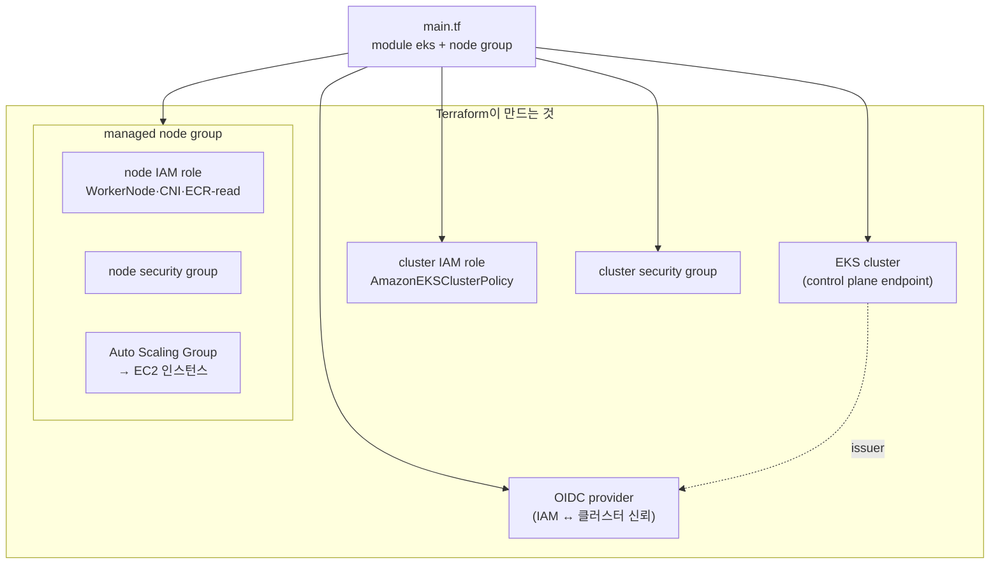

# 3. 클러스터 생성 — Terraform

`terraform-aws-eks` 모듈로 클러스터를 하나 만들고, 그 짧은 코드가 실제로 어떤 AWS 리소스를 낳는지 하나씩 확인합니다. 이 편이 끝나면 EKS 한 벌이 cluster · IAM role · security group · OIDC provider · node group(ASG)으로 어떻게 펼쳐지는지 짚어 설명할 수 있습니다.

## 핵심 다이어그램



- **EKS cluster** — control plane endpoint. cluster IAM role을 달고 AWS가 운영한다.
- **cluster IAM role** — control plane이 AWS API(ENI 생성 등)를 호출할 때 쓰는 권한.
- **security group** — cluster SG와 node SG 두 벌. 둘 사이 트래픽을 서로 허용해 노드가 control plane과 통신한다.
- **OIDC provider** — 클러스터의 신원 발급기(issuer)를 IAM이 신뢰하도록 등록한 것. AWS 권한과 클러스터를 잇는 토대.
- **managed node group** — node IAM role + node SG + Auto Scaling Group. ASG가 실제 EC2 인스턴스를 띄우고 유지한다.

## 사전 준비

- **macOS + Homebrew** — `brew install awscli kubernetes-cli terraform`
- **AWS 프로필 `rosa-lab`** — 리전 `ap-northeast-2`(서울). `aws sts get-caller-identity --profile rosa-lab` 로 확인.

## 빠른 시작

`rosa-lab` 클러스터가 이미 있으면 apply를 건너뛰고 kubeconfig만 내려받는다.

```bash
aws eks describe-cluster --name rosa-lab --region ap-northeast-2 --profile rosa-lab \
  --query 'cluster.status' 2>/dev/null
# "ACTIVE"  → 이미 있음. apply 건너뛰고 update-kubeconfig로.
# 에러      → 없음. 아래로 만든다.
```

```bash
mkdir -p /tmp/eks-lab-3 && cd /tmp/eks-lab-3
```

```hcl
# main.tf
terraform {
  required_providers {
    aws = {
      source  = "hashicorp/aws"
      version = "~> 5.0"
    }
  }
}

provider "aws" {
  region  = "ap-northeast-2"
  profile = "rosa-lab"
}

data "aws_availability_zones" "available" {
  state = "available"
}

locals {
  name = "rosa-lab"
  azs  = slice(data.aws_availability_zones.available.names, 0, 2)
  tags = {
    Project = "rosa-hands-on"
    Edition = "eks-3"
  }
}

module "vpc" {
  source  = "terraform-aws-modules/vpc/aws"
  version = "~> 5.0"

  name = "${local.name}-vpc"
  cidr = "10.0.0.0/16"

  azs                     = local.azs
  public_subnets          = ["10.0.1.0/24", "10.0.2.0/24"]
  enable_nat_gateway      = false
  map_public_ip_on_launch = true

  tags = local.tags
}

module "eks" {
  source  = "terraform-aws-modules/eks/aws"
  version = "~> 20.0"

  cluster_name    = local.name
  cluster_version = "1.32"

  cluster_endpoint_public_access           = true
  enable_cluster_creator_admin_permissions = true

  vpc_id     = module.vpc.vpc_id
  subnet_ids = module.vpc.public_subnets

  eks_managed_node_groups = {
    default = {
      instance_types = ["t3.medium"]
      min_size       = 2
      max_size       = 2
      desired_size   = 2
      subnet_ids     = module.vpc.public_subnets
    }
  }

  tags = local.tags
}
```

```bash
terraform init
terraform apply   # 약 15분
#   Enter a value: yes
# Apply complete!

aws eks update-kubeconfig --name rosa-lab --region ap-northeast-2 --profile rosa-lab
```

## 여기서 직접 확인할 수 있는 것

### 짧은 코드가 낳은 리소스 목록

`module` 두 개짜리 코드가 실제로는 수십 개의 리소스가 된다. Terraform state에 전부 적혀 있다.

```bash
terraform state list | grep module.eks | head -30
# module.eks.aws_eks_cluster.this[0]
# module.eks.aws_eks_node_group... (managed node group)
# module.eks.aws_iam_role.this[0]            ← cluster IAM role
# module.eks.aws_iam_role_policy_attachment...
# module.eks.aws_security_group.cluster[0]   ← cluster SG
# module.eks.aws_security_group.node[0]      ← node SG
# module.eks.aws_iam_openid_connect_provider.oidc_provider[0]  ← OIDC
# ...
```

아래에서 이 목록의 핵심 항목을 AWS API로 하나씩 되짚는다.

### EKS cluster와 그 IAM role

cluster는 control plane endpoint를 내밀고, 자기 일을 하기 위한 IAM role을 달고 있다.

```bash
aws eks describe-cluster --name rosa-lab --region ap-northeast-2 --profile rosa-lab \
  --query 'cluster.{endpoint:endpoint,roleArn:roleArn,version:version}'
# {
#   "endpoint": "https://XXXX.eks.amazonaws.com",
#   "roleArn": "arn:aws:iam::...:role/...cluster...",
#   "version": "1.32"
# }
```

그 role에 무엇이 붙어 있는지 본다.

```bash
CLUSTER_ROLE=$(aws eks describe-cluster --name rosa-lab --region ap-northeast-2 --profile rosa-lab \
  --query 'cluster.roleArn' --output text | awk -F/ '{print $NF}')

aws iam list-attached-role-policies --role-name "$CLUSTER_ROLE" --profile rosa-lab \
  --query 'AttachedPolicies[].PolicyName'
# [ "AmazonEKSClusterPolicy" ]
```

`AmazonEKSClusterPolicy` 는 control plane이 내 계정 안에서 ENI를 만들고 load balancer를 붙이는 등의 작업을 할 권한이다. 이 role이 없으면 클러스터는 만들어지지 않는다.

### security group 두 벌

cluster SG와 node SG가 나뉘어 있고, 서로의 트래픽을 허용한다.

```bash
aws eks describe-cluster --name rosa-lab --region ap-northeast-2 --profile rosa-lab \
  --query 'cluster.resourcesVpcConfig.{clusterSG:clusterSecurityGroupId,extraSG:securityGroupIds}'
# {
#   "clusterSG": "sg-aaa...",   ← EKS가 만든 primary cluster SG
#   "extraSG": ["sg-bbb..."]    ← 모듈이 붙인 추가 SG
# }
```

노드가 control plane과, 또 노드끼리 통신하려면 이 SG들의 규칙이 서로 열려 있어야 한다. 규칙이 어긋나면 노드가 `Ready` 로 올라오지 못한다.

### OIDC provider — 신원의 토대

클러스터는 자신의 신원 토큰을 발급하는 issuer URL을 가진다. 그 issuer를 IAM에 provider로 등록해 두면, AWS가 클러스터가 발급한 토큰을 신뢰할 수 있다.

```bash
# 클러스터의 issuer URL
aws eks describe-cluster --name rosa-lab --region ap-northeast-2 --profile rosa-lab \
  --query 'cluster.identity.oidc.issuer' --output text
# https://oidc.eks.ap-northeast-2.amazonaws.com/id/XXXX

# IAM에 등록된 OIDC provider (issuer와 짝이 맞는다)
aws iam list-open-id-connect-providers --profile rosa-lab
# {
#   "OpenIDConnectProviderList": [
#     { "Arn": "arn:aws:iam::...:oidc-provider/oidc.eks.ap-northeast-2.amazonaws.com/id/XXXX" }
#   ]
# }
```

issuer의 뒷부분(`id/XXXX`)이 provider ARN에 그대로 들어 있다. 이 짝이 맞아야 클러스터 신원과 AWS 권한을 잇는 다리가 놓인다.

### node group → Auto Scaling Group → EC2

managed node group은 그 자체가 하나의 추상이다. 안을 들여다보면 Auto Scaling Group이 있고, 그 밑에 EC2 인스턴스가 있다.

```bash
# node group과 그 node IAM role
aws eks describe-nodegroup --cluster-name rosa-lab --nodegroup-name default \
  --region ap-northeast-2 --profile rosa-lab \
  --query 'nodegroup.{status:status,role:nodeRole,asg:resources.autoScalingGroups}'
# {
#   "status": "ACTIVE",
#   "role": "arn:aws:iam::...:role/...node...",
#   "asg": [ { "name": "eks-default-..." } ]
# }
```

node IAM role에 붙은 정책들:

```bash
NODE_ROLE=$(aws eks describe-nodegroup --cluster-name rosa-lab --nodegroup-name default \
  --region ap-northeast-2 --profile rosa-lab --query 'nodegroup.nodeRole' --output text | awk -F/ '{print $NF}')

aws iam list-attached-role-policies --role-name "$NODE_ROLE" --profile rosa-lab \
  --query 'AttachedPolicies[].PolicyName'
# [
#   "AmazonEKSWorkerNodePolicy",          ← 노드가 클러스터에 조인
#   "AmazonEC2ContainerRegistryReadOnly", ← ECR에서 이미지 pull
#   "AmazonEKS_CNI_Policy"                ← VPC CNI가 ENI/IP 관리
# ]
```

이 세 정책이 노드가 "조인하고, 이미지를 받고, IP를 얻는" 최소 조건이다. ASG가 실제로 띄운 인스턴스는 `kubectl` 에서 노드로 보인다.

```bash
kubectl get nodes -o wide
# 2개 노드가 Ready
```

### 장애 실험 — 노드를 하나 없애면 ASG가 다시 채운다

managed node group은 desired 수를 지키려 한다. EC2 인스턴스 하나를 강제로 종료해 본다.

```bash
INSTANCE_ID=$(aws ec2 describe-instances \
  --filters "Name=tag:eks:cluster-name,Values=rosa-lab" "Name=instance-state-name,Values=running" \
  --query 'Reservations[0].Instances[0].InstanceId' --output text \
  --region ap-northeast-2 --profile rosa-lab)

aws ec2 terminate-instances --instance-ids "$INSTANCE_ID" \
  --region ap-northeast-2 --profile rosa-lab
```

잠시 지켜본다.

```bash
kubectl get nodes -w
# 종료된 노드가 NotReady → 목록에서 사라지고,
# 몇 분 뒤 새 노드가 조인해 다시 2개가 된다.
```

인스턴스를 직접 지워도 desired=2를 ASG가 다시 맞춘다. 노드 한 대는 소모품이고, 유지 책임은 node group(ASG)에 있다. 이것이 self-managed에서 노드를 직접 세우는 것과의 차이다.

### 비용 영향

- **control plane** — 시간당 약 $0.10/h(≈ $73/월). 클러스터가 존재하는 시간에 비례.
- **노드** — `t3.medium` 2대 ≈ $0.10/h + EBS(gp3) 소액.
- **NAT** — 만들지 않음(노드를 public 서브넷 + 공인 IP로 외부에 닿게 함).
- **OIDC provider · IAM role · SG** — 이들 자체는 과금되지 않는다.
- 도는 클러스터 합계 대략 **$0.20/h**.

### 제거 방법

이어서 재사용할 거라면 그대로 둔다. 끝났으면 지운다. destroy는 생성의 역순(node group → cluster → OIDC·role·SG → VPC)으로 처리된다.

```bash
cd /tmp/eks-lab-3
terraform destroy
#   Enter a value: yes
# Destroy complete!
```

```bash
kubectl config delete-context "$(kubectl config current-context)" 2>/dev/null || true

aws eks list-clusters --region ap-northeast-2 --profile rosa-lab
# { "clusters": [] }
```

OIDC provider가 남아 있지 않은지도 확인한다(destroy가 함께 지운다).

```bash
aws iam list-open-id-connect-providers --profile rosa-lab
# { "OpenIDConnectProviderList": [] }
```

### 실습 폴더 정리

```bash
cd ..
rm -rf /tmp/eks-lab-3
```
