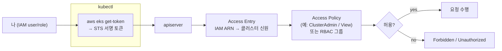

# 4. 클러스터 접근 제어

`kubectl` 한 줄이 apiserver에 닿기까지 IAM 신원이 어떻게 검사되는지 따라가고, Access Entry로 다른 신원에게 최소 권한을 주고, 잠겨도 다시 들어오는 break-glass를 확인합니다. 이 편이 끝나면 "누가 클러스터에 들어올 수 있는가"를 IAM → Access Entry → RBAC 사슬로 설명할 수 있습니다.

## 핵심 다이어그램



- **인증(authentication)** — "너 누구냐". `kubectl` 은 매 요청마다 `aws eks get-token` 으로 STS 서명 토큰을 만들어 apiserver에 보낸다. apiserver는 이 토큰으로 IAM 신원(ARN)을 확인한다.
- **매핑(Access Entry)** — 그 IAM ARN이 클러스터 안에서 누구인지 잇는다. 최근 EKS의 기본 방식이며, 예전 `aws-auth` ConfigMap을 대체한다.
- **인가(authorization)** — 무엇을 할 수 있는지. Access Entry에 AWS 관리형 **Access Policy**(ClusterAdmin·View 등)를 붙이거나, Kubernetes 그룹에 이어 **RBAC**로 정한다.
- 사슬 어디가 끊겨도 결과가 다르다 — 매핑이 없으면 `Unauthorized`, 매핑은 됐지만 권한이 모자라면 `Forbidden`.

## 사전 준비

- **macOS + Homebrew** — `brew install awscli kubernetes-cli terraform`
- **AWS 프로필 `rosa-lab`** — 리전 `ap-northeast-2`(서울). 이 프로필이 IAM role을 만들고 assume할 수 있어야 한다.

## 빠른 시작

`rosa-lab` 클러스터가 이미 있으면 apply의 EKS 부분은 그대로 두고, 아래 코드에서 **viewer role·access entry만** 추가해 `terraform apply` 한다. 없으면 전체를 만든다.

```bash
mkdir -p /tmp/eks-lab-4 && cd /tmp/eks-lab-4
```

```hcl
# main.tf
terraform {
  required_providers {
    aws = {
      source  = "hashicorp/aws"
      version = "~> 5.0"
    }
  }
}

provider "aws" {
  region  = "ap-northeast-2"
  profile = "rosa-lab"
}

data "aws_availability_zones" "available" {
  state = "available"
}

data "aws_caller_identity" "current" {}

locals {
  name = "rosa-lab"
  azs  = slice(data.aws_availability_zones.available.names, 0, 2)
  tags = {
    Project = "rosa-hands-on"
    Edition = "eks-4"
  }
}

module "vpc" {
  source  = "terraform-aws-modules/vpc/aws"
  version = "~> 5.0"

  name = "${local.name}-vpc"
  cidr = "10.0.0.0/16"

  azs                     = local.azs
  public_subnets          = ["10.0.1.0/24", "10.0.2.0/24"]
  enable_nat_gateway      = false
  map_public_ip_on_launch = true

  tags = local.tags
}

# ─── 최소 권한 확인용 viewer role ───
resource "aws_iam_role" "viewer" {
  name = "${local.name}-viewer"

  assume_role_policy = jsonencode({
    Version = "2012-10-17"
    Statement = [{
      Effect    = "Allow"
      Principal = { AWS = "arn:aws:iam::${data.aws_caller_identity.current.account_id}:root" }
      Action    = "sts:AssumeRole"
    }]
  })

  tags = local.tags
}

module "eks" {
  source  = "terraform-aws-modules/eks/aws"
  version = "~> 20.0"

  cluster_name    = local.name
  cluster_version = "1.32"

  cluster_endpoint_public_access           = true
  enable_cluster_creator_admin_permissions = true # 나(생성자)에게 admin access entry

  vpc_id     = module.vpc.vpc_id
  subnet_ids = module.vpc.public_subnets

  # ─── viewer role에게 읽기 전용 Access Policy ───
  access_entries = {
    viewer = {
      principal_arn = aws_iam_role.viewer.arn
      policy_associations = {
        view = {
          policy_arn   = "arn:aws:iam::aws:policy/AmazonEKSViewPolicy"
          access_scope = { type = "cluster" }
        }
      }
    }
  }

  eks_managed_node_groups = {
    default = {
      instance_types = ["t3.medium"]
      min_size       = 2
      max_size       = 2
      desired_size   = 2
      subnet_ids     = module.vpc.public_subnets
    }
  }

  tags = local.tags
}

output "viewer_role_arn" {
  value = aws_iam_role.viewer.arn
}
```

```bash
terraform init
terraform apply   # 신규면 약 15분, 재사용이면 viewer role·access entry만 수 초
#   Enter a value: yes

aws eks update-kubeconfig --name rosa-lab --region ap-northeast-2 --profile rosa-lab
```

## 여기서 직접 확인할 수 있는 것

### kubectl은 매번 IAM 토큰을 만들어 보낸다

kubeconfig 안에는 비밀번호가 없다. 대신 요청마다 `aws` 를 실행해 STS 토큰을 받는 exec 설정이 들어 있다.

```bash
kubectl config view --minify \
  -o jsonpath='{.users[0].user.exec.command}{"\n"}{.users[0].user.exec.args}{"\n"}'
# aws
# ["--region","ap-northeast-2","eks","get-token","--cluster-name","rosa-lab",...]
```

이 때문에 IAM 자격증명이 곧 클러스터 접근 열쇠다. AWS 자격증명이 만료되면 `kubectl` 도 바로 막힌다.

### IAM 신원과 클러스터가 본 신원

같은 나를 두 각도에서 본다. IAM이 보는 나:

```bash
aws sts get-caller-identity --profile rosa-lab
# { "Arn": "arn:aws:iam::111122223333:user/...", ... }
```

클러스터가 본 나:

```bash
kubectl auth whoami
# ATTRIBUTE   VALUE
# Username    arn:aws:sts::111122223333:assumed-role/...  (또는 IAM user ARN)
# Groups      [system:masters ...]  ← admin access entry가 붙인 신원
```

IAM ARN이 apiserver 안에서 어떤 username·group으로 매핑됐는지가 여기서 드러난다.

### Access Entry 목록 — 누가 들어올 수 있는가

클러스터에 등록된 IAM 신원들을 본다.

```bash
aws eks list-access-entries --cluster-name rosa-lab \
  --region ap-northeast-2 --profile rosa-lab
# {
#   "accessEntries": [
#     "arn:aws:iam::...:user/...",         ← 생성자(나)
#     "arn:aws:iam::...:role/rosa-lab-viewer"
#   ]
# }
```

생성자에게 어떤 Access Policy가 붙어 있는지 본다.

```bash
MY_ARN=$(aws sts get-caller-identity --profile rosa-lab --query Arn --output text)

aws eks list-associated-access-policies --cluster-name rosa-lab \
  --principal-arn "$MY_ARN" --region ap-northeast-2 --profile rosa-lab \
  --query 'associatedAccessPolicies[].policyArn'
# [ "arn:aws:iam::aws:policy/AmazonEKSClusterAdminPolicy" ]
```

`enable_cluster_creator_admin_permissions = true` 가 만든 admin 매핑이다. 이 한 줄이 없으면 클러스터를 만든 나조차 들어올 수 없다.

### 최소 권한 — viewer는 읽기만 된다

viewer role로 들어가는 컨텍스트를 하나 더 만든다. `--role-arn` 을 주면 `get-token` 이 그 role을 assume한다.

```bash
VIEWER_ARN=$(terraform output -raw viewer_role_arn)

aws eks update-kubeconfig --name rosa-lab --region ap-northeast-2 --profile rosa-lab \
  --role-arn "$VIEWER_ARN" --alias rosa-lab-viewer
# Added new context rosa-lab-viewer
```

읽기는 된다.

```bash
kubectl --context rosa-lab-viewer get pods -A
# (전체 Pod 목록이 나온다)
```

### 장애 실험 — 권한이 모자라면 Forbidden

viewer 컨텍스트로 쓰기를 시도한다.

```bash
kubectl --context rosa-lab-viewer create namespace test
# Error from server (Forbidden): namespaces is forbidden:
#   User "arn:aws:sts::...:assumed-role/rosa-lab-viewer/..." cannot create resource "namespaces"...
```

인증은 통과했지만(누구인지는 알려짐) 인가에서 막혔다 — `AmazonEKSViewPolicy` 에 쓰기가 없기 때문이다. 이것이 **`Forbidden`**(신원은 맞고 권한이 부족).

Access Entry가 아예 없는 IAM 신원이라면 이야기가 다르다. 그때는 매핑 단계에서 걸려 **`Unauthorized`**(누구인지 모름)가 난다. 실무에서 "kubectl이 안 돼요"의 대부분이 이 둘 중 하나이고, 메시지로 어느 단계가 끊겼는지 바로 갈린다.

관리자(내 기본 컨텍스트)로는 같은 명령이 된다.

```bash
kubectl create namespace test
# namespace/test created
kubectl delete namespace test
# namespace "test" deleted
```

### Access Entry는 클러스터 밖(control plane)에 산다 — break-glass

접근 매핑이 어디에 저장되는지 본다.

```bash
aws eks describe-cluster --name rosa-lab --region ap-northeast-2 --profile rosa-lab \
  --query 'cluster.accessConfig'
# {
#   "authenticationMode": "API_AND_CONFIG_MAP",
#   "bootstrapClusterCreatorAdminPermissions": true
# }
```

`authenticationMode` 에 `API` 가 있으면 Access Entry가 켜진 것이다. Access Entry는 **EKS control plane이 관리**하므로, 클러스터 안의 무언가(예: 예전 `aws-auth` ConfigMap)를 잘못 건드려 스스로 잠기는 사고에서 자유롭다.

그래도 접근이 막혔다면, admin 권한을 가진 IAM 신원이 밖에서 access entry를 다시 만들어 복구한다. 이것이 break-glass다.

```bash
# (복구 예시 — 잠겼을 때 admin IAM 자격으로 실행)
aws eks create-access-entry --cluster-name rosa-lab \
  --principal-arn arn:aws:iam::111122223333:role/break-glass-admin \
  --region ap-northeast-2 --profile rosa-lab

aws eks associate-access-policy --cluster-name rosa-lab \
  --principal-arn arn:aws:iam::111122223333:role/break-glass-admin \
  --policy-arn arn:aws:iam::aws:policy/AmazonEKSClusterAdminPolicy \
  --access-scope type=cluster \
  --region ap-northeast-2 --profile rosa-lab
```

이 경로가 살아 있으려면 **클러스터와 별개로 신뢰할 수 있는 admin IAM 신원**을 미리 두는 것이 핵심이다. 접근 문제는 클러스터 생성 실패보다 훨씬 자주 나므로, 비상 통로는 처음부터 확보해 둔다.

### 비용 영향

- **control plane** — 약 $0.10/h(≈ $73/월).
- **노드** — `t3.medium` 2대 ≈ $0.10/h + EBS 소액.
- **IAM role · Access Entry** — 과금되지 않는다.
- 도는 클러스터 합계 대략 **$0.20/h**.

### 제거 방법

이어서 재사용할 거라면 그대로 둔다. viewer 실험만 물리려면 `access_entries` 와 `aws_iam_role.viewer` 블록을 지우고 `terraform apply` 한다. 전체를 끝내려면 destroy 한다.

```bash
cd /tmp/eks-lab-4
terraform destroy
#   Enter a value: yes
```

kubeconfig의 두 컨텍스트를 지운다.

```bash
kubectl config delete-context rosa-lab-viewer 2>/dev/null || true
kubectl config delete-context "$(kubectl config current-context)" 2>/dev/null || true

aws eks list-clusters --region ap-northeast-2 --profile rosa-lab
# { "clusters": [] }
```

### 실습 폴더 정리

```bash
cd ..
rm -rf /tmp/eks-lab-4
```
