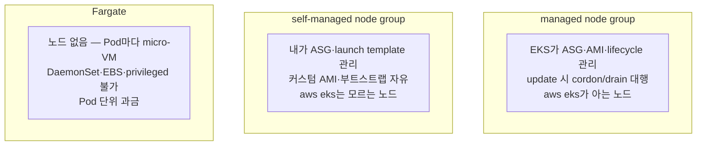

# 5. node group

노드를 띄우는 세 방식 — managed node group · self-managed node group · Fargate — 을 한 클러스터에 두고 무엇이 다른지 확인합니다. 이 편이 끝나면 "이 워크로드는 어떤 컴퓨트에 올릴까"를 관리 책임·제약·비용 기준으로 고를 수 있습니다.

## 핵심 다이어그램



- **managed node group** — EKS가 ASG·EKS-optimized AMI·노드 교체(update 시 cordon/drain)를 대신한다. `aws eks` API로 관리되는 노드. 손이 가장 덜 간다.
- **self-managed node group** — ASG와 launch template을 내가 소유한다. 커스텀 AMI·부트스트랩·특수 설정이 필요할 때. EKS는 이 노드들의 lifecycle을 모른다.
- **Fargate** — 노드 자체가 없다. Pod마다 격리된 micro-VM이 뜬다. 운영 부담이 가장 적지만 제약(DaemonSet·EBS·privileged 불가)이 있고 Pod 단위로 과금된다.

## 사전 준비

- **macOS + Homebrew** — `brew install awscli kubernetes-cli terraform`
- **AWS 프로필 `rosa-lab`** — 리전 `ap-northeast-2`(서울).

## 빠른 시작

`rosa-lab` 클러스터가 이미 있으면 아래에서 `self_managed_node_groups` 블록만 더해 `terraform apply` 한다. 없으면 전체를 만든다.

```bash
mkdir -p /tmp/eks-lab-5 && cd /tmp/eks-lab-5
```

```hcl
# main.tf
terraform {
  required_providers {
    aws = {
      source  = "hashicorp/aws"
      version = "~> 5.0"
    }
  }
}

provider "aws" {
  region  = "ap-northeast-2"
  profile = "rosa-lab"
}

data "aws_availability_zones" "available" {
  state = "available"
}

locals {
  name = "rosa-lab"
  azs  = slice(data.aws_availability_zones.available.names, 0, 2)
  tags = {
    Project = "rosa-hands-on"
    Edition = "eks-5"
  }
}

module "vpc" {
  source  = "terraform-aws-modules/vpc/aws"
  version = "~> 5.0"

  name = "${local.name}-vpc"
  cidr = "10.0.0.0/16"

  azs                     = local.azs
  public_subnets          = ["10.0.1.0/24", "10.0.2.0/24"]
  enable_nat_gateway      = false
  map_public_ip_on_launch = true

  tags = local.tags
}

module "eks" {
  source  = "terraform-aws-modules/eks/aws"
  version = "~> 20.0"

  cluster_name    = local.name
  cluster_version = "1.32"

  cluster_endpoint_public_access           = true
  enable_cluster_creator_admin_permissions = true

  vpc_id     = module.vpc.vpc_id
  subnet_ids = module.vpc.public_subnets

  # ─── managed node group — EKS가 관리 ───
  eks_managed_node_groups = {
    default = {
      instance_types = ["t3.medium"]
      min_size       = 2
      max_size       = 2
      desired_size   = 2
      subnet_ids     = module.vpc.public_subnets
    }
  }

  # ─── self-managed node group — 내가 ASG 소유 ───
  self_managed_node_groups = {
    custom = {
      instance_type = "t3.medium"
      min_size      = 1
      max_size      = 1
      desired_size  = 1
      subnet_ids    = module.vpc.public_subnets
    }
  }

  # ─── Fargate (선택지) — 이 랩에서는 적용하지 않음 ───
  # Fargate Pod은 private 서브넷 + NAT(또는 VPC endpoint)가 있어야 이미지를 받는다.
  # 이 구성은 비용 절감을 위해 public 서브넷·NAT 없음이라 아래를 켜지 않는다.
  # fargate_profiles = {
  #   serverless = {
  #     selectors  = [{ namespace = "serverless" }]
  #     subnet_ids = module.vpc.private_subnets
  #   }
  # }

  tags = local.tags
}
```

```bash
terraform init
terraform apply   # 신규면 약 15분, 재사용이면 self-managed 노드만 수 분
#   Enter a value: yes

aws eks update-kubeconfig --name rosa-lab --region ap-northeast-2 --profile rosa-lab
```

## 여기서 직접 확인할 수 있는 것

### 세 노드가 한 클러스터에 붙어 있다

`kubectl` 에는 managed 2대 + self-managed 1대가 모두 노드로 보인다.

```bash
kubectl get nodes -L eks.amazonaws.com/nodegroup,node.kubernetes.io/instance-type
# NAME                 STATUS   ROLES    VERSION   NODEGROUP   INSTANCE-TYPE
# ip-10-0-1-a...       Ready    <none>   v1.32.x   default     t3.medium   ← managed
# ip-10-0-2-b...       Ready    <none>   v1.32.x   default     t3.medium   ← managed
# ip-10-0-1-c...       Ready    <none>   v1.32.x               t3.medium   ← self-managed(라벨 없음)
```

managed 노드에는 `eks.amazonaws.com/nodegroup` 라벨이 붙지만, self-managed 노드에는 없다. 클러스터에 조인해 워크로드를 받는다는 점은 같다.

### EKS는 managed만 안다

`kubectl` 에는 셋 다 보였지만, EKS API에 물으면 managed node group만 나온다.

```bash
aws eks list-nodegroups --cluster-name rosa-lab \
  --region ap-northeast-2 --profile rosa-lab
# {
#   "nodegroups": [ "default" ]
# }
```

self-managed(`custom`)는 목록에 없다. EKS 입장에서 그것은 그냥 내 ASG일 뿐이다. 이 차이가 "누가 노드를 책임지느냐"의 경계다.

```bash
# managed 노드 그룹의 상세 — AMI 타입·update 설정을 EKS가 들고 있다
aws eks describe-nodegroup --cluster-name rosa-lab --nodegroup-name default \
  --region ap-northeast-2 --profile rosa-lab \
  --query 'nodegroup.{amiType:amiType,status:status,version:version}'
# { "amiType": "AL2023_x86_64_STANDARD", "status": "ACTIVE", "version": "1.32" }
```

### 장애 실험 — 관리 표면의 차이

managed node group은 EKS API로 스케일을 바꿀 수 있다.

```bash
aws eks update-nodegroup-config --cluster-name rosa-lab --nodegroup-name default \
  --scaling-config minSize=2,maxSize=3,desiredSize=3 \
  --region ap-northeast-2 --profile rosa-lab
# (업데이트 시작 — 잠시 뒤 managed 노드가 3대로)
```

같은 명령을 self-managed에 쓰면 EKS가 그 그룹을 모른다.

```bash
aws eks update-nodegroup-config --cluster-name rosa-lab --nodegroup-name custom \
  --scaling-config desiredSize=2 \
  --region ap-northeast-2 --profile rosa-lab
# An error occurred (ResourceNotFoundException) ...
#   → EKS는 self-managed를 모른다. 스케일은 ASG를 직접 바꿔야 한다.
```

self-managed 노드 수를 바꾸려면 EKS가 아니라 그 ASG의 desired를 직접 조정한다.

```bash
ASG=$(aws autoscaling describe-auto-scaling-groups \
  --query "AutoScalingGroups[?contains(AutoScalingGroupName, 'custom')].AutoScalingGroupName | [0]" \
  --output text --region ap-northeast-2 --profile rosa-lab)

aws autoscaling set-desired-capacity --auto-scaling-group-name "$ASG" \
  --desired-capacity 1 --region ap-northeast-2 --profile rosa-lab
```

두 명령의 갈림이 곧 책임의 갈림이다 — managed는 EKS가 창구를 열어 주고, self-managed는 내가 EC2·ASG를 직접 다룬다.

> 실습으로 managed를 3대로 늘렸다면 Terraform state와 벌어진다. `terraform apply` 로 다시 desired=2에 맞추거나, 코드의 `desired_size` 를 3으로 올려 정렬한다.

### Fargate — 노드 없는 선택지

Fargate는 노드를 만들지 않는다. Fargate profile(namespace·label 셀렉터)에 걸리는 Pod은 EKS가 그때그때 micro-VM을 띄워 실행하고, 그 micro-VM이 `kubectl get nodes` 에 `fargate-...` 라는 가상 노드로 잠깐 나타난다. 노드 대수·패치·스케일을 신경 쓸 일이 없다.

대신 제약이 뚜렷하다.

| 제약 | 이유 |
|---|---|
| DaemonSet 불가 | Pod마다 독립 VM이라 "노드마다 하나" 개념이 없다 |
| EBS 볼륨 불가 | 블록 스토리지 대신 EFS(공유 파일)만 |
| privileged·HostNetwork·HostPort 불가 | 노드를 공유하지 않는 격리 모델 |
| private 서브넷 필요 | Fargate Pod은 공인 IP를 못 받아 NAT/VPC endpoint로 이미지를 받는다 |
| vCPU/메모리 조합으로 반올림 | 요청량이 정해진 조합으로 올림돼 과금 |

이 랩은 비용 절감을 위해 public 서브넷·NAT 없이 구성했으므로 Fargate profile을 켜지 않았다. 적용하려면 위 `main.tf` 의 주석 처리된 `fargate_profiles` 블록과 private 서브넷·NAT가 필요하다.

### 셋 중 무엇을 고르나

| | managed node group | self-managed | Fargate |
|---|---|---|---|
| ASG·AMI·lifecycle | EKS | 나 | 없음(EKS가 Pod별 VM) |
| 커스텀 AMI·부트스트랩 | 제한적 | 자유 | 불가 |
| DaemonSet·EBS·privileged | 가능 | 가능 | 불가 |
| 운영 부담 | 낮음 | 높음 | 가장 낮음 |
| 과금 단위 | EC2(노드) | EC2(노드) | Pod(vCPU·메모리) |
| 적합 | 대부분의 워크로드 | 특수 AMI·GPU 드라이버·세밀한 제어 | 드문드문·격리 필요·저운영 |

기본은 managed node group이다. self-managed는 managed로 안 되는 특수 요구가 있을 때, Fargate는 노드 운영을 아예 없애고 싶고 제약을 받아들일 수 있을 때 고른다.

### 비용 영향

- **control plane** — 약 $0.10/h.
- **managed 노드** — `t3.medium` 2대 ≈ $0.10/h.
- **self-managed 노드** — `t3.medium` 1대 ≈ $0.05/h(이 편에서 추가됨).
- **Fargate** — 켜지 않았으므로 과금 없음. 켜면 실행된 Pod의 vCPU·메모리 시간만큼.
- 이 편 구성 합계 대략 **$0.25/h**. self-managed 실험이 끝나면 그 그룹부터 지워 비용을 줄인다.

### 제거 방법

self-managed 그룹만 물리려면 `self_managed_node_groups` 블록을 지우고 `terraform apply` 한다. 전체를 끝내려면 destroy 한다.

```bash
cd /tmp/eks-lab-5
terraform destroy
#   Enter a value: yes
```

```bash
kubectl config delete-context "$(kubectl config current-context)" 2>/dev/null || true

aws eks list-clusters --region ap-northeast-2 --profile rosa-lab
# { "clusters": [] }
```

### 실습 폴더 정리

```bash
cd ..
rm -rf /tmp/eks-lab-5
```
