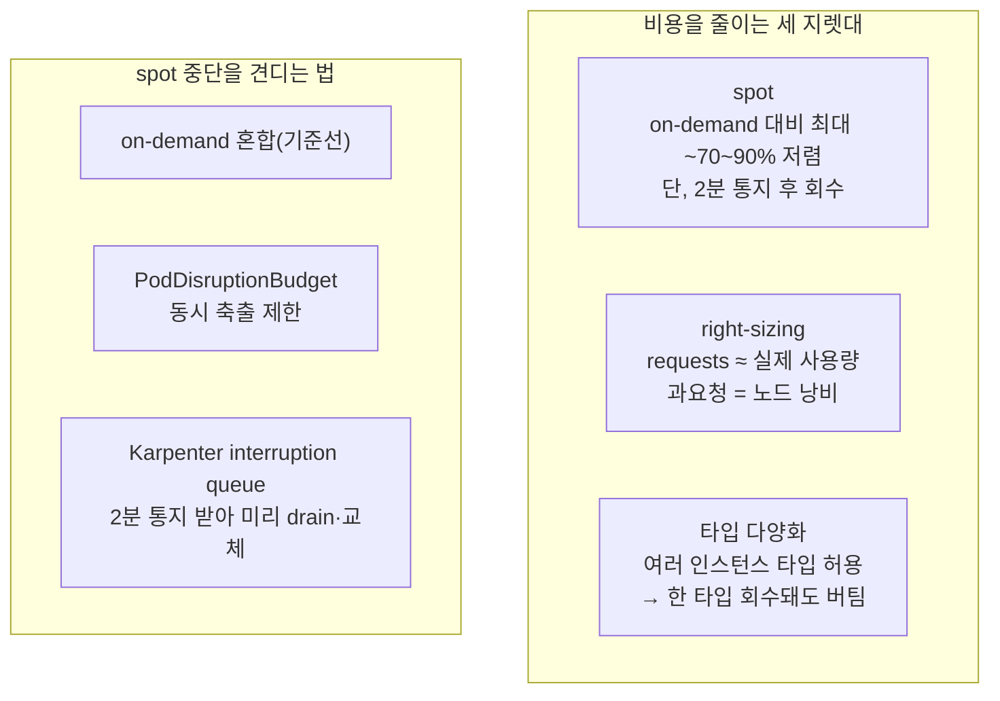

# 7. 인스턴스 전략

같은 워크로드를 더 싸게 운영하는 세 지렛대 — spot · 인스턴스 타입 다양화 · right-sizing — 을 Karpenter로 재현하고, spot 중단(interruption)을 PDB로 견디는 것을 확인합니다. 이 편이 끝나면 "이 워크로드를 어떤 인스턴스로 얼마에 올릴지"를 근거를 갖고 정할 수 있습니다.

## 핵심 다이어그램



- **spot** — 남는 EC2 용량을 크게 할인해 쓴다. 대신 AWS가 용량을 회수할 때 **2분 통지** 후 노드가 사라진다.
- **타입 다양화** — 한 인스턴스 타입만 쓰면 그 타입의 spot이 마르면 다 흔들린다. 여러 타입을 허용하면 Karpenter가 그중 가용한 것을 고른다.
- **on-demand 혼합** — 죽으면 안 되는 기준선은 on-demand로, 여유분은 spot으로.
- **PodDisruptionBudget(PDB)** — 노드가 빠질 때 한 번에 몇 개까지 Pod을 내릴지 제한해 서비스가 통째로 끊기지 않게 한다.
- **right-sizing** — Pod의 requests를 실제 사용량에 맞춘다. 과하게 요청하면 Karpenter가 그만큼 큰/많은 노드를 띄워 돈이 샌다.

## 사전 준비

- **macOS + Homebrew** — `brew install awscli kubernetes-cli terraform helm`
- **AWS 프로필 `rosa-lab`** — 리전 `ap-northeast-2`(서울).

## 빠른 시작

Karpenter가 spot·타입 선택을 실제로 하도록 세운다. Karpenter controller는 작은 managed node group에 두고, 워크로드용 노드는 Karpenter가 spot으로 띄운다.

```bash
mkdir -p /tmp/eks-lab-7 && cd /tmp/eks-lab-7
```

```hcl
# main.tf
terraform {
  required_providers {
    aws = {
      source  = "hashicorp/aws"
      version = "~> 5.0"
    }
  }
}

provider "aws" {
  region  = "ap-northeast-2"
  profile = "rosa-lab"
}

data "aws_availability_zones" "available" {
  state = "available"
}

locals {
  name = "rosa-lab"
  azs  = slice(data.aws_availability_zones.available.names, 0, 2)
  tags = {
    Project = "rosa-hands-on"
    Edition = "eks-7"
  }
}

module "vpc" {
  source  = "terraform-aws-modules/vpc/aws"
  version = "~> 5.0"

  name = "${local.name}-vpc"
  cidr = "10.0.0.0/16"

  azs                     = local.azs
  public_subnets          = ["10.0.1.0/24", "10.0.2.0/24"]
  enable_nat_gateway      = false
  map_public_ip_on_launch = true

  public_subnet_tags = {
    "karpenter.sh/discovery" = local.name
  }

  tags = local.tags
}

module "eks" {
  source  = "terraform-aws-modules/eks/aws"
  version = "~> 20.0"

  cluster_name    = local.name
  cluster_version = "1.32"

  cluster_endpoint_public_access           = true
  enable_cluster_creator_admin_permissions = true

  vpc_id     = module.vpc.vpc_id
  subnet_ids = module.vpc.public_subnets

  node_security_group_tags = {
    "karpenter.sh/discovery" = local.name
  }

  eks_managed_node_groups = {
    system = {
      instance_types = ["t3.medium"]
      min_size       = 2
      max_size       = 2
      desired_size   = 2
      subnet_ids     = module.vpc.public_subnets
    }
  }

  tags = local.tags
}

module "karpenter" {
  source  = "terraform-aws-modules/eks/aws//modules/karpenter"
  version = "~> 20.0"

  cluster_name = module.eks.cluster_name

  enable_pod_identity             = true
  create_pod_identity_association = true

  node_iam_role_additional_policies = {
    AmazonSSMManagedInstanceCore = "arn:aws:iam::aws:policy/AmazonSSMManagedInstanceCore"
  }

  tags = local.tags
}

output "karpenter_queue_name" {
  value = module.karpenter.queue_name
}

output "karpenter_node_role_name" {
  value = module.karpenter.node_iam_role_name
}
```

```bash
terraform init
terraform apply   # 약 15분
#   Enter a value: yes

aws eks update-kubeconfig --name rosa-lab --region ap-northeast-2 --profile rosa-lab

# Karpenter 설치
QUEUE=$(terraform output -raw karpenter_queue_name)
helm upgrade --install karpenter oci://public.ecr.aws/karpenter/karpenter \
  --version "1.3.3" --namespace kube-system \
  --set "settings.clusterName=rosa-lab" \
  --set "settings.interruptionQueue=${QUEUE}" --wait
```

### spot 우선 · 타입 다양화 NodePool

```bash
NODE_ROLE=$(terraform output -raw karpenter_node_role_name)

cat <<EOF | kubectl apply -f -
apiVersion: karpenter.sh/v1
kind: NodePool
metadata:
  name: default
spec:
  template:
    spec:
      requirements:
        - key: kubernetes.io/arch
          operator: In
          values: ["amd64"]
        # spot과 on-demand를 모두 허용 → Karpenter가 더 싼 spot을 우선
        - key: karpenter.sh/capacity-type
          operator: In
          values: ["spot", "on-demand"]
        # 여러 타입을 허용 → 한 타입 spot이 말라도 다른 타입으로
        - key: node.kubernetes.io/instance-type
          operator: In
          values: ["t3.medium", "t3.large", "t3a.medium", "t3a.large", "t2.medium"]
      nodeClassRef:
        group: karpenter.k8s.aws
        kind: EC2NodeClass
        name: default
  disruption:
    consolidationPolicy: WhenEmptyOrUnderutilized
    consolidateAfter: 30s
  limits:
    cpu: "20"
---
apiVersion: karpenter.k8s.aws/v1
kind: EC2NodeClass
metadata:
  name: default
spec:
  amiSelectorTerms:
    - alias: al2023@latest
  role: ${NODE_ROLE}
  subnetSelectorTerms:
    - tags:
        karpenter.sh/discovery: rosa-lab
  securityGroupSelectorTerms:
    - tags:
        karpenter.sh/discovery: rosa-lab
EOF
```

## 여기서 직접 확인할 수 있는 것

### Karpenter는 더 싼 spot을 고른다

워크로드를 띄운다.

```bash
kubectl create deployment web --image=public.ecr.aws/nginx/nginx:latest --replicas=6
kubectl set resources deployment web --requests=cpu=500m,memory=256Mi
```

Karpenter가 띄운 노드의 capacity-type을 본다.

```bash
kubectl get nodes -L karpenter.sh/capacity-type,node.kubernetes.io/instance-type \
  -l karpenter.sh/nodepool
# NAME            CAPACITY-TYPE   INSTANCE-TYPE
# ip-10-0-...     spot            t3a.large      ← 다양화한 타입 중 spot을 골랐다
```

spot과 on-demand를 모두 허용했으므로 Karpenter는 가격·용량을 보고 더 싼 spot을 우선 선택한다. 같은 워크로드가 on-demand보다 크게 싸게 올라간다.

### right-sizing — requests가 노드 비용을 정한다

Karpenter는 실제 사용량이 아니라 **requests**를 보고 노드를 띄운다. requests를 부풀리면 그만큼 더 많은/큰 노드가 필요해진다.

```bash
# 과요청: cpu를 실제보다 크게 잡는다
kubectl set resources deployment web --requests=cpu=2,memory=256Mi
kubectl get nodes -l karpenter.sh/nodepool
# 노드 수/크기가 늘어난다 (6 × cpu2 = 12 vCPU 필요)
```

실제 사용량은 그보다 훨씬 작다는 걸 metrics-server로 확인한다.

```bash
kubectl apply -f https://github.com/kubernetes-sigs/metrics-server/releases/latest/download/components.yaml
kubectl -n kube-system rollout status deploy/metrics-server

kubectl top pods -l app=web
# 각 Pod의 실제 CPU는 수 m 수준 — cpu=2 요청은 크게 과함
```

requests를 실사용에 맞추면 Karpenter가 노드를 거둔다.

```bash
kubectl set resources deployment web --requests=cpu=200m,memory=256Mi
kubectl get nodes -l karpenter.sh/nodepool -w
# consolidation으로 노드가 줄어든다
```

right-sizing은 코드 한 줄(requests)로 노드 청구서를 바꾼다. 과요청은 아무도 안 쓰는 용량에 돈을 내는 것과 같다.

### spot 중단을 견디는 장치

spot 노드는 2분 통지 후 사라질 수 있다. 세 장치가 이를 견딘다.

- **타입 다양화** — 위 NodePool처럼 여러 타입을 허용하면 특정 타입 spot이 회수돼도 Karpenter가 다른 타입으로 대체한다.
- **Karpenter interruption queue** — 설치 때 준 `settings.interruptionQueue` 로 Karpenter가 2분 통지를 SQS로 받아, 회수 전에 그 노드를 미리 cordon·drain하고 대체 노드를 띄운다.

```bash
# interruption을 받는 큐가 존재한다
aws sqs get-queue-url --queue-name "$(terraform output -raw karpenter_queue_name)" \
  --region ap-northeast-2 --profile rosa-lab
# { "QueueUrl": "https://sqs...." }
```

- **PodDisruptionBudget** — 노드가 빠질 때 한 번에 내려갈 수 있는 Pod 수를 제한한다.

```bash
kubectl create pdb web-pdb --selector=app=web --min-available=5
kubectl get pdb web-pdb
# MIN AVAILABLE   ALLOWED DISRUPTIONS
# 5               1        ← 6개 중 항상 5개는 유지, 한 번에 1개만 축출 허용
```

### 장애 실험 — PDB가 축출을 막아 선다

PDB를 "한 개도 못 내림"으로 조여 노드 drain을 시도하면 막힌다. 이것이 spot 회수·consolidation 같은 자발적 축출(voluntary disruption)에 PDB가 개입하는 지점이다.

```bash
kubectl delete pdb web-pdb
kubectl create pdb web-pdb --selector=app=web --max-unavailable=0   # 아무것도 못 내림

# web Pod이 있는 노드를 하나 골라 drain 시도
NODE=$(kubectl get pods -l app=web -o jsonpath='{.items[0].spec.nodeName}')
kubectl drain "$NODE" --ignore-daemonsets --delete-emptydir-data --timeout=30s
# error when evicting pod ... "Cannot evict pod as it would violate the pod's disruption budget."
#   → PDB가 축출을 거부해 drain이 막힌다
```

너무 조인 PDB는 노드 교체 자체를 막아, spot 회수 때 오히려 위험하다(2분 안에 못 옮기면 강제로 끊긴다). 현실적인 값으로 되돌린다.

```bash
kubectl delete pdb web-pdb
kubectl create pdb web-pdb --selector=app=web --max-unavailable=1
kubectl uncordon "$NODE"
```

적절한 PDB는 "한 번에 하나씩 안전하게 교체"를 보장하고, 과한 PDB는 교체를 막는다. 그 사이를 맞추는 게 spot 운영의 핵심이다.

### on-demand와 spot — 무엇에 무엇을

| | on-demand | spot |
|---|---|---|
| 가격 | 정가 | 최대 ~70~90% 저렴(변동) |
| 회수 | 없음 | 2분 통지 후 가능 |
| 적합 | 상태 있는·끊기면 안 되는 기준선 | 무상태·복제된·중단 견디는 워크로드 |
| 견디는 법 | — | 타입 다양화 + on-demand 혼합 + PDB + Karpenter drain |

실무 조합: 죽으면 안 되는 최소량은 on-demand로 깔고, 나머지 확장분은 spot으로. Karpenter NodePool에 둘을 함께 허용하면 이 혼합이 자동으로 이뤄진다.

### 비용 영향

- **control plane** — 약 $0.10/h.
- **system 노드** — `t3.medium` 2대 ≈ $0.10/h.
- **Karpenter가 띄운 노드** — spot이면 같은 크기를 on-demand의 일부 가격에 쓴다. right-sizing·consolidation으로 유휴 시 0으로 수렴.
- 이 편의 절감 요지: **spot + 타입 다양화 + right-sizing**이 컴퓨트 청구서의 대부분을 좌우한다.

### 제거 방법

```bash
kubectl delete deployment web
kubectl delete pdb web-pdb 2>/dev/null || true
kubectl delete nodepool default
kubectl delete ec2nodeclass default
kubectl get nodes -l karpenter.sh/nodepool
# No resources found

helm uninstall karpenter -n kube-system

cd /tmp/eks-lab-7
terraform destroy
#   Enter a value: yes
```

```bash
kubectl config delete-context "$(kubectl config current-context)" 2>/dev/null || true

aws eks list-clusters --region ap-northeast-2 --profile rosa-lab
# { "clusters": [] }
```

### 실습 폴더 정리

```bash
cd ..
rm -rf /tmp/eks-lab-7
```
