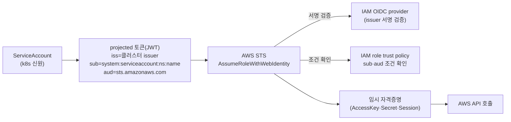

# 8. IAM ↔ Kubernetes 연결

Pod이 하드코딩된 키 없이 AWS API를 호출할 수 있는 이유 — ServiceAccount 토큰이 STS를 거쳐 AWS 임시 자격증명이 되는 경로 — 를 토큰 발급·디코드·STS 호출까지 손으로 확인합니다. 이 편이 끝나면 IAM → STS → OIDC → ServiceAccount 페더레이션을 처음부터 끝까지 설명할 수 있습니다.

## 핵심 다이어그램



- **ServiceAccount** — Pod의 k8s 신원. 이 신원으로 서명된 짧은 수명의 토큰(JWT)을 발급받을 수 있다.
- **projected 토큰** — 클러스터가 서명한 JWT. `iss`(issuer), `sub`(어느 ServiceAccount인지), `aud`(누구에게 쓸 토큰인지=`sts.amazonaws.com`)를 담는다.
- **IAM OIDC provider** — 클러스터의 issuer를 IAM에 등록해 둔 것. STS가 토큰 서명을 이 provider로 검증한다.
- **IAM role trust policy** — "이 issuer가 발급한, 이 `sub`·`aud` 를 가진 토큰만 이 role을 assume할 수 있다"는 조건.
- **STS AssumeRoleWithWebIdentity** — 토큰을 받아 서명·조건을 확인하고 임시 자격증명을 돌려준다. 이 호출은 기존 AWS 키가 없어도 된다 — 토큰 자체가 열쇠다.

## 사전 준비

- **macOS + Homebrew** — `brew install awscli kubernetes-cli terraform jq`
- **AWS 프로필 `rosa-lab`** — 리전 `ap-northeast-2`(서울).

## 빠른 시작

`rosa-lab` 클러스터가 이미 있으면 아래에서 `s3_reader` 관련 블록만 더해 `terraform apply` 한다. 없으면 전체를 만든다. EKS 모듈은 기본으로 IAM OIDC provider를 만든다.

```bash
mkdir -p /tmp/eks-lab-8 && cd /tmp/eks-lab-8
```

```hcl
# main.tf
terraform {
  required_providers {
    aws = {
      source  = "hashicorp/aws"
      version = "~> 5.0"
    }
  }
}

provider "aws" {
  region  = "ap-northeast-2"
  profile = "rosa-lab"
}

data "aws_availability_zones" "available" {
  state = "available"
}

locals {
  name = "rosa-lab"
  azs  = slice(data.aws_availability_zones.available.names, 0, 2)
  tags = {
    Project = "rosa-hands-on"
    Edition = "eks-8"
  }
}

module "vpc" {
  source  = "terraform-aws-modules/vpc/aws"
  version = "~> 5.0"

  name = "${local.name}-vpc"
  cidr = "10.0.0.0/16"

  azs                     = local.azs
  public_subnets          = ["10.0.1.0/24", "10.0.2.0/24"]
  enable_nat_gateway      = false
  map_public_ip_on_launch = true

  tags = local.tags
}

module "eks" {
  source  = "terraform-aws-modules/eks/aws"
  version = "~> 20.0"

  cluster_name    = local.name
  cluster_version = "1.32"

  cluster_endpoint_public_access           = true
  enable_cluster_creator_admin_permissions = true

  vpc_id     = module.vpc.vpc_id
  subnet_ids = module.vpc.public_subnets

  eks_managed_node_groups = {
    default = {
      instance_types = ["t3.medium"]
      min_size       = 2
      max_size       = 2
      desired_size   = 2
      subnet_ids     = module.vpc.public_subnets
    }
  }

  tags = local.tags
}

# ─── 특정 ServiceAccount만 assume할 수 있는 IAM role ───
data "aws_iam_policy_document" "s3_reader_trust" {
  statement {
    effect  = "Allow"
    actions = ["sts:AssumeRoleWithWebIdentity"]

    principals {
      type        = "Federated"
      identifiers = [module.eks.oidc_provider_arn]
    }

    # 토큰의 aud가 sts.amazonaws.com 이어야 함
    condition {
      test     = "StringEquals"
      variable = "${module.eks.oidc_provider}:aud"
      values   = ["sts.amazonaws.com"]
    }

    # 토큰의 sub가 default 네임스페이스의 s3-reader SA 여야 함
    condition {
      test     = "StringEquals"
      variable = "${module.eks.oidc_provider}:sub"
      values   = ["system:serviceaccount:default:s3-reader"]
    }
  }
}

resource "aws_iam_role" "s3_reader" {
  name               = "${local.name}-s3-reader"
  assume_role_policy = data.aws_iam_policy_document.s3_reader_trust.json
  tags               = local.tags
}

resource "aws_iam_role_policy_attachment" "s3_reader" {
  role       = aws_iam_role.s3_reader.name
  policy_arn = "arn:aws:iam::aws:policy/AmazonS3ReadOnlyAccess"
}

output "s3_reader_role_arn" {
  value = aws_iam_role.s3_reader.arn
}

output "oidc_provider" {
  value = module.eks.oidc_provider
}
```

```bash
terraform init
terraform apply   # 신규면 약 15분, 재사용이면 IAM role만 수 초
#   Enter a value: yes

aws eks update-kubeconfig --name rosa-lab --region ap-northeast-2 --profile rosa-lab
```

## 여기서 직접 확인할 수 있는 것

### 클러스터 issuer와 IAM OIDC provider가 짝을 이룬다

클러스터가 토큰에 새기는 issuer와, IAM에 등록돼 그 서명을 검증할 provider가 같은 것을 가리킨다.

```bash
# 클러스터 issuer
aws eks describe-cluster --name rosa-lab --region ap-northeast-2 --profile rosa-lab \
  --query 'cluster.identity.oidc.issuer' --output text
# https://oidc.eks.ap-northeast-2.amazonaws.com/id/XXXX

# IAM에 등록된 OIDC provider
aws iam list-open-id-connect-providers --profile rosa-lab \
  --query 'OpenIDConnectProviderList[].Arn'
# [ "arn:aws:iam::...:oidc-provider/oidc.eks.ap-northeast-2.amazonaws.com/id/XXXX" ]
```

이 등록이 있어야 STS가 클러스터가 서명한 토큰을 믿는다.

### ServiceAccount 토큰을 발급해 안을 들여다본다

ServiceAccount를 만들고, `aud=sts.amazonaws.com` 으로 짧은 토큰을 발급한다.

```bash
kubectl create serviceaccount s3-reader

TOKEN=$(kubectl create token s3-reader --audience sts.amazonaws.com --duration 3600s)
```

JWT의 payload(가운데 조각)를 디코드한다.

```bash
echo "$TOKEN" | cut -d. -f2 | python3 -c \
  'import sys,base64,json; s=sys.stdin.read().strip(); s+="="*(-len(s)%4); print(json.dumps(json.loads(base64.urlsafe_b64decode(s)), indent=2))'
# {
#   "aud": ["sts.amazonaws.com"],
#   "iss": "https://oidc.eks.ap-northeast-2.amazonaws.com/id/XXXX",
#   "sub": "system:serviceaccount:default:s3-reader",
#   "exp": ...
# }
```

`iss` 는 클러스터 issuer, `sub` 는 이 토큰이 어느 ServiceAccount의 것인지, `aud` 는 STS를 향한 토큰임을 말한다. IAM role의 trust policy가 확인하는 값이 바로 이 셋이다.

### 토큰만으로 AWS 임시 자격증명을 받는다

이 토큰을 STS에 내밀면 role을 assume할 수 있다. 기존 AWS 키 없이, 토큰만으로.

```bash
ROLE_ARN=$(terraform output -raw s3_reader_role_arn)

aws sts assume-role-with-web-identity \
  --role-arn "$ROLE_ARN" \
  --role-session-name demo \
  --web-identity-token "$TOKEN" \
  --region ap-northeast-2 \
  --query 'Credentials.{AccessKeyId:AccessKeyId,Expiration:Expiration}'
# {
#   "AccessKeyId": "ASIA...",
#   "Expiration": "..."
# }
```

STS는 토큰 서명을 OIDC provider로 검증하고, trust policy의 `sub`·`aud` 조건을 확인한 뒤 임시 자격증명을 돌려줬다. 이 한 번의 호출이 페더레이션의 핵심이다.

### 그 자격증명이 실제 S3 권한을 지닌다

받은 임시 자격증명으로 S3를 읽어 본다.

```bash
CREDS=$(aws sts assume-role-with-web-identity \
  --role-arn "$ROLE_ARN" --role-session-name demo \
  --web-identity-token "$TOKEN" --region ap-northeast-2 \
  --query Credentials --output json)

AWS_ACCESS_KEY_ID=$(echo "$CREDS" | jq -r .AccessKeyId) \
AWS_SECRET_ACCESS_KEY=$(echo "$CREDS" | jq -r .SecretAccessKey) \
AWS_SESSION_TOKEN=$(echo "$CREDS" | jq -r .SessionToken) \
aws s3 ls --region ap-northeast-2
# (계정의 S3 버킷 목록 — 임시 자격이 AmazonS3ReadOnlyAccess를 지녔음)
```

role에 붙인 `AmazonS3ReadOnlyAccess` 가 그대로 이 세션의 권한이 된다. Pod은 이 과정을 SDK가 자동으로 하며, 키를 저장하지 않는다.

### 장애 실험 — trust policy 조건이 신원을 강제한다

trust policy는 `sub` 가 `system:serviceaccount:default:s3-reader` 인 토큰만 허용한다. 다른 ServiceAccount의 토큰으로 시도하면 STS가 거부한다.

```bash
kubectl create serviceaccount other
BAD_TOKEN=$(kubectl create token other --audience sts.amazonaws.com)

aws sts assume-role-with-web-identity \
  --role-arn "$ROLE_ARN" --role-session-name x \
  --web-identity-token "$BAD_TOKEN" --region ap-northeast-2
# An error occurred (AccessDenied) ... Not authorized to perform sts:AssumeRoleWithWebIdentity
#   → sub 조건(s3-reader)과 안 맞아 거부
```

`aud` 가 다른 토큰도 마찬가지로 막힌다.

```bash
WRONG_AUD=$(kubectl create token s3-reader --audience wrong.example.com)

aws sts assume-role-with-web-identity \
  --role-arn "$ROLE_ARN" --role-session-name x \
  --web-identity-token "$WRONG_AUD" --region ap-northeast-2
# AccessDenied — aud 조건(sts.amazonaws.com)과 불일치
```

이 두 거부가 페더레이션의 안전장치다 — 아무 ServiceAccount나 AWS 권한을 얻는 게 아니라, trust policy에 이름이 박힌 신원만 얻는다. 어떤 role을 어떤 SA에 열지가 곧 최소 권한의 경계다.

### 비용 영향

- **control plane** — 약 $0.10/h.
- **노드** — `t3.medium` 2대 ≈ $0.10/h.
- **IAM role · OIDC provider · S3 읽기** — 과금되지 않는다.
- 도는 클러스터 합계 대략 **$0.20/h**.

### 제거 방법

IAM role·SA만 물리려면 `s3_reader` 블록을 지우고 `terraform apply` 한 뒤 SA를 지운다. 전체를 끝내려면 destroy 한다.

```bash
kubectl delete serviceaccount s3-reader other 2>/dev/null || true

cd /tmp/eks-lab-8
terraform destroy
#   Enter a value: yes
```

```bash
kubectl config delete-context "$(kubectl config current-context)" 2>/dev/null || true

aws eks list-clusters --region ap-northeast-2 --profile rosa-lab
# { "clusters": [] }
```

### 실습 폴더 정리

```bash
cd ..
rm -rf /tmp/eks-lab-8
```
