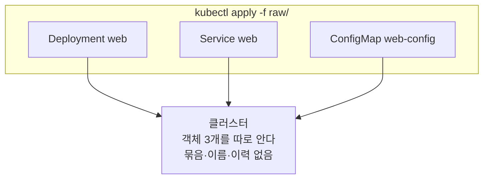
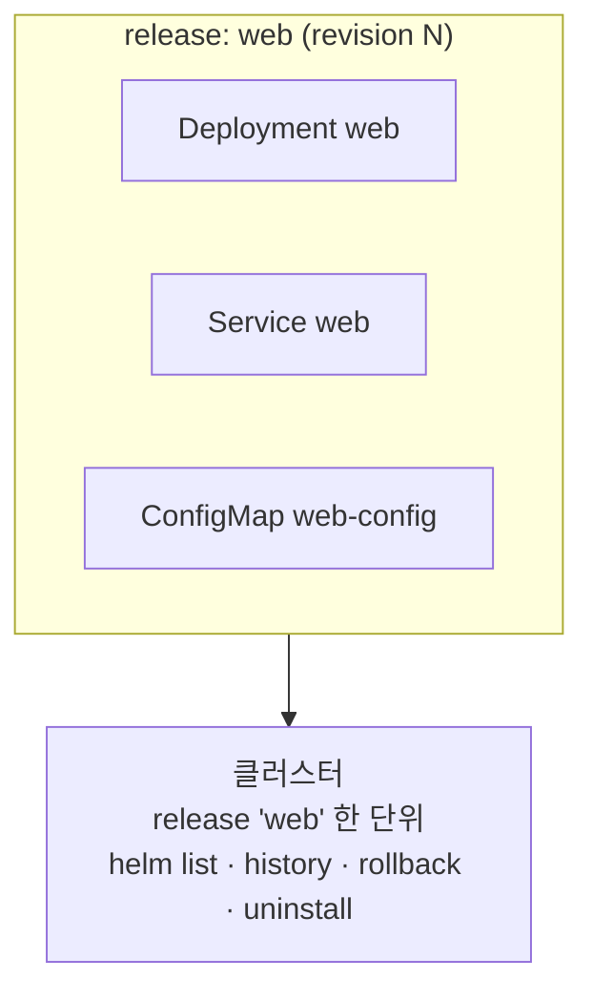

# 1. 왜 Helm인가 — release라는 단위

`kubectl apply -f`는 매니페스트를 클러스터에 밀어 넣습니다. 객체 하나하나는 정확히 반영되지만, "이 셋이 한 앱이다"라는 사실은 어디에도 남지 않습니다. 그래서 앱 구성에서 객체를 하나 빼도 이전에 만든 객체는 클러스터에 그대로 남고(orphan), "방금 뭘 깔았지"를 물어볼 목록도, "이전 상태로 되돌려라"를 실행할 이력도 없습니다. Helm은 매니페스트 묶음을 **release**라는 한 단위로 다룹니다 — 이름이 붙고, revision이 매겨지고, 설치·업그레이드·롤백·삭제가 그 단위로 일어납니다. 이 편은 같은 앱(Deployment·Service·ConfigMap)을 `kubectl apply -f`로 한 번, `helm install`로 한 번 배포해 라이프사이클의 차이를 손으로 확인합니다. 산출물은 "두 방식의 라이프사이클 차이를 직접 본 재현 가능한 기록"과 "release가 왜 한 단위인가에 대한 한 줄 정의"입니다. release가 클러스터 어디에, 어떤 형태로 저장되기에 rollback이 가능한지는 4편에서 풉니다.

## 핵심 다이어그램





- **`apply`는 객체 단위로 일한다.** 세 객체를 한 번에 보내도 클러스터는 각각을 따로 기억합니다. "이 셋이 한 앱"이라는 끈이 없으니, 무엇을 함께 깔았는지는 라벨로 직접 찾아야 합니다.
- **`helm`은 release 단위로 일한다.** `helm install web`은 같은 세 객체를 `web`이라는 release로 묶습니다. 이름·revision·상태가 release에 붙고, `helm list`로 "뭐가 깔렸는지"를 묻습니다.
- **단위가 있으면 set의 차이를 계산할 수 있다.** chart에서 객체를 빼고 `helm upgrade`하면, helm은 이전 release의 객체 집합과 비교해 더 이상 없는 객체를 정리합니다. `apply`에는 비교할 "이전 집합"이 없습니다.
- **단위가 있으면 이력이 있다.** 각 변경은 revision으로 쌓이고, `helm rollback`은 지정한 revision의 객체 집합을 다시 적용합니다. `apply`에는 되돌릴 이력 자체가 없습니다.

아래 시연이 이 차이를 한 줄씩 손으로 확인합니다.

## 사전 준비물

이 실습은 **macOS** 환경을 기준으로 합니다.

- **Docker** — Docker Desktop, OrbStack 등. `docker ps`가 에러 없이 돌아가면 OK.
- **Homebrew** — macOS 패키지 관리자.

### kind · kubectl 설치

```bash
brew install kind kubectl
```

### Helm v3 설치

이 시리즈는 **Helm v3** 기준입니다. Homebrew가 v4를 설치한다면, 아래로 v3 바이너리를 받습니다 (Intel Mac은 `arm64`를 `amd64`로 바꿉니다).

```bash
brew install helm
helm version --short      # v3.x.x 인지 확인

# v4가 깔렸다면 v3로 교체
curl -fsSL https://get.helm.sh/helm-v3.21.2-darwin-arm64.tar.gz -o /tmp/helm3.tgz
tar -xzf /tmp/helm3.tgz -C /tmp
sudo mv /tmp/darwin-arm64/helm /usr/local/bin/helm
helm version --short      # v3.21.2
```

### rosa-lab 클러스터 · namespace 준비

```bash
kind create cluster --name rosa-lab
kubectl create namespace rosa-lab
kubectl config set-context --current --namespace=rosa-lab
```

이미 있으면 건너뜁니다 (`kind get clusters`, `kubectl config get-contexts`로 확인).

## 실습 환경

| 파일 | 내용 |
|---|---|
| `manifests/raw/` | `kubectl apply -f` 대상 — Deployment·Service·ConfigMap 원본 |
| `manifests/chart/` | 같은 매니페스트를 release로 묶은 최소 chart (`Chart.yaml` + `templates/`) |

> `manifests/chart/templates/`의 세 파일은 `manifests/raw/`와 글자 그대로 같습니다. 차이는 오직 "어떻게 배포하느냐"뿐이라, 두 방식의 라이프사이클을 같은 매니페스트로 비교할 수 있습니다. chart가 무엇으로 이뤄지는지(`Chart.yaml`·`values.yaml`·`templates/`)는 5편에서 해부합니다. 이 편에서 `Chart.yaml`은 helm이 이 디렉터리를 chart로 인식하게 하는 최소 표식일 뿐입니다.
>
> 세 객체는 일부러 느슨하게 묶었습니다 — Deployment는 ConfigMap을 `optional: true`로 참조하므로, ConfigMap을 빼도 Pod가 깨지지 않습니다. 관심사는 "set을 어떻게 다루느냐"이지 객체 간 배선이 아닙니다.

## 여기서 직접 확인할 수 있는 것

### kubectl apply -f — 묶음이라는 개념이 없다

_전제: `rosa-lab` namespace에 `web` 관련 객체가 없는 상태._ 다시 시작하려면 `kubectl delete deploy,svc,cm -l app=web --ignore-not-found`로 비웁니다.

세 객체를 한 번에 적용합니다.

```bash
kubectl apply -f manifests/raw/
```

```
configmap/web-config created
deployment.apps/web created
service/web created
```

"이 셋이 한 앱"이라는 사실은 어디에도 기록되지 않습니다. 클러스터는 각 객체를 따로 알 뿐이라, 무엇을 함께 깔았는지는 라벨로 직접 찾아야 합니다.

```bash
kubectl get deploy,svc,cm -l app=web
```

```
NAME                  READY   UP-TO-DATE   AVAILABLE   AGE
deployment.apps/web   0/2     2            0           0s

NAME          TYPE        CLUSTER-IP    EXTERNAL-IP   PORT(S)   AGE
service/web   ClusterIP   10.96.95.75   <none>        80/TCP    0s

NAME                   DATA   AGE
configmap/web-config   1      0s
```

이제 앱 구성에서 ConfigMap을 뺐다고 합시다. 새 구성(Deployment·Service만)을 다시 적용합니다.

```bash
kubectl apply -f manifests/raw/deployment.yaml -f manifests/raw/service.yaml
```

```
deployment.apps/web unchanged
service/web unchanged
```

ConfigMap은 어떻게 됐을까요.

```bash
kubectl get cm web-config
```

```
NAME         DATA   AGE
web-config   1      12s
```

**앱에서 뺐는데도 클러스터에는 남습니다.** `apply`는 "지금 보낸 파일"만 보고, "직전에 이 앱이 무엇으로 이뤄졌는지"는 알지 못합니다. 비교할 이전 집합이 없으니, 사라진 객체를 정리할 방법도 없습니다(`--prune` 옵션이 있지만 라벨 기반의 별도 장치이고 기본 동작이 아닙니다). "방금 뭘 깔았지", "이전으로 되돌려라"를 물어볼 명령도 `apply`에는 없습니다.

### helm install — release가 단위다

_전제: `rosa-lab` namespace에 `web` 관련 객체·release가 없는 상태._ `manifests/chart/`는 같은 Deployment·Service·ConfigMap을 담은 최소 chart이고, 차이는 배포 방식뿐입니다. 같은 이름의 객체가 이미 있으면 helm이 소유권 충돌을 내므로 먼저 비우고 설치합니다.

```bash
kubectl delete deploy,svc,cm -l app=web --ignore-not-found
helm install web manifests/chart/
```

```
NAME: web
LAST DEPLOYED: Fri Jun 26 14:39:56 2026
NAMESPACE: rosa-lab
STATUS: deployed
REVISION: 1
TEST SUITE: None
```

같은 세 객체가 `web`이라는 release 하나로 묶였습니다. `STATUS`·`REVISION`이 release에 붙습니다. "뭐가 깔렸지"의 답은 이제 한 줄입니다.

```bash
helm list
```

```
NAME	NAMESPACE	REVISION	UPDATED                             	STATUS  	CHART    	APP VERSION
web 	rosa-lab 	1       	2026-06-26 14:39:56.838061 +0900 KST	deployed	web-0.1.0	1.0.0
```

라벨로 객체를 뒤지지 않아도, release 목록이 "설치된 앱"을 그대로 보여 줍니다.

### helm upgrade — release는 빠진 객체를 정리한다

_전제: `web` release가 ConfigMap을 포함해 설치된 상태(revision 1). 건너뛰었다면 `helm install web manifests/chart/`를 먼저 실행합니다._

`apply`에서는 구성에서 ConfigMap을 빼도 orphan으로 남았습니다. 같은 변경을 Helm에서 재현합니다 — chart에서 ConfigMap 템플릿을 빼고 업그레이드합니다.

```bash
rm manifests/chart/templates/configmap.yaml
helm upgrade web manifests/chart/
```

```
Release "web" has been upgraded. Happy Helming!
NAME: web
LAST DEPLOYED: Fri Jun 26 14:40:06 2026
NAMESPACE: rosa-lab
STATUS: deployed
```

```bash
kubectl get cm web-config
```

```
Error from server (NotFound): configmaps "web-config" not found
```

**`apply`에서는 남았던 ConfigMap이, 여기서는 정리됐습니다.** helm은 revision 1의 객체 집합(세 개)과 새로 렌더한 집합(두 개)을 비교해, 더 이상 없는 ConfigMap을 삭제합니다. "이전 집합"이 release에 있기에 가능한 일입니다.

### helm rollback — release는 이력에서 복원한다

_전제: ConfigMap을 뺀 upgrade까지 마쳐, revision 2가 deployed인 상태(ConfigMap이 정리됨)._

release는 변경마다 revision을 쌓습니다.

```bash
helm history web
```

```
REVISION	UPDATED                 	STATUS    	CHART    	APP VERSION	DESCRIPTION
1       	Fri Jun 26 14:39:56 2026	superseded	web-0.1.0	1.0.0      	Install complete
2       	Fri Jun 26 14:40:06 2026	deployed  	web-0.1.0	1.0.0      	Upgrade complete
```

revision 1은 ConfigMap이 있던 상태입니다. 그리로 되돌립니다.

```bash
helm rollback web 1
```

```
Rollback was a success! Happy Helming!
```

```bash
kubectl get cm web-config
```

```
NAME         DATA   AGE
web-config   1      1s
```

**ConfigMap이 다시 생겼습니다.** 주목할 점은, 방금 `rm`으로 지운 템플릿 파일을 복구하지 않았다는 것입니다 — rollback은 로컬 파일이 아니라 **release에 저장된 revision 1의 매니페스트**에서 복원합니다. 즉 helm은 각 revision의 렌더 결과를 클러스터 어딘가에 들고 있습니다. 어디에, 어떤 형태로 저장하기에 이게 가능한지는 4편에서 봅니다.

### helm uninstall — 묶음을 한 번에

_전제: `web` release가 존재하는 상태(`helm list`에 보임)._

release가 단위이므로, 삭제도 단위입니다.

```bash
helm uninstall web
```

```
release "web" uninstalled
```

```bash
kubectl get deploy,svc,cm -l app=web
```

```
No resources found in rosa-lab namespace.
```

세 객체가 한 번에 사라집니다. `apply`였다면 무엇을 깔았는지 기억해 파일을 모아 `kubectl delete -f` 해야 합니다. release는 그 기억을 대신 들고 있습니다.

### 정리

```bash
# chart 템플릿 원복 (위 upgrade 실험에서 지웠다면)
cp manifests/raw/configmap.yaml manifests/chart/templates/configmap.yaml

# release가 남아 있다면 제거
helm uninstall web --ignore-not-found
```

클러스터까지 정리하려면:

```bash
kind delete cluster --name rosa-lab
```

## 이 편의 산출물

- 같은 앱(Deployment·Service·ConfigMap)을 `kubectl apply -f`와 `helm install`로 각각 배포하고, **객체 집합의 변경·되돌리기·삭제**에서 무엇이 다른지 손으로 확인한 재현 가능한 기록.
- `apply`는 객체 단위라 "이전 집합"이 없어 빠진 객체가 orphan으로 남고, 설치 목록·이력·rollback이 없다는 것을 직접 본 상태.
- `helm`은 매니페스트 묶음을 **release**라는 한 단위로 다루며, `helm list`(설치 목록)·`helm upgrade`(set diff로 정리)·`helm history`·`helm rollback`(이력 복원)·`helm uninstall`(묶음 제거)이 모두 그 단위로 동작함을 확인한 상태.
- `helm rollback`이 로컬 파일이 아니라 **release에 저장된 revision**에서 복원한다는 것을 보고, "release는 클러스터 어딘가에 저장된다"는 사실까지만 확인한 상태 — 저장 위치·형태는 4편.
- release 한 줄 정의: **이름이 붙고 revision이 매겨진 매니페스트 묶음, 설치·업그레이드·롤백·삭제의 단위.**
