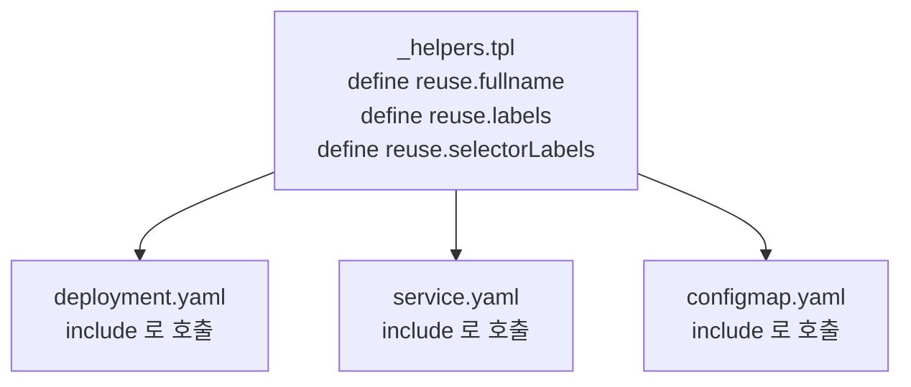
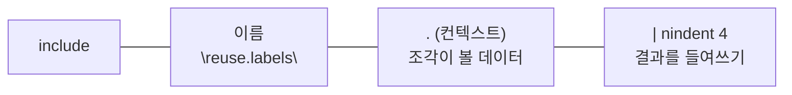

# 10. named template과 _helpers.tpl — 반복 블록을 재사용하기

한 chart 안에서 Deployment·Service·ConfigMap이 같은 라벨 블록과 같은 이름 규칙을 반복합니다. 같은 걸 여러 파일에 베껴 두면, 하나 고칠 때 전부를 찾아 고쳐야 합니다. 그래서 공통 블록을 **한 곳에 정의하고 여러 곳에서 불러** 씁니다. 이 편은 그 도구를 봅니다 — **`define`**(이름 붙은 조각 정의), **`include`**(불러 쓰기, 결과를 파이프로 넘김), **`tpl`**(문자열을 템플릿으로 평가), 그리고 named template이 스코프를 자동 상속하지 않아 **컨텍스트 `.`을 넘겨야 하는** 규칙. 이 조각들을 모으는 관례 파일이 `_helpers.tpl`입니다. 산출물은 재사용 시연 chart `reuse/`와, 한 곳에 정의한 블록이 여러 매니페스트에 똑같이 펼쳐지는 것을 본 기록입니다.

## 핵심 다이어그램





- **define은 조각을 만든다.** `{{ define "name" }}…{{ end }}`. 객체로 펼쳐지지 않고, 불릴 때 그 자리에 끼어듭니다.
- **include는 불러 쓴다.** `{{ include "name" . }}`. include는 결과를 파이프로 넘길 수 있어 `| nindent 4`로 들여쓰기까지 합니다. `template`은 파이프가 안 돼, 실무에서는 include를 씁니다.
- **컨텍스트 `.`을 넘긴다.** named template은 바깥 스코프를 상속하지 않습니다. `include "name" .`의 `.`이 그 조각이 볼 데이터입니다 — 빠뜨리면 조각이 `.Release` 같은 값을 못 봅니다.
- **tpl은 문자열을 템플릿으로 본다.** 값 안에 `{{ }}`가 들어 있으면, `tpl`이 그것을 한 번 더 평가합니다.

아래 시연이 이 동작을 한 줄씩 손으로 확인합니다.

## 사전 준비물

이 실습은 **macOS** 환경을 기준으로 합니다. 이 편은 `helm template`으로 렌더만 하므로 클러스터·namespace는 필요 없습니다.

- **Homebrew** — macOS 패키지 관리자.

### Helm v3 설치

이 시리즈는 **Helm v3** 기준입니다. Homebrew가 v4를 설치한다면, 아래로 v3 바이너리를 받습니다 (Intel Mac은 `arm64`를 `amd64`로 바꿉니다).

```bash
brew install helm
helm version --short      # v3.x.x 인지 확인

# v4가 깔렸다면 v3로 교체
curl -fsSL https://get.helm.sh/helm-v3.21.2-darwin-arm64.tar.gz -o /tmp/helm3.tgz
tar -xzf /tmp/helm3.tgz -C /tmp
sudo mv /tmp/darwin-arm64/helm /usr/local/bin/helm
helm version --short      # v3.21.2
```

## 실습 환경

| 파일 | 내용 |
|---|---|
| `manifests/reuse/` | named template 재사용 시연 chart (`_helpers.tpl` + deployment · service · configmap) |

아래 명령은 `manifests/` 디렉터리에서 실행합니다.

```bash
cd manifests
```

## 여기서 직접 확인할 수 있는 것

### define — _helpers.tpl에 조각을 정의한다

`_helpers.tpl`은 매니페스트가 아니라, `define`으로 이름 붙은 조각을 모아 둔 파일입니다.

```
{{- define "reuse.fullname" -}}
{{ .Release.Name }}-reuse
{{- end -}}

{{- define "reuse.labels" -}}
app.kubernetes.io/name: reuse
app.kubernetes.io/instance: {{ .Release.Name }}
app.kubernetes.io/managed-by: {{ .Release.Service }}
helm.sh/chart: {{ .Chart.Name }}-{{ .Chart.Version }}
{{- end -}}

{{- define "reuse.selectorLabels" -}}
app.kubernetes.io/name: reuse
app.kubernetes.io/instance: {{ .Release.Name }}
{{- end -}}
```

`reuse.fullname`·`reuse.labels`·`reuse.selectorLabels` 세 조각이 정의됐습니다. 이름은 보통 `차트이름.용도`로 짓습니다 — 다른 chart의 조각과 섞이지 않게 하기 위해서입니다.

### include — 여러 매니페스트에서 같은 조각을 부른다

`deployment.yaml`과 `service.yaml`이 같은 `reuse.labels`를 `include`로 부릅니다.

```yaml
# deployment.yaml
metadata:
  name: {{ include "reuse.fullname" . }}
  labels:
    {{- include "reuse.labels" . | nindent 4 }}
```

렌더하면 두 객체에 **똑같은 라벨 블록**이 들어갑니다.

```bash
helm template app reuse
```

```yaml
---
# Source: reuse/templates/service.yaml
apiVersion: v1
kind: Service
metadata:
  name: app-reuse
  labels:
    app.kubernetes.io/name: reuse
    app.kubernetes.io/instance: app
    app.kubernetes.io/managed-by: Helm
    helm.sh/chart: reuse-0.1.0
...
---
# Source: reuse/templates/deployment.yaml
apiVersion: apps/v1
kind: Deployment
metadata:
  name: app-reuse
  labels:
    app.kubernetes.io/name: reuse
    app.kubernetes.io/instance: app
    app.kubernetes.io/managed-by: Helm
    helm.sh/chart: reuse-0.1.0
...
```

이름(`app-reuse`)도 라벨 블록도 두 곳이 같습니다 — 한 곳(`_helpers.tpl`)만 고치면 모두 바뀝니다. `{{- include "reuse.labels" . | nindent 4 }}`에서 `nindent 4`가 조각의 출력을 4칸 들여써 YAML 자리에 맞췄습니다.

### include는 파이프, template은 안 된다

조각을 부르는 옛 방식으로 `{{ template "name" . }}`도 있지만, `template`은 결과를 파이프로 넘기지 못합니다. `include`를 `template`으로 바꿔 `| nindent`를 붙이면 깨집니다.

```bash
cp -r reuse /tmp/r-tmpl
sed -i '' 's/{{- include "reuse.labels" . | nindent 4 }}/{{- template "reuse.labels" . | nindent 4 }}/' \
  /tmp/r-tmpl/templates/service.yaml
helm template app /tmp/r-tmpl -s templates/service.yaml
rm -rf /tmp/r-tmpl
```

```
Error: ... at <4>: wrong type for value; expected string; got chartutil.Values
```

`template`은 함수가 아니라 출력 액션이라 `| nindent`가 결과에 걸리지 못하고 어긋납니다. 들여쓰기가 핵심인 YAML에서는 출력을 파이프로 다듬어야 하므로, `include`가 사실상 표준입니다.

### 컨텍스트 .을 빠뜨리면 조각이 데이터를 못 본다

named template은 바깥 스코프를 물려받지 않습니다. `include "reuse.labels"`에서 `.`을 빼면, 조각은 무엇을 봐야 할지 받지 못합니다.

```bash
cp -r reuse /tmp/r-noctx
sed -i '' 's/{{- include "reuse.labels" . | nindent 4 }}/{{- include "reuse.labels" | nindent 4 }}/' \
  /tmp/r-noctx/templates/service.yaml
helm template app /tmp/r-noctx -s templates/service.yaml
rm -rf /tmp/r-noctx
```

```
Error: ... at <include>: wrong number of args for include: want 2 got 1
```

`include`는 인자가 둘(이름 + 컨텍스트)이어야 합니다. `reuse.labels` 안의 `{{ .Release.Name }}`이 값을 보려면, 그 `.`을 `include`가 넘겨 줘야 하기 때문입니다.

### tpl — 값 안의 템플릿을 평가한다

`values.yaml`의 값이 `{{ }}`를 품을 때가 있습니다. `welcomeMessage: "Hello from {{ .Release.Name }}"`처럼. 그냥 출력하면 글자 그대로 나오고, `tpl`을 거치면 한 번 더 평가됩니다.

```bash
# tpl 없이 — 글자 그대로
cp -r reuse /tmp/r-notpl
sed -i '' 's/{{ tpl .Values.welcomeMessage . | quote }}/{{ .Values.welcomeMessage | quote }}/' \
  /tmp/r-notpl/templates/configmap.yaml
helm template app /tmp/r-notpl -s templates/configmap.yaml | grep welcome
rm -rf /tmp/r-notpl

# tpl 있게 — 평가됨
helm template app reuse -s templates/configmap.yaml | grep welcome
```

```
  welcome: "Hello from {{ .Release.Name }}"
  welcome: "Hello from app"
```

`tpl`이 없으면 `{{ .Release.Name }}`이 문자 그대로 남고, `tpl .Values.welcomeMessage .`은 그 문자열을 템플릿으로 보고 평가해 `Hello from app`이 됩니다. 두 번째 인자 `.`은 그 문자열이 평가될 때 볼 컨텍스트입니다.

### 정리

이 편은 렌더만 했으므로 따로 정리할 것이 없습니다(비교에서 만든 `/tmp/r-*`는 각 줄에서 지웁니다).

## 이 편의 산출물

- named template 재사용 시연 chart `reuse/`와, `_helpers.tpl`의 `define` 조각이 `include`로 Deployment·Service·ConfigMap에 똑같이 펼쳐지는 것을 본 기록 — 한 곳만 고치면 모두 바뀐다는 DRY를 확인한 상태.
- `include`는 결과를 `| nindent`로 파이프할 수 있고 `template`은 못 한다는 것을, 바꿔치기로 에러를 내 확인한 경험.
- named template이 스코프를 상속하지 않아 `include "name" .`의 컨텍스트 `.`이 필수이며, 빠뜨리면 `want 2 got 1`로 깨지는 것을 본 상태.
- `tpl`이 값 안의 `{{ }}`를 평가한다는 것 — `tpl` 없이는 글자 그대로, `tpl`로는 `Hello from app`이 되는 차이를 확인한 경험.
- 이름을 `차트이름.용도`로 짓는 관례와, `_helpers.tpl`이 조각을 모으는 자리임을 정리한 상태.
