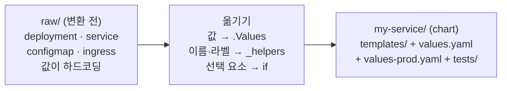
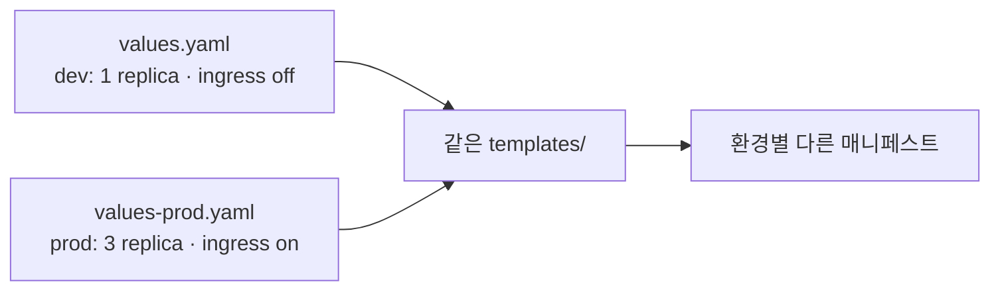

# 11. 내 매니페스트를 chart로 — raw를 동작하는 chart로 옮기기

이미 동작하는 매니페스트가 손에 있다고 합시다 — Deployment·Service·ConfigMap·Ingress 네 장, 값은 전부 하드코딩. 이걸 chart로 옮깁니다. 옮긴다는 건 파일을 `templates/`에 복사하는 게 아니라, **하드코딩된 값을 `.Values`로 빼고**, **이름·라벨을 `_helpers.tpl`로 묶고**, **Ingress 같은 선택 요소를 `if`로 끄고 켜고**, **환경별 `values` 파일을 두는** 일입니다. 앞선 편들에서 익힌 해부·엔진·흐름 제어·재사용을 한 chart에 모읍니다. 산출물은 동작하는 chart `my-service/`입니다 — `lint`·`template`·`install`·`test`를 통과하고, 기본값으로는 dev를, `values-prod.yaml`로는 prod를 같은 templates에서 찍어냅니다.

## 핵심 다이어그램





- **하드코딩을 값으로.** `replicas`·`image`·`config`처럼 환경마다 달라지는 것을 `.Values`로 빼냅니다.
- **이름·라벨을 한 곳으로.** `_helpers.tpl`의 named template으로 묶어, 모든 객체가 같은 이름 규칙·라벨을 공유합니다.
- **선택 요소는 if로.** Ingress는 `.Values.ingress.enabled`로 끄고 켭니다 — dev엔 없고 prod엔 있습니다.
- **환경은 values 파일로.** 기본 `values.yaml` 위에 `values-prod.yaml`을 얹어 환경 차이만 덮어씁니다.
- **chart엔 테스트가 딸린다.** `templates/tests/`의 test hook을 `helm test`로 돌려, 설치된 release가 실제로 응답하는지 확인합니다.

아래 시연이 이 옮기는 과정을 한 단계씩 확인합니다.

## 사전 준비물

이 실습은 **macOS** 환경을 기준으로 합니다.

- **Docker** — Docker Desktop, OrbStack 등. `docker ps`가 에러 없이 돌아가면 OK.
- **Homebrew** — macOS 패키지 관리자.

### kind · kubectl 설치

```bash
brew install kind kubectl
```

### Helm v3 설치

이 시리즈는 **Helm v3** 기준입니다. Homebrew가 v4를 설치한다면, 아래로 v3 바이너리를 받습니다 (Intel Mac은 `arm64`를 `amd64`로 바꿉니다).

```bash
brew install helm
helm version --short      # v3.x.x 인지 확인

# v4가 깔렸다면 v3로 교체
curl -fsSL https://get.helm.sh/helm-v3.21.2-darwin-arm64.tar.gz -o /tmp/helm3.tgz
tar -xzf /tmp/helm3.tgz -C /tmp
sudo mv /tmp/darwin-arm64/helm /usr/local/bin/helm
helm version --short      # v3.21.2
```

### rosa-lab 클러스터 · namespace 준비

```bash
kind create cluster --name rosa-lab
kubectl create namespace rosa-lab
kubectl config set-context --current --namespace=rosa-lab
```

이미 있으면 건너뜁니다 (`kind get clusters`, `kubectl config get-contexts`로 확인).

## 실습 환경

| 경로 | 내용 |
|---|---|
| `manifests/raw/` | 변환 전 — 하드코딩된 Deployment·Service·ConfigMap·Ingress |
| `manifests/my-service/` | 변환 후 — 동작하는 chart |

```
my-service/
├── Chart.yaml
├── values.yaml          # dev 기본값
├── values-prod.yaml     # prod 오버레이
└── templates/
    ├── _helpers.tpl      # 이름·라벨 named template
    ├── deployment.yaml
    ├── service.yaml
    ├── configmap.yaml
    ├── ingress.yaml      # if로 켜고 끔
    └── tests/
        └── test-connection.yaml
```

아래 명령은 `manifests/` 디렉터리에서 실행합니다.

```bash
cd manifests
```

## 여기서 직접 확인할 수 있는 것

### 변환 전 — 하드코딩된 raw 매니페스트

`raw/deployment.yaml`은 이름도 이미지도 replica도 박혀 있습니다.

```yaml
# raw/deployment.yaml (발췌)
metadata:
  name: my-service
  labels:
    app: my-service
spec:
  replicas: 1
  ...
        - name: my-service
          image: nginx:1.27
```

dev든 prod든 이 파일을 통째로 복사해 손으로 고쳐야 합니다. 이걸 값으로 빼는 게 변환입니다.

### 변환 후 — 같은 Deployment를 템플릿으로

`my-service/templates/deployment.yaml`은 박힌 값을 `.Values`로, 이름·라벨을 `include`로 바꿨습니다.

```yaml
# my-service/templates/deployment.yaml
metadata:
  name: {{ include "my-service.fullname" . }}
  labels:
    {{- include "my-service.labels" . | nindent 4 }}
spec:
  replicas: {{ .Values.replicaCount }}
  selector:
    matchLabels:
      {{- include "my-service.selectorLabels" . | nindent 6 }}
  template:
    ...
        - name: my-service
          image: "{{ .Values.image.repository }}:{{ .Values.image.tag }}"
          envFrom:
            - configMapRef:
                name: {{ include "my-service.fullname" . }}-config
          resources:
            {{- toYaml .Values.resources | nindent 12 }}
```

`my-service`라는 이름은 `include "my-service.fullname" .`로, 라벨 블록은 `include "my-service.labels" . | nindent 4`로, `replicas: 1`은 `.Values.replicaCount`로 바뀌었습니다. `config`는 `toYaml .Values.config`로 ConfigMap에 통째로 들어갑니다.

### 선택 요소는 if로 — ingress.yaml

raw에서 Ingress는 늘 존재했지만, chart에서는 끄고 켤 수 있어야 합니다. 그래서 전체를 `{{- if .Values.ingress.enabled }}`로 감싸고, host 목록을 `range`로 돕니다.

```yaml
# my-service/templates/ingress.yaml (발췌)
{{- if .Values.ingress.enabled }}
...
  rules:
    {{- range .Values.ingress.hosts }}
    - host: {{ .host | quote }}
      http:
        paths:
          {{- range .paths }}
          - path: {{ .path }}
            backend:
              service:
                name: {{ include "my-service.fullname" $ }}
                port:
                  number: {{ $.Values.service.port }}
          {{- end }}
    {{- end }}
{{- end }}
```

`range` 안에서는 `.`이 host·path 원소로 바뀌므로, 이름과 포트는 루트 컨텍스트 `$`로 가져옵니다(`include "..." $`, `$.Values.service.port`).

### 기본값 렌더 — dev

기본 `values.yaml`(replica 1, ingress off)로 렌더합니다.

```bash
helm template my-service my-service | grep -E '^kind:|replicas:'
```

```
kind: ConfigMap
kind: Service
kind: Deployment
  replicas: 1
kind: Pod
```

Deployment·Service·ConfigMap이 나오고, `replicas: 1`, Ingress는 없습니다. 끝의 `kind: Pod`는 `tests/`의 test hook으로, 설치 때가 아니라 `helm test`에서 실행됩니다.

### prod 오버레이 — values-prod.yaml

같은 templates에 `values-prod.yaml`을 얹으면 결과가 달라집니다.

```bash
helm template my-service my-service -f my-service/values-prod.yaml \
  | grep -E '^kind:|replicas:|image:|host:'
```

```
kind: ConfigMap
kind: Service
kind: Deployment
  replicas: 3
          image: "nginx:1.27-alpine"
kind: Ingress
    - host: "my-service.example.com"
kind: Pod
```

`replicas: 3`, 이미지 태그 `1.27-alpine`, 그리고 `ingress.enabled: true`라 **Ingress가 생겼습니다**(`my-service.example.com`). chart 하나가 값 파일만 바꿔 dev·prod 두 모습을 찍습니다.

### 설치하고 동작 확인

기본값으로 설치합니다.

```bash
helm install my-service my-service -n rosa-lab
kubectl rollout status deploy/my-service -n rosa-lab
kubectl get deploy,svc,cm -l app.kubernetes.io/name=my-service -n rosa-lab
```

```
NAME                         READY   UP-TO-DATE   AVAILABLE   AGE
deployment.apps/my-service   1/1     1            1           25s

NAME                 TYPE        CLUSTER-IP     EXTERNAL-IP   PORT(S)   AGE
service/my-service   ClusterIP   10.96.79.177   <none>        80/TCP    25s

NAME                          DATA   AGE
configmap/my-service-config   2      25s
```

옮긴 chart가 raw와 같은 객체들을 실제로 띄웁니다.

### helm test — chart에 딸린 테스트

`templates/tests/test-connection.yaml`은 Service에 `wget`을 날리는 Pod입니다. `helm test`가 그것을 실행합니다.

```bash
helm test my-service -n rosa-lab
```

```
NAME: my-service
...
TEST SUITE:     my-service-test
Last Started:   Fri Jun 26 18:31:09 2026
Last Completed: Fri Jun 26 18:31:11 2026
Phase:          Succeeded
```

`Phase: Succeeded` — 테스트 Pod가 Service에 닿아 응답을 받았다는 뜻입니다. 설치가 됐는지뿐 아니라 실제로 동작하는지까지 chart 안에서 검증했습니다.

### 정리

```bash
helm uninstall my-service -n rosa-lab
```

클러스터까지 정리하려면:

```bash
kind delete cluster --name rosa-lab
```

## 이 편의 산출물

- 동작하는 chart `my-service/` — `Chart.yaml`·`values.yaml`·`values-prod.yaml`·`templates/`(`_helpers.tpl`·deployment·service·configmap·ingress·tests)를 갖추고 `helm lint`를 통과한 상태.
- raw 매니페스트의 하드코딩을 `.Values`로 빼고, 이름·라벨을 `_helpers.tpl`의 named template으로 묶어 모든 객체가 공유하게 만든 결과물.
- Ingress를 `{{ if .Values.ingress.enabled }}`로 감싸 선택 요소로 만들고, `range`·`$`로 host 목록을 도는 템플릿을 작성한 경험.
- 같은 templates에 `values.yaml`(dev: replica 1·ingress off)과 `values-prod.yaml`(prod: replica 3·ingress on·alpine 태그)을 얹어, chart 하나로 두 환경을 찍어낸 기록.
- `helm install`로 객체가 실제로 뜨고, `templates/tests/`의 test hook을 `helm test`로 돌려 `Phase: Succeeded`를 받은 경험.
