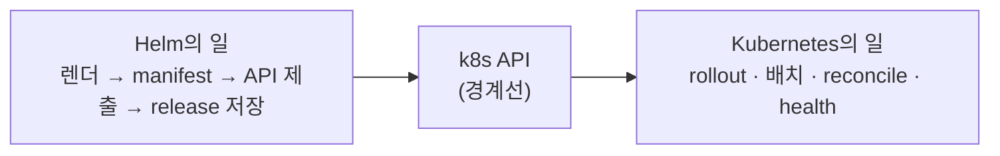
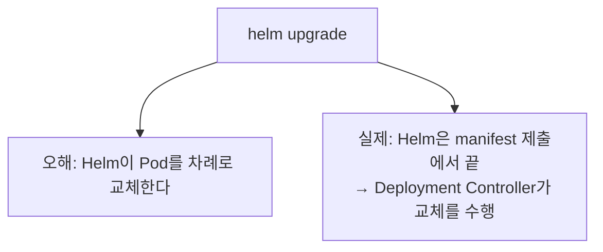

# 12. Helm vs Kubernetes 경계 — 어디까지 Helm이고 어디부터 k8s인가

`helm upgrade`가 끝나면 `STATUS: deployed`가 뜹니다. 그런데 그 한 줄이 뜨기까지 무엇이 Helm의 일이었고, 그 다음 무엇이 Kubernetes의 일일까요. Helm은 **렌더하고, manifest를 k8s API에 제출하고, release를 저장**하는 데서 멈춥니다. 그 너머 — Pod를 차례로 교체하고(rolling update), 노드에 배치하고, Pod가 죽으면 되살리고(reconcile), 컨테이너가 건강한지 보는 — 일은 전부 Kubernetes 컨트롤러의 몫입니다. 이 편은 그 경계선을 네 가지 실험으로 직접 긋고, 흔한 오해 둘을 깹니다 — "Helm이 롤링 업데이트를 수행한다"(→ 실제는 Deployment Controller), "helm rollback이 트래픽을 되돌린다"(→ 실제는 옛 manifest를 다시 제출할 뿐). 산출물은 Helm과 k8s의 책임 경계를 실측으로 확인한 기록입니다.

## 핵심 다이어그램





- **Helm은 API에서 손을 뗀다.** 렌더한 manifest를 k8s API에 제출하고 release Secret을 저장하면 Helm의 일은 끝납니다. `helm upgrade`가 1초 만에 `deployed`를 반환하는 이유입니다.
- **rollout은 Deployment Controller다.** Pod를 차례로 바꾸는 rolling update는 Helm이 아니라 k8s 컨트롤러가 합니다.
- **"deployed"는 manifest 수락이지 health가 아니다.** 이미지가 깨졌어도 Helm은 `deployed`라고 합니다. 앱이 건강한지는 k8s가 봅니다.
- **reconcile은 k8s다.** Pod를 지워도 Helm은 모릅니다. ReplicaSet이 되살립니다. Helm에는 reconcile 루프가 없습니다.

아래 시연이 이 경계를 한 줄씩 손으로 확인합니다.

## 사전 준비물

이 실습은 **macOS** 환경을 기준으로 합니다.

- **Docker** — Docker Desktop, OrbStack 등. `docker ps`가 에러 없이 돌아가면 OK.
- **Homebrew** — macOS 패키지 관리자.

### kind · kubectl 설치

```bash
brew install kind kubectl
```

### Helm v3 설치

이 시리즈는 **Helm v3** 기준입니다. Homebrew가 v4를 설치한다면, 아래로 v3 바이너리를 받습니다 (Intel Mac은 `arm64`를 `amd64`로 바꿉니다).

```bash
brew install helm
helm version --short      # v3.x.x 인지 확인

# v4가 깔렸다면 v3로 교체
curl -fsSL https://get.helm.sh/helm-v3.21.2-darwin-arm64.tar.gz -o /tmp/helm3.tgz
tar -xzf /tmp/helm3.tgz -C /tmp
sudo mv /tmp/darwin-arm64/helm /usr/local/bin/helm
helm version --short      # v3.21.2
```

### rosa-lab 클러스터 · namespace 준비

```bash
kind create cluster --name rosa-lab
kubectl create namespace rosa-lab
kubectl config set-context --current --namespace=rosa-lab
```

이미 있으면 건너뜁니다 (`kind get clusters`, `kubectl config get-contexts`로 확인).

## 실습 환경

| 파일 | 내용 |
|---|---|
| `manifests/app/` | 경계 시연용 chart (`Deployment`, replica 3) |

아래 명령은 `manifests/` 디렉터리에서 실행합니다. 먼저 기준 release를 설치합니다.

```bash
cd manifests
helm install app app -n rosa-lab
kubectl rollout status deploy/app -n rosa-lab
```

## 여기서 직접 확인할 수 있는 것

### upgrade는 manifest 제출에서 끝난다 — rollout은 k8s

이미지 태그를 바꿔 upgrade하고, helm이 반환하기까지 걸린 시간을 잽니다.

```bash
time helm upgrade app app --set image.tag=1.27-alpine -n rosa-lab
```

```
STATUS: deployed
REVISION: 2
...
helm upgrade  ...  1초
```

`helm upgrade`가 곧바로 `deployed`를 반환했습니다. 그런데 Pod 교체는 끝났을까요? 직후에 ReplicaSet을 봅니다.

```bash
kubectl get rs -l app=app -n rosa-lab \
  -o custom-columns='RS:.metadata.name,DESIRED:.spec.replicas,READY:.status.readyReplicas'
kubectl get deploy app -n rosa-lab \
  -o jsonpath='{.status.conditions[?(@.type=="Progressing")].message}{"\n"}'
```

```
RS               DESIRED   READY
app-57b67678c9   3         3
app-5f9d865947   1         <none>
```
```
ReplicaSet "app-5f9d865947" is progressing.
```

Helm이 `deployed`를 반환한 뒤에도 ReplicaSet이 둘 — 옛것(3)과 새것(1) — 이고, 새 Pod는 아직 올라오는 중입니다. 이 교체를 진행하는 주체는 메시지가 말하듯 **Deployment Controller**입니다. Helm은 새 manifest를 제출했을 뿐, Pod를 직접 바꾸지 않습니다.

### "deployed" ≠ 앱이 건강하다

존재하지 않는 이미지 태그로 upgrade해 봅니다.

```bash
helm upgrade app app --set image.tag=nope-not-real -n rosa-lab
helm list -n rosa-lab
```

```
STATUS: deployed
REVISION: 3
NAME	REVISION	STATUS
app 	3       	deployed
```

Helm은 태연히 `deployed`라고 합니다. 하지만 새 Pod의 실제 상태는 다릅니다.

```bash
kubectl get pods -l app=app -n rosa-lab
```

```
NAME                   READY   STATUS         RESTARTS   AGE
app-59d5597f46-6jkr5   0/1     ErrImagePull   0          12s
app-5f9d865947-8fdb7   1/1     Running        0          ...
app-5f9d865947-hd5q8   1/1     Running        0          ...
app-5f9d865947-mbjg5   1/1     Running        0          ...
```

새 Pod는 `ErrImagePull`입니다. Helm의 `deployed`는 "manifest를 API가 받아 저장했다"는 뜻이지, "앱이 건강하다"는 뜻이 아닙니다. 컨테이너가 뜨는지·readiness를 통과하는지는 kubelet과 컨트롤러가 보는 영역입니다. (옛 Pod가 그대로 `Running`인 것도 k8s의 일입니다 — 새 Pod가 준비될 때까지 옛것을 유지하는 rolling update 전략 덕입니다.)

### reconcile은 k8s다 — Pod를 지워도 Helm은 모른다

건강한 상태로 되돌린 뒤, Pod 하나를 `kubectl`로 지워 봅니다.

```bash
helm rollback app 2 -n rosa-lab
kubectl rollout status deploy/app -n rosa-lab

kubectl delete pod -n rosa-lab \
  $(kubectl get pods -l app=app -n rosa-lab -o name | head -1)
sleep 5
kubectl get pods -l app=app -n rosa-lab
helm list -n rosa-lab
```

```
app-5f9d865947-hd5q8   1/1   Running   72s
app-5f9d865947-mbjg5   1/1   Running   71s
app-5f9d865947-q2vd6   1/1   Running   6s
NAME	REVISION	STATUS
app 	4       	deployed
```

지운 자리에 **새 Pod(`q2vd6`, AGE 6s)** 가 생겼습니다 — ReplicaSet 컨트롤러가 "desired 3"을 맞추려 되살린 것입니다. 그동안 Helm의 revision은 4에서 그대로입니다. Helm은 이 일에 관여하지 않습니다. reconcile은 Helm이 아니라 k8s의 상시 동작입니다.

(`helm rollback app 2`도 같은 경계를 보여 줍니다 — Helm은 revision 2의 옛 manifest를 다시 제출할 뿐이고, Pod를 되돌리는 rollout은 다시 Deployment Controller가 합니다. "rollback = 트래픽 즉시 복구"가 아니라 "옛 manifest 재제출"입니다.)

### Helm이 health를 보려면 — k8s에 물어야 한다

Helm이 "건강할 때까지 기다리게" 할 수는 있습니다. `--wait`·`--atomic`입니다. 다만 이건 Helm이 health를 계산하는 게 아니라, **k8s의 readiness를 폴링**하는 것입니다. 깨진 이미지에 `--atomic`을 붙여 봅니다.

```bash
helm upgrade app app --set image.tag=nope-not-real --atomic --timeout=30s -n rosa-lab
```

```
Error: UPGRADE FAILED: release app failed, and has been rolled back due to atomic being set: context deadline exceeded
```

Helm이 30초 동안 새 Pod가 ready가 되기를 기다렸지만(k8s에 묻는 일), `ErrImagePull`이라 끝내 준비되지 않았습니다. `--atomic`이라 Helm은 실패로 보고 **자동 롤백**했습니다(= 옛 manifest를 다시 제출). 즉 Helm이 health에 반응하는 유일한 방법은 k8s의 상태를 들여다보는 것이고, 그 판단·복구의 실행은 여전히 k8s가 합니다.

### 정리

```bash
helm uninstall app -n rosa-lab
```

클러스터까지 정리하려면:

```bash
kind delete cluster --name rosa-lab
```

## 이 편의 산출물

- `helm upgrade`가 1초 만에 `deployed`를 반환하고, 그 직후 ReplicaSet이 둘로 나뉘어 **Deployment Controller가 rollout을 수행**하는 것을 보고, "Helm이 롤링 업데이트를 한다"는 오해를 깬 기록.
- 깨진 이미지로 upgrade해도 Helm은 `deployed`지만 Pod는 `ErrImagePull`인 것을 보고, **Helm의 STATUS는 manifest 수락이지 앱 health가 아니다**라는 경계를 확인한 경험.
- `kubectl delete pod` 후 ReplicaSet이 새 Pod로 되살리는 동안 Helm revision이 그대로인 것을 보고, **reconcile은 Helm이 아니라 k8s의 일**임을 확인한 상태.
- `helm rollback`이 트래픽을 되돌리는 게 아니라 **옛 manifest를 다시 제출**하고, 실제 교체는 다시 k8s가 한다는 것을 정리한 상태.
- `--atomic`이 k8s readiness를 폴링하다 실패 시 자동 롤백하는 것을 보고, **Helm이 health에 닿는 유일한 길은 k8s에 묻는 것**임을 확인한 경험.
