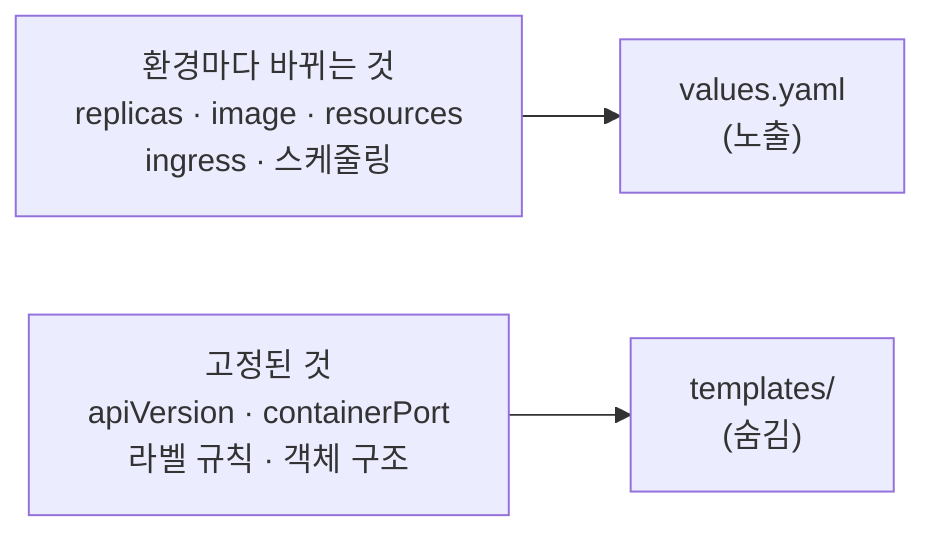
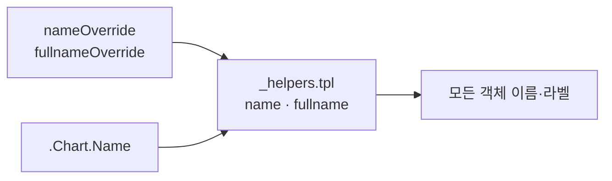

# 13. chart 설계 원칙 — 무엇을 노출하고 무엇을 숨기는가

동작하는 chart와 잘 설계된 chart는 다릅니다. 렌더가 통과하고 설치가 되는 것과, 남이 값 파일 하나로 자기 환경에 맞게 쓸 수 있는 것은 별개입니다. 그 차이를 가르는 게 **무엇을 `values`로 노출하고 무엇을 템플릿에 숨기느냐**입니다. 너무 적게 노출하면 쓰는 사람이 chart를 포크해야 하고, 너무 많이 노출하면 `values.yaml`이 비대해져 무엇을 건드려야 하는지 알 수 없어집니다. 이 편은 그 경계를 다섯 개의 원칙으로 잡고, 이름 관례·스케줄링 훅까지 갖춘 chart `my-service/`(version `0.2.0`)를 산출물로 남깁니다. 기본값만으로 설치되고, `nameOverride`·`fullnameOverride`로 이름을 재정의할 수 있으며, `nodeSelector`·`tolerations`·`affinity`를 열어두되 비워두면 매니페스트에 나타나지 않습니다.

## 핵심 다이어그램





- **환경마다 바뀌는 것만 노출한다.** `replicas`·`image`·`resources`·`ingress`는 `values`로 열고, `apiVersion`·`containerPort`·라벨 규칙처럼 고정된 것은 템플릿에 둡니다.
- **기본값만으로 설치된다.** `values.yaml` 그 자체로 `helm install`이 성공해야 합니다 — `resources: {}`, `ingress.enabled: false`처럼 안전한 기본값을 둡니다.
- **이름은 관례를 따른다.** 객체 이름을 하드코딩하지 않고 chart 이름에서 유도하며, `nameOverride`·`fullnameOverride`로 덮을 수 있게 합니다.
- **스케줄링 훅은 열어두되 비운다.** `nodeSelector`·`tolerations`·`affinity`를 노출하되 기본은 비워, 채우지 않으면 매니페스트에 나타나지 않게 합니다.
- **selector 라벨은 불변으로.** Deployment의 selector에 들어가는 라벨은 한 번 정하면 바꿀 수 없으므로, `name`·`instance`만 두고 버전 같은 가변 라벨은 뺍니다.

아래 시연이 이 원칙들을 렌더 결과로 하나씩 확인합니다.

## 사전 준비물

이 실습은 **macOS** 환경을 기준으로 합니다.

- **Docker** — Docker Desktop, OrbStack 등. `docker ps`가 에러 없이 돌아가면 OK.
- **Homebrew** — macOS 패키지 관리자.

### kind · kubectl 설치

```bash
brew install kind kubectl
```

### Helm v3 설치

이 시리즈는 **Helm v3** 기준입니다. Homebrew가 v4를 설치한다면, 아래로 v3 바이너리를 받습니다 (Intel Mac은 `arm64`를 `amd64`로 바꿉니다).

```bash
brew install helm
helm version --short      # v3.x.x 인지 확인

# v4가 깔렸다면 v3로 교체
curl -fsSL https://get.helm.sh/helm-v3.21.2-darwin-arm64.tar.gz -o /tmp/helm3.tgz
tar -xzf /tmp/helm3.tgz -C /tmp
sudo mv /tmp/darwin-arm64/helm /usr/local/bin/helm
helm version --short      # v3.21.2
```

### rosa-lab 클러스터 · namespace 준비

렌더 확인(`helm template`·`helm lint`)은 클러스터가 없어도 되지만, 설치와 `helm test`에는 필요합니다.

```bash
kind create cluster --name rosa-lab
kubectl create namespace rosa-lab
kubectl config set-context --current --namespace=rosa-lab
```

이미 있으면 건너뜁니다 (`kind get clusters`, `kubectl config get-contexts`로 확인).

## 실습 환경

| 경로 | 내용 |
|---|---|
| `manifests/my-service/` | 설계 원칙을 적용한 chart |

```
my-service/
├── Chart.yaml            # version 0.2.0
├── values.yaml           # dev 기본값 + 스케줄링 훅(비어 있음)
├── values-prod.yaml      # prod 오버레이
└── templates/
    ├── _helpers.tpl       # name · fullname · labels 관례
    ├── deployment.yaml
    ├── service.yaml
    ├── configmap.yaml
    ├── ingress.yaml
    └── tests/
        └── test-connection.yaml
```

아래 명령은 `manifests/` 디렉터리에서 실행합니다.

```bash
cd manifests
```

## 여기서 직접 확인할 수 있는 것

### 원칙 1 — 노출할 값과 숨길 값을 가른다

`values.yaml`에는 환경마다 달라지는 것만 있습니다.

```yaml
replicaCount: 1
image:
  repository: nginx
  tag: "1.27"
service:
  type: ClusterIP
  port: 80
config:
  LOG_LEVEL: info
  GREETING: "hello"
```

반면 `apiVersion: apps/v1`, `containerPort: 80`, 라벨 규칙은 템플릿에 박혀 있고 `values`에 없습니다. 이것들은 환경이 달라도 바뀌지 않기 때문입니다. 노출 목록이 곧 "이 chart를 쓸 때 신경 쓸 것"의 전부가 되도록, 나머지는 감춥니다.

### 원칙 2 — 기본값만으로 렌더·설치된다

`-f`나 `--set` 없이, `values.yaml`만으로 완결된 매니페스트가 나옵니다.

```bash
helm lint my-service
```

```
==> Linting my-service
[INFO] Chart.yaml: icon is recommended

1 chart(s) linted, 0 chart(s) failed
```

`icon`은 권장 사항일 뿐 실패가 아닙니다. 기본값이 안전(빈 `resources`, 꺼진 `ingress`)하므로, 값을 몰라도 설치가 됩니다.

### 원칙 3 — 이름은 chart 이름에서 유도한다

`_helpers.tpl`은 이름을 하드코딩하지 않습니다. `name`은 `.Chart.Name`에서 유도하고(`nameOverride`로 덮을 수 있음), `fullname`은 release 이름과 조합합니다.

```
{{- define "my-service.name" -}}
{{- default .Chart.Name .Values.nameOverride | trunc 63 | trimSuffix "-" -}}
{{- end -}}
```

release 이름을 `web`으로 렌더하면, 객체 이름은 `web-my-service`, `name` 라벨은 chart 이름 `my-service`, `instance` 라벨은 release 이름 `web`이 됩니다.

```bash
helm template web my-service | grep -E '^kind:|  name:|app.kubernetes.io/name:|app.kubernetes.io/instance:' | head -8
```

```
kind: ConfigMap
  name: web-my-service-config
    app.kubernetes.io/name: my-service
    app.kubernetes.io/instance: web
kind: Service
  name: web-my-service
    app.kubernetes.io/name: my-service
    app.kubernetes.io/instance: web
```

### 원칙 3 — `fullnameOverride`로 이름을 통째로 바꾼다

같은 chart를 한 클러스터에 여러 벌 설치하거나, 기존 객체 이름에 맞춰야 할 때 `fullnameOverride`로 접두사를 고정합니다.

```bash
helm template web my-service --set fullnameOverride=web | grep -E '^kind:|  name:'
```

```
kind: ConfigMap
  name: web-config
kind: Service
  name: web
kind: Deployment
  name: web
kind: Pod
  name: "web-test"
```

release 이름과 무관하게 모든 객체가 `web`으로 통일됩니다. 반대로 `nameOverride=api`는 이름 접두사는 그대로 두고 `name` 라벨과 객체 이름의 중간 토큰만 `api`로 바꿉니다.

```bash
helm template web my-service --set nameOverride=api | grep -E 'app.kubernetes.io/name:|  name: web' | head -4
```

```
  name: web-api-config
    app.kubernetes.io/name: api
  name: web-api
    app.kubernetes.io/name: api
```

release 이름이 이미 chart 이름을 포함하면(예: `helm install my-service ...`), 이름이 `my-service-my-service`로 겹치지 않도록 `contains`로 걸러 `my-service` 하나만 씁니다.

```bash
helm template my-service my-service | grep -E '^kind:|  name:' | grep -v config | head -4
```

```
kind: ConfigMap
kind: Service
  name: my-service
kind: Deployment
  name: my-service
```

### 원칙 4 — 스케줄링 훅은 열어두되 비워둔다

`values.yaml`은 `nodeSelector`·`tolerations`·`affinity`를 노출하지만 기본은 비어 있습니다.

```yaml
resources: {}
nodeSelector: {}
tolerations: []
affinity: {}
```

템플릿은 이것들을 `{{- with }}`로 감쌌기 때문에, 비어 있으면 블록 자체가 렌더되지 않습니다.

```bash
helm template web my-service | grep -cE 'nodeSelector|affinity|tolerations'
```

```
0
```

기본 렌더에는 세 키가 한 번도 나타나지 않습니다. `values`에는 있지만 매니페스트에는 없습니다 — 열어는 뒀으되 채우기 전까지 조용합니다.

### 원칙 4 — prod에서 값을 채우면 나타난다

`values-prod.yaml`은 `nodeSelector`와 `resources`를 채웁니다.

```bash
helm template web my-service -f my-service/values-prod.yaml \
  | grep -E 'replicas:|cpu:|memory:|nodeSelector:|kubernetes.io/os'
```

```
  replicas: 3
              cpu: 500m
              memory: 256Mi
              cpu: 100m
              memory: 128Mi
      nodeSelector:
        kubernetes.io/os: linux
```

같은 templates가, 값을 채운 만큼만 `resources`와 `nodeSelector`를 매니페스트에 드러냅니다. dev에는 없던 블록이 prod에서 붙습니다.

### 원칙 5 — selector 라벨은 불변만 담는다

`_helpers.tpl`은 라벨을 두 벌로 나눕니다. `selectorLabels`에는 `name`·`instance`만 두고, 가변적인 `version`·`managed-by`·`chart`는 `labels`에만 둡니다.

```
{{- define "my-service.selectorLabels" -}}
app.kubernetes.io/name: {{ include "my-service.name" . }}
app.kubernetes.io/instance: {{ .Release.Name }}
{{- end -}}
```

Deployment의 `spec.selector.matchLabels`는 생성 후 바꿀 수 없습니다. 여기에 `version` 같은 가변 라벨을 넣으면 이미지 태그를 올릴 때마다 selector가 바뀌어 upgrade가 막힙니다. 그래서 selector에는 불변 라벨만 넣고, 공통 `labels` 블록이 그것을 포함해(DRY) 나머지 라벨을 얹습니다.

### 설치하고 test까지

설계 원칙을 적용한 chart도 그대로 동작합니다. 기본값으로 설치하고 `helm test`로 응답을 확인합니다.

```bash
helm install web my-service -n rosa-lab
kubectl rollout status deploy/web-my-service -n rosa-lab
helm test web -n rosa-lab
```

`rollout status`가 `successfully rolled out`을 반환하고, `helm test`가 `Phase: Succeeded`를 내면 — 설치된 release가 실제로 응답한 것입니다. 테스트 Pod가 `web-my-service:80`에 `wget`을 날려 확인합니다.

### 정리

```bash
helm uninstall web -n rosa-lab
```

클러스터까지 정리하려면:

```bash
kind delete cluster --name rosa-lab
```

## 이 편의 산출물

- 설계 원칙을 적용한 chart `my-service/`(version `0.2.0`) — `helm lint`를 통과하고, 기본값만으로 렌더·설치되는 상태.
- 환경마다 바뀌는 값만 `values`로 노출하고, `apiVersion`·`containerPort`·라벨 규칙 같은 고정 요소는 템플릿에 숨긴 결과물.
- `_helpers.tpl`의 `name`·`fullname` 관례 — 이름을 하드코딩하지 않고 `.Chart.Name`에서 유도하며, `nameOverride`·`fullnameOverride`로 재정의하고, release 이름과 chart 이름의 중복을 `contains`로 거르는 것을 렌더로 확인한 기록.
- `nodeSelector`·`tolerations`·`affinity`를 `{{- with }}`로 감싸, 비우면 매니페스트에 나타나지 않고 채우면 드러나는 것을 dev·prod 렌더로 대조한 경험.
- selector 라벨에 불변만 담고(`name`·`instance`), 공통 `labels`가 그것을 포함하게 나눠 upgrade가 막히지 않도록 설계한 근거.
