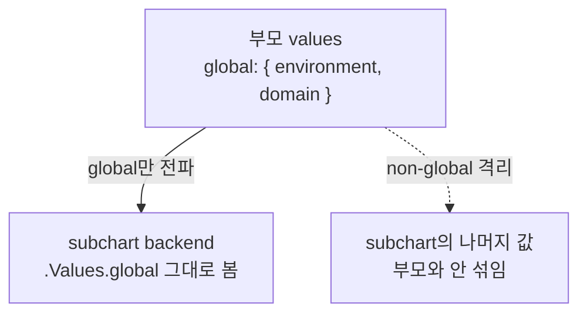

# 14. values 설계 — 계층·병합·우선순위·global

chart를 쓰는 사람은 `values`로 말을 겁니다. 그래서 값이 여러 겹으로 쌓일 때 무엇이 이기고 무엇이 살아남는지를 정확히 알아야, 환경별 파일을 안심하고 얹을 수 있습니다. Helm은 `values.yaml`을 바닥에 깔고, `-f`로 준 파일들을 순서대로 올린 뒤, `--set`을 맨 위에 얹습니다. 이때 map(딕셔너리)은 키 단위로 **깊게 병합**되지만 list(배열)는 **통째로 교체**됩니다 — 이 둘을 헷갈리면 환경 파일에 리스트 하나 적었다가 기본 리스트가 통째로 사라집니다. 여기에 부모와 subchart가 함께 보는 `global`까지가 values 설계의 축입니다. 이 편은 값을 덤프하는 chart `values-demo/`로 이 규칙들을 렌더 결과로 확인합니다. 산출물은 우선순위 사다리·map/list 병합 차이·global 전파를 직접 눈으로 본 재현 가능한 기록입니다.

## 핵심 다이어그램




- **우선순위는 아래에서 위로.** `values.yaml` < `-f` 파일 < `--set`. 위에 얹힌 것이 이깁니다.
- **여러 `-f`는 뒤가 이긴다.** 같은 키를 두 파일이 다르게 주면, 명령줄에서 뒤에 온 파일이 최종값이 됩니다.
- **map은 깊게 병합된다.** 상위 파일이 map의 한 키만 덮으면 나머지 키는 살아남습니다.
- **list는 통째로 교체된다.** 상위 파일이 배열을 주면 아래 배열은 병합·append 없이 사라집니다.
- **global은 subchart로 내려간다.** 부모 `global`은 모든 subchart가 그대로 보지만, global이 아닌 값은 subchart로 넘어가지 않습니다.

아래 시연이 이 규칙들을 값 덤프로 하나씩 확인합니다.

## 사전 준비물

이 실습은 **macOS** 환경을 기준으로 합니다. 렌더만 확인하므로 클러스터는 필요 없고, Helm만 있으면 됩니다.

- **Homebrew** — macOS 패키지 관리자.

### Helm v3 설치

이 시리즈는 **Helm v3** 기준입니다. Homebrew가 v4를 설치한다면, 아래로 v3 바이너리를 받습니다 (Intel Mac은 `arm64`를 `amd64`로 바꿉니다).

```bash
brew install helm
helm version --short      # v3.x.x 인지 확인

# v4가 깔렸다면 v3로 교체
curl -fsSL https://get.helm.sh/helm-v3.21.2-darwin-arm64.tar.gz -o /tmp/helm3.tgz
tar -xzf /tmp/helm3.tgz -C /tmp
sudo mv /tmp/darwin-arm64/helm /usr/local/bin/helm
helm version --short      # v3.21.2
```

## 실습 환경

| 경로 | 내용 |
|---|---|
| `manifests/values-demo/` | 값을 ConfigMap으로 덤프하는 chart + subchart |

```
values-demo/
├── Chart.yaml            # backend를 subchart(dependency)로 선언
├── values.yaml           # 바닥 기본값 (map · list · global)
├── env/
│   ├── staging.yaml      # 오버레이 A
│   └── prod.yaml         # 오버레이 B
├── templates/
│   └── configmap.yaml    # 병합된 부모 값을 덤프
└── charts/
    └── backend/
        ├── Chart.yaml
        ├── values.yaml
        └── templates/
            └── configmap.yaml   # subchart가 본 global을 덤프
```

`templates/configmap.yaml`은 `replicaCount`·`config`(map)·`featureFlags`(list)·`global`을 그대로 ConfigMap에 적어, 병합 결과를 눈으로 볼 수 있게 합니다.

아래 명령은 `manifests/` 디렉터리에서 실행합니다.

```bash
cd manifests
```

## 여기서 직접 확인할 수 있는 것

### 바닥 — values.yaml만

아무것도 얹지 않으면 `values.yaml`이 그대로 나옵니다.

```bash
helm template app values-demo -s templates/configmap.yaml
```

```
data:
  replicaCount: "1"
  config: |
    GREETING: hello
    LOG_LEVEL: info
    TIMEOUT: 30s
  featureFlags: |
    - alpha
    - beta
  global-environment: "dev"
  global-domain: "example.local"
```

`config`에는 세 키, `featureFlags`에는 두 원소, global은 `dev`/`example.local`입니다. 이게 병합의 바닥입니다.

### `-f`를 얹으면 — map은 병합, list는 교체

`env/prod.yaml`은 `config.LOG_LEVEL`만 덮고, `featureFlags`에는 `stable` 하나만, `global.environment`만 `prod`로 줍니다.

```yaml
# env/prod.yaml
replicaCount: 3
config:
  LOG_LEVEL: warn
featureFlags:
  - stable
global:
  environment: prod
```

이걸 얹은 결과:

```bash
helm template app values-demo -f values-demo/env/prod.yaml -s templates/configmap.yaml
```

```
data:
  replicaCount: "3"
  config: |
    GREETING: hello
    LOG_LEVEL: warn
    TIMEOUT: 30s
  featureFlags: |
    - stable
  global-environment: "prod"
  global-domain: "example.local"
```

두 규칙이 갈립니다.

- **map — `config`:** `LOG_LEVEL`은 `warn`으로 바뀌었지만 `GREETING: hello`·`TIMEOUT: 30s`는 그대로입니다. 한 키만 덮어도 나머지는 살아남습니다(깊은 병합).
- **list — `featureFlags`:** `alpha`·`beta`가 통째로 사라지고 `stable`만 남았습니다. 배열은 병합되지 않고 교체됩니다.
- **global:** `environment`는 `prod`로 바뀌었지만 덮지 않은 `domain`은 `example.local` 그대로입니다(global도 map이라 깊게 병합).

### 여러 `-f` — 뒤에 온 파일이 이긴다

`staging.yaml`과 `prod.yaml`이 같은 키를 다르게 줄 때, 명령줄 순서가 승패를 정합니다.

```bash
helm template app values-demo -f values-demo/env/staging.yaml -f values-demo/env/prod.yaml \
  -s templates/configmap.yaml | grep -E 'replicaCount|LOG_LEVEL|global-environment'
```

```
  replicaCount: "3"
    LOG_LEVEL: warn
  global-environment: "prod"
```

순서를 뒤집으면 결과도 뒤집힙니다.

```bash
helm template app values-demo -f values-demo/env/prod.yaml -f values-demo/env/staging.yaml \
  -s templates/configmap.yaml | grep -E 'replicaCount|LOG_LEVEL|global-environment'
```

```
  replicaCount: "2"
    LOG_LEVEL: debug
  global-environment: "staging"
```

같은 파일 둘, 순서만 바꿨는데 `replicaCount`·`LOG_LEVEL`·`environment`가 전부 마지막 파일 쪽으로 넘어갔습니다.

### `--set`은 `-f`보다 위

`-f`로 파일을 얹은 위에 `--set`을 주면, 파일이 무엇을 정했든 `--set`이 최종값입니다.

```bash
helm template app values-demo -f values-demo/env/prod.yaml --set replicaCount=9 \
  -s templates/configmap.yaml | grep replicaCount
```

```
  replicaCount: "9"
```

`prod.yaml`이 `3`을 줬지만 `--set replicaCount=9`가 이깁니다. 사다리의 맨 위입니다.

### global — subchart가 부모 값을 본다

`charts/backend/`는 `global`을 자기 `values.yaml`에 두지 않았습니다. 그런데도 부모의 `global`을 그대로 봅니다.

```bash
helm template app values-demo -f values-demo/env/prod.yaml \
  -s charts/backend/templates/configmap.yaml
```

```
data:
  # subchart는 자기 replicaCount만 안다(부모 값과 섞이지 않는다).
  own-replicaCount: "1"
  # global은 부모에서 내려온 것을 그대로 본다.
  seen-global-environment: "prod"
  seen-global-domain: "example.local"
```

두 가지가 동시에 보입니다.

- **global은 전파된다.** subchart는 부모가 `prod`로 덮은 `global.environment`를, 자기 파일에 아무것도 안 적고도 봅니다.
- **non-global은 격리된다.** `own-replicaCount`는 subchart 자신의 기본값 `1`입니다 — 부모가 `replicaCount: 3`이어도 subchart로 넘어오지 않습니다. 부모와 subchart는 이름이 같아도 별개의 `replicaCount`를 가집니다.

## 이 편의 산출물

- 값을 ConfigMap으로 덤프하는 chart `values-demo/` — `helm lint`를 통과하고, `-f`·`--set`으로 병합 결과를 렌더로 확인할 수 있는 상태.
- 우선순위 사다리(`values.yaml` < `-f` < `--set`)를 렌더로 확인하고, 여러 `-f` 중 뒤에 온 파일이 이기는 것을 순서를 뒤집어 대조한 기록.
- map은 한 키만 덮어도 나머지가 살아남고(`config.GREETING`·`TIMEOUT` 생존), list는 통째로 교체되는(`featureFlags` alpha·beta → stable) 차이를 같은 오버레이 하나로 확인한 경험.
- 부모 `global`이 subchart로 전파되고(`seen-global-environment: prod`), non-global 값은 subchart로 넘어가지 않는(`own-replicaCount: 1`) 격리를 렌더로 대조한 근거.
