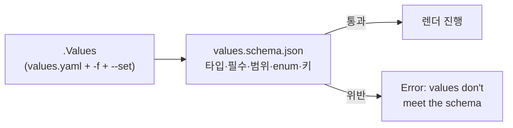

# 15. schema 검증 — values.schema.json으로 입력을 강제한다

`values`를 노출한다는 건 남이 아무 값이나 넣을 수 있다는 뜻이기도 합니다. `replicaCount`에 `"three"`를 넣거나, `logLevel`에 오타를 치거나, 키 이름을 `replicaCoutn`으로 잘못 적어도 템플릿은 그대로 렌더를 시도하고, 문제는 클러스터에서 터집니다. `values.schema.json`은 그 입력을 chart 안에서 규칙으로 못박습니다 — 타입·필수·범위·enum·허용된 키를 JSON Schema로 적어두면, Helm이 렌더 **이전에** `.Values`를 검증하고 위반이면 멈춥니다. 그리고 이 검증은 `helm lint`에도 걸리므로 CI에서 한 줄로 강제됩니다. 이 편은 스키마를 갖춘 chart `my-service/`(version `0.3.0`)로, 유효한 값은 통과하고 위반은 어떤 메시지로 걸리는지 실측합니다. 산출물은 chart에 입력 계약을 박고, 잘못된 값이 렌더 전에 멈추는 것을 확인한 기록입니다.

## 핵심 다이어그램



- **스키마는 렌더 전에 검사한다.** `.Values`가 스키마를 어기면 템플릿을 펼치지 않고 멈춥니다.
- **JSON Schema 그대로.** 타입(`integer`·`string`), 필수(`required`), 범위(`minimum`·`maximum`), 목록(`enum`), 허용된 키(`additionalProperties: false`)를 적습니다.
- **오타를 잡는다.** `additionalProperties: false`면 스키마에 없는 키(오타 포함)를 거부합니다.
- **한 번에 다 보고한다.** 위반이 여럿이면 한 실행에서 전부 나열합니다.
- **CI에 걸린다.** `helm lint`가 스키마를 검사하고, 위반이면 exit code가 1이라 파이프라인이 멈춥니다.

아래 시연이 통과와 위반을 하나씩 확인합니다.

## 사전 준비물

이 실습은 **macOS** 환경을 기준으로 합니다. 렌더·lint만 확인하므로 클러스터는 필요 없고, Helm만 있으면 됩니다.

- **Homebrew** — macOS 패키지 관리자.

### Helm v3 설치

이 시리즈는 **Helm v3** 기준입니다. Homebrew가 v4를 설치한다면, 아래로 v3 바이너리를 받습니다 (Intel Mac은 `arm64`를 `amd64`로 바꿉니다).

```bash
brew install helm
helm version --short      # v3.x.x 인지 확인

# v4가 깔렸다면 v3로 교체
curl -fsSL https://get.helm.sh/helm-v3.21.2-darwin-arm64.tar.gz -o /tmp/helm3.tgz
tar -xzf /tmp/helm3.tgz -C /tmp
sudo mv /tmp/darwin-arm64/helm /usr/local/bin/helm
helm version --short      # v3.21.2
```

## 실습 환경

| 경로 | 내용 |
|---|---|
| `manifests/my-service/` | `values.schema.json`을 갖춘 chart |
| `manifests/bad-values.yaml` | 위반을 여럿 담은 오버레이 |

```
my-service/
├── Chart.yaml
├── values.yaml           # 스키마를 통과하는 기본값
├── values.schema.json    # 입력 계약
└── templates/
    └── deployment.yaml
```

`values.schema.json`은 이렇게 생겼습니다.

```json
{
  "type": "object",
  "additionalProperties": false,
  "required": ["image"],
  "properties": {
    "replicaCount": { "type": "integer", "minimum": 1, "maximum": 10 },
    "image": {
      "type": "object",
      "required": ["repository", "tag"],
      "properties": {
        "repository": { "type": "string" },
        "tag": { "type": "string" }
      }
    },
    "service": { "type": "object", "properties": { "port": { "type": "integer" } } },
    "logLevel": { "type": "string", "enum": ["debug", "info", "warn", "error"] }
  }
}
```

아래 명령은 `manifests/` 디렉터리에서 실행합니다.

```bash
cd manifests
```

## 여기서 직접 확인할 수 있는 것

### 유효한 값은 통과한다

기본 `values.yaml`은 스키마를 만족하므로 그대로 렌더됩니다.

```bash
helm template app my-service | grep -E 'replicas:|image:|LOG_LEVEL'
```

```
  replicas: 1
          image: "nginx:1.27"
            - name: LOG_LEVEL
```

스키마가 있어도 유효하면 아무 일 없이 지나갑니다 — 검증은 위반일 때만 소리를 냅니다.

### 타입 위반 — 문자열을 integer 자리에

`replicaCount`에 숫자가 아닌 값을 주면 렌더 전에 멈춥니다.

```bash
helm template app my-service --set replicaCount=three
```

```
Error: values don't meet the specifications of the schema(s) in the following chart(s):
- at '/replicaCount': got string, want integer
```

어느 경로(`/replicaCount`)에서 무엇을 기대했는지(`want integer`)까지 찍힙니다.

### 범위 위반 — maximum을 넘김

`replicaCount`는 `maximum: 10`입니다.

```bash
helm template app my-service --set replicaCount=20
```

```
Error: values don't meet the specifications of the schema(s) in the following chart(s):
- at '/replicaCount': maximum: got 20, want 10
```

타입이 맞아도 범위를 벗어나면 걸립니다.

### enum 위반 — 목록에 없는 값

`logLevel`은 `debug`·`info`·`warn`·`error`만 허용합니다.

```bash
helm template app my-service --set logLevel=verbose
```

```
Error: values don't meet the specifications of the schema(s) in the following chart(s):
- at '/logLevel': value must be one of 'debug', 'info', 'warn', 'error'
```

허용된 값을 메시지가 그대로 알려줍니다.

### 오타 — 없는 키를 거부한다

`additionalProperties: false` 덕분에, 스키마에 없는 키는 오타든 뭐든 거부됩니다. `replicaCount`를 `replicaCoutn`으로 잘못 치면:

```bash
helm template app my-service --set replicaCoutn=3
```

```
Error: values don't meet the specifications of the schema(s) in the following chart(s):
- at '': additional properties 'replicaCoutn' not allowed
```

스키마가 없었다면 이 오타는 조용히 무시되고 `replicaCount`는 기본값 1로 남았을 것입니다. 스키마가 그것을 실패로 바꿉니다.

### 위반이 여럿이면 한 번에 — helm lint

`bad-values.yaml`은 세 곳을 어깁니다.

```yaml
# bad-values.yaml
replicaCount: 0          # minimum 1 위반
logLevel: trace          # enum 위반
service:
  port: "eighty"         # integer 아님
```

`helm lint`가 스키마를 검사하며, 위반을 전부 나열합니다.

```bash
helm lint my-service -f bad-values.yaml
```

```
==> Linting my-service
[INFO] Chart.yaml: icon is recommended
[ERROR] values.yaml: - at '/logLevel': value must be one of 'debug', 'info', 'warn', 'error'
- at '/replicaCount': minimum: got 0, want 1
- at '/service/port': got string, want integer

Error: 1 chart(s) linted, 1 chart(s) failed
```

하나 고치고 다시 돌리는 게 아니라, 세 위반이 한 실행에 모두 보입니다.

### CI에 거는 한 줄 — exit code

`helm lint`는 스키마 위반이면 exit code `1`을 냅니다. CI는 이걸로 파이프라인을 멈춥니다.

```bash
helm lint my-service -f bad-values.yaml >/dev/null 2>&1; echo $?   # 1
helm lint my-service                     >/dev/null 2>&1; echo $?   # 0
```

```
1
0
```

GitHub Actions든 어디든 `helm lint`를 한 스텝으로 넣으면, 잘못된 값이 들어간 PR은 병합 전에 빨간불이 됩니다.

## 이 편의 산출물

- `values.schema.json`을 갖춘 chart `my-service/`(version `0.3.0`) — 타입·필수·범위·enum·허용된 키를 JSON Schema로 못박은 입력 계약.
- 유효한 값은 통과하고, 타입(`got string, want integer`)·범위(`maximum: got 20, want 10`)·enum(`value must be one of ...`) 위반이 렌더 전에 멈추는 것을 각각 확인한 기록.
- `additionalProperties: false`로 오타(`replicaCoutn`)를 `additional properties ... not allowed`로 걸러낸 경험.
- `helm lint`가 스키마를 검사해 위반을 한 번에 나열하고, exit code `1`(위반)/`0`(정상)으로 CI에 걸 수 있음을 확인한 근거.
