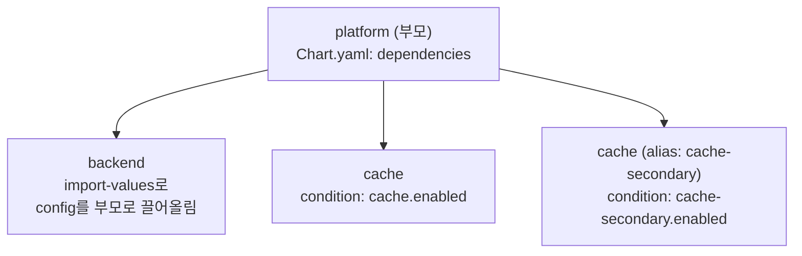
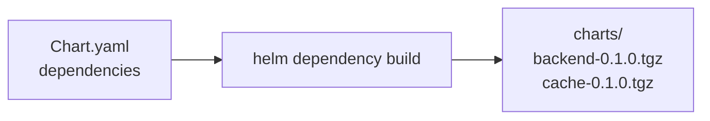

# 16. 의존성과 subchart — chart가 다른 chart를 품는다

앱 하나는 혼자 서지 않습니다. backend에는 cache가, cache가 둘 필요할 때도 있고, 어떤 환경에서는 cache를 아예 빼기도 합니다. Helm은 이걸 `Chart.yaml`의 `dependencies`로 다룹니다 — 다른 chart를 subchart로 선언하면 `helm dependency build`가 그것을 `charts/`로 가져오고, 부모를 설치하면 subchart도 함께 설치됩니다. 여기에 세 개의 조절 손잡이가 붙습니다. `condition`은 값 하나로 subchart를 켜고 끄고, `alias`는 같은 chart를 다른 이름으로 두 번 품고, `import-values`는 subchart의 값을 부모로 끌어올립니다. 이 편은 로컬 subchart `backend`·`cache`를 품는 부모 chart `platform/`으로 이 넷을 렌더 결과로 확인합니다. 산출물은 `Chart.lock`으로 고정되고 `helm dependency build`로 재현되는, subchart를 품은 chart입니다.

## 핵심 다이어그램





- **dependencies로 선언한다.** 다른 chart를 `name`·`version`·`repository`로 적으면 subchart가 됩니다.
- **build로 가져온다.** `helm dependency build`가 subchart를 `charts/`에 채우고 `Chart.lock`에 버전을 고정합니다.
- **condition으로 켜고 끈다.** `condition: cache.enabled`면 값 하나로 subchart 전체를 뺄 수 있습니다.
- **alias로 두 번 품는다.** 같은 chart를 `alias`로 다른 이름을 붙여, 서로 다른 값으로 두 벌 설치합니다.
- **import-values로 끌어올린다.** subchart의 값을 부모 `.Values` 아래로 가져와 부모 템플릿이 씁니다.

아래 시연이 이 넷을 한 chart에서 확인합니다.

## 사전 준비물

이 실습은 **macOS** 환경을 기준으로 합니다. 렌더만 확인하므로 클러스터는 필요 없고, Helm만 있으면 됩니다.

- **Homebrew** — macOS 패키지 관리자.

### Helm v3 설치

이 시리즈는 **Helm v3** 기준입니다. Homebrew가 v4를 설치한다면, 아래로 v3 바이너리를 받습니다 (Intel Mac은 `arm64`를 `amd64`로 바꿉니다).

```bash
brew install helm
helm version --short      # v3.x.x 인지 확인

# v4가 깔렸다면 v3로 교체
curl -fsSL https://get.helm.sh/helm-v3.21.2-darwin-arm64.tar.gz -o /tmp/helm3.tgz
tar -xzf /tmp/helm3.tgz -C /tmp
sudo mv /tmp/darwin-arm64/helm /usr/local/bin/helm
helm version --short      # v3.21.2
```

## 실습 환경

| 경로 | 내용 |
|---|---|
| `manifests/charts-src/backend/` | 로컬 subchart — import-values 소스 |
| `manifests/charts-src/cache/` | 로컬 subchart — condition·alias 시연용 |
| `manifests/platform/` | subchart를 품는 부모 chart |

```
platform/
├── Chart.yaml            # dependencies: backend · cache · cache(alias)
├── Chart.lock            # 고정된 버전 (build가 생성)
├── values.yaml
├── templates/
│   └── configmap.yaml    # import된 값을 덤프
└── charts/               # build가 채운다 (.tgz는 커밋 제외)
```

`Chart.yaml`의 `dependencies`는 이렇게 생겼습니다.

```yaml
dependencies:
  - name: backend
    version: "0.1.0"
    repository: "file://../charts-src/backend"
    import-values:
      - child: config          # backend의 .Values.config 를
        parent: backendConfig  # 부모 .Values.backendConfig 로
  - name: cache
    version: "0.1.0"
    repository: "file://../charts-src/cache"
    condition: cache.enabled
  - name: cache
    version: "0.1.0"
    repository: "file://../charts-src/cache"
    alias: cache-secondary
    condition: cache-secondary.enabled
```

아래 명령은 `manifests/` 디렉터리에서 실행합니다.

```bash
cd manifests
```

## 여기서 직접 확인할 수 있는 것

### subchart를 가져온다 — dependency build

`charts/`는 비어 있습니다. `helm dependency build`가 선언한 subchart를 채웁니다.

```bash
helm dependency build platform
ls platform/charts/
```

```
backend-0.1.0.tgz
cache-0.1.0.tgz
```

`file://` 저장소라 네트워크 없이 로컬 소스에서 패키징돼 들어옵니다. 같은 `cache`를 두 번 선언했지만 `charts/`에는 tarball 하나(`cache-0.1.0.tgz`)만 있고, 두 벌로 펼치는 건 렌더 때 일어납니다.

### 부모를 렌더하면 subchart가 함께 나온다

부모 `platform`을 렌더하면 subchart의 객체도 같이 나옵니다.

```bash
helm template app platform | grep -E '^kind:|  name:|chart-name:|label:|imported-'
```

```
kind: ConfigMap
  name: app-backend
kind: ConfigMap
  name: app-secondary
  chart-name: "cache-secondary"
  label: "secondary"
kind: ConfigMap
  name: app-primary
  chart-name: "cache"
  label: "primary"
kind: ConfigMap
  name: app-platform
  imported-db-host: "postgres"
  imported-db-port: "5432"
```

한 번의 렌더에 네 가지가 다 보입니다 — backend, cache 두 벌, 그리고 부모 자신. 아래에서 하나씩 뜯어봅니다.

### condition — 값 하나로 subchart를 끈다

`cache` subchart는 `condition: cache.enabled`에 걸려 있습니다. `cache.enabled=false`를 주면 그 subchart의 객체가 통째로 사라집니다.

```bash
helm template app platform --set cache.enabled=false | grep -E '  name: app-(primary|secondary|backend)'
```

```
  name: app-backend
  name: app-secondary
```

`app-primary`(cache)가 없어졌습니다. `app-secondary`(alias된 두 번째 cache)와 `app-backend`는 그대로입니다 — condition은 각 dependency마다 따로 걸립니다. 둘 다 끄면 cache 계열이 전부 빠집니다.

```bash
helm template app platform --set cache.enabled=false --set cache-secondary.enabled=false \
  | grep -c 'kind: ConfigMap'
```

```
2
```

backend와 platform, 둘만 남습니다.

### alias — 같은 chart를 다른 이름으로 두 번

`cache`를 두 번 선언하되 두 번째에 `alias: cache-secondary`를 붙였습니다. 렌더 결과를 보면 두 번째 인스턴스의 `chart-name`이 `cache`가 아니라 `cache-secondary`입니다.

```
  name: app-primary       # cache (원래 이름)
  chart-name: "cache"
  label: "primary"

  name: app-secondary     # cache (alias: cache-secondary)
  chart-name: "cache-secondary"
  label: "secondary"
```

`alias`는 subchart를 그 이름으로 다시 세웁니다 — 값도 별개 키(`cache`·`cache-secondary`)로 받습니다. `values.yaml`에서 둘을 따로 설정한 덕에 `label`이 `primary`·`secondary`로 갈립니다.

```yaml
# platform/values.yaml
cache:
  enabled: true
  label: primary
cache-secondary:
  enabled: true
  label: secondary
```

같은 chart 하나로 서로 다른 두 인스턴스를 세웠습니다.

### import-values — subchart 값을 부모로 끌어올린다

`backend`의 `values.yaml`에는 `config.DB_HOST: postgres`가 있습니다. 부모는 그 값을 직접 갖고 있지 않지만, `import-values` 매핑으로 `backendConfig` 아래로 가져와 씁니다.

```yaml
# Chart.yaml (backend dependency)
import-values:
  - child: config
    parent: backendConfig
```

부모 템플릿은 `.Values.backendConfig.DB_HOST`를 참조합니다.

```bash
helm template app platform -s templates/configmap.yaml
```

```
data:
  imported-db-host: "postgres"
  imported-db-port: "5432"
```

부모가 subchart의 `config`를 자기 `backendConfig`로 받아, 마치 자기 값처럼 씁니다. subchart가 정의한 값을 부모·형제가 공유해야 할 때 쓰는 통로입니다.

### 버전 고정 — Chart.lock

`helm dependency build`는 `Chart.lock`을 만들어 어떤 버전을 가져왔는지 못박습니다.

```bash
cat platform/Chart.lock
```

```
dependencies:
- name: backend
  repository: file://../charts-src/backend
  version: 0.1.0
- name: cache
  repository: file://../charts-src/cache
  version: 0.1.0
- name: cache
  repository: file://../charts-src/cache
  version: 0.1.0
digest: sha256:c023af6d...
```

`charts/`의 tarball을 지워도 `helm dependency build`가 `Chart.lock`에 적힌 그대로 다시 채웁니다 — 다른 사람이 받아도 같은 subchart 버전으로 재현됩니다. 그래서 `Chart.lock`은 커밋하고, 벤더링된 `charts/*.tgz`는 커밋하지 않습니다.

## 이 편의 산출물

- subchart를 품는 부모 chart `platform/` — `backend`·`cache`를 `dependencies`로 선언하고, `helm dependency build`로 `charts/`에 채워 `Chart.lock`으로 고정한 상태.
- 부모 하나를 렌더하면 subchart 객체가 함께 나오고, `condition: cache.enabled`로 subchart를 값 하나(`--set cache.enabled=false`)로 뺀 것을 확인한 기록.
- 같은 `cache` chart를 `alias: cache-secondary`로 두 번 품어, `chart-name`이 `cache`·`cache-secondary`로 갈리고 값도 별개 키로 받는 것을 렌더로 대조한 경험.
- `import-values`로 backend의 `config`를 부모 `backendConfig`로 끌어올려, 부모 템플릿이 `postgres`·`5432`를 자기 값처럼 참조한 근거.
- `Chart.lock`으로 subchart 버전을 고정하고, 벤더링된 `.tgz`는 커밋에서 제외해 `helm dependency build`로 재현하는 운영 방식.
