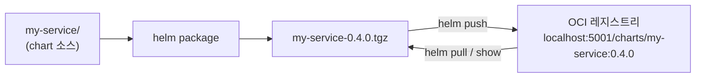
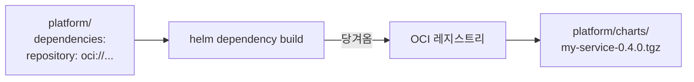

# 17. OCI registry — chart를 어디에 저장하고 어디서 가져오는가

chart를 만들었으면 어딘가에 두고 남이 받게 해야 합니다. 예전 방식은 `.tgz`들을 웹 서버에 올리고 `index.yaml`로 목록을 관리하는 chart repository였지만, 지금 실무의 기본은 **OCI 레지스트리**입니다 — 컨테이너 이미지를 저장하는 그 레지스트리(Docker Hub·GHCR·ECR·Harbor)에 chart도 아티팩트로 함께 담습니다. Helm v3는 `helm push`·`helm pull`·`helm show`가 `oci://` 주소를 그대로 받고, 의존성도 `repository: oci://...`로 가져옵니다. 이 편은 로컬 OCI 레지스트리(`registry:2`)를 띄워 chart를 `package → push → show → pull` 하고, 다른 chart가 그것을 OCI 의존성으로 당겨오는 것까지 실측합니다. 산출물은 레지스트리에 태그로 올라간 chart와, 그것을 OCI에서 가져와 렌더한 재현 가능한 기록입니다.

## 핵심 다이어그램





- **chart도 OCI 아티팩트다.** 이미지 레지스트리에 chart를 `push`하면 `이름:버전` 태그로 저장됩니다.
- **주소는 `oci://`.** `helm push`·`pull`·`show`·`install`이 `oci://호스트/경로` 형태를 그대로 받습니다.
- **버전은 태그.** chart의 `version`이 곧 레지스트리 태그가 되고, 내용은 digest로 식별됩니다.
- **의존성도 OCI에서.** `dependencies`의 `repository`를 `oci://...`로 두면 `helm dependency build`가 거기서 subchart를 당겨옵니다.
- **HTTP 레지스트리는 `--plain-http`.** 로컬 평문 레지스트리에는 TLS를 건너뛰는 플래그가 필요합니다(사설 레지스트리는 TLS를 씁니다).

아래 시연이 이 흐름을 한 단계씩 확인합니다.

## 사전 준비물

이 실습은 **macOS** 환경을 기준으로 합니다.

- **Docker** — Docker Desktop, OrbStack 등. 로컬 OCI 레지스트리를 컨테이너로 띄웁니다. `docker ps`가 에러 없이 돌아가면 OK.
- **Homebrew** — macOS 패키지 관리자.

### Helm v3 설치

이 시리즈는 **Helm v3** 기준입니다. Homebrew가 v4를 설치한다면, 아래로 v3 바이너리를 받습니다 (Intel Mac은 `arm64`를 `amd64`로 바꿉니다).

```bash
brew install helm
helm version --short      # v3.x.x 인지 확인

# v4가 깔렸다면 v3로 교체
curl -fsSL https://get.helm.sh/helm-v3.21.2-darwin-arm64.tar.gz -o /tmp/helm3.tgz
tar -xzf /tmp/helm3.tgz -C /tmp
sudo mv /tmp/darwin-arm64/helm /usr/local/bin/helm
helm version --short      # v3.21.2
```

### 로컬 OCI 레지스트리 띄우기

`registry:2` 컨테이너를 포트 5001에 올립니다(5000은 macOS AirPlay와 부딪히기 쉬워 5001을 씁니다).

```bash
docker run -d -p 5001:5000 --name rosa-registry registry:2
```

정리할 때는 `docker rm -f rosa-registry`.

## 실습 환경

| 경로 | 내용 |
|---|---|
| `manifests/my-service/` | 레지스트리에 올릴 chart |
| `manifests/platform/` | OCI에서 `my-service`를 의존성으로 가져오는 부모 chart |

```
my-service/            # version 0.4.0
├── Chart.yaml
├── values.yaml
└── templates/deployment.yaml

platform/
├── Chart.yaml         # dependencies: repository oci://localhost:5001/charts
├── Chart.lock         # OCI에서 받은 버전 고정
├── values.yaml
└── charts/            # dependency build가 채운다 (.tgz 커밋 제외)
```

아래 명령은 `manifests/` 디렉터리에서 실행합니다.

```bash
cd manifests
```

## 여기서 직접 확인할 수 있는 것

### package — chart를 tarball로

`helm package`가 chart를 `이름-버전.tgz`로 묶습니다.

```bash
helm package my-service
```

```
Successfully packaged chart and saved it to: .../my-service-0.4.0.tgz
```

이 tarball이 레지스트리에 올라갈 아티팩트입니다.

### push — 레지스트리에 올린다

`helm push`에 `oci://` 주소를 줍니다. 평문 HTTP 레지스트리라 `--plain-http`를 붙입니다.

```bash
helm push my-service-0.4.0.tgz oci://localhost:5001/charts --plain-http
```

```
Pushed: localhost:5001/charts/my-service:0.4.0
Digest: sha256:53521562f12f5d171358b973d0fea2a630c114a1c082ce85b0510de171205e99
```

chart의 `version`(`0.4.0`)이 그대로 태그가 되고, 내용은 `Digest`로 식별됩니다. `--plain-http` 없이 하면 `downgrades scheme from https` 에러가 나는데, 이는 Helm이 기본으로 HTTPS를 기대하기 때문입니다.

### show — 받지 않고 레지스트리에서 읽는다

`helm show chart`에 `oci://` 주소를 주면, 로컬에 받지 않고 레지스트리에서 메타데이터를 읽습니다.

```bash
helm show chart oci://localhost:5001/charts/my-service --version 0.4.0 --plain-http
```

```
apiVersion: v2
appVersion: "1.27"
description: OCI 레지스트리로 publish·pull 하는 chart
name: my-service
type: application
version: 0.4.0
```

레지스트리에 올린 그대로의 `Chart.yaml`이 돌아옵니다.

### pull — tarball로 받는다

```bash
helm pull oci://localhost:5001/charts/my-service --version 0.4.0 --plain-http
ls my-service-*.tgz
```

```
Pulled: localhost:5001/charts/my-service:0.4.0
Digest: sha256:53521562f12f5d171358b973d0fea2a630c114a1c082ce85b0510de171205e99
my-service-0.4.0.tgz
```

push할 때와 같은 digest — 올린 것과 받은 것이 바이트 단위로 같습니다.

### 레지스트리에 정말 있는지 — 카탈로그 API

레지스트리의 표준 API로 저장 상태를 직접 봅니다.

```bash
curl -s http://localhost:5001/v2/_catalog
curl -s http://localhost:5001/v2/charts/my-service/tags/list
```

```
{"repositories":["charts/my-service"]}
{"name":"charts/my-service","tags":["0.4.0"]}
```

chart가 `charts/my-service` 저장소에 `0.4.0` 태그로 들어 있습니다 — 이미지와 똑같은 방식으로 저장됩니다.

### 의존성을 OCI에서 당겨온다

`platform`은 `my-service`를 OCI 의존성으로 선언합니다.

```yaml
# platform/Chart.yaml
dependencies:
  - name: my-service
    version: "0.4.0"
    repository: "oci://localhost:5001/charts"
```

`helm dependency build`가 그 주소에서 subchart를 당겨옵니다.

```bash
helm dependency build platform --plain-http
ls platform/charts/
```

```
Downloading my-service from repo oci://localhost:5001/charts
Pulled: localhost:5001/charts/my-service:0.4.0
Digest: sha256:53521562f12f5d171358b973d0fea2a630c114a1c082ce85b0510de171205e99
my-service-0.4.0.tgz
```

이제 부모를 렌더하면 OCI에서 받은 subchart가 함께 나옵니다. `platform/values.yaml`이 `my-service.replicaCount: 2`를 줬으므로 `replicas: 2`입니다.

```bash
helm template app platform | grep -E '^kind:|  name:|replicas:'
```

```
kind: Deployment
  name: app-my-service
  replicas: 2
```

로컬 파일이 아니라 레지스트리에서 당겨온 chart가, 부모 값으로 조절돼 렌더됐습니다. `helm dependency build`는 받은 버전을 `Chart.lock`에 못박습니다.

```bash
cat platform/Chart.lock
```

```
dependencies:
- name: my-service
  repository: oci://localhost:5001/charts
  version: 0.4.0
digest: sha256:4aa5f3eb...
```

### 정리

```bash
docker rm -f rosa-registry
```

## 이 편의 산출물

- 레지스트리에 `charts/my-service:0.4.0` 태그로 올라간 chart와, `helm package → push → show → pull`을 각각 확인한 기록 — push와 pull의 digest가 같아 올린 것과 받은 것이 동일함을 확인.
- `--plain-http`가 왜 필요한지(평문 HTTP 레지스트리에서 `downgrades scheme from https` 회피) 확인한 경험.
- 레지스트리 카탈로그 API(`/v2/_catalog`·`/v2/.../tags/list`)로 chart가 이미지와 같은 방식으로 저장됨을 직접 본 근거.
- `dependencies`의 `repository`를 `oci://...`로 두고 `helm dependency build`가 subchart를 레지스트리에서 당겨와, 부모 값(`replicaCount: 2`)으로 조절돼 렌더되고 `Chart.lock`에 버전이 고정되는 것을 확인한 결과물.
