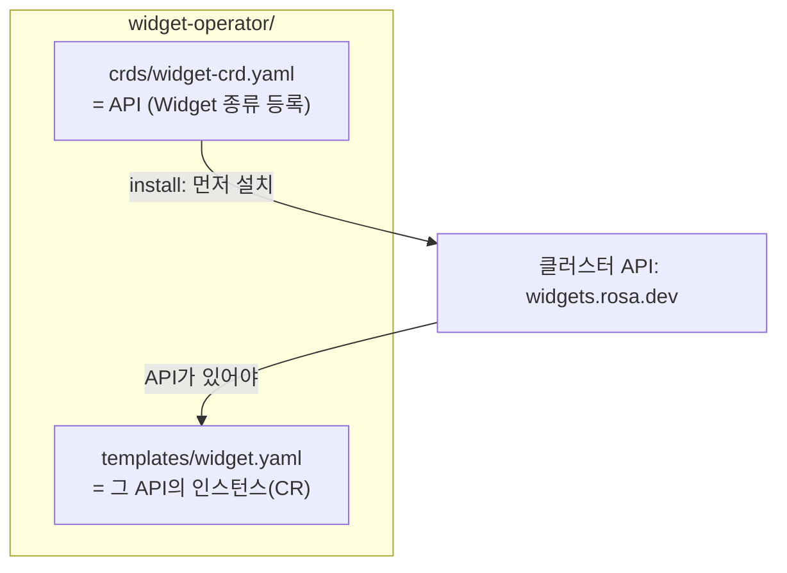
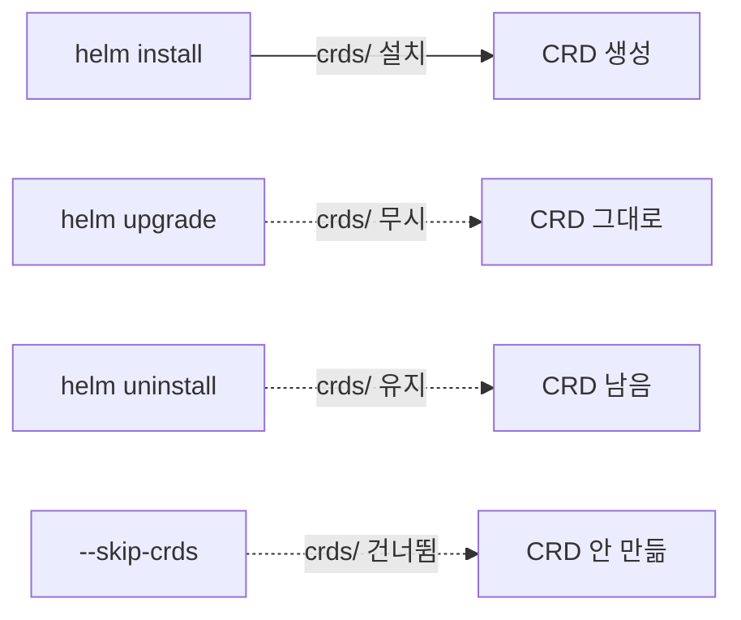

# 18. CRD와 Helm — Helm은 API를 깔고, Operator는 그 API를 구현한다

CRD(CustomResourceDefinition)는 클러스터 전체에 새로운 API 종류를 등록하는, 네임스페이스에 갇히지 않는 광역 객체입니다. 그래서 Helm은 CRD를 보통 리소스와 다르게 다룹니다 — chart의 `crds/` 디렉터리에 둔 CRD는 `install` 때 **가장 먼저 한 번** 설치되고, `upgrade` 때는 **건드리지 않으며**, `uninstall` 때도 **지우지 않습니다**. 이 규칙을 모르면 "chart를 올렸는데 CRD 스키마가 안 바뀐다", "release를 지웠는데 CRD가 남아 있다" 같은 혼란이 생깁니다. 그리고 이 `crds/`가 바로 Prometheus Operator·cert-manager·External Secrets 같은 것들이 Helm으로 배포되는 방식의 핵심입니다 — **Helm은 API(CRD)를 깔고, 그 안의 Operator(Deployment)가 API를 구현(reconcile)합니다.** 이 편은 CRD를 `crds/`에, 그 CRD의 인스턴스(CR)를 `templates/`에 둔 chart `widget-operator/`로 이 규칙들을 kind 클러스터에서 실물로 확인합니다. 산출물은 `install`·`upgrade`·`uninstall`·`--skip-crds`가 CRD를 각각 어떻게 다루는지 직접 관찰한 기록입니다.

## 핵심 다이어그램





- **install에서 먼저.** `crds/`의 CRD가 `templates/`보다 먼저 설치돼, 그 API에 기대는 CR을 같은 설치에서 만들 수 있습니다.
- **upgrade에서 무시.** `crds/`를 고쳐도 `helm upgrade`는 이미 있는 CRD를 갱신하지 않습니다.
- **uninstall에서 유지.** release를 지워도 CRD는 클러스터에 남습니다 — 지우려면 손으로 `kubectl delete crd`.
- **`--skip-crds`로 건너뛴다.** CRD가 이미 있다고 보고 설치를 생략합니다. 없으면 CR이 갈 곳을 잃습니다.
- **Operator와 한 chart.** `crds/`는 API를, `templates/`의 Deployment는 그 API를 구현하는 Operator를 담습니다.

아래 시연이 이 규칙들을 하나씩 확인합니다.

## 사전 준비물

이 실습은 **macOS** 환경을 기준으로 합니다.

- **Docker** — Docker Desktop, OrbStack 등. `docker ps`가 에러 없이 돌아가면 OK.
- **Homebrew** — macOS 패키지 관리자.

### kind · kubectl 설치

```bash
brew install kind kubectl
```

### Helm v3 설치

이 시리즈는 **Helm v3** 기준입니다. Homebrew가 v4를 설치한다면, 아래로 v3 바이너리를 받습니다 (Intel Mac은 `arm64`를 `amd64`로 바꿉니다).

```bash
brew install helm
helm version --short      # v3.x.x 인지 확인

# v4가 깔렸다면 v3로 교체
curl -fsSL https://get.helm.sh/helm-v3.21.2-darwin-arm64.tar.gz -o /tmp/helm3.tgz
tar -xzf /tmp/helm3.tgz -C /tmp
sudo mv /tmp/darwin-arm64/helm /usr/local/bin/helm
helm version --short      # v3.21.2
```

### rosa-lab 클러스터 · namespace 준비

```bash
kind create cluster --name rosa-lab
kubectl create namespace rosa-lab
kubectl config set-context --current --namespace=rosa-lab
```

이미 있으면 건너뜁니다 (`kind get clusters`로 확인).

## 실습 환경

| 경로 | 내용 |
|---|---|
| `manifests/widget-operator/` | `crds/`에 CRD, `templates/`에 CR을 둔 chart |

```
widget-operator/
├── Chart.yaml
├── crds/
│   └── widget-crd.yaml     # Widget API 정의 (crds/ = 특수 취급)
└── templates/
    └── widget.yaml         # Widget 인스턴스 (그 API에 의존)
```

`crds/widget-crd.yaml`은 `widgets.rosa.dev`라는 CRD를, `templates/widget.yaml`은 그 종류의 인스턴스 하나를 담습니다.

```yaml
# templates/widget.yaml
apiVersion: rosa.dev/v1
kind: Widget
metadata:
  name: {{ .Release.Name }}-sample
spec:
  size: small
```

아래 명령은 `manifests/` 디렉터리에서 실행합니다.

```bash
cd manifests
```

## 여기서 직접 확인할 수 있는 것

### install — CRD가 먼저, 그다음 CR

설치 전에는 `Widget`이라는 종류가 클러스터에 없습니다.

```bash
kubectl get crd widgets.rosa.dev
```

```
Error from server (NotFound): customresourcedefinitions.apiextensions.k8s.io "widgets.rosa.dev" not found
```

설치하면 `crds/`의 CRD가 먼저 등록되고, 그 덕에 `templates/`의 `Widget` 인스턴스가 성립합니다.

```bash
helm install wdg widget-operator -n rosa-lab
kubectl get crd widgets.rosa.dev
kubectl get widget -n rosa-lab
```

```
STATUS: deployed
...
NAME               CREATED AT
widgets.rosa.dev   2026-07-01T02:11:18Z
NAME         AGE
wdg-sample   0s
```

CRD와 그 인스턴스가 한 설치에서 함께 뜹니다. `crds/`가 `templates/`보다 먼저 적용되기 때문에, 방금 정의한 종류를 같은 chart 안에서 바로 씁니다.

### upgrade — crds/를 고쳐도 CRD는 그대로

`crds/widget-crd.yaml`의 스키마에 `color` 필드를 추가해 봅니다.

```yaml
# crds/widget-crd.yaml (spec.properties 에 추가)
                size:
                  type: string
                color:
                  type: string
```

그리고 upgrade합니다.

```bash
helm upgrade wdg widget-operator -n rosa-lab
kubectl get crd widgets.rosa.dev \
  -o jsonpath='{.spec.versions[0].schema.openAPIV3Schema.properties.spec.properties}'
```

```
{"size":{"type":"string"}}
```

release는 REVISION 2로 올라갔지만, 클러스터의 CRD에는 `color`가 없습니다 — `size`뿐입니다. **Helm은 `upgrade` 때 `crds/`를 아예 보지 않습니다.** CRD 스키마를 바꾸려면 `kubectl apply -f crds/`로 직접 적용해야 합니다. 이게 "chart를 올렸는데 CRD가 안 바뀐다"의 정체입니다.

### uninstall — release를 지워도 CRD는 남는다

release를 통째로 지웁니다.

```bash
helm uninstall wdg -n rosa-lab
kubectl get widget -n rosa-lab
kubectl get crd widgets.rosa.dev
```

```
release "wdg" uninstalled
No resources found in rosa-lab namespace.
NAME               CREATED AT
widgets.rosa.dev   2026-07-01T02:11:18Z
```

인스턴스(`wdg-sample`)는 사라졌지만 CRD는 그대로 남아 있습니다. Helm은 `crds/`의 CRD를 삭제 대상에서 뺍니다 — CRD를 지우면 그 종류의 모든 CR이 클러스터 전체에서 함께 날아가기 때문에, 안전을 위해 손으로만 지우게 합니다.

```bash
kubectl delete crd widgets.rosa.dev
```

### --skip-crds — CRD 설치를 건너뛴다

이미 CRD가 있는 환경(예: 운영팀이 미리 깔아둔 경우)에서는 `--skip-crds`로 CRD 설치를 생략합니다. 그런데 CRD가 **없는** 상태에서 이 플래그를 주면, `templates/`의 CR이 갈 곳을 잃습니다.

```bash
kubectl delete crd widgets.rosa.dev        # CRD 없는 상태로 만들고
helm install wdg2 widget-operator -n rosa-lab --skip-crds
```

```
Error: INSTALLATION FAILED: unable to build kubernetes objects from release manifest:
resource mapping not found for name: "wdg2-sample" ... no matches for kind "Widget" in version "rosa.dev/v1"
```

`Widget`이라는 종류가 클러스터에 없으니 CR을 만들 수 없습니다. `--skip-crds`는 "CRD는 내가 이미 챙겼다"고 Helm에게 말하는 것이라, 정말 있을 때만 안전합니다.

### 왜 Operator는 Helm과 같이 배포되나

이 chart의 구조가 곧 답입니다. `crds/`는 **API**(`Widget`이라는 종류)를 등록하고, `templates/`는 그 API를 쓰는 것을 담습니다. 실무의 Operator chart도 똑같습니다 — cert-manager는 `Certificate`·`Issuer` CRD를 `crds/`로 깔고, `templates/`의 controller Deployment가 그 CR을 지켜보며 실제 인증서를 발급합니다. Prometheus Operator는 `ServiceMonitor`·`Prometheus` CRD를 깔고, operator가 그것을 읽어 스크레이프 설정을 만듭니다.

정리하면 역할이 둘로 갈립니다.

- **Helm(+`crds/`)**: 새로운 종류를 클러스터 API에 등록한다 — "이런 객체를 쓸 수 있다"를 선언.
- **Operator(`templates/`의 Deployment)**: 그 종류의 CR을 감시하며 실제 상태로 만든다 — 선언을 동작으로.

그래서 CRD 업그레이드가 Helm의 손을 벗어나 있다는 사실이 중요합니다. Operator를 새 버전으로 올릴 때 CRD 스키마도 바뀌어야 하면, `helm upgrade`만으로는 부족하고 CRD를 따로 적용하는 절차가 필요합니다.

## 이 편의 산출물

- `crds/`에 CRD(API)를, `templates/`에 그 CR을 둔 chart `widget-operator/` — 설치 시 CRD가 먼저 적용돼 CR이 성립하는 것을 클러스터에서 확인한 상태.
- `helm upgrade`가 `crds/` 변경(`color` 필드 추가)을 무시해 클러스터 CRD가 `size`만 유지하는 것을 `jsonpath`로 직접 관찰한 기록.
- `helm uninstall`이 CR은 지우되 CRD는 남기는 것, `--skip-crds`가 CRD 없는 환경에서 `no matches for kind "Widget"`으로 실패하는 것을 각각 확인한 경험.
- CRD = 광역 API 변경이라 Helm이 특수 취급하는 이유와, Operator chart(cert-manager·Prometheus Operator)가 `crds/`(API) + `templates/`(구현)로 나뉘는 구조를 정리한 근거.
