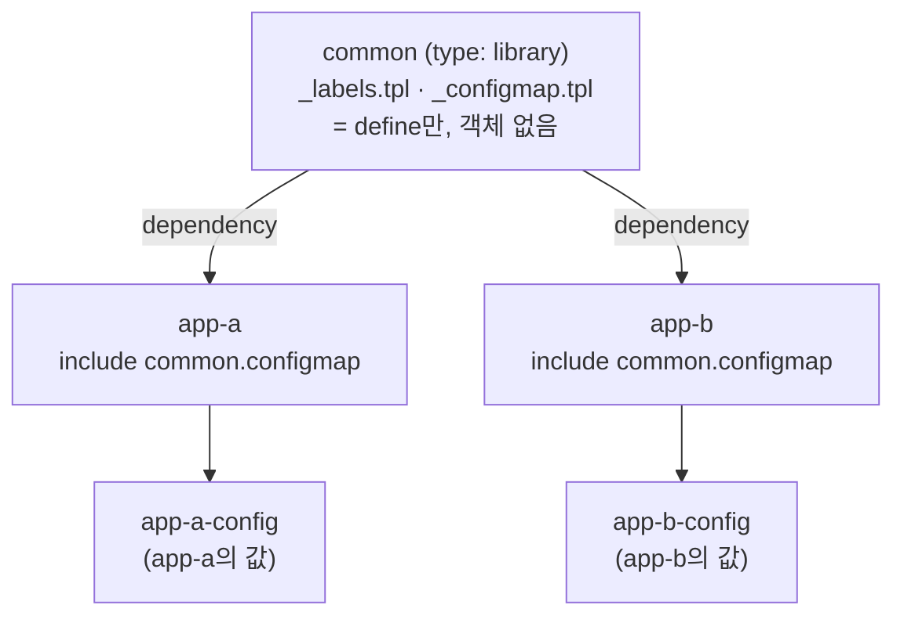

# 19. library chart — 여러 chart의 공통부를 떼어낸다

앱이 여러 개면 chart마다 같은 코드가 반복됩니다 — 같은 라벨 규칙, 같은 ConfigMap 뼈대, 같은 이름 관례. 한 chart에서 `_helpers.tpl`로 묶는 건 그 chart 안에서만 통하고, 옆 chart는 그 블록을 다시 씁니다. `type: library` chart는 이 공통부를 **한 곳에 정의해 여러 앱이 공유**하게 합니다. 라이브러리 chart는 자기 객체를 만들지 않습니다 — `templates/`에 `define` 블록만 담고, 그것을 가져다 쓰는 앱 chart가 `include`로 불러 객체를 찍습니다. 그래서 라이브러리는 그 자체로 설치되지 않고, 오직 다른 chart의 의존성으로만 쓰입니다. 이 편은 공통 라벨·ConfigMap 템플릿을 담은 library `common`과, 그것을 가져다 쓰는 두 앱 `app-a`·`app-b`로 이 구조를 확인합니다. 산출물은 공통부를 한 번 정의해 두 앱이 각자 값으로 찍어낸 기록입니다.

## 핵심 다이어그램



- **library는 객체를 안 만든다.** `templates/`에 `_*.tpl`의 `define` 블록만 두고, 렌더 가능한 매니페스트는 없습니다.
- **library는 설치되지 않는다.** `helm install`/`helm template`을 직접 걸면 `library charts are not installable`로 거부됩니다.
- **앱이 의존성으로 가져온다.** 앱 chart의 `dependencies`에 library를 넣고 `helm dependency build`로 당겨옵니다.
- **호출한 앱의 컨텍스트로 렌더된다.** library 템플릿 안의 `.Values`·`.Chart`·`.Release`는 부른 앱의 것입니다.
- **정의는 한 번, 사용은 여럿.** 두 앱이 같은 `common.configmap`을 불러도 각자의 값·이름으로 찍힙니다.

아래 시연이 이 구조를 확인합니다.

## 사전 준비물

이 실습은 **macOS** 환경을 기준으로 합니다. 렌더만 확인하므로 클러스터는 필요 없고, Helm만 있으면 됩니다.

- **Homebrew** — macOS 패키지 관리자.

### Helm v3 설치

이 시리즈는 **Helm v3** 기준입니다. Homebrew가 v4를 설치한다면, 아래로 v3 바이너리를 받습니다 (Intel Mac은 `arm64`를 `amd64`로 바꿉니다).

```bash
brew install helm
helm version --short      # v3.x.x 인지 확인

# v4가 깔렸다면 v3로 교체
curl -fsSL https://get.helm.sh/helm-v3.21.2-darwin-arm64.tar.gz -o /tmp/helm3.tgz
tar -xzf /tmp/helm3.tgz -C /tmp
sudo mv /tmp/darwin-arm64/helm /usr/local/bin/helm
helm version --short      # v3.21.2
```

## 실습 환경

| 경로 | 내용 |
|---|---|
| `manifests/common/` | 공통 템플릿만 담은 library chart |
| `manifests/app-a/` | common을 가져다 쓰는 앱 |
| `manifests/app-b/` | common을 가져다 쓰는 또 다른 앱 |

```
common/                    # type: library
├── Chart.yaml
└── templates/
    ├── _labels.tpl        # define "common.labels"
    └── _configmap.tpl     # define "common.configmap" (객체 한 장을 통째로)

app-a/                     # type: application
├── Chart.yaml            # dependencies: common (file://)
├── values.yaml
└── templates/
    └── configmap.yaml    # {{ include "common.configmap" . }}
```

`common`의 `_configmap.tpl`은 ConfigMap 한 장을 통째로 정의합니다.

```
{{- define "common.configmap" -}}
apiVersion: v1
kind: ConfigMap
metadata:
  name: {{ .Release.Name }}-config
  labels:
    {{- include "common.labels" . | nindent 4 }}
data:
  {{- toYaml .Values.config | nindent 2 }}
{{- end -}}
```

앱의 `templates/configmap.yaml`은 그것을 한 줄로 부릅니다.

```
{{ include "common.configmap" . }}
```

아래 명령은 `manifests/` 디렉터리에서 실행합니다.

```bash
cd manifests
```

## 여기서 직접 확인할 수 있는 것

### library는 그 자체로 설치되지 않는다

`common`을 직접 렌더하려 하면 거부됩니다.

```bash
helm template lib common
```

```
Error: library charts are not installable
```

`type: library`라 Helm이 설치·렌더 대상에서 뺍니다. 라이브러리는 객체를 만들지 않고 템플릿만 제공하므로, 혼자서는 할 일이 없습니다.

### 앱이 library를 의존성으로 가져온다

`app-a`는 `common`을 `dependencies`로 선언했습니다. `helm dependency build`가 그것을 `charts/`로 당겨옵니다.

```bash
helm dependency build app-a
```

가져온 뒤 렌더하면, 앱의 `include`가 library의 `common.configmap`을 불러 ConfigMap을 찍습니다.

```bash
helm template app-a app-a
```

```
# Source: app-a/templates/configmap.yaml
apiVersion: v1
kind: ConfigMap
metadata:
  name: app-a-config
  labels:
    app.kubernetes.io/name: app-a
    app.kubernetes.io/instance: app-a
    app.kubernetes.io/managed-by: Helm
    helm.sh/chart: app-a-0.1.0
data:
  APP: app-a
  LOG_LEVEL: info
```

`# Source`가 `app-a/templates/configmap.yaml`인 데 주목합니다 — 객체를 찍은 건 앱이고, library는 뼈대만 제공했습니다. 라벨의 `app.kubernetes.io/name: app-a`와 `helm.sh/chart: app-a-0.1.0`도 눈여겨봅니다. library 템플릿 안에서 `.Chart.Name`을 썼는데 결과는 `common`이 아니라 `app-a`입니다 — **템플릿은 부른 앱의 컨텍스트에서 실행**되기 때문입니다.

### 같은 library, 다른 앱, 다른 값

`app-b`는 같은 `common.configmap`을 부르지만 자기 값을 가집니다.

```bash
helm dependency build app-b
helm template app-b app-b
```

```
# Source: app-b/templates/configmap.yaml
apiVersion: v1
kind: ConfigMap
metadata:
  name: app-b-config
  labels:
    app.kubernetes.io/name: app-b
    app.kubernetes.io/instance: app-b
    app.kubernetes.io/managed-by: Helm
    helm.sh/chart: app-b-0.1.0
data:
  APP: app-b
  FEATURE_X: "on"
  LOG_LEVEL: warn
```

이름은 `app-b-config`, 라벨은 `app-b`, data에는 `app-b`의 값(`FEATURE_X: on` 포함)이 들어갑니다. **공통 템플릿은 `common`에 한 번 정의했지만, 두 앱이 각자의 값·이름으로 찍어냅니다.** ConfigMap 구조를 고치고 싶으면 `common/_configmap.tpl` 한 곳만 바꾸면 두 앱에 함께 반영됩니다.

### `_helpers.tpl`과 무엇이 다른가

한 chart 안의 `_helpers.tpl`도 `define`을 담지만, 그 chart 안에서만 보입니다. 옆 chart는 그 블록을 다시 적어야 합니다. `type: library` chart는 그 `define`들을 **패키지로 떼어내** 여러 chart가 의존성으로 공유하게 만든 것입니다 — 조직에 앱이 수십 개면 라벨·ConfigMap·Deployment 뼈대를 library 하나에 모아 전부가 같은 규칙을 따르게 합니다.

## 이 편의 산출물

- 공통 템플릿(`common.labels`·`common.configmap`)만 담은 library chart `common`(`type: library`) — `helm template`을 직접 걸면 `library charts are not installable`로 거부되는 것을 확인한 상태.
- `common`을 `dependencies`로 가져와 `include`로 부르는 두 앱 `app-a`·`app-b` — `helm dependency build`로 library를 당겨와 각자 ConfigMap을 찍은 기록.
- library 템플릿이 부른 앱의 컨텍스트에서 실행돼(`.Chart.Name`이 `app-a`/`app-b`로 평가) 같은 정의가 각 앱의 값·이름으로 렌더되는 것을 두 앱 대조로 확인한 경험.
- 공통부를 `common` 한 곳에 정의해, 고칠 때 한 파일만 바꾸면 여러 앱에 반영되는 구조를 세운 근거.
