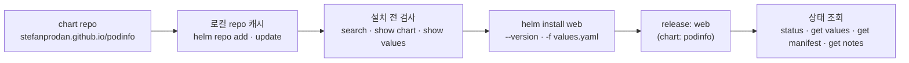
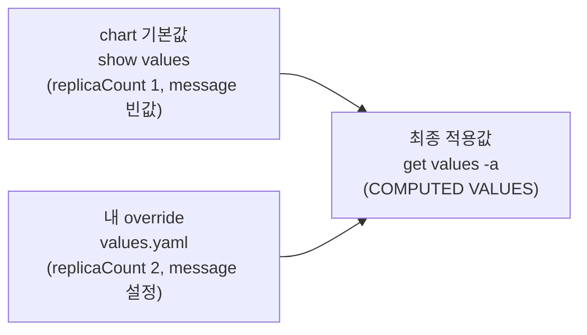

# 2. 첫 release — 남의 chart 설치

Helm을 쓰는 대부분의 출발점은 chart를 직접 만드는 게 아니라, 남이 만든 chart를 받아 설치하는 일입니다. 이 편은 공개 repo에서 chart를 등록하고, 설치 전에 무엇을 바꿀 수 있는지 확인하고, 내 값으로 덮어 설치한 뒤, 그 release의 상태를 조회하는 흐름을 다룹니다. 핵심 감각 두 가지를 손에 넣습니다 — **release 이름은 설치하는 내가 정한다**(chart 이름과 무관), 그리고 **내 값(`values.yaml`)이 chart 기본값 위에 병합된다**. 실습은 `podinfo`(데모용 공개 chart)를 `replicaCount`와 화면 메시지만 바꿔 설치하고, 그 값이 클러스터에서 실제로 동작하는지 앱 응답까지 확인합니다. 산출물은 "repo 등록 → 검사 → 설정 설치 → 상태 조회"의 재현 가능한 기록과, `helm get values`(내가 준 값)와 `helm get values -a`(병합된 최종값)의 차이를 직접 본 경험입니다.

## 핵심 다이어그램





- **chart는 repo에서 온다.** `helm repo add`로 등록하면 그 repo의 색인이 로컬 캐시에 받아집니다. `search`·`show`는 클러스터가 아니라 이 캐시를 봅니다.
- **설치 전에 본다.** `show chart`로 버전·앱을, `show values`로 무엇을 바꿀 수 있는지 확인한 뒤 설치합니다. 남의 chart는 "무슨 값을 노출하는가"를 먼저 읽는 게 첫걸음입니다.
- **release 이름은 내가 정한다.** `helm install web podinfo/podinfo`에서 `web`은 release 이름이고 `podinfo/podinfo`는 `repo/chart`입니다. 둘은 무관하며, 생성되는 객체는 `web-podinfo`처럼 release 이름과 chart 이름이 합쳐진 형태가 됩니다.
- **내 값이 기본값을 덮는다.** `-f values.yaml`로 준 값이 chart 기본값 위에 병합됩니다. `get values`는 내가 준 값만, `get values -a`는 병합된 최종값을 보여 줍니다.

아래 시연이 이 흐름을 한 줄씩 손으로 확인합니다.

## 사전 준비물

이 실습은 **macOS** 환경을 기준으로 합니다.

- **Docker** — Docker Desktop, OrbStack 등. `docker ps`가 에러 없이 돌아가면 OK.
- **Homebrew** — macOS 패키지 관리자.

### kind · kubectl 설치

```bash
brew install kind kubectl
```

### Helm v3 설치

이 시리즈는 **Helm v3** 기준입니다. Homebrew가 v4를 설치한다면, 아래로 v3 바이너리를 받습니다 (Intel Mac은 `arm64`를 `amd64`로 바꿉니다).

```bash
brew install helm
helm version --short      # v3.x.x 인지 확인

# v4가 깔렸다면 v3로 교체
curl -fsSL https://get.helm.sh/helm-v3.21.2-darwin-arm64.tar.gz -o /tmp/helm3.tgz
tar -xzf /tmp/helm3.tgz -C /tmp
sudo mv /tmp/darwin-arm64/helm /usr/local/bin/helm
helm version --short      # v3.21.2
```

### rosa-lab 클러스터 · namespace 준비

```bash
kind create cluster --name rosa-lab
kubectl create namespace rosa-lab
kubectl config set-context --current --namespace=rosa-lab
```

이미 있으면 건너뜁니다 (`kind get clusters`, `kubectl config get-contexts`로 확인).

## 실습 환경

| 파일 | 내용 |
|---|---|
| `manifests/values.yaml` | podinfo chart 기본값을 덮어쓰는 consumer override (`replicaCount: 2`, `ui.message`) |

> 이 파일은 chart 안이 아니라 chart **밖**에 있습니다 — 남의 chart는 그대로 두고, 내 값만 따로 들고 다니며 설치 때 얹는 게 소비자의 기본 사용법입니다.

## 여기서 직접 확인할 수 있는 것

### helm repo add — chart는 어디서 오나

chart repo를 등록하고 색인을 받습니다.

```bash
helm repo add podinfo https://stefanprodan.github.io/podinfo
helm repo update podinfo
```

```
"podinfo" has been added to your repositories
Hang tight while we grab the latest from your chart repositories...
...Successfully got an update from the "podinfo" chart repository
Update Complete. ⎈Happy Helming!⎈
```

`repo add`는 클러스터를 건드리지 않습니다 — repo의 색인을 로컬에 등록할 뿐입니다.

```bash
helm repo list
```

```
NAME   	URL
podinfo	https://stefanprodan.github.io/podinfo
```

### helm search repo — 무엇을, 어느 버전을

등록한 repo에서 chart를 찾고, 고를 수 있는 버전을 봅니다.

```bash
helm search repo podinfo --versions | head -6
```

```
NAME           	CHART VERSION	APP VERSION	DESCRIPTION
podinfo/podinfo	6.14.0       	6.14.0     	Podinfo Helm chart for Kubernetes
podinfo/podinfo	6.13.0       	6.13.0     	Podinfo Helm chart for Kubernetes
podinfo/podinfo	6.12.0       	6.12.0     	Podinfo Helm chart for Kubernetes
podinfo/podinfo	6.11.2       	6.11.2     	Podinfo Helm chart for Kubernetes
podinfo/podinfo	6.11.1       	6.11.1     	Podinfo Helm chart for Kubernetes
```

`CHART VERSION`은 chart 패키지의 버전이고 `APP VERSION`은 그 안에 든 앱의 버전입니다 — 둘은 별개로 매겨집니다(podinfo는 우연히 같습니다). chart의 메타데이터도 따로 봅니다.

```bash
helm show chart podinfo/podinfo | head -12
```

```
apiVersion: v1
appVersion: 6.14.0
description: Podinfo Helm chart for Kubernetes
home: https://github.com/stefanprodan/podinfo
kubeVersion: '>=1.23.0-0'
maintainers:
- email: stefanprodan@users.noreply.github.com
  name: stefanprodan
name: podinfo
sources:
- https://github.com/stefanprodan/podinfo
version: 6.14.0
```

### helm show values — 무엇을 바꿀 수 있나

남의 chart를 설치하기 전, 노출된 값을 먼저 읽습니다. 이게 "이 chart를 어떻게 설정하는가"의 사용설명서입니다.

```bash
helm show values podinfo/podinfo | head -20
```

```
# Default values for podinfo.

replicaCount: 1
logLevel: info
host: #0.0.0.0
backend: #http://backend-podinfo:9898/echo
backends: []

image:
  repository: ghcr.io/stefanprodan/podinfo
  tag: 6.14.0
  pullPolicy: IfNotPresent
  pullSecrets: []

prefix: /

ui:
  color: "#34577c"
  message: ""
  logo: ""
```

여기서 두 값을 바꾸기로 합니다 — `replicaCount`(기본 1)와 `ui.message`(기본 빈 문자열). 그 override가 `manifests/values.yaml`입니다.

```yaml
# podinfo chart의 기본값을 덮어쓰는 consumer override
replicaCount: 2
ui:
  message: "hello from rosa-lab"
```

### helm install — release 이름은 내가 정한다

repo의 chart를, 버전을 고정하고, 내 values를 얹어 설치합니다.

```bash
helm install web podinfo/podinfo --version 6.14.0 -f manifests/values.yaml -n rosa-lab
```

```
NAME: web
LAST DEPLOYED: Fri Jun 26 15:33:08 2026
NAMESPACE: rosa-lab
STATUS: deployed
REVISION: 1
NOTES:
1. Get the application URL by running these commands:
  echo "Visit http://127.0.0.1:8080 to use your application"
  kubectl -n rosa-lab port-forward deploy/web-podinfo 8080:9898
```

`web`이라는 release 이름은 chart 이름(`podinfo`)과 무관하게 내가 골랐습니다. `--version 6.14.0`으로 버전을 박았으니, 나중에 누가 같은 명령을 실행해도 같은 chart가 깔립니다. 끝의 `NOTES`는 chart 제작자가 넣어 둔 설치 후 안내입니다.

```bash
helm list -n rosa-lab
```

```
NAME	NAMESPACE	REVISION	UPDATED                            	STATUS  	CHART         	APP VERSION
web 	rosa-lab 	1       	2026-06-26 15:33:08.13605 +0900 KST	deployed	podinfo-6.14.0	6.14.0
```

### helm get — 무엇이, 어떤 값으로 깔렸나

"내가 준 값"과 "병합된 최종값"은 다른 명령으로 봅니다.

```bash
helm get values web -n rosa-lab
```

```
USER-SUPPLIED VALUES:
replicaCount: 2
ui:
  message: hello from rosa-lab
```

```bash
helm get values web -a -n rosa-lab | head -12
```

```
COMPUTED VALUES:
affinity: {}
backend: null
backends: []
cache: ""
certificate:
  create: false
  dnsNames:
  - podinfo
  issuerRef:
    kind: ClusterIssuer
    name: self-signed
```

`get values`는 내가 넘긴 두 값만, `get values -a`는 **chart 기본값에 내 값을 병합한 최종값 전체**를 보여 줍니다. 이 병합 결과가 실제로 렌더된 매니페스트는 `get manifest`로 봅니다.

```bash
helm get manifest web -n rosa-lab | grep -nE 'replicas:|PODINFO_UI_MESSAGE|hello from rosa-lab'
```

```
39:  replicas: 2
72:          - name: PODINFO_UI_MESSAGE
73:            value: "hello from rosa-lab"
```

내 두 값이 `replicas: 2`와 환경변수로 정확히 들어갔습니다. (`helm get notes web`은 설치 때 본 `NOTES`를, `helm status web`은 release 상태 요약을 다시 보여 줍니다.)

### 값이 진짜 동작하나 — 앱 응답으로 확인

렌더된 매니페스트만이 아니라, 클러스터에서 실제로 그 값이 동작하는지 봅니다. `replicaCount: 2`는 Pod 수로, `ui.message`는 앱 응답으로 드러납니다.

```bash
kubectl rollout status deploy/web-podinfo -n rosa-lab
kubectl get pods -n rosa-lab
```

```
deployment "web-podinfo" successfully rolled out
NAME                           READY   STATUS    RESTARTS   AGE
web-podinfo-57867c76d4-7vmcd   1/1     Running   0          42s
web-podinfo-57867c76d4-qshnq   1/1     Running   0          42s
```

Pod가 둘입니다. 앱이 내려 주는 JSON에서 메시지를 확인합니다.

```bash
kubectl -n rosa-lab port-forward deploy/web-podinfo 8080:9898 >/dev/null 2>&1 &
sleep 4
curl -s http://127.0.0.1:8080/ | grep -E '"message"|"version"|"hostname"'
kill %1
```

```
    "hostname": "web-podinfo-57867c76d4-qshnq",
    "version": "6.14.0",
    "message": "hello from rosa-lab",
```

`values.yaml`에 적은 메시지가 앱 응답까지 닿았습니다. `helm show values`에서 본 값 하나가, 렌더된 매니페스트를 거쳐, 실제 앱 동작으로 이어지는 경로를 끝까지 확인한 것입니다.

### 정리

```bash
helm uninstall web -n rosa-lab
```

```
release "web" uninstalled
```

등록한 repo까지 거두려면:

```bash
helm repo remove podinfo
```

클러스터까지 정리하려면:

```bash
kind delete cluster --name rosa-lab
```

## 이 편의 산출물

- 공개 repo에서 chart를 등록(`helm repo add`·`update`)하고, 버전을 골라(`helm search repo --versions`), 설치 전에 노출 값을 읽고(`helm show chart`·`show values`), 내 values로 덮어 설치한(`helm install --version -f`) 재현 가능한 기록.
- **release 이름은 설치하는 쪽이 정한다**는 것 — `web`이라는 release가 `podinfo` chart로 깔리고 객체는 `web-podinfo`가 된다는 것을 직접 본 상태.
- `helm get values`(USER-SUPPLIED, 내가 준 값)와 `helm get values -a`(COMPUTED, 기본값에 병합된 최종값)의 차이를 보고, **내 값이 chart 기본값 위에 병합된다**는 모델을 확인한 상태.
- `manifests/values.yaml`의 두 값(`replicaCount`·`ui.message`)이 `helm get manifest`의 렌더 결과(`replicas: 2`·환경변수)를 거쳐, 실제 Pod 수와 앱 응답(`"message": "hello from rosa-lab"`)까지 이어지는 경로를 끝까지 추적한 경험.
