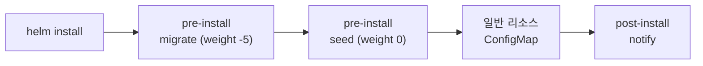
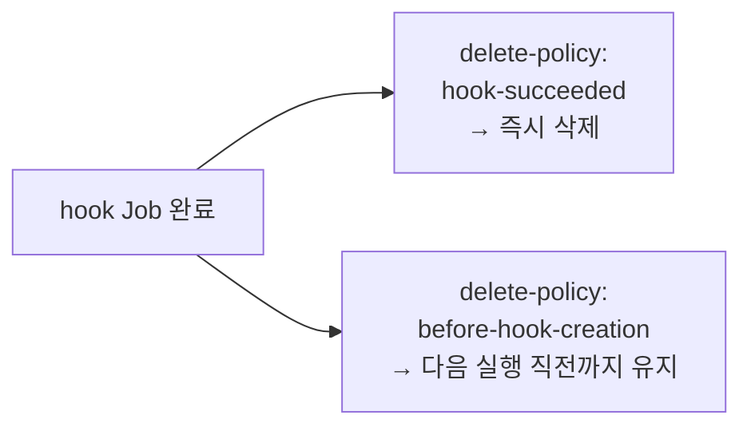

# 20. hooks — 설치·업그레이드 전후에 작업을 끼운다

release를 설치하거나 올릴 때, 그 앞뒤에 무언가를 실행해야 할 때가 있습니다 — DB 마이그레이션을 먼저 돌리고, 설치가 끝나면 알림을 보내는 식입니다. Helm은 이걸 **hook**으로 다룹니다. 매니페스트에 `helm.sh/hook` 어노테이션을 붙이면, Helm은 그 객체를 일반 리소스와 분리해 지정한 생애 시점(`pre-install`·`post-install`·`pre-upgrade` 등)에 실행합니다. hook이 여럿이면 `hook-weight`로 순서를 정하고, 끝난 hook을 언제 지울지는 `hook-delete-policy`로 정합니다. 흔히 Job을 hook으로 써서 "설치 전에 한 번 실행되고 완료를 기다리는" 작업을 겁니다. 이 편은 pre-install Job 둘(weight가 다름)과 post-install Job 하나를 담은 chart `hook-demo/`로, hook이 순서대로 실행되고 정책대로 정리되는 것을 kind 클러스터에서 실물로 확인합니다. 산출물은 hook의 실행 순서·정리·업그레이드 동작을 직접 관찰한 기록입니다.

## 핵심 다이어그램





- **hook은 어노테이션으로 지정한다.** `helm.sh/hook: pre-install`을 붙이면 그 객체는 일반 리소스와 따로, 설치 전에 실행됩니다.
- **pre-install은 블록한다.** hook Job이 끝날 때까지 `helm install`이 기다린 뒤 일반 리소스를 만듭니다.
- **hook-weight가 순서를 정한다.** 작은 값이 먼저 — `-5`가 `0`보다 앞섭니다.
- **delete-policy가 정리 시점을 정한다.** `hook-succeeded`는 성공하면 바로 지우고, `before-hook-creation`은 다음 실행 직전까지 남깁니다.
- **install hook은 upgrade에 안 돈다.** `pre-install`은 설치에서만 — 업그레이드 때 돌리려면 `pre-upgrade`가 따로 필요합니다.

아래 시연이 이 규칙들을 하나씩 확인합니다.

## 사전 준비물

이 실습은 **macOS** 환경을 기준으로 합니다.

- **Docker** — Docker Desktop, OrbStack 등. `docker ps`가 에러 없이 돌아가면 OK.
- **Homebrew** — macOS 패키지 관리자.

### kind · kubectl 설치

```bash
brew install kind kubectl
```

### Helm v3 설치

이 시리즈는 **Helm v3** 기준입니다. Homebrew가 v4를 설치한다면, 아래로 v3 바이너리를 받습니다 (Intel Mac은 `arm64`를 `amd64`로 바꿉니다).

```bash
brew install helm
helm version --short      # v3.x.x 인지 확인

# v4가 깔렸다면 v3로 교체
curl -fsSL https://get.helm.sh/helm-v3.21.2-darwin-arm64.tar.gz -o /tmp/helm3.tgz
tar -xzf /tmp/helm3.tgz -C /tmp
sudo mv /tmp/darwin-arm64/helm /usr/local/bin/helm
helm version --short      # v3.21.2
```

### rosa-lab 클러스터 · namespace 준비

```bash
kind create cluster --name rosa-lab
kubectl create namespace rosa-lab
kubectl config set-context --current --namespace=rosa-lab
```

이미 있으면 건너뜁니다 (`kind get clusters`로 확인).

## 실습 환경

| 경로 | 내용 |
|---|---|
| `manifests/hook-demo/` | pre/post-install hook Job과 일반 ConfigMap을 담은 chart |

```
hook-demo/
├── Chart.yaml
├── values.yaml
└── templates/
    ├── configmap.yaml            # 일반 리소스
    ├── pre-install-migrate.yaml  # Job · pre-install · weight -5
    ├── pre-install-seed.yaml     # Job · pre-install · weight 0
    └── post-install-notify.yaml  # Job · post-install · hook-succeeded
```

hook Job은 이런 모양입니다.

```yaml
# pre-install-migrate.yaml
metadata:
  name: {{ .Release.Name }}-migrate
  annotations:
    "helm.sh/hook": pre-install
    "helm.sh/hook-weight": "-5"
    "helm.sh/hook-delete-policy": before-hook-creation
```

아래 명령은 `manifests/` 디렉터리에서 실행합니다.

```bash
cd manifests
```

## 여기서 직접 확인할 수 있는 것

### install은 pre-install hook을 기다린다

설치하면 `helm install`이 pre-install Job들이 끝날 때까지 블록합니다.

```bash
helm install hd hook-demo -n rosa-lab
```

```
STATUS: deployed
```

migrate가 2초, seed가 1초 자도록 해둬서, 설치 명령이 그만큼 기다린 뒤 돌아옵니다. hook이 완료되지 않으면 일반 리소스도 만들어지지 않습니다.

### hook-weight — 작은 값이 먼저

두 pre-install Job은 weight가 다릅니다(`migrate: -5`, `seed: 0`). Helm은 weight 순으로 실행하고, 앞 hook이 끝나야 다음 hook을 만듭니다. 로그의 실행 시각으로 확인합니다.

```bash
kubectl logs job/hd-migrate -n rosa-lab
kubectl logs job/hd-seed -n rosa-lab
```

```
migrate ran at 02:31:11
seed ran at 02:31:16
```

`migrate`(weight -5)가 먼저 실행돼 끝난 뒤에야 `seed`(weight 0)가 돌았습니다. Job 생성 시각도 migrate가 앞섭니다.

```bash
kubectl get jobs -n rosa-lab
```

```
NAME         STATUS     COMPLETIONS   DURATION   AGE
hd-migrate   Complete   1/1           5s         11s
hd-seed      Complete   1/1           3s         6s
```

`hd-notify`(post-install)는 목록에 없습니다 — 다음에서 봅니다.

### delete-policy — 끝난 hook을 언제 지우나

`post-install-notify`는 `hook-delete-policy: hook-succeeded`라, 성공하면 곧바로 삭제됩니다. 그래서 설치가 끝난 뒤 조회하면 이미 없습니다.

```bash
kubectl get job hd-notify -n rosa-lab
```

```
Error from server (NotFound): jobs.batch "hd-notify" not found
```

반면 `migrate`·`seed`는 `before-hook-creation`이라, **다음에 같은 hook을 만들기 직전까지** 남습니다. 그래서 위에서 조회했을 때 완료 상태로 보였습니다 — 로그를 읽어 무슨 일이 있었는지 확인할 수 있습니다. 재설치하면 그때 이전 Job이 지워지고 새로 만들어집니다.

### 일반 리소스는 그대로 만들어진다

hook과 별개로, `templates/configmap.yaml`의 ConfigMap은 일반 리소스로 설치됩니다.

```bash
kubectl get cm hd-config -n rosa-lab
```

```
NAME        DATA   AGE
hd-config   1      4s
```

hook은 "언제 실행할지"가 다를 뿐, 같은 chart 안에 일반 리소스와 공존합니다.

### install hook은 upgrade에 안 돈다

`pre-install`·`post-install`은 이름 그대로 설치에서만 실행됩니다. 업그레이드하면 이 hook들은 돌지 않습니다.

```bash
helm upgrade hd hook-demo -n rosa-lab --set message="v2"
kubectl logs job/hd-migrate -n rosa-lab
kubectl get cm hd-config -n rosa-lab -o jsonpath='{.data.message}'
```

```
STATUS: deployed
REVISION: 2
migrate ran at 02:31:11
v2
```

release는 REVISION 2로 올라가고 ConfigMap은 `v2`로 갱신됐지만, migrate 로그는 여전히 `02:31:11` — **다시 실행되지 않았습니다.** 업그레이드 때 마이그레이션을 돌리려면 같은 Job에 `pre-upgrade`를 추가로 붙여야 합니다.

### uninstall과 남는 hook Job

release를 지워도, `before-hook-creation` 정책의 hook Job은 함께 삭제되지 않습니다.

```bash
helm uninstall hd -n rosa-lab
kubectl get jobs -n rosa-lab
```

```
release "hd" uninstalled
NAME         STATUS     COMPLETIONS   DURATION   AGE
hd-migrate   Complete   1/1           5s         26s
hd-seed      Complete   1/1           3s         21s
```

`before-hook-creation`은 "다음 생성 직전에 지운다"는 뜻이라, uninstall로는 정리되지 않습니다. 남은 Job은 손으로 지웁니다.

```bash
kubectl delete job hd-migrate hd-seed -n rosa-lab
```

정리하려면 hook에도 `hook-delete-policy`에 `hook-succeeded`(또는 `before-hook-creation,hook-succeeded`)를 함께 두는 편이 안전합니다.

## 이 편의 산출물

- pre-install Job 둘(weight `-5`·`0`)과 post-install Job 하나, 일반 ConfigMap을 담은 chart `hook-demo/` — hook과 일반 리소스가 한 chart에 공존하는 것을 클러스터에서 확인한 상태.
- `hook-weight`로 `migrate`(-5)가 `seed`(0)보다 먼저 실행돼 끝나는 것을 로그 시각(`02:31:11` → `02:31:16`)과 Job 생성 순서로 확인한 기록.
- `hook-delete-policy: hook-succeeded`인 `notify`가 성공 직후 삭제되고(`NotFound`), `before-hook-creation`인 Job은 남는 차이를 관찰한 경험.
- `helm upgrade`가 install hook을 재실행하지 않는 것(migrate 로그 불변)과, uninstall 후 `before-hook-creation` Job이 남아 수동 정리가 필요한 것을 확인한 근거.
