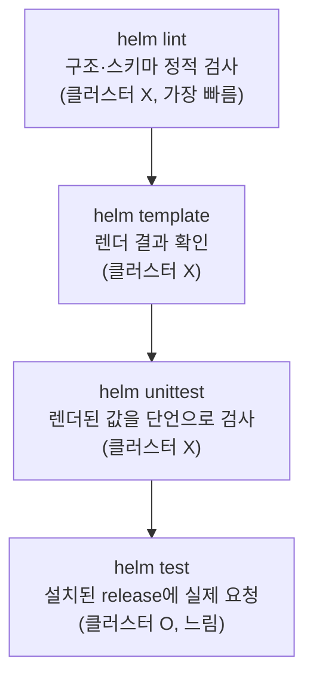

# 21. 테스트·검증 — chart가 맞게 렌더·동작하는지 확인한다

chart는 보통 *설치 후에* 깨집니다. 렌더는 통과했는데 값 하나가 엉뚱하게 들어가 있거나, 설치는 됐는데 앱이 응답하지 않는 식입니다. 그래서 chart에도 테스트가 필요하고, 검증은 여러 층으로 나눕니다 — 아래층은 빠르고 클러스터 없이 돌고, 위층은 느리지만 실제 동작을 봅니다. `helm lint`는 chart 구조와 스키마를 정적으로 훑고, `helm template`은 렌더 결과를 눈으로 확인하고, **helm-unittest**는 클러스터 없이 렌더된 값을 단언으로 검사하고, `helm test`는 설치된 release에 실제 요청을 날려 동작을 확인합니다. 이 넷이 테스트 피라미드를 이룹니다. 이 편은 네 층을 모두 갖춘 chart `my-service/`로, 각 층이 무엇을 잡는지 실측합니다. 산출물은 lint·template·unittest·helm test를 통과하는 chart와, unit test가 틀린 값을 어떻게 잡는지 본 기록입니다.

## 핵심 다이어그램



- **lint — 구조를 훑는다.** chart 형식·필수 파일·`values.schema.json`을 정적으로 검사합니다.
- **template — 렌더를 본다.** 값이 매니페스트로 어떻게 펼쳐지는지 눈으로 확인합니다.
- **unittest — 값을 단언한다.** 클러스터 없이, 렌더된 특정 필드가 기대값과 같은지 검사합니다.
- **helm test — 동작을 본다.** release를 설치한 뒤, `templates/tests/`의 test hook을 실행해 실제로 응답하는지 확인합니다.
- **아래에서 위로.** 빠른 검사를 앞에, 느린 검사를 뒤에 둬서 문제를 이른 층에서 잡습니다.

아래 시연이 네 층을 하나씩 확인합니다.

## 사전 준비물

이 실습은 **macOS** 환경을 기준으로 합니다.

- **Docker** — Docker Desktop, OrbStack 등. `helm test`에 클러스터가 필요합니다. `docker ps`가 에러 없이 돌아가면 OK.
- **Homebrew** — macOS 패키지 관리자.

### kind · kubectl 설치

```bash
brew install kind kubectl
```

### Helm v3 설치

이 시리즈는 **Helm v3** 기준입니다. Homebrew가 v4를 설치한다면, 아래로 v3 바이너리를 받습니다 (Intel Mac은 `arm64`를 `amd64`로 바꿉니다).

```bash
brew install helm
helm version --short      # v3.x.x 인지 확인

# v4가 깔렸다면 v3로 교체
curl -fsSL https://get.helm.sh/helm-v3.21.2-darwin-arm64.tar.gz -o /tmp/helm3.tgz
tar -xzf /tmp/helm3.tgz -C /tmp
sudo mv /tmp/darwin-arm64/helm /usr/local/bin/helm
helm version --short      # v3.21.2
```

### helm-unittest 플러그인 설치

unit test에는 `helm-unittest` 플러그인이 필요합니다.

```bash
helm plugin install https://github.com/helm-unittest/helm-unittest
helm plugin list | grep unittest
```

### rosa-lab 클러스터 · namespace 준비

`helm test` 단계에 필요합니다(lint·template·unittest는 클러스터 없이 됩니다).

```bash
kind create cluster --name rosa-lab
kubectl create namespace rosa-lab
kubectl config set-context --current --namespace=rosa-lab
```

## 실습 환경

| 경로 | 내용 |
|---|---|
| `manifests/my-service/` | 네 층의 테스트를 갖춘 chart |

```
my-service/
├── Chart.yaml
├── values.yaml
├── templates/
│   ├── deployment.yaml
│   ├── service.yaml
│   └── tests/
│       └── test-connection.yaml   # helm test hook (클러스터에서 실행)
└── tests/
    └── deployment_test.yaml        # helm-unittest (클러스터 없이 실행)
```

두 `tests/`가 다릅니다 — `templates/tests/`는 `helm test`가 클러스터에서 돌리는 test hook Pod이고, chart 루트의 `tests/`는 `helm unittest`가 오프라인에서 돌리는 단위 테스트입니다.

아래 명령은 `manifests/` 디렉터리에서 실행합니다.

```bash
cd manifests
```

## 여기서 직접 확인할 수 있는 것

### [1] helm lint — 구조를 훑는다

```bash
helm lint my-service
```

```
==> Linting my-service
[INFO] Chart.yaml: icon is recommended

1 chart(s) linted, 0 chart(s) failed
```

가장 빠른 검사입니다. chart 형식이 맞는지, 필수 파일이 있는지, 스키마를 어기지 않는지를 봅니다. `icon`은 권장일 뿐 실패가 아닙니다.

### [2] helm template — 렌더를 본다

```bash
helm template web my-service | grep -E '^kind:|  name:|replicas:|image:'
```

```
kind: Service
  name: web-my-service
kind: Deployment
  name: web-my-service
  replicas: 1
          image: "nginx:1.27"
kind: Pod
  name: "web-test"
```

값이 어떤 매니페스트로 펼쳐지는지 눈으로 확인합니다. 끝의 `kind: Pod`(`web-test`)는 `templates/tests/`의 test hook으로, 설치 때가 아니라 `helm test`에서 실행됩니다.

### [3] helm unittest — 값을 단언한다

`tests/deployment_test.yaml`은 렌더된 Deployment의 특정 필드가 기대값과 같은지 단언합니다.

```yaml
tests:
  - it: replicaCount 값이 spec.replicas로 들어간다
    set:
      replicaCount: 3
    asserts:
      - equal:
          path: spec.replicas
          value: 3
  - it: image는 repository:tag로 조합된다
    asserts:
      - equal:
          path: spec.template.spec.containers[0].image
          value: nginx:1.27
```

클러스터 없이 돌립니다.

```bash
helm unittest my-service
```

```
### Chart [ my-service ] my-service

 PASS  deployment 렌더 검증	my-service/tests/deployment_test.yaml

Charts:      1 passed, 1 total
Test Suites: 1 passed, 1 total
Tests:       4 passed, 4 total
```

네 단언이 모두 통과했습니다. `helm template`이 "무엇이 나오나"를 눈으로 본다면, unittest는 "이 값이 정확히 이래야 한다"를 기계가 검사합니다 — 값 하나가 바뀌면 즉시 실패합니다.

### unit test는 틀린 값을 잡는다

`image` 기대값을 일부러 `nginx:9.99`로 틀리게 단언하면, 실제 렌더값(`nginx:1.27`)과 달라 실패합니다.

```
 FAIL  ...
	- asserts[0] `equal` fail
			Path:	spec.template.spec.containers[0].image
			Expected to equal:
				nginx:9.99
			Actual:
				nginx:1.27
			Diff:
				--- Expected
				+++ Actual
				@@ -1,2 +1,2 @@
				-nginx:9.99
				+nginx:1.27
```

기대값과 실제값을 diff로 짚어줍니다. 템플릿을 고치다 값이 어긋나면 이 단계에서 걸립니다 — 클러스터에 올리기 전에.

### [4] helm test — 동작을 본다

앞의 셋은 렌더까지만 봅니다. `helm test`는 release를 실제로 설치한 뒤, 실행 중인 앱에 요청을 날립니다.

```bash
helm install ms my-service -n rosa-lab
kubectl rollout status deploy/ms-my-service -n rosa-lab
helm test ms -n rosa-lab
```

```
deployment "ms-my-service" successfully rolled out
NAME: ms
TEST SUITE:     ms-test
Phase:          Succeeded
```

`templates/tests/test-connection.yaml`의 Pod가 `ms-my-service:80`에 `wget`을 날려 응답을 받았습니다. `Phase: Succeeded` — 설치가 됐는지뿐 아니라 실제로 동작하는지까지 확인했습니다. 이건 렌더로는 알 수 없고, 오직 실행 중인 클러스터에서만 볼 수 있습니다.

### 정리

```bash
helm uninstall ms -n rosa-lab
```

## 이 편의 산출물

- 네 층의 테스트를 갖춘 chart `my-service/` — `helm lint`·`helm template`·`helm unittest`·`helm test`를 모두 통과하는 상태.
- `helm unittest`로 렌더된 Deployment의 `replicas`·`image`·이름·포트를 클러스터 없이 단언해 4개 테스트를 통과시킨 기록.
- 기대값을 일부러 틀리게 했을 때 unit test가 Expected/Actual diff로 불일치를 잡는 것을 확인한 경험.
- `helm test`로 설치된 release의 test hook Pod가 Service에 실제 요청을 날려 `Phase: Succeeded`를 받은 근거 — 렌더 검증과 동작 검증의 경계를 확인.
- `templates/tests/`(helm test hook, 클러스터)와 chart 루트 `tests/`(helm-unittest, 오프라인)의 역할 차이를 구분한 chart 구조.
