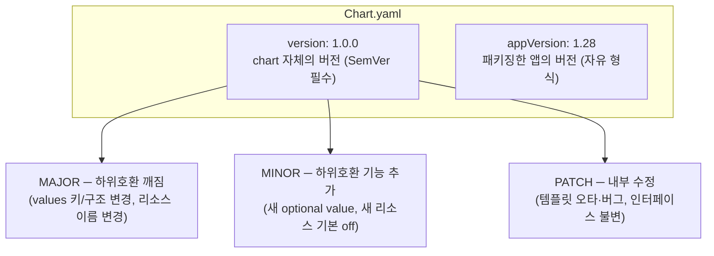

# 22. 버전 전략 — chart version과 appVersion을 어떻게 올리는가

chart를 남에게 배포하기 시작하면 버전이 규율이 됩니다. 소비자는 `my-service-1.0.0.tgz` 같은 버전 태그로 chart를 당겨오고, `version: ">=0.5.0 <0.6.0"` 같은 제약으로 자동 업데이트 범위를 정합니다. 그래서 버전을 아무렇게나 올리면 남의 배포가 조용히 깨집니다. 여기엔 두 개의 버전이 있습니다 — chart 자체의 버전(`version`)과 그 chart가 패키징한 앱의 버전(`appVersion`). 둘은 수명이 다릅니다. 그리고 `version`은 **SemVer** 규약을 따라 올려야 합니다: 하위호환이 깨지면 MAJOR, 하위호환되는 기능 추가면 MINOR, 내부 수정이면 PATCH. 이 편은 `version`과 `appVersion`을 구분하고, SemVer로 언제 무엇을 올리는지 정하고, values 키 이름을 바꾸는 breaking change가 소비자에게 어떻게 조용히 번지는지, 그리고 그것을 어떻게 알리는지를 실측합니다. 산출물은 버전 전략을 적용한 chart `my-service/`와, breaking change가 옛 인터페이스를 조용히 무시하는 장면을 직접 본 기록입니다.

## 핵심 다이어그램



- **version — chart의 버전.** 템플릿·values 구조·기본값이 바뀌면 오른다. SemVer(`MAJOR.MINOR.PATCH`)를 **반드시** 따른다.
- **appVersion — 앱의 버전.** chart가 감싼 컨테이너/애플리케이션의 버전. 자유 형식 문자열이고 SemVer가 아니어도 된다.
- **둘은 독립이다.** 앱만 올라가면 `appVersion`만 바뀌고 `version`은 PATCH로 오른다. 반대로 앱은 그대로인데 chart 템플릿만 고치면 `version`만 오른다.
- **breaking은 MAJOR.** values 키 이름·구조가 바뀌면 소비자의 기존 values가 깨진다 — 이건 MAJOR다.
- **버전은 소비자와의 계약이다.** 소비자는 버전 제약으로 자동 업데이트 범위를 잡으므로, MAJOR를 건너뛰고 breaking을 내면 그 계약이 깨진다.

아래 시연이 두 버전의 구분과, breaking change가 번지는 양상을 하나씩 확인합니다.

## 사전 준비물

이 실습은 **macOS** 환경을 기준으로 합니다. 버전 확인·렌더·패키징은 모두 클러스터 없이 됩니다 — 이 편은 클러스터를 띄우지 않습니다.

- **Homebrew** — macOS 패키지 관리자.

### Helm v3 설치

이 시리즈는 **Helm v3** 기준입니다. Homebrew가 v4를 설치한다면, 아래로 v3 바이너리를 받습니다 (Intel Mac은 `arm64`를 `amd64`로 바꿉니다).

```bash
brew install helm
helm version --short      # v3.x.x 인지 확인

# v4가 깔렸다면 v3로 교체
curl -fsSL https://get.helm.sh/helm-v3.21.2-darwin-arm64.tar.gz -o /tmp/helm3.tgz
tar -xzf /tmp/helm3.tgz -C /tmp
sudo mv /tmp/darwin-arm64/helm /usr/local/bin/helm
helm version --short      # v3.21.2
```

## 실습 환경

| 경로 | 내용 |
|---|---|
| `manifests/my-service/` | 버전 전략을 적용한 chart (`version: 1.0.0`, `appVersion: 1.28`) |
| `manifests/old-values.yaml` | 1.0.0 이전(0.x) 인터페이스로 값을 넘기는 파일 |

```
manifests/
├── my-service/
│   ├── Chart.yaml          # version · appVersion · annotations
│   ├── CHANGELOG.md        # 사람이 읽는 변경 이력
│   ├── values.yaml
│   └── templates/
│       ├── deployment.yaml
│       └── service.yaml
└── old-values.yaml         # image.tag (구 인터페이스) — breaking 시연용
```

아래 명령은 `manifests/` 디렉터리에서 실행합니다.

```bash
cd manifests
```

## 여기서 직접 확인할 수 있는 것

### [1] version과 appVersion — 두 개의 버전, 두 개의 수명

`Chart.yaml`에는 버전이 둘 있습니다.

```yaml
version: 1.0.0        # chart 자체의 버전 (SemVer 필수)
appVersion: "1.28"    # 패키징한 앱(nginx)의 버전 (자유 형식)
```

`helm show chart`로 둘을 함께 봅니다.

```bash
helm show chart my-service | grep -E '^version:|^appVersion:'
```

```
appVersion: "1.28"
version: 1.0.0
```

둘을 헷갈리는 것이 가장 흔한 실수입니다. **`version`은 "이 chart의 릴리스 번호"**, **`appVersion`은 "이 chart가 담은 앱의 버전"**입니다. nginx를 1.28 → 1.29로만 올리면 `appVersion`이 1.29가 되고, chart 구조는 안 바뀌었으니 `version`은 PATCH(1.0.0 → 1.0.1)만 오릅니다. 반대로 앱은 1.28 그대로 두고 chart 템플릿에 값을 하나 추가하면 `appVersion`은 그대로, `version`만 오릅니다.

`version`은 SemVer라 반드시 `MAJOR.MINOR.PATCH` 꼴이어야 하지만, `appVersion`은 자유 문자열입니다 — `"1.28"`, `"2024.10"`, `"v1.28.0-rc1"` 모두 됩니다(그래서 따옴표로 감싸 문자열로 둡니다).

### [2] SemVer — 언제 무엇을 올리나

chart `version`은 세 자리로 소비자에게 변경의 성격을 알립니다.

| 자리 | 언제 올리나 | 예 |
|---|---|---|
| **MAJOR** (`x.0.0`) | 하위호환이 깨질 때 | values 키 이름/구조 변경, 리소스 이름 변경(재생성 유발), 필수값 추가, 기본값을 크게 바꿈 |
| **MINOR** (`0.x.0`) | 하위호환되는 기능 추가 | 새 optional value, 새 리소스(기본 비활성), 기존 값 유지 |
| **PATCH** (`0.0.x`) | 인터페이스 불변인 내부 수정 | 템플릿 오타·버그 수정, 렌더 결과만 교정 |

판별 기준은 하나입니다 — **소비자의 기존 `values.yaml`이 그대로 동작하는가.** 그대로면 MINOR 이하, 깨지면 MAJOR입니다. 이 chart의 `CHANGELOG.md`가 그 이력을 담고 있습니다.

```bash
cat my-service/CHANGELOG.md
```

`0.5.1`(PATCH, 오타 수정) → `0.6.0`(MINOR, `resources` 자리 추가) → `1.0.0`(MAJOR, `image.tag` → `image.version` 키 변경)으로 오른 이력이 보입니다. 마지막 단계에서 키 이름이 바뀌었기 때문에 `0.7.0`이 아니라 `1.0.0`으로 뛰었습니다.

### [3] helm package — 버전이 아티팩트에 박힌다

chart를 패키징하면 `version`이 파일 이름에 그대로 들어갑니다.

```bash
helm package my-service
```

```
Successfully packaged chart and saved it to: .../my-service-1.0.0.tgz
```

```bash
ls *.tgz
```

```
my-service-1.0.0.tgz
```

파일 이름이 `<name>-<version>.tgz`입니다. `appVersion`은 파일 이름에 들어가지 않습니다 — 아티팩트를 식별하는 것은 어디까지나 chart `version`입니다. 레지스트리에 이 태그로 올라가고, 소비자는 이 버전으로 당겨옵니다. 그래서 같은 `version`으로 내용이 다른 chart를 두 번 올리면 소비자 쪽 캐시가 꼬입니다 — **버전을 올리지 않고 내용만 바꾸는 것**이 가장 위험합니다.

```bash
rm my-service-1.0.0.tgz    # 정리
```

### [4] breaking change는 소비자 쪽에서 조용히 무시된다

`1.0.0`에서 values 키를 `image.tag` → `image.version`으로 바꿨습니다. 템플릿은 이제 `image.version`을 읽습니다.

```yaml
# templates/deployment.yaml
image: "{{ .Values.image.repository }}:{{ .Values.image.version }}"
```

기본값으로 렌더하면 정상입니다.

```bash
helm template web my-service | grep 'image:'
```

```
          image: "nginx:1.28"
```

이제 **0.x 시절 인터페이스**로 값을 넘기는 소비자를 흉내 냅니다. `old-values.yaml`은 옛 키 `image.tag: "1.25"`로 태그를 1.25에 고정하려 합니다.

```bash
helm template web my-service -f old-values.yaml | grep 'image:'
```

```
          image: "nginx:1.28"
```

소비자는 1.25로 고정했다고 믿지만, 실제로는 **1.28**이 나옵니다. 옛 키 `image.tag`는 템플릿이 더 이상 읽지 않아 조용히 무시되고, chart 기본값 `image.version: "1.28"`이 그대로 적용됩니다. 에러도, 경고도 없습니다 — 렌더는 성공하는데 의도만 사라집니다. 새 키로 넘기면 정상 반영됩니다.

```bash
helm template web my-service --set image.version=1.25 | grep 'image:'
```

```
          image: "nginx:1.25"
```

같은 override인데 옛 키는 무시되고 새 키만 먹습니다. 이 "조용한 무시"가 바로 breaking change가 위험한 이유입니다. chart는 멀쩡히 렌더·설치되는데 소비자가 지정한 버전이 사라져, 운영에서야 엉뚱한 이미지가 떠 있는 걸 발견합니다. 그래서 이 변경은 PATCH나 MINOR가 아니라 **MAJOR**여야 합니다 — 버전으로 "당신의 values를 손봐야 한다"를 미리 알리는 것입니다.

### [5] breaking change를 알린다

MAJOR로 올리는 것만으로는 부족합니다. **무엇이** 깨졌고 **어떻게** 옮기는지를 함께 줘야 합니다. 두 곳에 적습니다.

**사람이 읽는 `CHANGELOG.md`** — 변경과 마이그레이션을 문장으로.

```bash
grep -A3 '1.0.0' my-service/CHANGELOG.md
```

`image.tag` → `image.version`으로 키를 바꾸라는 안내가 들어 있습니다.

**기계가 읽는 `Chart.yaml`의 `annotations`** — Artifact Hub 같은 카탈로그가 변경 목록을 렌더하는 표준 필드입니다.

```bash
helm show chart my-service | grep -A6 annotations
```

```yaml
annotations:
  artifacthub.io/changes: |
    - kind: changed
      description: "values 키를 image.tag → image.version 으로 변경 (breaking)"
    - kind: added
      description: "resources 값 추가 (선택, 하위호환)"
```

`kind: changed`는 변경, `added`는 추가를 뜻합니다. 소비자는 이 목록을 보고 자기 `values.yaml`을 손봐야 할지 판단합니다. **버전(계약)·CHANGELOG(설명)·annotations(카탈로그)** 셋이 함께 있어야 breaking change가 조용히 번지지 않습니다.

## 이 편의 산출물

- 버전 전략을 적용한 chart `my-service/` — `version: 1.0.0`·`appVersion: "1.28"`을 구분해 둔 상태.
- `version`(chart 릴리스 번호, SemVer 필수)과 `appVersion`(패키징한 앱 버전, 자유 형식)이 서로 다른 수명을 갖는다는 것을 `helm show chart`로 확인한 기록.
- `0.5.1`(PATCH) → `0.6.0`(MINOR) → `1.0.0`(MAJOR)으로 오른 `CHANGELOG.md` — "소비자의 기존 values가 그대로 동작하는가"로 자리를 판별한 이력.
- `helm package`가 chart `version`을 `my-service-1.0.0.tgz` 파일 이름에 박는 것을 확인 — 버전을 올리지 않고 내용만 바꾸면 안 되는 이유.
- 옛 키(`image.tag`)로 넘긴 값이 새 chart에서 조용히 무시되고 기본값이 그대로 나오는 장면(`nginx:1.28`) — breaking change가 에러 없이 소비자 의도만 지우는 것을 실측.
- breaking change를 알리는 세 층(버전·`CHANGELOG.md`·`Chart.yaml` annotations `artifacthub.io/changes`)을 갖춘 chart.
