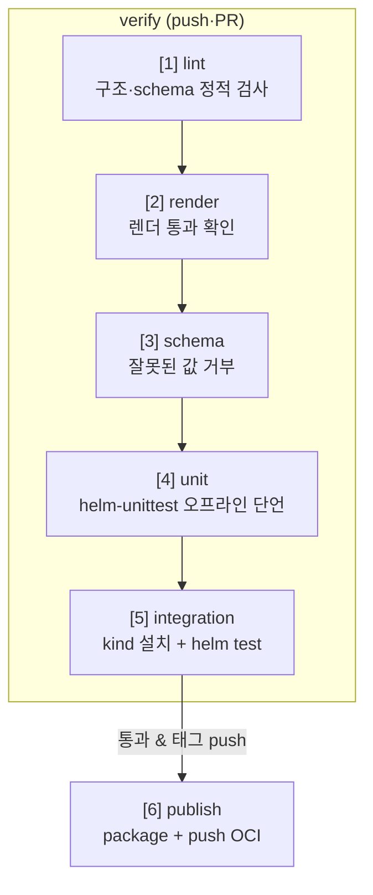

# 23. CI에서 Helm — chart를 자동으로 검증·버전·publish한다

chart 하나에 lint·schema·unit test·helm test가 다 들어 있어도, 그걸 사람이 손으로 매번 돌리면 언젠가 빠뜨립니다. CI는 그 검사들을 **정해진 순서로, 자동으로, 실패하면 멈추게** 묶는 일입니다. 순서가 중요합니다 — 클러스터 없이 빠르게 도는 검사(lint·render·schema·unit)를 앞에 두고, 클러스터가 필요한 느린 검사(kind에 실제 설치 + helm test)를 뒤에 둡니다. chart는 보통 *설치 후에* 깨지므로, kind 통합 설치 단계가 이 파이프라인의 핵심입니다. 그리고 검증을 다 통과하고 **태그를 밀었을 때만** package해서 OCI 레지스트리로 push합니다. 이 편은 여섯 단계(`lint → render → schema → unit → integration → publish`)를 로컬에서 하나씩 실측한 뒤, 같은 명령을 GitHub Actions 워크플로 하나로 묶습니다. 산출물은 이 흐름을 담은 `.github/workflows/chart-ci.yaml`과, 각 단계가 무엇을 잡는지 직접 돌려 본 기록입니다.

## 핵심 다이어그램



- **아래층은 빠르고, 위층은 느리다.** lint·render·schema·unit은 클러스터 없이 초 단위로 돌고, integration은 클러스터를 띄워 실제로 설치한다.
- **실패하면 멈춘다.** 앞 단계가 실패하면 뒤 단계는 돌지 않아, 문제를 가장 싼 층에서 잡는다.
- **integration이 핵심이다.** 렌더·단언까지 통과해도 설치가 깨질 수 있다 — kind에 올려 `helm test`로 동작까지 본다.
- **publish는 조건부다.** 검증을 통과하고 **태그를 밀었을 때만** package·push한다. 아무 커밋에나 레지스트리로 밀지 않는다.
- **CI는 결국 같은 명령이다.** 아래에서 로컬로 돌리는 명령과 워크플로의 각 step은 같다 — CI는 그걸 순서대로 자동화할 뿐이다.

아래 시연이 여섯 단계를 로컬에서 하나씩 돌려 본 뒤, 워크플로로 묶습니다.

## 사전 준비물

이 실습은 **macOS** 환경을 기준으로 합니다.

- **Docker** — Docker Desktop, OrbStack 등. integration·publish 단계에 클러스터·레지스트리가 필요합니다. `docker ps`가 에러 없이 돌면 OK.
- **Homebrew** — macOS 패키지 관리자.

### kind · kubectl 설치

```bash
brew install kind kubectl
```

### Helm v3 설치

이 시리즈는 **Helm v3** 기준입니다. Homebrew가 v4를 설치한다면, 아래로 v3 바이너리를 받습니다 (Intel Mac은 `arm64`를 `amd64`로 바꿉니다).

```bash
brew install helm
helm version --short      # v3.x.x 인지 확인

# v4가 깔렸다면 v3로 교체
curl -fsSL https://get.helm.sh/helm-v3.21.2-darwin-arm64.tar.gz -o /tmp/helm3.tgz
tar -xzf /tmp/helm3.tgz -C /tmp
sudo mv /tmp/darwin-arm64/helm /usr/local/bin/helm
helm version --short      # v3.21.2
```

### helm-unittest 플러그인 설치

unit 단계에 필요합니다.

```bash
helm plugin install https://github.com/helm-unittest/helm-unittest
helm plugin list | grep unittest
```

## 실습 환경

`manifests/` 디렉터리를 **하나의 저장소 루트**로 보면 됩니다 — chart는 `charts/`에, 워크플로는 `.github/workflows/`에 있습니다. 그래서 아래 로컬 명령의 경로와 워크플로 안의 경로가 똑같습니다.

| 경로 | 내용 |
|---|---|
| `manifests/charts/my-service/` | 여섯 단계를 통과하도록 갖춘 chart |
| `manifests/bad-values.yaml` | schema를 어기는 값 (schema 단계 시연용) |
| `manifests/.github/workflows/chart-ci.yaml` | 여섯 단계를 묶은 GitHub Actions 워크플로 |

```
manifests/                       # = 저장소 루트로 본다
├── .github/workflows/
│   └── chart-ci.yaml
├── charts/my-service/
│   ├── Chart.yaml               # version 1.1.0 · appVersion 1.28
│   ├── values.yaml
│   ├── values.schema.json       # schema 단계가 쓰는 규격
│   ├── templates/
│   │   ├── deployment.yaml
│   │   ├── service.yaml
│   │   └── tests/
│   │       └── test-connection.yaml   # helm test hook (integration)
│   └── tests/
│       └── deployment_test.yaml        # helm-unittest (unit)
└── bad-values.yaml
```

아래 명령은 `manifests/` 디렉터리에서 실행합니다.

```bash
cd manifests
```

## 여기서 직접 확인할 수 있는 것

### [1] lint — 구조를 훑는다

```bash
helm lint charts/my-service
```

```
==> Linting charts/my-service
[INFO] Chart.yaml: icon is recommended

1 chart(s) linted, 0 chart(s) failed
```

가장 빠른 검사입니다. chart 형식·필수 파일·`values.schema.json`을 정적으로 봅니다. `icon`은 권장일 뿐 실패가 아닙니다.

### [2] render — 렌더가 통과하는지 본다

```bash
helm template ci charts/my-service | grep -E '^kind:|replicas:|image:'
```

```
kind: Service
kind: Deployment
  replicas: 1
          image: "nginx:1.28"
kind: Pod
      image: busybox:1.36
```

기본값으로 템플릿이 매니페스트까지 펼쳐지는지 확인합니다. CI에서는 출력을 버리고(`> /dev/null`) 렌더가 에러 없이 끝나는지만 봅니다.

### [3] schema — 잘못된 값을 거부한다

`values.schema.json`은 `replicaCount`를 1~10 정수로 못박습니다. `bad-values.yaml`은 99를 넣어 이를 어깁니다.

```bash
helm lint charts/my-service -f bad-values.yaml
```

```
==> Linting charts/my-service
[INFO] Chart.yaml: icon is recommended
[ERROR] values.yaml: - at '/replicaCount': maximum: got 99, want 10

[ERROR] templates/: values don't meet the specifications of the schema(s) in the following chart(s):
my-service:
- at '/replicaCount': maximum: got 99, want 10

Error: 1 chart(s) linted, 1 chart(s) failed
```

lint가 exit 1로 실패합니다 — 이게 정상입니다. CI에서는 이 단계에서 lint가 **성공하면** 오히려 schema가 뚫린 것이므로, "성공하면 CI를 실패시키는" 반전 조건을 겁니다(워크플로 참고).

### [4] unit — 렌더된 값을 단언한다

`tests/deployment_test.yaml`이 렌더된 Deployment의 필드를 클러스터 없이 검사합니다.

```bash
helm unittest charts/my-service
```

```
### Chart [ my-service ] charts/my-service

 PASS  deployment 렌더 검증	charts/my-service/tests/deployment_test.yaml

Charts:      1 passed, 1 total
Test Suites: 1 passed, 1 total
Tests:       3 passed, 3 total
```

`replicas`·`image`·`containerPort` 세 단언이 통과했습니다. 여기까지가 클러스터 없이 도는 빠른 층입니다.

### [5] integration — kind에 실제 설치하고 동작을 본다

앞의 넷은 렌더까지만 봅니다. 이 단계는 클러스터를 띄워 실제로 설치하고, `helm test`로 실행 중인 앱에 요청을 날립니다.

```bash
kind create cluster --name rosa-lab
kubectl create namespace rosa-lab
helm install ms charts/my-service -n rosa-lab --wait
helm test ms -n rosa-lab
```

```
NAME: ms
STATUS: deployed
REVISION: 1
...
TEST SUITE:     ms-test
Phase:          Succeeded
```

`--wait`로 Pod가 Ready가 될 때까지 기다린 뒤, `templates/tests/`의 test hook Pod가 Service에 `wget`을 날려 응답을 받았습니다(`Phase: Succeeded`). 렌더로는 알 수 없고 오직 실행 중인 클러스터에서만 보이는 확인입니다. 정리:

```bash
helm uninstall ms -n rosa-lab
```

### [6] publish — package 후 OCI로 push한다

검증을 다 통과하면 chart를 package해서 레지스트리로 올립니다. 여기서는 로컬 OCI 레지스트리로 실측합니다(워크플로는 `ghcr.io`를 씁니다).

```bash
docker run -d -p 5001:5000 --name ci-registry registry:2
helm package charts/my-service -d dist
helm push dist/my-service-1.1.0.tgz oci://localhost:5001/charts --plain-http
```

```
Successfully packaged chart and saved it to: dist/my-service-1.1.0.tgz
Pushed: localhost:5001/charts/my-service:1.1.0
Digest: sha256:d7a909e...
```

파일명과 레지스트리 태그가 모두 chart `version`(1.1.0)입니다. 카탈로그에서 확인:

```bash
curl -s localhost:5001/v2/charts/my-service/tags/list
```

```
{"name":"charts/my-service","tags":["1.1.0"]}
```

정리:

```bash
docker rm -f ci-registry && rm -rf dist
```

### 여섯 단계를 워크플로로 묶는다

위 명령들이 곧 `.github/workflows/chart-ci.yaml`의 각 step입니다. CI는 순서를 강제하고, 실패하면 멈춥니다.

```yaml
on:
  push:
    branches: [main]
    tags: ["my-service-*"]
  pull_request:

jobs:
  verify:                          # [1]~[5] — push·PR마다
    runs-on: ubuntu-latest
    steps:
      - uses: actions/checkout@v4
      - uses: azure/setup-helm@v4
        with: { version: v3.21.2 }
      - name: lint
        run: helm lint charts/my-service
      - name: render
        run: helm template ci charts/my-service > /dev/null
      - name: schema (거부 확인)
        run: |
          if helm lint charts/my-service -f bad-values.yaml; then
            echo "schema가 잘못된 값을 통과시켰다"; exit 1
          fi
      - name: unit
        run: |
          helm plugin install https://github.com/helm-unittest/helm-unittest
          helm unittest charts/my-service
      - name: kind 클러스터
        uses: helm/kind-action@v1
        with: { cluster_name: rosa-lab }
      - name: integration (install + test)
        run: |
          kubectl create namespace rosa-lab
          helm install ms charts/my-service -n rosa-lab --wait
          helm test ms -n rosa-lab

  publish:                         # [6] — verify 통과 & 태그 push일 때만
    needs: verify
    if: startsWith(github.ref, 'refs/tags/')
    runs-on: ubuntu-latest
    permissions: { packages: write }
    steps:
      - uses: actions/checkout@v4
      - uses: azure/setup-helm@v4
        with: { version: v3.21.2 }
      - name: package & push
        run: |
          helm package charts/my-service -d dist
          echo "${{ secrets.GITHUB_TOKEN }}" | \
            helm registry login ghcr.io -u ${{ github.actor }} --password-stdin
          helm push dist/my-service-*.tgz oci://ghcr.io/${{ github.repository_owner }}/charts
```

두 job으로 나눈 이유가 있습니다. **verify**는 push·PR마다 돌아 아무 변경이나 걸러냅니다. **publish**는 `needs: verify`로 검증을 전제하고, `if: startsWith(github.ref, 'refs/tags/')`로 **태그를 밀었을 때만** 돕니다 — 그래서 `my-service-1.1.0` 같은 태그를 push해야 레지스트리로 올라갑니다. 버전을 매겨 태그로 releasing하는 규율이 여기서 자동화로 굳습니다. (전체 파일은 `manifests/.github/workflows/chart-ci.yaml`.)

## 이 편의 산출물

- 여섯 단계(`lint → render → schema → unit → integration → publish`)를 묶은 GitHub Actions 워크플로 `chart-ci.yaml` — verify(push·PR)와 publish(태그 push) 두 job으로 나눈 상태.
- 각 단계를 로컬에서 하나씩 돌려 본 기록: lint 통과, render 통과, `bad-values.yaml`(replicaCount=99)을 schema가 `maximum: got 99, want 10`으로 거부, helm-unittest 3단언 통과.
- kind에 실제 설치하고 `helm test`로 `Phase: Succeeded`를 받아, 렌더 검증과 동작 검증의 경계를 확인한 integration 기록.
- `helm package` → `helm push oci://`로 chart `version`(1.1.0)을 태그로 레지스트리에 올리고 카탈로그(`tags:["1.1.0"]`)로 확인한 publish 기록.
- 검증 통과와 태그 push를 함께 만족할 때만 publish가 도는 조건(`needs: verify` + `if: refs/tags/`)을 갖춘 파이프라인 — 아무 커밋에나 레지스트리로 밀지 않는 구조.
