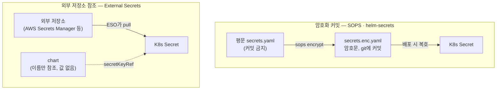

# 24. Secret 공급 — 비밀은 누가 만들고 누가 소비하는가

비밀 값을 chart에 어떻게 "숨기느냐"가 아니라, **누가 만들어서 누가 소비하느냐**가 문제입니다. 값을 `values.yaml`에 평문으로 적어 커밋하면 그대로 새고, K8s Secret의 base64는 암호화가 아니라 되돌릴 수 있는 인코딩일 뿐입니다. 그래서 실무는 비밀을 chart 밖에서 공급하고, 방식은 크게 둘입니다. 하나는 **암호화 커밋** — 값을 SOPS로 암호화해 git에 커밋하고 배포 시 복호합니다(helm-secrets). 다른 하나는 **외부 저장소 참조** — 값은 AWS Secrets Manager·Vault 같은 외부 저장소에 있고, External Secrets Operator(ESO)가 그것을 당겨 K8s Secret으로 만들면 chart는 그 Secret을 이름으로만 참조합니다. 앞 방식은 비밀(암호문)이 git에 있고, 뒤 방식은 chart에 비밀이 아예 없습니다. 이 편은 세 가지를 실측합니다 — 안티패턴(평문·base64), SOPS 암호화 커밋, 그리고 ESO가 외부 저장소 값을 Secret으로 materialize하는 전 과정. 산출물은 두 방식을 각각 갖춘 chart와, 비밀이 어디서 만들어져 어디로 흘러 Pod까지 닿는지 추적한 기록입니다.

## 핵심 다이어그램



- **base64는 암호화가 아니다.** K8s Secret은 값을 base64로 저장할 뿐이라 `base64 -d`로 되돌린다. 평문 values를 커밋하면 그대로 유출이다.
- **암호화 커밋 — 비밀(암호문)이 git에 산다.** 만드는 쪽이 키로 암호화해 커밋하고, 배포하는 쪽이 키로 복호한다. 키만 git 밖에 둔다.
- **외부 저장소 참조 — chart에 비밀이 없다.** 값은 외부 저장소에 있고, ESO가 당겨 K8s Secret으로 만든다. chart는 Secret 이름만 안다.
- **공급의 주체가 다르다.** 앞은 키 소유자, 뒤는 보안팀이 채운 외부 저장소. chart는 어느 쪽이든 비밀 값을 직접 품지 않는다.

아래 시연이 안티패턴 → 암호화 커밋 → 외부 참조를 하나씩 확인합니다.

## 사전 준비물

이 실습은 **macOS** 환경을 기준으로 합니다.

- **Docker** — Docker Desktop, OrbStack 등. 외부 참조 시연에 클러스터가 필요합니다. `docker ps`가 에러 없이 돌면 OK.
- **Homebrew** — macOS 패키지 관리자.

### kind · kubectl 설치

```bash
brew install kind kubectl
```

### Helm v3 설치

이 시리즈는 **Helm v3** 기준입니다. Homebrew가 v4를 설치한다면, 아래로 v3 바이너리를 받습니다 (Intel Mac은 `arm64`를 `amd64`로 바꿉니다). helm-secrets 플러그인은 v3에서 동작합니다.

```bash
brew install helm
helm version --short      # v3.x.x 인지 확인

# v4가 깔렸다면 v3로 교체
curl -fsSL https://get.helm.sh/helm-v3.21.2-darwin-arm64.tar.gz -o /tmp/helm3.tgz
tar -xzf /tmp/helm3.tgz -C /tmp
sudo mv /tmp/darwin-arm64/helm /usr/local/bin/helm
helm version --short      # v3.21.2
```

### sops · age · helm-secrets 설치

암호화 커밋 시연에 필요합니다.

```bash
brew install sops age
helm plugin install https://github.com/jkroepke/helm-secrets
helm plugin list | grep secrets
```

### rosa-lab 클러스터 · namespace 준비

외부 참조 시연에 필요합니다.

```bash
kind create cluster --name rosa-lab
kubectl create namespace rosa-lab
kubectl config set-context --current --namespace=rosa-lab
```

## 실습 환경

| 경로 | 내용 |
|---|---|
| `manifests/charts/app-plain/` | 비밀을 values로 받는 chart (안티패턴·SOPS 공용) |
| `manifests/charts/app-eso/` | 비밀을 외부에서 참조하는 chart (값 없음) |
| `manifests/eso/fake-store.yaml` | 외부 저장소를 흉내 내는 SecretStore(fake provider) |
| `manifests/secrets.enc.yaml` | SOPS 암호문 (커밋 대상, 예시) |
| `manifests/.sops.yaml` | sops 암호화 규칙 (age recipient) |

```
manifests/                       # = 저장소 루트로 본다
├── charts/
│   ├── app-plain/
│   │   ├── Chart.yaml
│   │   ├── values.yaml          # dbPassword: "" (기본 빈값)
│   │   └── templates/
│   │       ├── secret.yaml       # .Values.dbPassword → Secret
│   │       └── deployment.yaml   # secretKeyRef로 소비
│   └── app-eso/
│       ├── Chart.yaml
│       ├── values.yaml           # secretStore·remoteKey (값 아님)
│       └── templates/
│           ├── externalsecret.yaml
│           └── deployment.yaml
├── eso/fake-store.yaml
├── secrets.enc.yaml             # 커밋 O
├── .sops.yaml
└── .gitignore                   # secrets.yaml·key.txt 커밋 X
```

`secrets.yaml`(평문)과 `key.txt`(age 개인키)는 `.gitignore`로 커밋하지 않습니다 — 이 편이 경고하는 바로 그것입니다. 아래 명령은 `manifests/` 디렉터리에서 실행합니다.

```bash
cd manifests
```

## 여기서 직접 확인할 수 있는 것

### [1] 안티패턴 — 평문 values, 그리고 base64는 암호화가 아니다

비밀을 평문 values로 넘겨 봅니다.

```bash
printf 'dbPassword: s3cr3t-pw\n' > secrets.yaml
helm template web charts/app-plain -f secrets.yaml -s templates/secret.yaml
```

```yaml
# Source: app-plain/templates/secret.yaml
apiVersion: v1
kind: Secret
metadata:
  name: web-db
type: Opaque
stringData:
  DB_PASSWORD: "s3cr3t-pw"
```

이 `secrets.yaml`을 커밋하면 비밀이 그대로 git에 남습니다. "그래도 클러스터에 올라가면 Secret이니 안전하지 않냐"는 오해도 흔합니다 — K8s Secret은 값을 **base64로 인코딩**할 뿐입니다.

```bash
printf 's3cr3t-pw' | base64          # 저장되는 형태
printf 'czNjcjN0LXB3' | base64 -d     # 되돌린다
```

```
czNjcjN0LXB3
s3cr3t-pw
```

base64는 키 없이 누구나 되돌립니다. 그래서 비밀은 chart 밖에서, 암호화된 채로 공급해야 합니다.

### [2] 암호화 커밋 — SOPS + helm-secrets

값을 암호화해 git에 커밋하고, 배포 때만 복호합니다. 먼저 age 키를 만들고, 암호화 규칙에 **자기 공개키**를 넣습니다.

```bash
age-keygen -o key.txt
# 출력 예: Public key: age1djxpdfs63nadw2qclk7v0mh2rcjmx4mhqx85fqf0hzjpkwk4meysxae8mx
```

```bash
# .sops.yaml — secrets.enc.yaml을 이 age 공개키로 암호화하라는 규칙
cat > .sops.yaml <<'EOF'
creation_rules:
  - path_regex: secrets\.enc\.yaml$
    age: <위에서 나온 age1... 공개키>
EOF
```

`secrets.yaml`(평문)을 복사해 암호화합니다.

```bash
export SOPS_AGE_KEY_FILE=$PWD/key.txt
cp secrets.yaml secrets.enc.yaml
sops encrypt --in-place secrets.enc.yaml
cat secrets.enc.yaml
```

```yaml
dbPassword: ENC[AES256_GCM,data:RRXtupyvjXQe,iv:...,tag:...,type:str]
sops:
    age:
        - recipient: age1djxpdfs63nadw2qclk7v0mh2rcjmx4mhqx85fqf0hzjpkwk4meysxae8mx
          enc: |
            -----BEGIN AGE ENCRYPTED FILE-----
            ...
            -----END AGE ENCRYPTED FILE-----
    lastmodified: "..."
    mac: ENC[AES256_GCM,...]
    version: 3.13.2
```

`dbPassword` 값이 `ENC[...]` 암호문으로 바뀌었고, 복호에 필요한 메타데이터가 `sops:` 블록에 붙었습니다. **이 파일은 커밋해도 됩니다** — 키(`key.txt`) 없이는 못 엽니다. 키가 있으면 복호됩니다.

```bash
sops decrypt secrets.enc.yaml
```

```yaml
dbPassword: s3cr3t-pw
```

배포 때는 `helm secrets`가 이 복호를 자동으로 끼웁니다 — 암호문 파일을 그대로 `-f`로 넘깁니다.

```bash
helm secrets template web charts/app-plain -f secrets.enc.yaml -s templates/secret.yaml
```

```
[helm-secrets] Decrypt: secrets.enc.yaml
---
# Source: app-plain/templates/secret.yaml
apiVersion: v1
kind: Secret
metadata:
  name: web-db
type: Opaque
stringData:
  DB_PASSWORD: "s3cr3t-pw"
[helm-secrets] Removed: secrets.enc.yaml.dec
```

`helm secrets`가 배포 순간에만 복호해 넘기고, 임시 복호 파일(`.dec`)을 바로 지웠습니다. git에는 암호문만 남고, 평문은 배포하는 사람의 손(키)에서만 잠깐 존재합니다. 비밀을 **만드는 쪽**이 키로 암호화해 커밋하고, **소비하는 쪽**이 키로 복호합니다 — 키만 git 밖에 두면 됩니다.

> 저장소에 커밋된 `secrets.enc.yaml`은 작성자 키로 암호화된 예시라 그대로는 복호되지 않습니다. 직접 따라 할 때는 위처럼 자기 키를 만들어 `.sops.yaml`에 넣고 다시 암호화하세요.

### [3] 외부 저장소 참조 — External Secrets

이 방식의 chart에는 비밀이 **없습니다**. 어느 저장소의 어느 키를 참조할지만 있습니다. 먼저 렌더로 확인합니다.

```bash
helm template web charts/app-eso
```

```yaml
# Source: app-eso/templates/deployment.yaml
...
          env:
            - name: DB_PASSWORD
              valueFrom:
                secretKeyRef:
                  name: web-db        # ESO가 만든 Secret을 이름으로만 참조
                  key: DB_PASSWORD
---
# Source: app-eso/templates/externalsecret.yaml
apiVersion: external-secrets.io/v1
kind: ExternalSecret
spec:
  secretStoreRef:
    name: fake-store
  target:
    name: web-db
  data:
    - secretKey: DB_PASSWORD
      remoteRef:
        key: /rosa-lab/db-password
```

chart 어디에도 비밀 값이 없습니다.

```bash
helm template web charts/app-eso | grep -iE 'from-secrets-manager|s3cr3t|password:'
```

```
(아무것도 안 나온다 — 참조만 있고 값은 없다)
```

이제 실제로 돌립니다. **ESO를 설치**하고, **외부 저장소를 흉내 내는 SecretStore**를 둡니다. 여기서는 `fake` provider가 하드코딩 값을 돌려주는데, 실무에서는 이 자리에 AWS Secrets Manager·Vault가 옵니다.

```bash
helm repo add external-secrets https://charts.external-secrets.io
helm repo update external-secrets
helm install external-secrets external-secrets/external-secrets \
  -n external-secrets --create-namespace --set installCRDs=true --wait
```

`eso/fake-store.yaml`이 외부 저장소 역할입니다 — `/rosa-lab/db-password` 키에 `from-secrets-manager` 값을 담고 있습니다(chart 밖, 클러스터 인프라).

```bash
kubectl apply -f eso/fake-store.yaml
helm install web charts/app-eso -n rosa-lab
```

ESO가 SecretStore에서 값을 당겨 K8s Secret을 만듭니다.

```bash
kubectl get externalsecret -n rosa-lab
kubectl get secret web-db -n rosa-lab
```

```
NAME     STORE        STATUS         READY
web-db   fake-store   SecretSynced   True

NAME     TYPE     DATA   AGE
web-db   Opaque   1      5s
```

`ExternalSecret`은 없었는데 `SecretSynced`가 되며 `web-db` Secret이 생겼습니다. 값이 외부 저장소에서 온 것인지 확인합니다.

```bash
kubectl get secret web-db -n rosa-lab -o jsonpath='{.data.DB_PASSWORD}' | base64 -d
```

```
from-secrets-manager
```

Pod까지 닿는지 봅니다.

```bash
kubectl rollout status deploy/web-app -n rosa-lab
kubectl exec deploy/web-app -n rosa-lab -- printenv DB_PASSWORD
```

```
from-secrets-manager
```

`외부 저장소 → ESO → K8s Secret → Pod env`로 값이 흘렀습니다. chart는 이 사슬 어디에도 비밀 값을 담지 않았습니다 — Secret 이름(`web-db`)과 참조 경로(`/rosa-lab/db-password`)만 알았습니다. 비밀을 **만드는 쪽**은 외부 저장소(보안팀·클라우드), **소비하는 쪽**은 이름으로만 참조하는 chart입니다.

### 정리

```bash
helm uninstall web -n rosa-lab
kubectl delete -f eso/fake-store.yaml
helm uninstall external-secrets -n external-secrets
```

두 방식을 비교하면:

| | 암호화 커밋 (SOPS) | 외부 저장소 참조 (ESO) |
|---|---|---|
| 비밀이 사는 곳 | git (암호문) | 외부 저장소 |
| chart가 담는 것 | 암호화된 값 (`-f`로 공급) | 이름·참조 경로만 |
| 만드는 쪽 | 키 소유자 | 보안팀·클라우드 저장소 |
| 필요한 것 | sops·age 키 | ESO·외부 저장소 접근 |
| 회전(rotation) | 다시 암호화·커밋 | 저장소에서 바꾸면 ESO가 동기화 |

작은 팀·GitOps 초기에는 SOPS가 단순하고, 클라우드·다팀 운영에서는 외부 저장소 참조(AWS Secrets Manager → ESO)가 회전·권한 분리에서 유리합니다.

## 이 편의 산출물

- 비밀을 values로 받는 chart `app-plain/`와, 비밀을 외부에서 참조하는 chart `app-eso/`(값 없음) — 두 공급 방식을 각각 갖춘 상태.
- base64가 암호화가 아님을 `base64 -d`로 되돌려 확인한 기록 — 평문 values 커밋이 왜 유출인지.
- SOPS로 `dbPassword`를 `ENC[AES256_GCM,...]` 암호문으로 바꿔 커밋 가능한 `secrets.enc.yaml`을 만들고, `helm secrets`가 배포 순간에만 복호(`.dec` 즉시 삭제)해 렌더하는 것을 확인한 기록.
- ESO를 kind에 설치하고 fake SecretStore(외부 저장소 흉내)에서 값을 당겨 `ExternalSecret`이 `SecretSynced/True`가 되며 K8s Secret을 materialize하는 전 과정 — `외부 저장소 → ESO → Secret → Pod env(from-secrets-manager)`까지 추적.
- 두 방식의 비교표(비밀 위치·chart가 담는 것·만드는 쪽·회전) — 언제 무엇을 고르는지의 기준.
