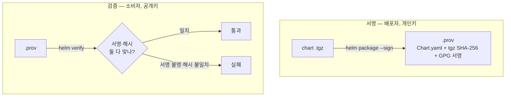

# 25. 출처·서명 — chart의 출처를 어떻게 보증하는가

레지스트리에서 받은 chart가 **정말 그 배포자가 만든 것이고, 받는 도중에 손대지 않았는지**를 어떻게 확인할까요. Helm은 이를 **provenance**로 답합니다 — chart를 서명하면 `.tgz` 옆에 `.prov` 파일이 생기는데, 여기엔 chart의 `Chart.yaml`과 `.tgz`의 SHA-256 해시가 들어 있고, 그 전체가 GPG로 서명됩니다. 받는 쪽은 서명자의 **공개키**로 두 가지를 한 번에 확인합니다. 서명이 그 공개키의 것인지(출처), 그리고 받은 `.tgz`의 해시가 `.prov`에 적힌 것과 같은지(무결성). 하나라도 어긋나면 검증이 실패합니다. 이 편은 GPG 키로 chart를 서명(`helm package --sign`)해 `.prov`가 무엇을 담는지 해부하고, `helm verify`가 통과·실패하는 경계를 실측합니다 — 정상, 내용 변조, 서명자 공개키 부재, 서명 없는 chart. 산출물은 서명된 chart(`.tgz` + `.prov`)와 검증용 공개키, 그리고 각 실패 조건에서 검증이 어떻게 막는지 본 기록입니다.

## 핵심 다이어그램



- **`.prov`는 서명된 지문이다.** chart 메타와 `.tgz`의 SHA-256을 담고, 그 전체를 GPG로 서명한다.
- **서명은 개인키로, 검증은 공개키로.** 배포자는 개인키로 서명하고, 소비자는 배포자의 공개키로 확인한다. 개인키는 공유하지 않는다.
- **검증은 두 가지를 본다.** 서명이 그 공개키의 것인지(출처), 받은 파일 해시가 `.prov`의 것과 같은지(무결성).
- **어긋나면 막는다.** 내용이 바뀌면 해시가 틀리고, 서명자 공개키가 없으면 출처를 확인할 수 없어 검증이 실패한다.

아래 시연이 서명 → 검증 통과 → 각 실패 조건을 하나씩 확인합니다.

## 사전 준비물

이 실습은 **macOS** 환경을 기준으로 합니다. 클러스터 없이 서명·검증이 됩니다.

- **Homebrew** — macOS 패키지 관리자.

### GnuPG 설치

서명·검증에 GPG 키가 필요합니다.

```bash
brew install gnupg
gpg --version | head -1      # gpg (GnuPG) 2.x
```

### Helm v3 설치

이 시리즈는 **Helm v3** 기준입니다. Homebrew가 v4를 설치한다면, 아래로 v3 바이너리를 받습니다 (Intel Mac은 `arm64`를 `amd64`로 바꿉니다).

```bash
brew install helm
helm version --short      # v3.x.x 인지 확인

# v4가 깔렸다면 v3로 교체
curl -fsSL https://get.helm.sh/helm-v3.21.2-darwin-arm64.tar.gz -o /tmp/helm3.tgz
tar -xzf /tmp/helm3.tgz -C /tmp
sudo mv /tmp/darwin-arm64/helm /usr/local/bin/helm
helm version --short      # v3.21.2
```

## 실습 환경

| 경로 | 내용 |
|---|---|
| `manifests/charts/my-service/` | 서명할 chart (`version 1.2.0`) |
| `manifests/my-service-1.2.0.tgz` | 서명된 chart (커밋된 산출물) |
| `manifests/my-service-1.2.0.tgz.prov` | provenance (커밋된 산출물) |
| `manifests/pubring.gpg` | 검증용 공개키 (커밋) — 키 없이 바로 검증 가능 |

```
manifests/                          # = 저장소 루트로 본다
├── charts/my-service/
│   ├── Chart.yaml                  # version 1.2.0 · appVersion 1.28
│   ├── values.yaml
│   └── templates/{deployment,service}.yaml
├── my-service-1.2.0.tgz            # 서명된 chart (커밋 O)
├── my-service-1.2.0.tgz.prov       # provenance (커밋 O)
├── pubring.gpg                     # 공개키 (커밋 O)
└── .gitignore                      # secring.gpg(개인키) 커밋 X
```

커밋된 `pubring.gpg`로 커밋된 `.tgz`를 바로 검증할 수 있습니다(아래 [3]). 직접 서명까지 따라 하려면 [1]에서 자기 키를 만듭니다. 아래 명령은 `manifests/` 디렉터리에서 실행합니다.

```bash
cd manifests
```

## 여기서 직접 확인할 수 있는 것

### [1] GPG 키를 만들고 helm용 keyring으로 내보낸다

데모용으로 격리된 keyring에 패스프레이즈 없는 키를 만듭니다(실무에서는 기본 `~/.gnupg`에, 패스프레이즈를 두고).

```bash
export GNUPGHOME=$(mktemp -d)      # 데모용 격리 (실무는 기본 ~/.gnupg)
cat > keyparams <<'EOF'
%no-protection
Key-Type: RSA
Key-Length: 3072
Name-Real: rosa-lab
Name-Email: rosa-lab@example.com
Expire-Date: 0
%commit
EOF
gpg --batch --gen-key keyparams
```

GnuPG 2.1+는 키를 keybox(`pubring.kbx`)에 두지만, Helm은 예전 형식의 keyring 파일을 읽습니다. 그래서 **서명용 secret keyring**과 **검증용 public keyring**을 파일로 내보냅니다.

```bash
gpg --export-secret-keys > secring.gpg    # 서명용 — 절대 커밋 금지
gpg --export           > pubring.gpg      # 검증용 — 공유 가능
```

### [2] sign — chart를 서명해 `.prov`를 만든다

`--sign`을 붙여 패키징하면 `.tgz`와 함께 `.tgz.prov`가 생깁니다.

```bash
helm package charts/my-service --sign --key 'rosa-lab' --keyring secring.gpg
ls my-service-1.2.0.tgz*
```

```
my-service-1.2.0.tgz
my-service-1.2.0.tgz.prov
```

`.prov`가 무엇을 담는지 봅니다.

```bash
cat my-service-1.2.0.tgz.prov
```

```
-----BEGIN PGP SIGNED MESSAGE-----
Hash: SHA512

apiVersion: v2
appVersion: "1.28"
description: 출처·서명(provenance·sign·verify)을 붙일 chart
name: my-service
type: application
version: 1.2.0

...
files:
  my-service-1.2.0.tgz: sha256:722b053d3d105bfca0ea848625e7fc0d539954453a26c50214842a957d0ee66f
-----BEGIN PGP SIGNATURE-----

wsDcBAEBCgAQBQJqRK5/CRBj/j6ovqm4rQAA...
-----END PGP SIGNATURE-----
```

세 부분입니다 — chart의 `Chart.yaml` 내용, `files:`에 적힌 `.tgz`의 **SHA-256 해시**, 그리고 그 전체에 대한 **PGP 서명**. 이 파일 하나가 "이 chart는 이 사람이 만들었고, 그 내용은 이 해시다"를 서명으로 못박습니다.

### [3] verify — 통과: 출처와 무결성을 함께 확인한다

공개키로 검증합니다. 커밋된 `pubring.gpg`로 커밋된 `.tgz`를 바로 확인할 수 있습니다.

```bash
helm verify --keyring pubring.gpg my-service-1.2.0.tgz
```

```
Signed by: rosa-lab <rosa-lab@example.com>
Using Key With Fingerprint: C557D1474A0E3FC239B5A4F163FE3EA8BEA9B8AD
Chart Hash Verified: sha256:722b053d3d105bfca0ea848625e7fc0d539954453a26c50214842a957d0ee66f
```

세 줄이 세 가지를 말합니다 — **누가** 서명했는지(`Signed by`), 그 **키 지문**, 그리고 `.tgz`의 **해시가 `.prov`와 일치**함(`Chart Hash Verified`). 출처와 무결성이 함께 확인됐습니다.

### [4] 내용이 변조되면 — 해시 불일치로 막는다

`.tgz` 내용을 1바이트만 바꿔 봅니다(`.prov`는 그대로).

```bash
mkdir -p /tmp/t
cp my-service-1.2.0.tgz my-service-1.2.0.tgz.prov /tmp/t/
printf 'x' >> /tmp/t/my-service-1.2.0.tgz      # 내용만 1바이트 변조
helm verify --keyring pubring.gpg /tmp/t/my-service-1.2.0.tgz
```

```
Error: sha256 sum does not match for my-service-1.2.0.tgz:
"sha256:722b053d...ee66f" != "sha256:84451ae9...b2b3"
```

`.prov`에 서명된 해시와 실제 파일 해시가 달라 검증이 실패합니다. 받는 도중에 한 바이트라도 바뀌면 걸립니다.

### [5] 서명자 공개키가 없으면 — 출처를 확인할 수 없다

검증은 무결성만 보는 게 아니라 **누가 서명했는지**를 봅니다. 서명자의 공개키가 없는 keyring으로 검증하면:

```bash
EMPTY=$(mktemp -d)
GNUPGHOME=$EMPTY gpg --export > /tmp/empty-pubring.gpg   # 아무 키도 없는 keyring
helm verify --keyring /tmp/empty-pubring.gpg my-service-1.2.0.tgz
```

```
Error: openpgp: signature made by unknown entity
```

해시는 맞아도, 서명을 만든 키가 keyring에 없어 **출처를 확인할 수 없다**며 막습니다. 그래서 소비자는 신뢰하는 배포자의 공개키를 미리 갖고 있어야 합니다.

### [6] 설치 시 검증 — `--verify`

`helm install`에 `--verify`를 붙이면 설치 전에 검증을 거칩니다. 서명된 chart는 통과하고,

```bash
helm install web my-service-1.2.0.tgz --verify --keyring pubring.gpg --dry-run
```

```
NAME: web
STATUS: pending-install
...
```

`.prov`가 없는(서명 안 된) chart는 설치 자체가 막힙니다.

```bash
helm package charts/my-service -d /tmp/unsigned      # 서명 없이 패키징
helm install web /tmp/unsigned/my-service-1.2.0.tgz --verify --keyring pubring.gpg --dry-run
```

```
Error: INSTALLATION FAILED: could not load provenance file .../my-service-1.2.0.tgz.prov:
... no such file or directory
```

OCI 레지스트리로 올릴 때도 `.prov`가 함께 push되고, `helm pull --verify`·`helm install --verify`가 같은 방식으로 출처를 확인합니다. 서명은 배포 파이프라인 끝에서 "이 chart는 우리가 낸 것"을 소비자가 검증할 수 있게 하는 마지막 관문입니다.

## 이 편의 산출물

- 서명된 chart `my-service-1.2.0.tgz`와 provenance `my-service-1.2.0.tgz.prov`, 검증용 공개키 `pubring.gpg` — 키 생성 없이 `helm verify`로 바로 재현 가능한 산출물.
- `.prov`가 chart `Chart.yaml` + `.tgz`의 SHA-256 + PGP 서명 세 부분으로 이뤄짐을 직접 열어 확인한 기록.
- `helm verify`가 서명자(`Signed by`)·키 지문·해시 일치(`Chart Hash Verified`)를 함께 보고하는 정상 검증 기록.
- 세 가지 실패 조건을 각각 재현: 내용 변조 → `sha256 sum does not match`, 서명자 공개키 부재 → `signature made by unknown entity`, 서명 없는 chart를 `--verify`로 설치 → `could not load provenance file`.
- 개인키(`secring.gpg`)는 `.gitignore`로 제외하고 공개키만 공유하는, 서명(개인키)·검증(공개키)의 키 분리 구조.
