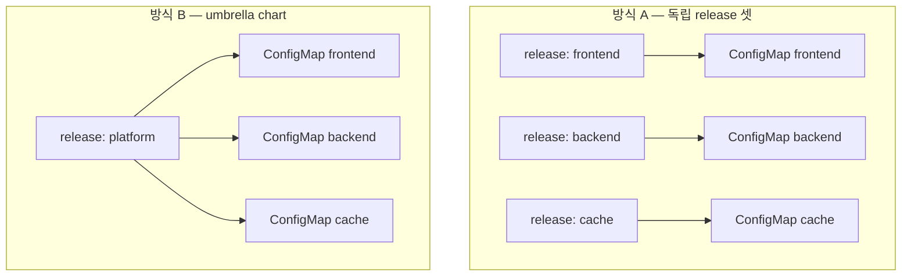

# 26. Release 전략 — release를 어떻게 쪼개고 배치하는가

선언적으로 배포하기 전에 정해야 할 것이 있습니다 — **release를 어떻게 쪼갤 것인가.** `frontend·backend·cache`를 각각 독립된 release 셋으로 둘 것인가, 아니면 하나의 umbrella chart로 묶어 release 하나로 둘 것인가. 이 선택이 배포·롤백·버전의 단위를 정합니다. release는 Helm이 라이프사이클을 추적하는 단위라, **한 release는 함께 배포되고 함께 롤백됩니다.** 여러 release로 쪼개면 각각을 따로 올리고 따로 되돌릴 수 있지만 그만큼 조율이 필요하고, umbrella로 묶으면 한 번에 원자적으로 움직이지만 한 subchart만 고쳐도 전체가 함께 움직입니다. 이 편은 같은 세 앱(`frontend·backend·cache`)을 두 방식으로 배포해 그 경계를 실측합니다 — 방식 A는 독립 release 셋, 방식 B는 umbrella chart 하나. 각 방식에서 `helm list`가 무엇을 세는지, ConfigMap을 누가 소유하는지, 그리고 한 앱을 바꾸고 롤백할 때 무엇이 함께 움직이는지 봅니다. 산출물은 두 방식을 각각 갖춘 chart 묶음과, release 경계가 롤백 범위를 어떻게 가르는지 본 기록입니다.

## 핵심 다이어그램



- **release는 라이프사이클의 단위다.** `helm install`·`upgrade`·`rollback`은 release 하나를 통째로 움직인다.
- **독립 release 셋 — 따로 움직인다.** `helm list`가 3줄. 각 앱을 따로 배포·롤백하고, 한 앱의 이력은 다른 앱과 무관하다. 대신 셋을 함께 맞추는 조율은 밖에서 해야 한다.
- **umbrella chart — 함께 움직인다.** `helm list`가 1줄. 한 subchart 값만 바꿔도 release 전체가 새 revision이 되고, 롤백하면 안 바꾼 subchart까지 함께 되돌아간다.
- **경계가 롤백 범위를 정한다.** "함께 되돌려야 하는가"가 곧 "한 release로 묶을 것인가"의 기준이다.

아래 시연이 두 방식을 같은 세 앱으로 배포해 경계를 확인합니다.

## 사전 준비물

이 실습은 **macOS** 환경을 기준으로 합니다.

- **Docker** — Docker Desktop, OrbStack 등. `docker ps`가 에러 없이 돌면 OK.
- **Homebrew** — macOS 패키지 관리자.

### kind · kubectl 설치

```bash
brew install kind kubectl
```

### Helm v3 설치

이 시리즈는 **Helm v3** 기준입니다. Homebrew가 v4를 설치한다면, 아래로 v3 바이너리를 받습니다 (Intel Mac은 `arm64`를 `amd64`로 바꿉니다).

```bash
brew install helm
helm version --short      # v3.x.x 인지 확인

# v4가 깔렸다면 v3로 교체
curl -fsSL https://get.helm.sh/helm-v3.21.2-darwin-arm64.tar.gz -o /tmp/helm3.tgz
tar -xzf /tmp/helm3.tgz -C /tmp
sudo mv /tmp/darwin-arm64/helm /usr/local/bin/helm
helm version --short      # v3.21.2
```

### rosa-lab 클러스터 · namespace 준비

```bash
kind create cluster --name rosa-lab
kubectl create namespace rosa-lab
kubectl config set-context --current --namespace=rosa-lab
```

## 실습 환경

| 경로 | 내용 |
|---|---|
| `manifests/charts/frontend/` · `backend/` · `cache/` | 앱 chart 셋 (각 ConfigMap 하나) |
| `manifests/charts/platform/` | umbrella chart — 셋을 subchart로 묶음 |

```
manifests/                       # = 저장소 루트로 본다
├── charts/
│   ├── frontend/                # ConfigMap frontend (message)
│   ├── backend/                 # ConfigMap backend
│   ├── cache/                   # ConfigMap cache
│   └── platform/                # umbrella
│       ├── Chart.yaml           # dependencies: frontend·backend·cache
│       ├── Chart.lock           # 고정된 의존성 (커밋 O)
│       └── values.yaml          # frontend:/backend:/cache: 아래에 subchart 값
└── .gitignore                   # platform/charts/*.tgz 제외
```

세 앱 chart는 각각 이름이 chart 이름인 ConfigMap 하나(`data.MESSAGE`)만 렌더합니다 — release 경계에만 집중하려고 객체를 최소로 뒀습니다. 아래 명령은 `manifests/` 디렉터리에서 실행합니다.

```bash
cd manifests
```

## 여기서 직접 확인할 수 있는 것

### 방식 A — 독립 release 셋

세 앱을 각각 별도 release로 설치합니다.

```bash
helm install frontend charts/frontend -n rosa-lab
helm install backend  charts/backend  -n rosa-lab
helm install cache    charts/cache    -n rosa-lab
helm list -n rosa-lab
```

```
NAME    	REVISION	STATUS  	CHART
backend 	1       	deployed	backend-0.1.0
cache   	1       	deployed	cache-0.1.0
frontend	1       	deployed	frontend-0.1.0
```

`helm list`가 **3줄**입니다 — release가 셋입니다. 각 ConfigMap이 누구 소유인지 봅니다(Helm은 관리 객체에 `meta.helm.sh/release-name` 주석을 붙입니다).

```bash
for cm in frontend backend cache; do
  printf '%s -> release: ' "$cm"
  kubectl get cm $cm -n rosa-lab -o jsonpath='{.metadata.annotations.meta\.helm\.sh/release-name}'; echo
done
```

```
frontend -> release: frontend
backend -> release: backend
cache -> release: cache
```

객체마다 소유 release가 다릅니다. 이제 **backend만** 올리고 되돌립니다.

```bash
helm upgrade backend charts/backend -n rosa-lab --set message="backend v2"
helm rollback backend 1 -n rosa-lab
helm history backend -n rosa-lab
```

```
REVISION	STATUS    	DESCRIPTION
1       	superseded	Install complete
2       	superseded	Upgrade complete
3       	deployed  	Rollback to 1
```

backend는 revision 3까지 쌓였습니다. frontend는 어떤가요.

```bash
helm history frontend -n rosa-lab
```

```
REVISION	STATUS  	DESCRIPTION
1       	deployed	Install complete
```

frontend는 revision 1 그대로입니다 — backend를 올리고 되돌리는 동안 아무 영향도 받지 않았습니다. **release가 독립이라 이력도, 롤백도 독립**입니다. 대신 "셋을 같은 버전으로 함께 배포"하려면 세 번의 명령을 밖에서 조율해야 합니다. 정리:

```bash
helm uninstall frontend backend cache -n rosa-lab
```

### 방식 B — umbrella chart

이번엔 셋을 한 chart로 묶습니다. `platform`은 셋을 subchart로 두는 umbrella입니다.

```bash
helm dependency build charts/platform
helm install platform charts/platform -n rosa-lab
helm list -n rosa-lab
```

```
NAME    	REVISION	STATUS  	CHART
platform	1       	deployed	platform-0.1.0
```

`helm list`가 **1줄**입니다 — ConfigMap은 셋인데 release는 하나입니다. 소유 release를 봅니다.

```bash
for cm in frontend backend cache; do
  printf '%s -> release: ' "$cm"
  kubectl get cm $cm -n rosa-lab -o jsonpath='{.metadata.annotations.meta\.helm\.sh/release-name}'; echo
done
```

```
frontend -> release: platform
backend -> release: platform
cache -> release: platform
```

셋 다 `platform` 소유입니다. 이제 **backend 값만** 바꿔 upgrade합니다.

```bash
helm upgrade platform charts/platform -n rosa-lab --set backend.message="backend v2"
for cm in frontend backend cache; do printf '%s: ' "$cm"; kubectl get cm $cm -n rosa-lab -o jsonpath='{.data.MESSAGE}'; echo; done
helm history platform -n rosa-lab
```

```
frontend: frontend v1
backend: backend v2
cache: cache v1

REVISION	STATUS    	DESCRIPTION
1       	superseded	Install complete
2       	deployed  	Upgrade complete
```

backend만 v2가 됐지만, revision이 오른 것은 **platform 하나**입니다 — frontend·cache는 값이 그대로여도 같은 release의 revision 2에 함께 담깁니다. 여기서 롤백하면:

```bash
helm rollback platform 1 -n rosa-lab
for cm in frontend backend cache; do printf '%s: ' "$cm"; kubectl get cm $cm -n rosa-lab -o jsonpath='{.data.MESSAGE}'; echo; done
```

```
frontend: frontend v1
backend: backend v1
cache: cache v1
```

backend가 v1로 돌아왔습니다. **바꾸지 않은 frontend·cache까지 같은 롤백에 포함**됩니다 — release가 하나라 되돌림도 통째입니다. 정리:

```bash
helm uninstall platform -n rosa-lab
```

### 두 방식의 경계

| | 독립 release 셋 | umbrella chart |
|---|---|---|
| `helm list` | 3줄 | 1줄 |
| 배포 단위 | 앱마다 따로 | 한 번에 통째 |
| 롤백 범위 | 그 앱만 | 전체(안 바꾼 것 포함) |
| 버전 | 앱마다 독립 | umbrella 하나 |
| 조율 | 밖에서(순서·버전 맞춤) | chart가 묶어 줌 |
| 맞는 경우 | 앱이 독립 배포·독립 롤백돼야 할 때 | 항상 함께 배포·롤백되는 한 덩어리일 때 |

세 번째 축이 있습니다 — **app-of-apps**. umbrella가 "여러 subchart를 한 release로" 묶는다면, app-of-apps는 반대로 **여러 개의 독립 release를 그대로 두되, 그것들을 배포하는 선언 하나를 상위에 둡니다.** GitOps 도구(Argo CD 등)가 상위 선언 하나를 보고 각 앱을 각자의 release로 배포·동기화하는 방식입니다. release는 여전히 독립(방식 A의 장점)이면서, "무엇을 배포할지"의 목록만 한곳에서 관리합니다. umbrella가 *배포 단위*를 묶는 것이라면, app-of-apps는 *배포 대상 목록*을 묶는 것입니다.

## 이 편의 산출물

- 같은 세 앱을 두 방식으로 배포하는 chart 묶음 — 독립 release용 `frontend·backend·cache`와 umbrella `platform`.
- 방식 A에서 `helm list`가 3줄이고 각 ConfigMap의 소유 release가 서로 다름을, `meta.helm.sh/release-name` 주석으로 확인한 기록.
- 방식 A에서 backend만 upgrade·rollback해 revision 3까지 쌓이는 동안 frontend는 revision 1 그대로임을 본, release 독립성의 근거.
- 방식 B에서 `helm list`가 1줄이고 세 ConfigMap 모두 `platform` 소유이며, backend 값만 바꿔도 platform 하나의 revision이 오르고 롤백하면 안 바꾼 frontend·cache까지 함께 되돌아감을 본, umbrella 원자성의 근거.
- 두 방식의 경계표(배포 단위·롤백 범위·버전·조율)와 app-of-apps(배포 대상 목록을 묶는 상위 선언)의 위치 — release를 어떻게 쪼갤지의 판단 기준.
