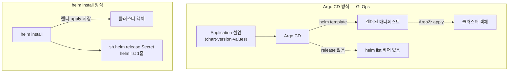

# 27. GitOps에서 Helm — 선언적 배포에 Helm을 얹으면 release는 누가 관리하는가

GitOps에서는 `helm install`을 사람이 치지 않습니다. 대신 "무엇을, 어디에, 어떻게 배포할지"를 선언으로 Git에 두면, 컨트롤러(Argo CD·Flux)가 그 선언과 클러스터를 맞춥니다. 이때 Helm의 역할이 바뀝니다. **Argo CD는 chart를 `helm install`이 아니라 `helm template`으로 렌더한 뒤 자기가 직접 apply합니다** — 그래서 Helm release가 생기지 않습니다. `helm list`에 안 뜨고, `sh.helm.release` Secret도 없습니다. release의 라이프사이클(무엇이 배포됐고 어떻게 되돌리나)을 관리하는 주체가 Helm에서 Argo CD로 넘어간 것입니다. Helm은 "패키징·렌더러"로만 남습니다. (Flux는 다릅니다 — HelmController가 Helm SDK로 진짜 release를 만듭니다.) 이 편은 Argo CD를 kind에 올리고, Helm chart를 가리키는 Application 하나를 선언해 동기화한 뒤, 그 결과에 **Helm release가 없음**을 `helm install` 방식과 나란히 놓고 실측합니다. 산출물은 chart를 배포하는 Argo CD Application과, 같은 chart를 두 방식(Argo 렌더 vs helm install)으로 배포했을 때 release 흔적이 어떻게 갈리는지 본 기록입니다.

## 핵심 다이어그램



- **선언이 명령을 대신한다.** `helm install`을 치는 대신 Application(무엇을·어디에·어떻게)을 선언하면 Argo CD가 맞춘다.
- **Argo CD는 `helm template`으로 렌더하고 자기가 apply한다.** Helm의 install 경로를 타지 않는다.
- **그래서 Helm release가 없다.** `helm list`가 비어 있고 `sh.helm.release` Secret도 없다. release 관리 주체가 Argo CD다.
- **Helm은 패키징·렌더러로 남는다.** chart·values는 그대로 쓰되, 라이프사이클은 GitOps 컨트롤러가 쥔다. (Flux는 Helm SDK로 진짜 release를 만들어 이 점이 다르다.)

아래 시연이 Argo CD로 Helm chart를 배포하고, release 흔적을 `helm install` 방식과 비교합니다.

## 사전 준비물

이 실습은 **macOS** 환경을 기준으로 합니다.

- **Docker** — Docker Desktop, OrbStack 등. `docker ps`가 에러 없이 돌면 OK.
- **Homebrew** — macOS 패키지 관리자.

### kind · kubectl 설치

```bash
brew install kind kubectl
```

### Helm v3 설치

이 시리즈는 **Helm v3** 기준입니다. Homebrew가 v4를 설치한다면, 아래로 v3 바이너리를 받습니다 (Intel Mac은 `arm64`를 `amd64`로 바꿉니다).

```bash
brew install helm
helm version --short      # v3.x.x 인지 확인

# v4가 깔렸다면 v3로 교체
curl -fsSL https://get.helm.sh/helm-v3.21.2-darwin-arm64.tar.gz -o /tmp/helm3.tgz
tar -xzf /tmp/helm3.tgz -C /tmp
sudo mv /tmp/darwin-arm64/helm /usr/local/bin/helm
helm version --short      # v3.21.2
```

### rosa-lab 클러스터 준비

```bash
kind create cluster --name rosa-lab
```

### Argo CD 설치

```bash
kubectl create namespace argocd
kubectl apply -n argocd -f https://raw.githubusercontent.com/argoproj/argo-cd/stable/manifests/install.yaml
kubectl -n argocd wait --for=condition=Ready pod --all --timeout=180s
```

> ApplicationSet CRD가 커서 `kubectl apply`가 그 CRD 하나에서 "annotations Too long" 경고를 낼 수 있는데, 이 실습에는 무관합니다(Application CRD·핵심 컨트롤러는 정상 생성). 필요하면 `kubectl apply --server-side`로 다시 적용합니다.

## 실습 환경

| 경로 | 내용 |
|---|---|
| `manifests/application.yaml` | Helm chart를 배포하는 Argo CD Application 선언 |

`podinfo` 공개 Helm chart를 대상으로 씁니다 — Argo CD가 Helm chart를 어떻게 다루는지에 집중하려고, 내 chart 대신 안정적인 공개 chart를 배포 대상으로 뒀습니다. 아래 명령은 `manifests/` 디렉터리에서 실행합니다.

```bash
cd manifests
```

## 여기서 직접 확인할 수 있는 것

### [1] Application을 선언하면 Argo CD가 배포한다

`application.yaml`은 chart·버전·values를 선언합니다.

```yaml
spec:
  source:
    repoURL: https://stefanprodan.github.io/podinfo
    chart: podinfo
    targetRevision: 6.14.0
    helm:
      parameters:
        - name: replicaCount
          value: "2"
  destination:
    namespace: rosa-lab
  syncPolicy:
    automated: {}
```

이 선언을 클러스터에 두면(GitOps에서는 Git에 커밋하면), Argo CD가 알아서 동기화합니다.

```bash
kubectl apply -f application.yaml
kubectl get application podinfo -n argocd \
  -o custom-columns='NAME:.metadata.name,SYNC:.status.sync.status,HEALTH:.status.health.status'
```

```
NAME      SYNC     HEALTH
podinfo   Synced   Healthy
```

`helm install`을 치지 않았는데 배포됐고, `helm.parameters`의 `replicaCount: 2`가 반영됐습니다.

```bash
kubectl get deploy podinfo -n rosa-lab
```

```
NAME      READY   UP-TO-DATE   AVAILABLE
podinfo   2/2     2            2
```

Argo CD가 chart를 렌더할 때 values를 그대로 먹였습니다 — Helm은 렌더러로 동작했습니다.

### [2] 그런데 Helm release가 없다

`helm install`이었다면 release가 남습니다. 확인해 봅니다.

```bash
helm list -A
```

```
NAME	NAMESPACE	REVISION	STATUS	CHART	APP VERSION
```

비어 있습니다 — Helm이 아는 release가 없습니다. release 상태를 담는 Secret도 봅니다.

```bash
kubectl get secret -n rosa-lab | grep 'sh.helm.release'
```

```
(아무것도 안 나온다)
```

`sh.helm.release.*` Secret이 없습니다. Argo CD는 chart를 `helm template`으로 렌더해 **자기가 apply**했을 뿐, Helm의 install 경로(release 저장)를 타지 않았습니다. 그럼 이 객체는 누가 추적할까요.

```bash
kubectl get deploy podinfo -n rosa-lab \
  -o jsonpath='{.metadata.annotations.argocd\.argoproj\.io/tracking-id}'
```

```
podinfo:apps/Deployment:rosa-lab/podinfo
```

Argo CD가 자기 주석(`tracking-id`)으로 소유·추적합니다. `meta.helm.sh/release-name` 주석은 없습니다(`helm install`이 붙이는 것이라).

> 참고: Deployment에 `app.kubernetes.io/managed-by: Helm` **라벨**이 보일 수 있는데, 이건 podinfo chart 템플릿이 박은 것입니다(`helm template`이 도니 `.Release.Service`가 Helm). 실제 Helm release가 있다는 뜻이 아닙니다 — 위처럼 `helm list`와 Secret으로 확인합니다.

### [3] 대비 — `helm install`은 release를 남긴다

같은 chart를 같은 값으로 `helm install` 해 봅니다(다른 namespace).

```bash
helm repo add podinfo https://stefanprodan.github.io/podinfo
helm install podinfo podinfo/podinfo --version 6.14.0 \
  -n helm-way --create-namespace --set replicaCount=2
helm list -n helm-way
```

```
NAME    	REVISION	STATUS  	CHART
podinfo 	1       	deployed	podinfo-6.14.0
```

이번엔 release가 있습니다. 저장 Secret과 소유 주석도 봅니다.

```bash
kubectl get secret -n helm-way | grep 'sh.helm.release'
kubectl get deploy podinfo -n helm-way \
  -o jsonpath='{.metadata.annotations.meta\.helm\.sh/release-name}'
```

```
sh.helm.release.v1.podinfo.v1   helm.sh/release.v1   1
podinfo
```

`sh.helm.release.v1.podinfo.v1` Secret과 `meta.helm.sh/release-name` 주석이 있습니다. 같은 chart·같은 `replicaCount`인데, **Argo CD 방식은 release를 안 남기고 helm install 방식은 남깁니다.** 이 차이가 곧 "release를 누가 관리하는가"입니다 — Argo CD 방식에서는 롤백·이력·상태를 Argo CD(Git)에서 보고, Helm의 `helm rollback`은 쓰지 않습니다.

### 정리

```bash
helm uninstall podinfo -n helm-way
kubectl delete ns helm-way
kubectl delete -f application.yaml
```

### Argo CD와 Flux는 Helm을 다르게 얹는다

같은 GitOps라도 Helm을 얹는 방식이 갈립니다.

| | Argo CD (native Helm) | Flux (HelmController) |
|---|---|---|
| chart를 어떻게 다루나 | `helm template`으로 렌더 후 Argo가 apply | Helm SDK로 진짜 `install`/`upgrade` |
| Helm release | 없음(`helm list` 비어 있음) | 있음(release Secret 생성) |
| 롤백 | Argo/Git에서(이전 커밋으로) | HelmRelease로, Helm 라이프사이클 사용 |
| hooks·test | 렌더 대상이라 일부는 다르게 동작 | Helm 훅을 그대로 실행 |

Argo CD는 Helm을 "렌더러"로만 쓰고 release 관리를 자기가 가져가고, Flux는 Helm의 release 관리를 그대로 살립니다. 어느 쪽이든 공통점은 **chart와 values는 그대로 재사용**된다는 것입니다 — 지금까지 만든 chart는 배포 시스템을 바꿔도 그대로 쓰입니다.

## 이 편의 산출물

- Helm chart를 배포하는 Argo CD Application 선언 `application.yaml` — `helm install` 명령 대신 chart·버전·values를 선언으로 둔 형태.
- Argo CD가 Application을 `Synced/Healthy`로 동기화하고 `helm.parameters`(replicaCount=2)를 반영해 chart를 렌더·배포한 기록.
- 그 결과에 **Helm release가 없음**을 실측: `helm list` 비어 있음, `sh.helm.release` Secret 없음, 소유는 Argo CD `tracking-id` 주석 — release 관리 주체가 Argo CD로 넘어감.
- 같은 chart를 `helm install`한 대비군에서는 `sh.helm.release.v1.podinfo.v1` Secret과 `meta.helm.sh/release-name` 주석이 생김을 확인 — 두 방식의 release 흔적 차이.
- Argo CD(렌더러로 사용, release 없음) vs Flux(Helm SDK 사용, release 있음)의 경계표 — 같은 GitOps라도 Helm을 얹는 방식이 다름.
