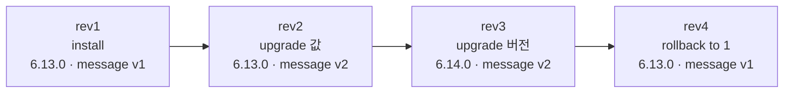
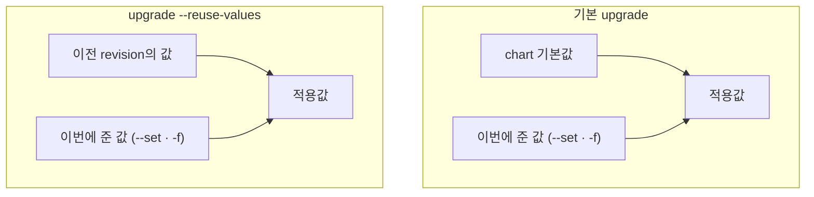

# 3. release 라이프사이클 — upgrade · rollback

release는 한 번 설치하고 끝나지 않습니다. 값을 바꾸고, chart 버전을 올리고, 문제가 생기면 되돌립니다. 이 편은 그 라이프사이클을 revision 단위로 봅니다. 핵심 감각은 두 가지입니다 — **upgrade도 rollback도 새 revision을 쌓을 뿐, 과거 revision을 지우지 않는다**(그래서 어디로든 되돌릴 수 있다), 그리고 **기본 `helm upgrade`는 이전 값을 자동으로 이어받지 않는다**(이번에 주지 않은 값은 chart 기본값으로 돌아간다 — `--reuse-values`가 그 동작을 바꾼다). 실습은 `podinfo`를 설치한 뒤 값·버전을 올려 revision을 쌓고, `helm history`로 그 궤적을 읽고, 특정 revision으로 rollback합니다. 산출물은 revision이 어떻게 쌓이고 rollback이 어디서 복원하는지에 대한 재현 가능한 기록과, upgrade 시 값이 병합되는 규칙을 직접 본 경험입니다. 실패한 upgrade를 자동 복구하는 옵션(`--atomic`·`--wait`)과 깨진 release 진단은 운영 편(29·30편)에서 다룹니다.

## 핵심 다이어그램





- **revision은 변경마다 쌓인다.** install이 rev1, 이후 upgrade마다 rev2·rev3… 각 revision은 그 시점의 chart 버전·값·렌더 결과를 통째로 담은 한 장입니다.
- **rollback도 새 revision이다.** rev1로 되돌려도 rev1을 다시 쓰는 게 아니라, rev1의 내용을 담은 **새 revision(rev4)** 이 만들어집니다. history는 줄지 않고 자랍니다.
- **현재 위치는 하나다.** history에서 `STATUS: deployed`인 한 줄만 지금 클러스터에 적용된 상태이고, 나머지는 `superseded`입니다.
- **값은 자동으로 이어지지 않는다.** 기본 upgrade는 chart 기본값 위에 *이번에 준 값만* 얹습니다. 직전 revision에서 주었던 값은, 이번에 다시 주지 않으면 사라집니다. `--reuse-values`는 출발점을 chart 기본값이 아니라 이전 revision의 값으로 바꿉니다.

아래 시연이 이 궤적을 한 줄씩 손으로 확인합니다.

## 사전 준비물

이 실습은 **macOS** 환경을 기준으로 합니다.

- **Docker** — Docker Desktop, OrbStack 등. `docker ps`가 에러 없이 돌아가면 OK.
- **Homebrew** — macOS 패키지 관리자.

### kind · kubectl 설치

```bash
brew install kind kubectl
```

### Helm v3 설치

이 시리즈는 **Helm v3** 기준입니다. Homebrew가 v4를 설치한다면, 아래로 v3 바이너리를 받습니다 (Intel Mac은 `arm64`를 `amd64`로 바꿉니다).

```bash
brew install helm
helm version --short      # v3.x.x 인지 확인

# v4가 깔렸다면 v3로 교체
curl -fsSL https://get.helm.sh/helm-v3.21.2-darwin-arm64.tar.gz -o /tmp/helm3.tgz
tar -xzf /tmp/helm3.tgz -C /tmp
sudo mv /tmp/darwin-arm64/helm /usr/local/bin/helm
helm version --short      # v3.21.2
```

### rosa-lab 클러스터 · namespace · chart repo 준비

```bash
kind create cluster --name rosa-lab
kubectl create namespace rosa-lab
kubectl config set-context --current --namespace=rosa-lab
helm repo add podinfo https://stefanprodan.github.io/podinfo
helm repo update podinfo
```

이미 있으면 건너뜁니다 (`kind get clusters`, `helm repo list`로 확인).

## 여기서 직접 확인할 수 있는 것

이 편은 매니페스트 파일 없이 `--set`으로 값을 바꿔 가며 진행합니다 — 산출물은 파일이 아니라 release의 revision 이력입니다.

### helm install — 첫 revision

chart 버전을 6.13.0으로 고정하고, 화면 메시지를 지정해 설치합니다.

```bash
helm install web podinfo/podinfo --version 6.13.0 --set ui.message="release v1" -n rosa-lab
```

```
NAME: web
LAST DEPLOYED: Fri Jun 26 15:54:51 2026
NAMESPACE: rosa-lab
STATUS: deployed
REVISION: 1
```

`REVISION: 1` — 라이프사이클의 시작점입니다.

### helm upgrade — 값을 바꾸면 rev2

같은 chart 버전에서 메시지만 바꿔 올립니다.

```bash
helm upgrade web podinfo/podinfo --version 6.13.0 --set ui.message="release v2" -n rosa-lab
```

```
Release "web" has been upgraded. Happy Helming!
NAME: web
LAST DEPLOYED: Fri Jun 26 15:54:51 2026
NAMESPACE: rosa-lab
STATUS: deployed
```

`install`이 아니라 `upgrade`이므로 release는 사라지지 않고, 위에 새 revision이 얹힙니다.

### helm upgrade — 버전을 바꾸면 rev3

이번엔 chart 버전을 6.14.0으로 올립니다. 값(message)은 다시 지정합니다 — 이유는 마지막 절에서 봅니다.

```bash
helm upgrade web podinfo/podinfo --version 6.14.0 --set ui.message="release v2" -n rosa-lab
```

```
Release "web" has been upgraded. Happy Helming!
NAME: web
LAST DEPLOYED: Fri Jun 26 15:54:59 2026
NAMESPACE: rosa-lab
STATUS: deployed
```

### helm history — 궤적을 읽는다

지금까지 쌓인 revision을 한눈에 봅니다.

```bash
helm history web -n rosa-lab
```

```
REVISION	UPDATED                 	STATUS    	CHART         	APP VERSION	DESCRIPTION
1       	Fri Jun 26 15:54:51 2026	superseded	podinfo-6.13.0	6.13.0     	Install complete
2       	Fri Jun 26 15:54:51 2026	superseded	podinfo-6.13.0	6.13.0     	Upgrade complete
3       	Fri Jun 26 15:54:59 2026	deployed  	podinfo-6.14.0	6.14.0     	Upgrade complete
```

`CHART` 칸이 rev3에서 `podinfo-6.14.0`으로 바뀐 게 버전 upgrade의 흔적입니다. `STATUS`는 rev3만 `deployed`, 나머지는 `superseded` — 지금 클러스터에 적용된 건 rev3 하나뿐입니다. `helm list`도 같은 사실을 현재 위치로 보여 줍니다.

```bash
helm list -n rosa-lab
```

```
NAME	NAMESPACE	REVISION	UPDATED                             	STATUS  	CHART         	APP VERSION
web 	rosa-lab 	3       	2026-06-26 15:54:59.282482 +0900 KST	deployed	podinfo-6.14.0	6.14.0
```

### 과거 revision은 그대로 남아 있다

이전 revision의 값은 지워지지 않았으므로 그대로 조회됩니다.

```bash
helm get values web --revision 1 -n rosa-lab
```

```
USER-SUPPLIED VALUES:
ui:
  message: release v1
```

rev1에 주었던 `release v1`이 rev3 시점에도 살아 있습니다. 이게 남아 있기에 그리로 되돌릴 수 있습니다.

### helm rollback — 되돌려도 history는 자란다

rev1로 되돌립니다.

```bash
helm rollback web 1 -n rosa-lab
```

```
Rollback was a success! Happy Helming!
```

```bash
helm history web -n rosa-lab
```

```
REVISION	UPDATED                 	STATUS    	CHART         	APP VERSION	DESCRIPTION
1       	Fri Jun 26 15:54:51 2026	superseded	podinfo-6.13.0	6.13.0     	Install complete
2       	Fri Jun 26 15:54:51 2026	superseded	podinfo-6.13.0	6.13.0     	Upgrade complete
3       	Fri Jun 26 15:54:59 2026	superseded	podinfo-6.14.0	6.14.0     	Upgrade complete
4       	Fri Jun 26 15:55:09 2026	deployed  	podinfo-6.13.0	6.13.0     	Rollback to 1
```

rev1로 "돌아갔지만" 만들어진 건 **rev4**입니다 — `DESCRIPTION: Rollback to 1`, `CHART: podinfo-6.13.0`(rev1과 같은 버전). history는 4줄로 자랐고, rev3은 사라지지 않고 `superseded`로 남습니다. 그래서 방금 되돌린 것조차 다시 `helm rollback web 3`으로 앞으로 갈 수 있습니다.

### 값은 자동으로 이어지지 않는다

라이프사이클에서 가장 자주 데는 지점입니다. 두 값을 주고 설치한 뒤, upgrade에서 **한 값만** 바꿔 봅니다.

```bash
helm install web podinfo/podinfo --version 6.14.0 \
  --set replicaCount=3 --set ui.message=keep -n rosa-lab
helm upgrade web podinfo/podinfo --version 6.14.0 \
  --set ui.message=changed -n rosa-lab
helm get values web -n rosa-lab
```

```
USER-SUPPLIED VALUES:
ui:
  message: changed
```

```bash
helm get manifest web -n rosa-lab | grep -m1 'replicas:'
```

```
  replicas: 1
```

**`replicaCount=3`이 사라졌습니다.** 기본 upgrade는 직전 값을 이어받지 않고 chart 기본값에서 출발하므로, 이번에 주지 않은 `replicaCount`는 기본값 1로 돌아갑니다. 같은 upgrade를 `--reuse-values`로 하면 출발점이 달라집니다.

```bash
helm uninstall web -n rosa-lab
helm install web podinfo/podinfo --version 6.14.0 \
  --set replicaCount=3 --set ui.message=keep -n rosa-lab
helm upgrade web podinfo/podinfo --version 6.14.0 \
  --reuse-values --set ui.message=changed -n rosa-lab
helm get values web -n rosa-lab
```

```
USER-SUPPLIED VALUES:
replicaCount: 3
ui:
  message: changed
```

```bash
helm get manifest web -n rosa-lab | grep -m1 'replicas:'
```

```
  replicas: 3
```

`--reuse-values`는 이전 revision의 값을 출발점으로 삼고 거기에 새 값을 얹으므로 `replicaCount=3`이 유지됩니다. 실무에서 권장되는 쪽은 매번 같은 `-f values.yaml`을 명시해 적용값을 선언적으로 고정하는 것입니다 — `--reuse-values`는 "직전 상태가 무엇이었는지"에 결과가 의존해, 이력을 따라가지 않으면 헷갈리기 쉽습니다.

### 정리

```bash
helm uninstall web -n rosa-lab
```

클러스터까지 정리하려면:

```bash
kind delete cluster --name rosa-lab
```

## 이 편의 산출물

- `helm install` → `helm upgrade`(값 변경) → `helm upgrade`(버전 변경) → `helm rollback`으로 release를 움직이며, revision이 1→2→3→4로 쌓이는 궤적을 직접 만든 기록.
- `helm history`를 읽고 `CHART`(버전 변화)·`STATUS`(`deployed` 한 줄 vs `superseded`)·`DESCRIPTION`(`Rollback to 1`)의 의미를 짚은 상태.
- **rollback은 과거 revision을 다시 쓰는 게 아니라 그 내용을 담은 새 revision을 만든다**는 것 — rev1로 되돌렸을 때 rev4가 생기고 history가 줄지 않음을 확인한 경험.
- `helm get values --revision N`으로 과거 revision의 값이 그대로 남아 있음을 보고, rollback이 가능한 이유를 연결한 상태.
- **기본 `helm upgrade`는 이전 값을 이어받지 않는다**는 함정을, `replicaCount`가 리셋되는 것과 `--reuse-values`로 유지되는 것을 대비해 직접 본 경험.
