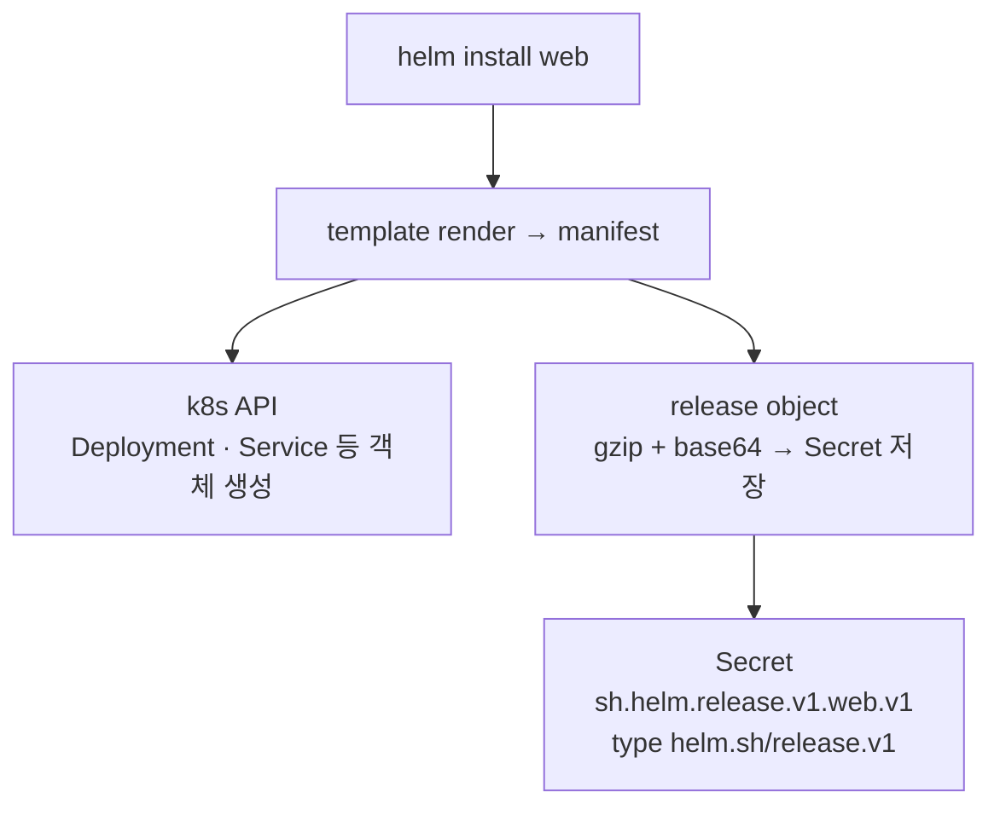
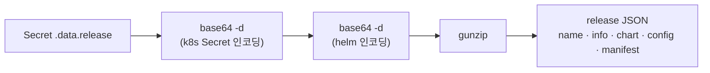

# 4. Helm 내부 구조 — release는 어디 저장되는가

`helm rollback`은 로컬 파일이 아니라 클러스터에 저장된 revision에서 복원합니다. 그 저장소가 무엇인지 이 편에서 엽니다. release 상태는 **설치한 namespace 안의 Secret**으로, revision마다 하나씩 저장됩니다 — 이름은 `sh.helm.release.v1.<release>.v<revision>`, type은 `helm.sh/release.v1`입니다. 그 Secret을 디코드하면 chart·사용자 값(config)·렌더된 manifest까지 담은 release object 하나가 통째로 들어 있습니다. 이 편은 그 Secret을 직접 디코드해 내용을 확인하고, revision과 Secret이 1:1로 대응함을 보고, Secret을 지우면 helm이 release를 잊는다는 것(객체는 그대로 도는데도)을 확인합니다. 그렇게 "Helm은 왜 상태를 클러스터에 저장하고 `kubectl apply`는 저장하지 않는가"라는 질문에 답합니다. 산출물은 release Secret의 디코드 경로와 내부 구조, 그리고 storage driver가 무엇인지에 대한 직접 확인 기록입니다.

## 핵심 다이어그램





- **release는 namespace 안의 Secret이다.** `helm install`은 객체만 만드는 게 아니라, release object를 압축·인코딩해 같은 namespace에 Secret으로 저장합니다. 이름은 `sh.helm.release.v1.<release>.v<revision>`.
- **revision마다 Secret 하나.** install이 `v1`, upgrade가 `v2`… label `status`가 `deployed`/`superseded`를 가릅니다. `helm history`·`helm list`는 이 Secret들을 읽어 보여 준 것입니다.
- **Secret 안에 release 전체가 있다.** 두 번 base64 디코드하고 gunzip하면 chart·config(사용자 값)·manifest(렌더 결과)를 담은 JSON이 나옵니다. `helm get`은 클러스터의 객체가 아니라 이 Secret에서 읽습니다.
- **그래서 helm은 무상태 클라이언트다.** 상태가 클러스터에 있으니 어느 머신의 helm으로도 같은 release를 봅니다. 거꾸로, 이 Secret을 지우면 helm은 그 release를 잊습니다 — 객체는 그대로 도는데도.

아래 시연이 이 구조를 한 줄씩 손으로 확인합니다.

## 사전 준비물

이 실습은 **macOS** 환경을 기준으로 합니다.

- **Docker** — Docker Desktop, OrbStack 등. `docker ps`가 에러 없이 돌아가면 OK.
- **Homebrew** — macOS 패키지 관리자.

### kind · kubectl 설치

```bash
brew install kind kubectl
```

### Helm v3 설치

이 시리즈는 **Helm v3** 기준입니다. Homebrew가 v4를 설치한다면, 아래로 v3 바이너리를 받습니다 (Intel Mac은 `arm64`를 `amd64`로 바꿉니다).

```bash
brew install helm
helm version --short      # v3.x.x 인지 확인

# v4가 깔렸다면 v3로 교체
curl -fsSL https://get.helm.sh/helm-v3.21.2-darwin-arm64.tar.gz -o /tmp/helm3.tgz
tar -xzf /tmp/helm3.tgz -C /tmp
sudo mv /tmp/darwin-arm64/helm /usr/local/bin/helm
helm version --short      # v3.21.2
```

### rosa-lab 클러스터 · namespace · chart repo 준비

```bash
kind create cluster --name rosa-lab
kubectl create namespace rosa-lab
kubectl config set-context --current --namespace=rosa-lab
helm repo add podinfo https://stefanprodan.github.io/podinfo
helm repo update podinfo
```

이미 있으면 건너뜁니다 (`kind get clusters`, `helm repo list`로 확인).

## 여기서 직접 확인할 수 있는 것

이 편은 매니페스트 파일 없이 진행합니다 — 들여다보는 대상은 helm이 클러스터에 직접 만든 Secret입니다. 먼저 release 하나를 설치합니다.

```bash
helm install web podinfo/podinfo --version 6.14.0 --set ui.message="stored in a secret" -n rosa-lab
```

### release Secret 찾기

설치한 namespace에 생긴 Secret을 봅니다.

```bash
kubectl get secret -n rosa-lab
```

```
NAME                        TYPE                 DATA   AGE
sh.helm.release.v1.web.v1   helm.sh/release.v1   1      0s
```

이름 `sh.helm.release.v1.web.v1` — `<release>=web`, `v<revision>=v1`입니다. type `helm.sh/release.v1`은 helm이 쓰는 전용 type입니다. label에 release의 메타데이터가 들어 있습니다.

```bash
kubectl get secret sh.helm.release.v1.web.v1 -n rosa-lab -o jsonpath='{.metadata.labels}'
```

```json
{"modifiedAt":"1782458536","name":"web","owner":"helm","status":"deployed","version":"1"}
```

`owner=helm`, `name=web`, `status=deployed`, `version=1` — `helm list`가 보여 주는 정보가 사실은 이 label에서 옵니다.

### 디코드 — Secret 안에 무엇이 있나

Secret의 `.data.release`는 압축·이중 인코딩돼 있습니다. **base64(k8s) → base64(helm) → gunzip** 순으로 풀면 JSON이 나옵니다.

```bash
kubectl get secret sh.helm.release.v1.web.v1 -n rosa-lab -o jsonpath='{.data.release}' \
  | base64 -d | base64 -d | gunzip \
  | python3 -c 'import sys,json; d=json.load(sys.stdin); \
print("keys:", list(d.keys())); \
print("chart.version:", d["chart"]["metadata"]["version"]); \
print("config:", d["config"])'
```

```
keys: ['name', 'info', 'chart', 'config', 'manifest', 'hooks', 'version', 'namespace']
chart.version: 6.14.0
config: {'ui': {'message': 'stored in a secret'}}
```

이 한 장에 release를 재현하는 데 필요한 모든 게 있습니다 — 설치된 `chart`, 내가 준 값 `config`, 렌더된 `manifest`, 상태 `info`, revision `version`. `helm rollback`이 파일 없이 과거로 돌아갈 수 있는 건, 각 revision의 이 한 장이 통째로 저장돼 있기 때문입니다.

### helm get은 이 Secret에서 읽는다

저장된 `manifest`가 `helm get manifest`의 출력과 같은지 비교하면, helm이 클러스터의 객체가 아니라 이 Secret을 읽는다는 게 드러납니다.

```bash
# Secret 속 manifest
kubectl get secret sh.helm.release.v1.web.v1 -n rosa-lab -o jsonpath='{.data.release}' \
  | base64 -d | base64 -d | gunzip \
  | python3 -c 'import sys,json; sys.stdout.write(json.load(sys.stdin)["manifest"])' > /tmp/sec.txt
# helm get manifest
helm get manifest web -n rosa-lab > /tmp/get.txt

diff <(sed -e 's/[[:space:]]*$//' /tmp/sec.txt | sed '/^$/d') \
     <(sed -e 's/[[:space:]]*$//' /tmp/get.txt | sed '/^$/d') \
  && echo "동일 (끝 빈 줄 차이뿐)"
```

```
동일 (끝 빈 줄 차이뿐)
```

`helm get manifest`·`get values`·`get notes`는 모두 이 Secret을 디코드해 보여 주는 명령입니다.

### revision마다 Secret 하나

upgrade하면 새 Secret이 하나 더 생기고, 직전 것은 지워지지 않고 `superseded`로 남습니다.

```bash
helm upgrade web podinfo/podinfo --version 6.14.0 --set ui.message="rev two" -n rosa-lab
kubectl get secret -n rosa-lab -l owner=helm \
  -o custom-columns='NAME:.metadata.name,VERSION:.metadata.labels.version,STATUS:.metadata.labels.status'
```

```
NAME                        VERSION   STATUS
sh.helm.release.v1.web.v1   1         superseded
sh.helm.release.v1.web.v2   2         deployed
```

`helm history`의 각 줄이 곧 이 Secret 하나입니다. revision이 쌓이는 것은 Secret이 쌓이는 것이고, rollback이 과거에서 복원하는 것은 과거 Secret을 읽는 것입니다.

### storage driver — Secret이 기본값

release를 어디에 저장할지는 **storage driver**가 정합니다. 기본값은 `secret`이라 위처럼 Secret으로 저장됩니다(그래서 base64 인코딩·k8s RBAC 보호를 받습니다). 환경변수로 바꿀 수 있습니다.

```bash
# 기본은 secret. 다른 선택지:
#   HELM_DRIVER=configmap  → Secret 대신 ConfigMap에 저장 (인코딩만, 암호화 아님)
#   HELM_DRIVER=sql        → 외부 SQL(Postgres)에 저장
echo "${HELM_DRIVER:-secret}"
```

```
secret
```

`secret`과 `configmap` 드라이버의 저장 위치는 둘 다 클러스터 namespace 안입니다 — 차이는 Secret이냐 ConfigMap이냐일 뿐, helm이 상태를 **클러스터에 둔다**는 사실은 같습니다.

### Secret이 곧 release — 지우면 helm이 잊는다

이 Secret이 release 기록 그 자체임을, 지워서 확인합니다. release 객체(Deployment·Service)는 건드리지 않고 release Secret만 지웁니다.

```bash
kubectl delete secret -n rosa-lab -l owner=helm,name=web
helm list -n rosa-lab
```

```
NAME	NAMESPACE	REVISION	UPDATED	STATUS	CHART	APP VERSION
```

```bash
kubectl get deploy web-podinfo -n rosa-lab \
  -o custom-columns='NAME:.metadata.name,READY:.status.readyReplicas'
```

```
NAME          READY
web-podinfo   1
```

`helm list`가 비었습니다 — helm은 더 이상 `web`이라는 release를 모릅니다. 그러나 Deployment는 그대로 돌고 있습니다. **release 기록과 실제 객체는 별개**이고, 기록은 전적으로 이 Secret에 있습니다. 이제 이 객체들은 helm이 관리하지 못하는 고아가 됐으므로 직접 지워야 합니다.

### 왜 Helm은 저장하고 kubectl apply는 안 하나

`kubectl apply`도 흔적을 남기긴 합니다 — 적용한 객체마다 `kubectl.kubernetes.io/last-applied-configuration` 어노테이션에 "마지막으로 보낸 모습"을 박습니다. 하지만 그건 **객체 하나하나에 흩어진 마지막 상태**일 뿐, "이 객체들이 한 release이고, 그 release가 revision 1·2·3을 거쳤다"는 **묶음과 이력**은 어디에도 없습니다. Helm은 그 묶음과 이력을 revision마다 Secret 한 장으로 따로 저장합니다. 그래서 `helm list`(설치 목록)·`helm history`(이력)·`helm rollback`(과거 복원)·`helm diff`(변경 비교)가 가능합니다 — 전부 이 Secret을 읽고 쓰는 일입니다.

### 정리

release Secret을 지운 탓에 객체가 고아가 됐다면 직접 정리합니다.

```bash
kubectl delete deploy,svc web-podinfo -n rosa-lab --ignore-not-found
```

클러스터까지 정리하려면:

```bash
kind delete cluster --name rosa-lab
```

## 이 편의 산출물

- `helm install`이 객체와 함께 release object를 namespace 안 **Secret**(`sh.helm.release.v1.<release>.v<revision>`, type `helm.sh/release.v1`)으로 저장한다는 것을 직접 본 상태.
- release Secret의 `.data.release`를 **base64 → base64 → gunzip**으로 디코드해, 안에 chart·config(사용자 값)·manifest가 통째로 든 JSON이 있음을 확인하고, `helm rollback`이 가능한 이유를 그 저장 구조로 설명할 수 있는 상태.
- 저장된 `manifest`가 `helm get manifest` 출력과 같음을 비교해, **helm get류 명령이 클러스터 객체가 아니라 이 Secret에서 읽는다**는 것을 확인한 경험.
- revision과 Secret이 1:1로 대응하고(`v1` superseded, `v2` deployed), `helm history`가 이 Secret들의 label을 읽은 결과임을 본 상태.
- storage driver의 기본이 `secret`이며 `configmap`·`sql`로 바꿀 수 있다는 것, 그리고 어느 쪽이든 helm이 상태를 **클러스터에 둔다**는 점을 정리한 상태.
- release Secret을 지우면 `helm list`에서 release가 사라지지만 객체는 계속 도는 것을 보고, **release 기록은 전적으로 그 Secret에 있다**는 결론에 이른 경험.
