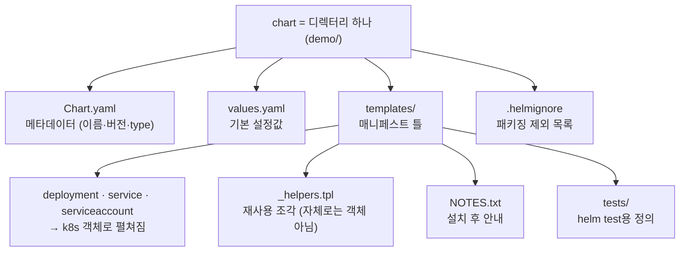
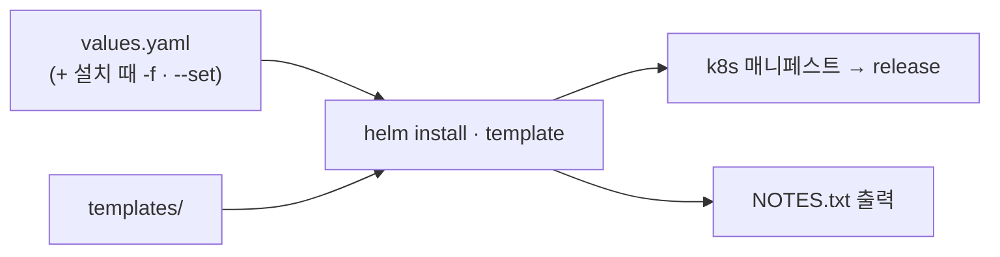

# 5. chart 해부 — chart는 무엇으로 이뤄지는가

chart는 특별한 포맷이 아니라 **정해진 구조를 가진 디렉터리 하나**입니다. 이 편은 `helm create`가 만든 표준 골격을 부위별로 갈라, 각 파일이 무엇이고 어떤 역할인지 봅니다 — `Chart.yaml`(메타데이터), `values.yaml`(기본 설정), `templates/`(매니페스트 틀), `templates/NOTES.txt`(설치 후 안내), `templates/_helpers.tpl`(재사용 조각), `.helmignore`(패키징 제외). 값이 `{{ }}`를 거쳐 매니페스트로 펼쳐지는 문법 자체는 이 편에서 다루지 않습니다 — 여기서는 부위의 이름과 역할, 그리고 그것들이 어떻게 한 release로 조립되는지에 집중합니다. 산출물은 해부한 표준 chart `demo/`와, 각 부위가 무슨 일을 하는지 한 줄로 짚은 정리입니다.

## 핵심 다이어그램





- **chart는 디렉터리다.** 정해진 이름의 파일·폴더로 이뤄지고, helm은 이 구조를 약속으로 압니다. `Chart.yaml`이 있으면 그 디렉터리는 chart입니다.
- **Chart.yaml은 신분증이다.** 이름·버전·type을 담습니다. `version`(chart 패키지 버전)과 `appVersion`(안에 든 앱 버전)은 별개로 매겨집니다.
- **values.yaml은 기본 설정이다.** `templates/`가 참조할 기본값을 모아 둔 곳이고, 설치 때 `-f`·`--set`으로 덮입니다.
- **templates/는 틀이다.** 그 안의 파일이 매니페스트로 펼쳐집니다. `_helpers.tpl`·`NOTES.txt`·`tests/`는 객체로 펼쳐지지 않는 특수 파일입니다.

아래 시연이 이 부위들을 하나씩 손으로 확인합니다.

## 사전 준비물

이 실습은 **macOS** 환경을 기준으로 합니다.

- **Docker** — Docker Desktop, OrbStack 등. `docker ps`가 에러 없이 돌아가면 OK.
- **Homebrew** — macOS 패키지 관리자.

### kind · kubectl 설치

```bash
brew install kind kubectl
```

### Helm v3 설치

이 시리즈는 **Helm v3** 기준입니다. Homebrew가 v4를 설치한다면, 아래로 v3 바이너리를 받습니다 (Intel Mac은 `arm64`를 `amd64`로 바꿉니다).

```bash
brew install helm
helm version --short      # v3.x.x 인지 확인

# v4가 깔렸다면 v3로 교체
curl -fsSL https://get.helm.sh/helm-v3.21.2-darwin-arm64.tar.gz -o /tmp/helm3.tgz
tar -xzf /tmp/helm3.tgz -C /tmp
sudo mv /tmp/darwin-arm64/helm /usr/local/bin/helm
helm version --short      # v3.21.2
```

### rosa-lab 클러스터 · namespace 준비

```bash
kind create cluster --name rosa-lab
kubectl create namespace rosa-lab
kubectl config set-context --current --namespace=rosa-lab
```

이미 있으면 건너뜁니다 (`kind get clusters`, `kubectl config get-contexts`로 확인).

## 실습 환경

| 파일 | 내용 |
|---|---|
| `manifests/demo/` | `helm create demo`로 만든 표준 chart 골격 (이 편의 해부 대상) |

> 이 실습은 아래 첫 단계에서 `helm create`로 직접 골격을 만듭니다. 저장소의 `manifests/demo/`는 그 결과 사본이라, 비교용으로 두고 봐도 됩니다.

## 여기서 직접 확인할 수 있는 것

### helm create — 표준 골격을 만든다

chart의 표준 구조를 한 번에 생성합니다.

```bash
helm create demo
find demo -type f | sort
```

```
demo/.helmignore
demo/Chart.yaml
demo/templates/NOTES.txt
demo/templates/_helpers.tpl
demo/templates/deployment.yaml
demo/templates/hpa.yaml
demo/templates/httproute.yaml
demo/templates/ingress.yaml
demo/templates/service.yaml
demo/templates/serviceaccount.yaml
demo/templates/tests/test-connection.yaml
demo/values.yaml
```

최상위에 `Chart.yaml`·`values.yaml`·`.helmignore`, 그리고 `templates/` 폴더. 이게 chart의 표준 부위입니다. 하나씩 봅니다.

### Chart.yaml — chart의 신분증

```bash
grep -vE '^\s*#' demo/Chart.yaml | grep -v '^$'
```

```yaml
apiVersion: v2
name: demo
description: A Helm chart for Kubernetes
type: application
version: 0.1.0
appVersion: "1.16.0"
```

- `apiVersion: v2` — Helm 3 chart 포맷.
- `name`·`description` — chart의 이름과 설명.
- `type: application` — 설치 가능한 앱 chart(다른 chart에 끼워 쓰는 `library`와 구분됩니다).
- `version` — **chart 패키지의 버전**. chart를 고칠 때 올립니다.
- `appVersion` — **그 안에 담긴 앱의 버전**. 둘은 따로 움직입니다 — 앱은 그대로인데 chart 템플릿만 고치면 `version`만 오릅니다.

### values.yaml — 기본 설정값

`templates/`가 참조할 기본값이 여기 모입니다.

```bash
grep -vE '^\s*#' demo/values.yaml | grep -v '^$' | head -22
```

```yaml
replicaCount: 1
image:
  repository: nginx
  pullPolicy: IfNotPresent
  tag: ""
imagePullSecrets: []
nameOverride: ""
fullnameOverride: ""
serviceAccount:
  create: true
  automount: true
  annotations: {}
  name: ""
podAnnotations: {}
podLabels: {}
podSecurityContext: {}
securityContext: {}
service:
  type: ClusterIP
  port: 80
ingress:
  enabled: false
```

`replicaCount`·`image.repository`·`service.port`처럼 사용자가 바꿀 만한 값이 여기 노출됩니다. `ingress.enabled: false`처럼 **기능을 켜고 끄는 스위치**도 값으로 들어 있습니다 — 이 스위치가 어떻게 해당 매니페스트를 켜고 끄는지는 다음 절에서 결과로 드러납니다.

### templates/ — 매니페스트로 펼쳐지는 틀

`templates/` 안의 파일이 실제 k8s 매니페스트로 펼쳐집니다. 어떤 파일이 어떤 객체가 되는지 봅니다.

```bash
helm template demo demo/ | grep -E '^# Source:|^kind:' | paste - -
```

```
# Source: demo/templates/serviceaccount.yaml	kind: ServiceAccount
# Source: demo/templates/service.yaml	kind: Service
# Source: demo/templates/deployment.yaml	kind: Deployment
# Source: demo/templates/tests/test-connection.yaml	kind: Pod
```

`deployment.yaml`→Deployment, `service.yaml`→Service처럼 1:1로 대응합니다. 그런데 골격에는 `ingress.yaml`·`hpa.yaml`·`httproute.yaml`도 있는데 출력에 없습니다 — 기본 `values.yaml`에서 꺼져 있기 때문입니다.

```bash
helm template demo demo/ -s templates/ingress.yaml | grep -c .
```

```
0
```

`ingress.enabled: false`라 `ingress.yaml`은 한 줄도 렌더되지 않습니다. **value 하나가 매니페스트 하나를 통째로 켜고 끕니다.** templates/는 고정된 결과가 아니라 values에 따라 달라지는 틀입니다.

### templates/_helpers.tpl — 재사용 조각

`_`로 시작하는 `_helpers.tpl`은 매니페스트가 아니라, 여러 템플릿이 공통으로 쓰는 이름·라벨 조각을 모아 둔 파일입니다.

```bash
grep -E 'define' demo/templates/_helpers.tpl
```

```
{{- define "demo.name" -}}
{{- define "demo.fullname" -}}
{{- define "demo.chart" -}}
{{- define "demo.labels" -}}
{{- define "demo.selectorLabels" -}}
{{- define "demo.serviceAccountName" -}}
```

`demo.fullname`·`demo.labels` 같은 **이름 붙은 조각**이 정의돼 있고, `deployment.yaml`·`service.yaml`이 이걸 가져다 씁니다. 그래서 위 `helm template` 출력에 `_helpers.tpl`이 `# Source:`로 등장하지 않았습니다 — 자체로는 객체로 펼쳐지지 않고, 다른 템플릿에 끼어 들어갈 뿐입니다.

### templates/NOTES.txt — 설치 후 안내

`NOTES.txt`는 객체가 아니라, 설치·업그레이드 직후 화면에 출력되는 안내문입니다. 설치해서 직접 봅니다.

```bash
helm install demo demo/ -n rosa-lab
```

```
NAME: demo
LAST DEPLOYED: Fri Jun 26 16:43:34 2026
NAMESPACE: rosa-lab
STATUS: deployed
REVISION: 1
NOTES:
1. Get the application URL by running these commands:
  export POD_NAME=$(kubectl get pods --namespace rosa-lab -l "app.kubernetes.io/name=demo,app.kubernetes.io/instance=demo" -o jsonpath="{.items[0].metadata.name}")
  export CONTAINER_PORT=$(kubectl get pod --namespace rosa-lab $POD_NAME -o jsonpath="{.spec.containers[0].ports[0].containerPort}")
  echo "Visit http://127.0.0.1:8080 to use your application"
  kubectl --namespace rosa-lab port-forward $POD_NAME 8080:$CONTAINER_PORT
```

`NOTES:` 아래가 `NOTES.txt`의 출력입니다. namespace(`rosa-lab`)·release 이름(`demo`)이 채워져 나온 걸 보면, NOTES.txt도 설치 시점 정보로 렌더되는 템플릿임을 알 수 있습니다.

### .helmignore — 패키징에서 뺄 것

chart를 패키지로 묶을 때 제외할 파일 목록입니다(`.gitignore`와 같은 결).

```bash
grep -vE '^\s*#' demo/.helmignore | grep -v '^$' | head -6
```

```
.DS_Store
.git/
.gitignore
.bzr/
.bzrignore
.hg/
```

버전 관리 메타파일·OS 부산물처럼 chart 패키지에 들어갈 필요 없는 것들이 기본으로 빠집니다.

### 조립 확인 — lint

마지막으로, 부위들이 chart로서 온전한지 점검합니다.

```bash
helm lint demo/
```

```
==> Linting demo/
[INFO] Chart.yaml: icon is recommended

1 chart(s) linted, 0 chart(s) failed
```

`[INFO]`는 권고일 뿐 실패가 아닙니다(`0 chart(s) failed`). 골격이 chart로서 유효합니다.

### 정리

```bash
helm uninstall demo -n rosa-lab
```

클러스터까지 정리하려면:

```bash
kind delete cluster --name rosa-lab
```

## 이 편의 산출물

- `helm create`로 만든 표준 chart 골격 `demo/`와, 그 디렉터리가 `Chart.yaml`·`values.yaml`·`templates/`·`.helmignore`로 이뤄진다는 것을 직접 본 상태.
- `Chart.yaml`의 `version`(chart 패키지)과 `appVersion`(앱)이 별개로 매겨진다는 것, `type: application`의 의미를 짚은 상태.
- `helm template`의 `# Source:` → `kind:` 대응으로 **어떤 템플릿 파일이 어떤 k8s 객체가 되는지** 확인하고, `ingress.enabled: false`처럼 **value가 매니페스트를 통째로 켜고 끈다**는 것을 렌더 0줄로 본 경험.
- `_helpers.tpl`(재사용 조각)·`NOTES.txt`(설치 후 안내)·`tests/`(helm test용)가 객체로 펼쳐지지 않는 특수 파일임을 구분한 상태.
- `helm install`로 `NOTES.txt`가 release 정보로 렌더되어 출력되는 것, `helm lint`로 골격이 유효함을 확인한 경험.
