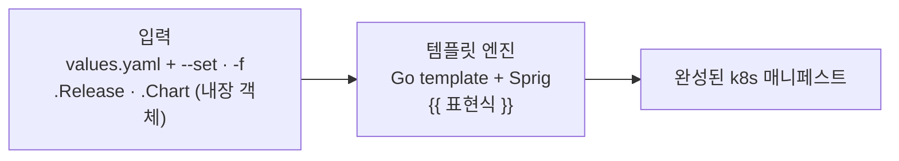
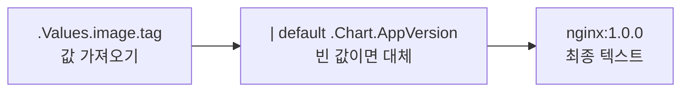

# 6. 템플릿 엔진 — 값이 어떻게 매니페스트로 펼쳐지는가

`templates/` 안의 파일은 고정된 매니페스트가 아니라 틀입니다. `{{ }}` 자리에 엔진이 값을 끼워 넣어 최종 매니페스트를 만듭니다. 엔진은 Go의 text/template에 Sprig 함수가 얹힌 것입니다. 이 편은 그 엔진의 기본기를 봅니다 — **내장 객체로 값을 가져오고**(`.Values` 설정값, `.Release` 설치 시점 정보, `.Chart` 메타데이터), **파이프 `|`와 함수로 다듬고**(`default`·`quote`·`upper`·`toYaml`·`nindent`), **공백을 `-`로 정리하는** 것까지. 조건·반복 같은 흐름 제어는 별도 주제라 이 편에서 다루지 않습니다 — 여기서는 값을 가져와 다듬어 박는 한 줄짜리 표현식에 집중합니다. 산출물은 엔진 시연용 최소 chart `engine/`과, 같은 템플릿이 release 이름·namespace·`--set`에 따라 다르게 펼쳐지는 것을 직접 본 기록입니다.

## 핵심 다이어그램





- **엔진은 Go template + Sprig다.** `{{ }}` 안의 표현식을 평가해 텍스트로 바꿉니다. 매니페스트는 그 결과물입니다.
- **값은 내장 객체에서 온다.** `.Values`(values.yaml + 설치 때 준 값), `.Release`(설치 시점: 이름·namespace·revision), `.Chart`(Chart.yaml의 이름·버전·appVersion).
- **파이프로 다듬는다.** `값 | 함수` 꼴로 왼쪽 결과를 오른쪽 함수에 넘깁니다. `default`·`quote`·`upper`·`toYaml`·`nindent`가 자주 쓰입니다.
- **공백은 `-`로 제어한다.** `{{-`는 표현식 앞의 공백·개행을, `-}}`는 뒤의 것을 지웁니다. YAML은 들여쓰기에 민감하므로 이 정리가 중요합니다.

아래 시연이 이 동작을 한 줄씩 손으로 확인합니다.

## 사전 준비물

이 실습은 **macOS** 환경을 기준으로 합니다. 이 편은 `helm template`으로 렌더만 하므로 클러스터·namespace는 필요 없습니다.

- **Homebrew** — macOS 패키지 관리자.

### Helm v3 설치

이 시리즈는 **Helm v3** 기준입니다. Homebrew가 v4를 설치한다면, 아래로 v3 바이너리를 받습니다 (Intel Mac은 `arm64`를 `amd64`로 바꿉니다).

```bash
brew install helm
helm version --short      # v3.x.x 인지 확인

# v4가 깔렸다면 v3로 교체
curl -fsSL https://get.helm.sh/helm-v3.21.2-darwin-arm64.tar.gz -o /tmp/helm3.tgz
tar -xzf /tmp/helm3.tgz -C /tmp
sudo mv /tmp/darwin-arm64/helm /usr/local/bin/helm
helm version --short      # v3.21.2
```

## 실습 환경

| 파일 | 내용 |
|---|---|
| `manifests/engine/` | 엔진 시연용 최소 chart (`Chart.yaml`·`values.yaml`·`templates/configmap.yaml`) |

`values.yaml`은 다음 값을 담습니다.

```yaml
greeting: hello
replicaCount: 2
image:
  repository: nginx
  tag: ""            # 빈 값 — default 함수로 .Chart.AppVersion 대체 시연
labels:
  team: platform
  env: dev
```

## 여기서 직접 확인할 수 있는 것

아래 명령은 모두 `manifests/` 디렉터리에서 실행합니다.

```bash
cd manifests
```

### 템플릿 — 엔진이 다루는 표현식

`templates/configmap.yaml`이 이 편의 본문입니다. ConfigMap을 고른 이유는 렌더된 값이 `data`에 그대로 드러나기 때문입니다.

```yaml
apiVersion: v1
kind: ConfigMap
metadata:
  name: {{ .Release.Name }}-engine
  labels:
    {{- toYaml .Values.labels | nindent 4 }}
data:
  # 내장 객체 .Release — 설치 시점 정보
  releaseName: {{ .Release.Name }}
  releaseNamespace: {{ .Release.Namespace }}
  releaseRevision: {{ .Release.Revision | quote }}
  # 내장 객체 .Chart — Chart.yaml 메타데이터
  chartName: {{ .Chart.Name }}
  chartVersion: {{ .Chart.Version }}
  # .Values 접근 (중첩 키)
  greeting: {{ .Values.greeting | quote }}
  greetingUpper: {{ .Values.greeting | upper | quote }}
  # 파이프 + default: image.tag가 비면 .Chart.AppVersion으로 대체
  image: {{ .Values.image.repository }}:{{ .Values.image.tag | default .Chart.AppVersion }}
  replicas: {{ .Values.replicaCount }}
```

### helm template — 값이 펼쳐진 결과

엔진을 돌려 위 틀이 무엇으로 바뀌는지 봅니다.

```bash
helm template web engine -n rosa-lab
```

```yaml
---
# Source: engine/templates/configmap.yaml
apiVersion: v1
kind: ConfigMap
metadata:
  name: web-engine
  labels:
    env: dev
    team: platform
data:
  # 내장 객체 .Release — 설치 시점 정보
  releaseName: web
  releaseNamespace: rosa-lab
  releaseRevision: "1"
  # 내장 객체 .Chart — Chart.yaml 메타데이터
  chartName: engine
  chartVersion: 0.1.0
  # .Values 접근 (중첩 키)
  greeting: "hello"
  greetingUpper: "HELLO"
  # 파이프 + default: image.tag가 비면 .Chart.AppVersion으로 대체
  image: nginx:1.0.0
  replicas: 2
```

`{{ .Release.Name }}` → `web`, `{{ .Chart.Name }}` → `engine`, `{{ .Values.greeting }}` → `hello`. 각 `{{ }}`가 내장 객체·설정값을 읽어 텍스트로 바뀌었습니다. `quote`가 붙은 곳은 `"hello"`, `upper`가 붙은 곳은 `HELLO`, `default`가 걸린 image는 `nginx:1.0.0`이 됐습니다 — 하나씩 뜯어 봅니다.

### 내장 객체 .Release — 명령에 따라 바뀐다

`.Release.*`는 chart 안에 고정된 값이 아니라, 설치(또는 렌더) 명령이 정합니다. release 이름과 namespace를 바꿔 같은 템플릿을 렌더합니다.

```bash
helm template api engine -n prod | grep -E 'name: |releaseName:|releaseNamespace:'
```

```
  name: api-engine
  releaseName: api
  releaseNamespace: prod
```

`web`/`rosa-lab`이던 자리가 `api`/`prod`로 바뀌었습니다. 그래서 같은 chart로 환경마다 다른 이름·namespace의 release를 찍어낼 수 있습니다.

### 파이프와 함수 — default · quote · upper

`{{ .Values.image.tag | default .Chart.AppVersion }}`은 "`image.tag`를 쓰되, 비어 있으면 `.Chart.AppVersion`을 대신 쓴다"는 뜻입니다. `values.yaml`에서 `tag`가 빈 문자열이라 `appVersion`(1.0.0)이 들어갔습니다. `--set`으로 값을 주면 default가 비켜섭니다.

```bash
helm template web engine --set image.tag=1.27 -n rosa-lab | grep 'image:'
```

```
  image: nginx:1.27
```

`tag`에 값이 생기자 `default`는 작동하지 않고 `1.27`이 그대로 쓰입니다. `quote`는 값을 따옴표로 감싸고(`hello`→`"hello"`), `upper`는 대문자로 바꿉니다(`hello`→`HELLO`) — 파이프로 여러 함수를 이어 붙일 수도 있습니다(`.Values.greeting | upper | quote`).

### toYaml — 블록을 통째로 펼친다

스칼라 한 값이 아니라 map·list 같은 블록을 그대로 옮길 때는 `toYaml`을 씁니다. `labels:` 아래에 `.Values.labels`의 두 키가 통째로 들어간 게 그 결과입니다.

```yaml
  labels:
    {{- toYaml .Values.labels | nindent 4 }}
```

```yaml
  labels:
    env: dev
    team: platform
```

`toYaml`이 `{team: platform, env: dev}`를 YAML 텍스트로 바꾸고, `nindent 4`가 앞에 개행을 넣고 4칸 들여씁니다. 덕분에 values에 라벨을 몇 개를 넣든 템플릿은 그대로 둬도 됩니다.

### 공백 제어 — {{- 로 줄을 정리한다

`nindent` 앞의 `{{-`가 하는 일을 직접 봅니다. 대시가 있는 원본과, 대시를 뺀 사본을 각각 렌더해 줄 끝(`$`)을 표시합니다.

```bash
# 대시를 뺀 사본을 임시로 만들어 비교
cp -r engine /tmp/engine-nodash
sed -i '' 's/{{- toYaml/{{ toYaml/' /tmp/engine-nodash/templates/configmap.yaml

echo "=== {{- (대시 O) ==="
helm template web engine        -n rosa-lab | sed -n '/labels:/,/^data:/p' | cat -e
echo "=== {{ (대시 X) ==="
helm template web /tmp/engine-nodash -n rosa-lab | sed -n '/labels:/,/^data:/p' | cat -e
rm -rf /tmp/engine-nodash
```

```
=== {{- (대시 O) ===
  labels:$
    env: dev$
    team: platform$
data:$
=== {{ (대시 X) ===
  labels:$
    $
    env: dev$
    team: platform$
data:$
```

대시가 없으면 `labels:` 다음에 공백만 있는 줄(`    $`)이 끼어듭니다 — 템플릿 줄의 들여쓰기 공백이 그대로 출력에 남기 때문입니다. `{{-`가 그 앞 공백·개행을 먹어 줄을 깔끔하게 정리합니다. YAML에서는 이런 잔여 공백이 들여쓰기를 어긋나게 해 파싱을 깨뜨리기도 하므로, 템플릿에서 `-`를 붙이고 빼는 감각이 실력을 가릅니다.

### 정리

이 편은 파일을 만들지 않고 렌더만 했으므로 따로 정리할 것이 없습니다(위 비교에서 만든 `/tmp/engine-nodash`는 마지막 줄에서 지웁니다).

## 이 편의 산출물

- 엔진 시연용 최소 chart `engine/`과, `helm template`으로 `{{ }}` 표현식이 텍스트로 펼쳐지는 결과를 직접 본 기록.
- 내장 객체 셋을 구분한 상태 — `.Values`(설정값), `.Release`(이름·namespace·revision, 명령이 정함), `.Chart`(Chart.yaml 메타데이터).
- `.Release.Name`·`.Release.Namespace`가 렌더 명령에 따라 바뀌어, 같은 chart가 환경마다 다른 release로 펼쳐짐을 본 경험.
- 파이프 `|`로 값을 함수에 넘기는 법(`default`로 빈 값 대체, `quote`·`upper`로 가공, 여러 함수 연결)과 `--set`이 `default`를 비켜서는 것을 확인한 상태.
- `toYaml | nindent`로 map 블록을 통째로 펼치는 법, 그리고 `{{-` 공백 제어가 잔여 공백 줄을 없애 YAML 들여쓰기를 지키는 것을 `cat -e`로 눈으로 확인한 경험.
