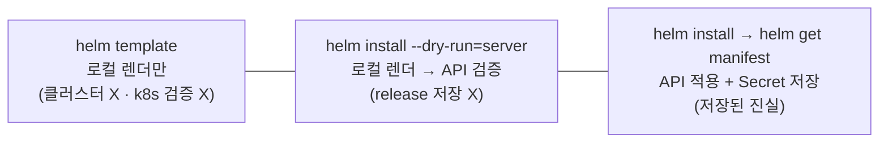
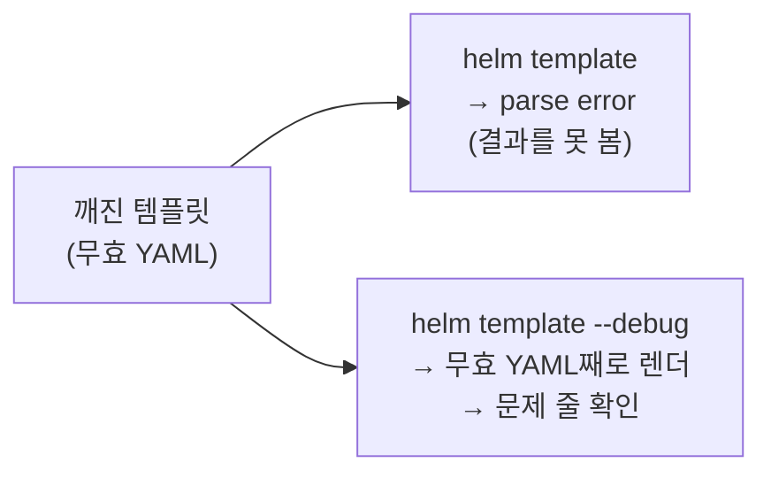

# 7. 렌더 디버깅 — 적용 전에 결과를 눈으로 확인하기

chart를 클러스터에 적용하기 전에, 그게 무엇을 만들지 미리 봐야 합니다. 보는 방법은 셋이고 각각 닿는 범위가 다릅니다 — `helm template`은 **클러스터에 닿지 않고 로컬에서만** 렌더하고, `helm install --dry-run=server`는 **렌더한 뒤 API 서버에 검증을 받되 설치하지 않으며**, `helm get manifest`는 **이미 설치된 release가 실제로 무엇으로 적용됐는지**를 보여 줍니다. 더해, 템플릿이 깨져 무효 YAML이 나올 때는 `--debug`로 그 결과를 그대로 렌더해 어느 줄이 문제인지 짚습니다. 이 편은 이 네 가지를 한 chart로 직접 돌려 차이와 쓰임을 가립니다. 산출물은 세 방법의 경계를 직접 본 기록과, 디버깅 시연 chart `app/`입니다.

## 핵심 다이어그램





- **helm template은 오프라인이다.** 클러스터에 닿지 않고 k8s 스키마 검증도 하지 않습니다. 그래서 클러스터 없이도, 가장 빠르게 반복할 수 있습니다.
- **--dry-run=server는 검증하되 저장하지 않는다.** 렌더한 매니페스트를 API 서버에 보내 "받아 줄 수 있는지"(미인식 kind·admission 등)를 확인하지만, release로 남기지 않습니다.
- **get manifest는 저장된 진실이다.** 이미 설치된 release가 실제로 무엇으로 적용됐는지를 보여 줍니다(release Secret에서 읽음).
- **깨지면 --debug다.** `helm template`은 무효 YAML이면 에러만 내고 결과를 감추지만, `--debug`는 렌더 결과를 그대로 출력해 어느 줄이 어긋났는지 눈으로 짚게 합니다.

아래 시연이 이 차이를 한 줄씩 손으로 확인합니다.

## 사전 준비물

이 실습은 **macOS** 환경을 기준으로 합니다. `--dry-run=server`와 설치는 클러스터가 필요합니다.

- **Docker** — Docker Desktop, OrbStack 등. `docker ps`가 에러 없이 돌아가면 OK.
- **Homebrew** — macOS 패키지 관리자.

### kind · kubectl 설치

```bash
brew install kind kubectl
```

### Helm v3 설치

이 시리즈는 **Helm v3** 기준입니다. Homebrew가 v4를 설치한다면, 아래로 v3 바이너리를 받습니다 (Intel Mac은 `arm64`를 `amd64`로 바꿉니다).

```bash
brew install helm
helm version --short      # v3.x.x 인지 확인

# v4가 깔렸다면 v3로 교체
curl -fsSL https://get.helm.sh/helm-v3.21.2-darwin-arm64.tar.gz -o /tmp/helm3.tgz
tar -xzf /tmp/helm3.tgz -C /tmp
sudo mv /tmp/darwin-arm64/helm /usr/local/bin/helm
helm version --short      # v3.21.2
```

### rosa-lab 클러스터 · namespace 준비

```bash
kind create cluster --name rosa-lab
kubectl create namespace rosa-lab
kubectl config set-context --current --namespace=rosa-lab
```

이미 있으면 건너뜁니다 (`kind get clusters`, `kubectl config get-contexts`로 확인).

## 실습 환경

| 파일 | 내용 |
|---|---|
| `manifests/app/` | 디버깅 시연용 chart (`Deployment` + `Service`) |

아래 명령은 모두 `manifests/` 디렉터리에서 실행합니다.

```bash
cd manifests
```

## 여기서 직접 확인할 수 있는 것

### helm template — 오프라인 렌더

chart가 무엇을 만들지 로컬에서 렌더합니다. 클러스터에 닿지 않습니다.

```bash
helm template app app | grep -E '^kind:|name: |replicas:|image:'
```

```
kind: Service
  name: app
kind: Deployment
  name: app
  replicas: 2
          image: nginx:1.27
```

`helm template`은 설치가 아니라 렌더입니다 — 끝나도 클러스터에는 아무것도 남지 않습니다.

```bash
helm list -n rosa-lab
```

```
NAME	NAMESPACE	REVISION	UPDATED	STATUS	CHART	APP VERSION
```

release 목록이 비어 있습니다. 그래서 빠르게 고치고 다시 렌더하는 반복에 적합합니다.

### --dry-run=server — 서버 검증, 저장은 안 함

`helm template`은 텍스트만 만들 뿐, 그 매니페스트를 API가 받아 줄지는 모릅니다. `--dry-run=server`는 렌더한 결과를 API 서버에 보내 검증하되 설치하지는 않습니다. 차이는 **API가 거부하는 것**에서 드러납니다 — 클러스터가 모르는 종류(kind)를 하나 끼워 봅니다.

```bash
cp -r app /tmp/app-badkind
cat > /tmp/app-badkind/templates/extra.yaml <<'YAML'
apiVersion: example.com/v1
kind: Wibble
metadata:
  name: {{ .Release.Name }}-wibble
YAML

# 오프라인 렌더: Wibble도 그냥 통과
helm template app /tmp/app-badkind | grep '^kind:'
```

```
kind: Service
kind: Deployment
kind: Wibble
```

```bash
# 서버 검증: 모르는 kind라 거부
helm install app /tmp/app-badkind --dry-run=server -n rosa-lab
```

```
Error: INSTALLATION FAILED: unable to build kubernetes objects from release manifest: resource mapping not found for name: "app-wibble" namespace: "" from "": no matches for kind "Wibble" in version "example.com/v1"
```

```bash
rm -rf /tmp/app-badkind
```

`helm template`은 `Wibble`을 군말 없이 렌더했지만, `--dry-run=server`는 "그런 kind는 없다"며 막았습니다. 클러스터에 실제로 적용 가능한지까지 확인하려면 `--dry-run=server`가 필요합니다. 그러면서도 release로 저장하지는 않습니다(검증을 통과하는 정상 chart로 확인하면 `helm list`는 여전히 비어 있습니다).

### helm get manifest — 저장된 진실

앞 둘이 "적용하기 전" 미리보기라면, `get manifest`는 "이미 적용된" release가 실제로 무엇인지입니다. 설치한 뒤 조회합니다.

```bash
helm install app app -n rosa-lab
helm get manifest app -n rosa-lab | grep -E '^kind:|name: |replicas:'
```

```
kind: Service
  name: app
kind: Deployment
  name: app
  replicas: 2
```

이 chart에서는 `helm template`의 결과와 `get manifest`가 같습니다 — 같은 입력을 같은 엔진이 렌더했기 때문입니다.

```bash
diff <(helm template app app -n rosa-lab        | grep -vE '^---|^# Source:' | sed -e 's/[[:space:]]*$//' | sed '/^$/d') \
     <(helm get manifest app -n rosa-lab | grep -vE '^---|^# Source:' | sed -e 's/[[:space:]]*$//' | sed '/^$/d') \
  && echo "동일"
```

```
동일
```

둘이 늘 같지는 않습니다 — 템플릿이 클러스터 상태를 읽는 함수(`lookup`)나 `.Capabilities`를 쓰면, `helm template`은 그 자리를 비우거나 가짜로 채우는 반면 실제 설치는 클러스터의 진짜 값을 씁니다. 그럴 때 "설치된 것"의 기준은 `get manifest`입니다.

### --debug — 깨진 템플릿을 들여다본다

템플릿이 무효 YAML을 내면 `helm template`은 에러만 내고 결과를 감춥니다. 들여쓰기를 일부러 어긋낸 사본으로 재현합니다.

```bash
cp -r app /tmp/app-broken
printf 'apiVersion: v1\nkind: Service\nmetadata:\n  name: {{ .Release.Name }}\nspec:\n  ports:\n  - port: 80\n   targetPort: 80\n' \
  > /tmp/app-broken/templates/service.yaml

helm template app /tmp/app-broken -n rosa-lab
```

```
Error: YAML parse error on app/templates/service.yaml: error converting YAML to JSON: yaml: line 9: did not find expected key

Use --debug flag to render out invalid YAML
```

에러는 "9번째 줄"이라고만 알려 줄 뿐, 렌더된 모습은 보이지 않습니다. `--debug`를 붙이면 무효 YAML이라도 렌더해 보여 줍니다.

```bash
helm template app /tmp/app-broken -n rosa-lab --debug 2>/dev/null \
  | sed -n '/kind: Service/,/targetPort/p' | cat -e
rm -rf /tmp/app-broken
```

```
kind: Service$
metadata:$
  name: app$
spec:$
  ports:$
  - port: 80$
   targetPort: 80$
```

`targetPort: 80`이 3칸 들여써져 `- port: 80`(2칸 `-`)의 항목 안에 들어가지 못했습니다 — 1칸이 모자랍니다. 에러 메시지의 "9번째 줄"이 무엇이었는지가 `--debug` 출력에서 눈에 보입니다.

### -s / --show-only — 템플릿 하나만

chart가 여러 템플릿을 가질 때, 하나만 렌더해 들여다볼 수 있습니다.

```bash
helm template app app -s templates/service.yaml -n rosa-lab
```

```yaml
---
# Source: app/templates/service.yaml
apiVersion: v1
kind: Service
metadata:
  name: app
spec:
  selector:
    app: app
  ports:
    - port: 80
      targetPort: 80
```

`-s`로 한 파일만 렌더하면, 고치는 중인 템플릿에 집중할 수 있습니다.

### 정리

```bash
helm uninstall app -n rosa-lab
```

클러스터까지 정리하려면:

```bash
kind delete cluster --name rosa-lab
```

## 이 편의 산출물

- 적용 전 렌더를 보는 세 방법의 경계를 직접 가린 기록 — `helm template`(오프라인, 검증 없음) / `--dry-run=server`(API 검증, 저장 없음) / `helm get manifest`(설치된 release의 저장된 진실).
- `helm template`은 미인식 kind도 렌더하지만 `--dry-run=server`는 "no matches for kind"로 거부하는 것을 보고, **로컬 렌더와 서버 검증의 차이**를 확인한 경험.
- 정상 chart에서 `helm template`과 `helm get manifest`가 같음을 비교하고, `lookup`·`.Capabilities`를 쓸 때는 갈릴 수 있음을 정리한 상태.
- 무효 YAML이 나는 템플릿에서 `helm template`은 에러만 내지만 `--debug`는 렌더 결과를 보여 줘 문제 줄을 짚게 한다는 것, `-s`로 템플릿 하나만 렌더하는 법을 익힌 상태.
- 디버깅 시연 chart `app/`.
