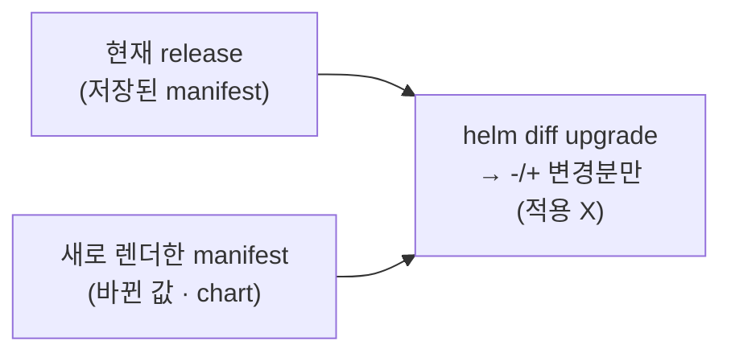

# 8. 변경 비교 — helm diff upgrade

`helm template`이 "무엇이 만들어지나"를 보여 준다면, `helm diff`는 "upgrade하면 무엇이 **바뀌나**"를 보여 줍니다. 현재 설치된 release와, upgrade했을 때 나올 결과를 `-`/`+`로 비교하되 실제로 적용하지는 않습니다. 이건 코어 명령이 아니라 외부 플러그인이라 따로 설치해야 합니다. 이 편은 플러그인을 설치하고, 값을 바꾼 upgrade가 무엇을 바꿀지 미리 보고, 그게 적용이 아니라 미리보기임을 확인하고, 저장된 두 revision을 비교하는 것까지 봅니다. 변경을 적용하기 전에 눈으로 확인하는 안전장치라, 수동 배포에서도 자동 동기화 파이프라인에서도 가장 먼저 거는 점검입니다. 산출물은 변경 미리보기를 직접 본 기록과, 시연 chart `app/`입니다.

## 핵심 다이어그램




- **helm diff는 플러그인이다.** 코어 helm에는 없습니다. 설치해야 `helm diff` 하위 명령이 생깁니다.
- **diff upgrade는 미리보기다.** 현재 release와 upgrade 후를 비교해 바뀌는 줄만 `-`(제거)/`+`(추가)로 보여 주고, 클러스터에는 손대지 않습니다.
- **바뀔 게 없으면 빈 출력이다.** 같은 값으로 다시 upgrade하면 diff가 비어 있습니다 — "정말 바뀌는 게 있나"를 적용 전에 가립니다.
- **revision끼리도 비교한다.** `helm diff revision`으로 저장된 두 revision의 차이를 봅니다.

아래 시연이 이 동작을 한 줄씩 손으로 확인합니다.

## 사전 준비물

이 실습은 **macOS** 환경을 기준으로 합니다.

- **Docker** — Docker Desktop, OrbStack 등. `docker ps`가 에러 없이 돌아가면 OK.
- **Homebrew** — macOS 패키지 관리자.

### kind · kubectl 설치

```bash
brew install kind kubectl
```

### Helm v3 설치

이 시리즈는 **Helm v3** 기준입니다. Homebrew가 v4를 설치한다면, 아래로 v3 바이너리를 받습니다 (Intel Mac은 `arm64`를 `amd64`로 바꿉니다).

```bash
brew install helm
helm version --short      # v3.x.x 인지 확인

# v4가 깔렸다면 v3로 교체
curl -fsSL https://get.helm.sh/helm-v3.21.2-darwin-arm64.tar.gz -o /tmp/helm3.tgz
tar -xzf /tmp/helm3.tgz -C /tmp
sudo mv /tmp/darwin-arm64/helm /usr/local/bin/helm
helm version --short      # v3.21.2
```

### rosa-lab 클러스터 · namespace 준비

```bash
kind create cluster --name rosa-lab
kubectl create namespace rosa-lab
kubectl config set-context --current --namespace=rosa-lab
```

이미 있으면 건너뜁니다 (`kind get clusters`, `kubectl config get-contexts`로 확인).

## 여기서 직접 확인할 수 있는 것

아래 명령은 chart가 있는 `manifests/` 디렉터리에서 실행합니다.

```bash
cd manifests
```

### helm-diff 플러그인 설치

`helm diff`는 [helm-diff](https://github.com/databus23/helm-diff) 플러그인이 제공합니다. 설치하면 helm에 `diff` 하위 명령이 붙습니다.

```bash
helm plugin install https://github.com/databus23/helm-diff
helm plugin list
```

```
NAME	VERSION	DESCRIPTION
diff	3.15.10	Preview helm upgrade changes as a diff
```

`diff` 플러그인이 잡혔습니다. 이제 `helm diff ...`를 쓸 수 있습니다.

### 비교의 기준점 — release 하나 설치

diff는 "현재 release"와 비교하므로, 먼저 기준이 될 release를 설치합니다. `app/` chart는 `replicaCount`와 ConfigMap의 `message`를 값으로 노출합니다.

```bash
helm install app app -n rosa-lab
```

```
NAME: app
LAST DEPLOYED: ...
NAMESPACE: rosa-lab
STATUS: deployed
REVISION: 1
```

기본값은 `replicaCount: 2`, `message: "v1"`입니다.

### helm diff upgrade — 무엇이 바뀌나

`replicaCount`를 3으로, `message`를 `v2`로 바꾼 upgrade가 무엇을 바꿀지 미리 봅니다.

```bash
helm diff upgrade app app --set replicaCount=3 --set message=v2 -n rosa-lab
```

```diff
rosa-lab, app, Deployment (apps) has changed:
  # Source: app/templates/deployment.yaml
  ...
  spec:
-   replicas: 2
+   replicas: 3
    selector:
      ...
rosa-lab, app-config, ConfigMap (v1) has changed:
  # Source: app/templates/configmap.yaml
  ...
  data:
-   message: "v1"
+   message: "v2"
```

바뀌는 객체(`Deployment`, `ConfigMap`)와 바뀌는 줄만 추려, `-` 빨강(현재)·`+` 초록(upgrade 후)으로 보여 줍니다. `replicas`는 2→3, `message`는 `"v1"`→`"v2"`. 바뀌지 않는 부분은 맥락으로만 깔립니다.

### diff는 적용이 아니다 — 미리보기다

방금 diff는 클러스터를 건드리지 않았습니다. 여전히 revision 1이고 replicas도 2입니다.

```bash
helm list -n rosa-lab
kubectl get deploy app -n rosa-lab -o jsonpath='{.spec.replicas}{"\n"}'
```

```
NAME	NAMESPACE	REVISION	UPDATED	STATUS	CHART	APP VERSION
app 	rosa-lab 	1       	...     	deployed	app-0.1.0	1.27
2
```

미리 본 변경을 실제로 반영하려면 같은 값으로 `helm upgrade`를 합니다.

```bash
helm upgrade app app --set replicaCount=3 --set message=v2 -n rosa-lab
```

### 바뀔 게 없으면 빈 출력

이제 release는 `replicaCount: 3`, `message: v2` 상태입니다(revision 2). 같은 값으로 다시 diff하면 출력이 없습니다.

```bash
helm diff upgrade app app --set replicaCount=3 --set message=v2 -n rosa-lab
echo "exit=$?"
```

```
exit=0
```

바뀔 게 없으니 한 줄도 나오지 않습니다. CI나 자동 동기화 앞에서 "이 upgrade가 실제로 무언가 바꾸는가"를 이렇게 가립니다 — 빈 출력은 "변화 없음"의 신호입니다.

### helm diff revision — 저장된 두 revision 비교

`diff upgrade`가 "현재 vs 앞으로"라면, `diff revision`은 "과거 vs 과거(또는 현재)"입니다. 저장된 revision 1과 2의 차이를 봅니다.

```bash
helm diff revision app 1 2 -n rosa-lab
```

```diff
rosa-lab, app, Deployment (apps) has changed:
  ...
-   replicas: 2
+   replicas: 3
rosa-lab, app-config, ConfigMap (v1) has changed:
  ...
-   message: "v1"
+   message: "v2"
```

rev1에서 rev2로 가며 무엇이 바뀌었는지가 그대로 드러납니다. "지난번 upgrade가 정확히 뭘 바꿨지"를 되짚을 때 씁니다.

### 정리

```bash
helm uninstall app -n rosa-lab
```

클러스터까지 정리하려면:

```bash
kind delete cluster --name rosa-lab
```

## 이 편의 산출물

- `helm diff`가 코어가 아닌 플러그인임을 알고 설치해, `helm diff` 하위 명령을 갖춘 상태.
- `helm diff upgrade`로 값 변경(`replicaCount` 2→3, `message` v1→v2)이 어떤 객체의 어떤 줄을 `-`/`+`로 바꾸는지 적용 전에 본 기록.
- diff가 미리보기일 뿐이라 클러스터를 건드리지 않는다는 것(diff 후에도 revision 1·replicas 2)을 확인하고, 같은 값으로 다시 diff하면 빈 출력이 나오는 멱등 점검을 본 경험.
- `helm diff revision`으로 저장된 두 revision의 차이를 비교해, 지난 upgrade가 무엇을 바꿨는지 되짚는 법을 익힌 상태.
- 변경 비교 시연 chart `app/`.
