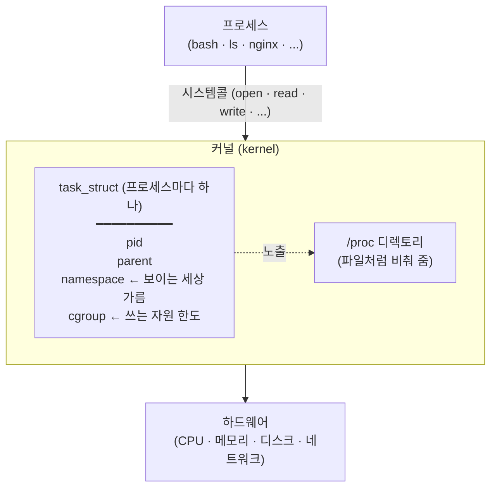

# 1. `ls` 한 줄에서 컨테이너까지

Linux 프로세스부터 컨테이너 격리까지, 명령 한 줄씩으로 직접 만져보는 실습 공간입니다.

## 관련 글

* [`ls` 한 줄에서 컨테이너까지](https://rog.idwwt.com/@rosa/ls-%ED%95%9C-%EC%A4%84%EC%97%90%EC%84%9C-%EC%BB%A8%ED%85%8C%EC%9D%B4%EB%84%88%EA%B9%8C%EC%A7%80)

## 핵심 다이어그램




- **프로세스**는 하드웨어를 직접 만질 수 없어, **시스템콜**로 커널에게 부탁합니다.
- 커널은 프로세스마다 **`task_struct`** 라는 상태 묶음을 들고 있고, 그 일부를 `/proc` 로 비춰 줍니다.
- `task_struct` 안의 **`namespace`** 값이 프로세스에게 보이는 세상을(PID·파일·네트워크 등) 가르고, **`cgroup`** 값이 그 프로세스가 쓸 수 있는 자원에 상한을 겁니다.
- 이 두 장치가 적용된 프로세스 하나가 곧 **컨테이너**입니다 — 호스트와 같은 커널을 공유하지만 시야와 자원이 제한된.

아래 시연들이 이 그림의 각 지점을 한 줄씩 손으로 확인합니다.

## 사전 준비

- **Docker** — Docker Desktop, OrbStack 등. namespace·cgroup 을 만지므로 privileged 컨테이너 실행이 가능해야 합니다
- **make** — macOS는 Xcode Command Line Tools(`xcode-select --install`)에 포함. Linux는 `build-essential` 등으로 설치

## 빠른 시작

```bash
make shell
```

privileged Ubuntu 컨테이너가 열립니다. 이후 명령은 모두 이 안에서 실행합니다.

> `make` 없이 직접 실행: `docker run --privileged --cgroupns=host --rm -it ubuntu:24.04 bash`

### 왜 `--privileged` 와 `--cgroupns=host` 를 쓰는가

일반 Docker 컨테이너는 호스트 보호를 위해 권한이 강하게 제한돼 있어서, 컨테이너 안에서 새 namespace 를 만들거나 cgroup 파일을 쓰는 일이 막힙니다. 이 실습에서는 그 두 가지를 직접 해보는 것이 목적이라, 권한을 풀어 줘야 합니다.

- **`--privileged`** — 새 namespace 생성(`unshare`), cgroup 파일 쓰기에 필요한 권한(예: `CAP_SYS_ADMIN`)을 컨테이너에 부여합니다. 없으면 `unshare` 가 Permission denied 로 막히고, `/sys/fs/cgroup/...` 에 쓰기도 거부됩니다.
- **`--cgroupns=host`** — 컨테이너에게 호스트의 cgroup 트리(`/sys/fs/cgroup/...`)를 그대로 보고 만질 수 있게 해 줍니다. 기본값(`--cgroupns=private`)에서는 cgroup namespace 가 격리돼서 `demo` cgroup이 의도대로 동작하지 않을 수 있습니다.

**중요** — 이 두 옵션은 호스트를 거의 그대로 컨테이너에 노출시키는 강한 설정입니다. 학습·실험용 로컬 컨테이너에서만 쓰고, 운영 환경에서는 절대 사용하지 마세요. 운영 컨테이너는 권한을 최소화하는 게 원칙입니다.

시연용 도구 네 개를 한 줄로 설치합니다.

```bash
apt-get update && apt-get install -y psmisc procps strace stress-ng
```

- `procps` — `ps`, `top`
- `psmisc` — `pstree`
- `strace` — 시스템콜 추적
- `stress-ng` — cgroup 시연용 메모리 폭발기

## 여기서 직접 확인할 수 있는 것

### 프로세스에는 고유 번호(PID)가 매겨집니다

자기 셸의 PID를 한 줄로 봅니다.

```bash
echo $$
# 1   (컨테이너 안에서는 자기 셸이 PID 1)
```

### 프로세스는 부모-자식 트리를 이룹니다

셸 안에서 셸을 다시 띄워, 두 셸의 관계를 트리로 그립니다.

```bash
bash
pstree -p $$
# bash(N)───pstree(M)
exit
```

### 커널은 프로세스 정보를 `/proc` 에서 파일처럼 노출합니다

`/proc` 디렉토리에는 살아 있는 프로세스 하나당 번호 디렉토리가 있습니다.

```bash
ls /proc | head -20
# 1  2  3  ...  (숫자가 PID)

cat /proc/$$/status | head
# Name:    bash
# Pid:     N
# PPid:    M
# ...
```

`ps` 도 결국 `/proc` 를 읽어 정리한 결과입니다.

```bash
ps
```

### 프로세스의 모든 동작은 시스템콜로 커널에게 부탁한 것입니다

`ls` 한 줄에서 발생하는 시스템콜의 양부터 봅니다. 첫 20줄은 대부분 동적 링커가 라이브러리(libc, libselinux 등)를 적재하는 과정입니다.

```bash
strace ls 2>&1 | head -20
# execve, brk, mmap, openat, fstat, ... 적재의 연속
```

화면에 결과를 출력하는 `write` 호출은 시간순으로 더 뒤에 있어서 `head -20` 안에는 잘 안 보입니다. `write` 만 골라 보려면 `-e trace=write` 필터를 씁니다.

```bash
strace -e trace=write ls
# write(1, "Makefile  README.md  diagrams\n", 30) = 30
# +++ exited with 0 +++
```

화면에 글자를 출력하는 그 한 줄까지 `write` 시스템콜로 커널에게 부탁한다는 사실이 그대로 드러납니다.

### namespace는 프로세스에게 "보이는 세상"을 가립니다

`unshare` 로 새 PID namespace 안의 셸을 띄우고, `ps` 결과가 달라지는 것을 확인합니다.

```bash
# 원래 셸
ps   # 컨테이너 안 모든 프로세스

# 새 namespace 셸로 진입
unshare --pid --fork --mount-proc bash

# 새 셸 안에서
ps         # 격리된 무리만 보임 (PID 1, 2 정도)
echo $$    # 1 — 자기가 새 무리의 PID 1

exit
```

같은 시스템·같은 커널 위에 있지만, 새 무리에 속한 셸에게는 다른 세상이 보입니다.

### cgroup은 프로세스가 쓸 수 있는 자원에 상한을 겁니다

메모리 100MB 한도를 걸고, 200MB 요청 시 OOM Kill 이 일어나는 것을 직접 봅니다.

```bash
# 1. cgroup 만들고 메모리 한도 100MB + 스왑 차단
mkdir /sys/fs/cgroup/demo
echo "100M" > /sys/fs/cgroup/demo/memory.max
echo "0" > /sys/fs/cgroup/demo/memory.swap.max
# 스왑을 막지 않으면 한도를 넘긴 페이지가 OOM 대신 스왑으로 빠져
# OOM Kill 이 일어나지 않을 수 있습니다.
```

```bash
# 2. subshell 안에서 200MB 요청
#    (메인 셸은 OOM 대상에 끼지 않도록 subshell 로 격리)
bash -c 'echo $$ > /sys/fs/cgroup/demo/cgroup.procs; exec stress-ng --vm 1 --vm-bytes 200M --vm-keep --timeout 5'
# stress-ng 가 OOM Kill 로 종료
```

```bash
# 3. 한도가 발동한 흔적 확인
cat /sys/fs/cgroup/demo/memory.events
# oom_kill   1   ← 1 이상이면 한도가 발동된 것
```

```bash
# 4. 정리
rmdir /sys/fs/cgroup/demo
```
